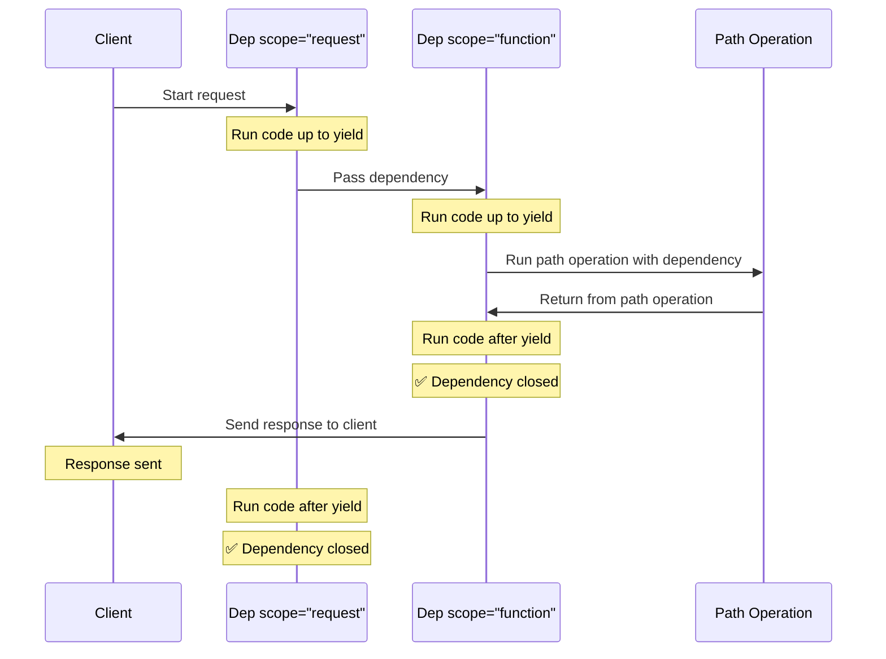

### FastAPI Class Initialization

Source: https://github.com/fastapi/fastapi/blob/master/docs/en/docs/reference/fastapi.md

Import and instantiate the FastAPI class to create a new FastAPI application instance. The FastAPI class serves as the main application object for building RESTful APIs with automatic OpenAPI documentation.

```APIDOC
## FastAPI Application Setup

### Description
Initialize a FastAPI application instance to define routes, middleware, and application configuration.

### Import
```python
from fastapi import FastAPI
```

### Usage
```python
app = FastAPI()
```

### Attributes
- **openapi_version** (string) - The OpenAPI version specification used for API documentation
- **webhooks** (dict) - Dictionary to store webhook configurations
- **state** (State) - Application state object for storing shared data
- **dependency_overrides** (dict) - Dictionary for overriding dependencies during testing

### Methods
- **openapi()** - Generate and return the OpenAPI schema
- **websocket(path)** - Decorator for defining WebSocket endpoints
- **include_router(router)** - Include routes from a separate APIRouter instance
- **get(path)** - Decorator for GET HTTP method routes
- **post(path)** - Decorator for POST HTTP method routes
- **put(path)** - Decorator for PUT HTTP method routes
- **delete(path)** - Decorator for DELETE HTTP method routes
- **patch(path)** - Decorator for PATCH HTTP method routes
- **head(path)** - Decorator for HEAD HTTP method routes
- **options(path)** - Decorator for OPTIONS HTTP method routes
- **trace(path)** - Decorator for TRACE HTTP method routes
- **on_event(event_type)** - Decorator for lifecycle events (startup, shutdown)
- **middleware(middleware_type)** - Decorator for adding middleware
- **exception_handler(exc_class_or_status_code)** - Decorator for custom exception handling
```

--------------------------------

### Run FastAPI development server with `fastapi dev`

Source: https://github.com/fastapi/fastapi/blob/master/docs/en/docs/index.md

This console command initiates the FastAPI development server using `fastapi dev main.py`. It automatically detects the FastAPI application, starts Uvicorn with auto-reload enabled, and displays the local server address and API documentation URLs.

```console
$ fastapi dev main.py

 ╭────────── FastAPI CLI - Development mode ───────────╮
 │                                                     │
 │  Serving at: http://127.0.0.1:8000                  │
 │                                                     │
 │  API docs: http://127.0.0.1:8000/docs               │
 │                                                     │
 │  Running in development mode, for production use:   │
 │                                                     │
 │  fastapi run                                        │
 │                                                     │
 ╰─────────────────────────────────────────────────────╯

INFO:     Will watch for changes in these directories: ['/home/user/code/awesomeapp']
INFO:     Uvicorn running on http://127.0.0.1:8000 (Press CTRL+C to quit)
INFO:     Started reloader process [2248755] using WatchFiles
INFO:     Started server process [2248757]
INFO:     Waiting for application startup.
INFO:     Application startup complete.
```

--------------------------------

### Modularize FastAPI Applications with APIRouter

Source: https://context7.com/fastapi/fastapi/llms.txt

This snippet introduces the 'APIRouter' in FastAPI, a mechanism for organizing larger applications into separate, reusable modules. It allows defining routes, dependencies, and exception handlers independently, which can then be included in the main FastAPI application.

```python
from fastapi import APIRouter, FastAPI
```

--------------------------------

### Import File and UploadFile in FastAPI

Source: https://github.com/fastapi/fastapi/blob/master/docs/en/docs/tutorial/request-files.md

To handle file uploads in FastAPI, import the `File` and `UploadFile` classes from the `fastapi` module. `File` is used for declaring file parameters, while `UploadFile` provides an advanced file-like object for handling larger files asynchronously.

```python
from fastapi import File, UploadFile
```

--------------------------------

### Import FastAPI Class

Source: https://github.com/fastapi/fastapi/blob/master/docs/en/docs/reference/fastapi.md

Import the FastAPI class from the fastapi package to create a new FastAPI application instance. This is the standard entry point for initializing a FastAPI web application.

```python
from fastapi import FastAPI
```

--------------------------------

### FastAPI Testing with TestClient

Source: https://context7.com/fastapi/fastapi/llms.txt

Comprehensive guide for testing FastAPI applications using TestClient. Covers writing unit tests for basic endpoints, testing with query parameters, and validating HTTP status codes and response bodies.

```APIDOC
## FastAPI Testing with TestClient

### Description
TestClient is a utility provided by FastAPI for testing applications without making actual HTTP requests. It allows you to test your API endpoints in unit tests, verify response status codes, validate response bodies, and test error handling.

### Test Setup
```python
from fastapi.testclient import TestClient
from myapp import app

client = TestClient(app)
```

### Example Test Cases

#### Test 1: Basic GET Request
```python
def test_read_main():
    response = client.get("/")
    assert response.status_code == 200
    assert response.json() == {"msg": "Hello World"}
```

#### Test 2: GET Request with Path Parameter and Query String
```python
def test_read_item():
    response = client.get("/items/42?q=test")
    assert response.status_code == 200
    assert response.json() == {"item_id": 42, "q": "test"}
```

#### Test 3: Validation Error Testing
```python
def test_invalid_item():
    response = client.get("/items/invalid")
    assert response.status_code == 422
```

### Running Tests
```bash
pytest test_main.py
```

### Common Assertions
- **response.status_code** - HTTP status code returned by endpoint
- **response.json()** - Parsed JSON response body
- **response.text** - Raw response text
- **response.headers** - Response headers dictionary
```

--------------------------------

### FastAPI APIRouter with Modular Endpoints

Source: https://context7.com/fastapi/fastapi/llms.txt

Define modular API routes using FastAPI's APIRouter for organizing endpoints by resource (items and users). Each router handles GET/POST operations with proper prefixes and tags for automatic OpenAPI documentation. Routers are included in the main FastAPI app instance.

```python
items_router = APIRouter(
    prefix="/items",
    tags=["items"],
    responses={404: {"description": "Not found"}}
)

@items_router.get("/")
async def read_items():
    return [{"name": "Item 1"}, {"name": "Item 2"}]

@items_router.get("/{item_id}")
async def read_item(item_id: int):
    return {"item_id": item_id, "name": f"Item {item_id}"}

users_router = APIRouter(prefix="/users", tags=["users"])

@users_router.get("/")
async def read_users():
    return [{"username": "user1"}, {"username": "user2"}]

@users_router.post("/")
async def create_user(username: str):
    return {"username": username, "created": True}

app = FastAPI()
app.include_router(items_router)
app.include_router(users_router)
```

--------------------------------

### FastAPI Application Structure for Testing (main.py)

Source: https://github.com/fastapi/fastapi/blob/master/docs/en/docs/tutorial/testing.md

This Python code defines a basic FastAPI application in `main.py` with a single GET endpoint. This file serves as an example for structuring a FastAPI app that will be tested in a separate file, demonstrating how to instantiate `FastAPI` and define a path operation.

```Python
from fastapi import FastAPI

app = FastAPI()

@app.get("/")
async def read_main():
    return {"msg": "Hello World"}
```

--------------------------------

### Import FastAPI Depends for Dependency Injection

Source: https://github.com/fastapi/fastapi/blob/master/docs/en/docs/reference/dependencies.md

This code snippet demonstrates how to import the `Depends` function from the `fastapi` module. `Depends` is fundamental in FastAPI for declaring dependencies in path operations, enabling reusable and modular code components.

```python
from fastapi import Depends
```

--------------------------------

### Import File, Form, and UploadFile from FastAPI

Source: https://github.com/fastapi/fastapi/blob/master/docs/en/docs/tutorial/request-forms-and-files.md

To define parameters that accept file uploads and form data in your FastAPI application, import `File`, `Form`, and `UploadFile` from the `fastapi` module. `File` can receive raw bytes, while `UploadFile` provides an interface for larger file streams.

```python
from fastapi import File, Form, UploadFile
```

--------------------------------

### Run FastAPI Development Server

Source: https://github.com/fastapi/fastapi/blob/master/docs/en/docs/tutorial/first-steps.md

Command-line instruction to start a FastAPI development server using the fastapi CLI tool. The server runs on http://127.0.0.1:8000 with auto-reload enabled and provides access to interactive API documentation at /docs (Swagger UI) and /redoc (ReDoc).

```console
$ fastapi dev main.py
```

--------------------------------

### Test FastAPI Applications with TestClient

Source: https://context7.com/fastapi/fastapi/llms.txt

Write comprehensive unit and integration tests for FastAPI endpoints using TestClient. This example demonstrates testing GET endpoints with various query parameters, validating response status codes and JSON payloads, and handling validation errors. TestClient provides a synchronous interface for testing async FastAPI applications without running a server.

```python
from fastapi import FastAPI
from fastapi.testclient import TestClient

app = FastAPI()

@app.get("/")
async def read_main():
    return {"msg": "Hello World"}

@app.get("/items/{item_id}")
async def read_item(item_id: int, q: str = None):
    return {"item_id": item_id, "q": q}

client = TestClient(app)

def test_read_main():
    response = client.get("/")
    assert response.status_code == 200
    assert response.json() == {"msg": "Hello World"}

def test_read_item():
    response = client.get("/items/42?q=test")
    assert response.status_code == 200
    assert response.json() == {"item_id": 42, "q": "test"}

def test_invalid_item():
    response = client.get("/items/invalid")
    assert response.status_code == 422
```

--------------------------------

### Create Basic Asynchronous FastAPI Application

Source: https://github.com/fastapi/fastapi/blob/master/README.md

This Python snippet presents an asynchronous version of the basic FastAPI application, defining two GET endpoints using `async def`. This pattern is suitable for I/O-bound operations and seamlessly integrates with Python's `async`/`await` syntax, providing non-blocking execution. It requires the `fastapi` and `typing` libraries.

```python
from typing import Union

from fastapi import FastAPI

app = FastAPI()


@app.get("/")
async def read_root():
    return {"Hello": "World"}


@app.get("/items/{item_id}")
async def read_item(item_id: int, q: Union[str, None] = None):
    return {"item_id": item_id, "q": q}
```

--------------------------------

### Run FastAPI application in development mode with `fastapi dev`

Source: https://github.com/fastapi/fastapi/blob/master/docs/en/docs/contributing.md

This console command starts a FastAPI application using the `fastapi dev` utility, serving a specified Python file. It automatically launches Uvicorn on `http://127.0.0.1:8000` by default, making the application accessible for development and testing without port clashes with documentation.

```console
$ fastapi dev tutorial001.py

<span style="color: green;">INFO</span>:     Uvicorn running on http://127.0.0.1:8000 (Press CTRL+C to quit)
```

--------------------------------

### Run FastAPI Development Server with Uvicorn

Source: https://github.com/fastapi/fastapi/blob/master/docs/en/docs/tutorial/bigger-applications.md

Start the FastAPI development server using the fastapi dev command with the application module path. The server will run on localhost:8000 and provide automatic API documentation at the /docs endpoint.

```bash
fastapi dev app/main.py
```

--------------------------------

### GET /

Source: https://context7.com/fastapi/fastapi/llms.txt

Simple endpoint that returns a welcome message. Used as a basic example for testing FastAPI applications with TestClient. This endpoint demonstrates straightforward request-response handling.

```APIDOC
## GET /

### Description
Returns a simple welcome message. This is a basic endpoint used to verify the FastAPI application is running and responding to requests.

### Method
GET

### Endpoint
/

### Response
#### Success Response (200)
- **msg** (string) - Welcome message

#### Response Example
```json
{
  "msg": "Hello World"
}
```
```

--------------------------------

### Basic FastAPI Test with TestClient and pytest

Source: https://github.com/fastapi/fastapi/blob/master/docs/en/docs/tutorial/testing.md

This Python code demonstrates how to set up basic testing for a FastAPI application using `TestClient` from `fastapi.testclient` and `pytest`. It shows importing `FastAPI`, creating a `TestClient` instance, and writing a test function that makes a GET request and asserts the response status code and JSON content.

```Python
from fastapi import FastAPI
client = TestClient(app)
def test_read_main():
    response = client.get("/")
    assert response.status_code == 200
    assert response.json() == {"msg": "Hello World"}
```

--------------------------------

### Run FastAPI Development Server using `fastapi dev`

Source: https://github.com/fastapi/fastapi/blob/master/docs/en/docs/tutorial/index.md

Use the `fastapi dev` command to start the development server for a FastAPI application. This command watches for file changes, reloads the server automatically, and provides URLs for accessing the API and its interactive documentation (Swagger UI). Ensure your application's entry point (e.g., `main.py`) defines an `app` object.

```console
$ fastapi dev main.py

  FastAPI   Starting development server 
             Searching for package file structure from directories
             with __init__.py files
             Importing from /home/user/code/awesomeapp

   module   main.py

     code   Importing the FastAPI app object from the module with
             the following code:

             from main import app

      app   Using import string: main:app

   server   Server started at http://127.0.0.1:8000
   server   Documentation at http://127.0.0.1:8000/docs

      tip   Running in development mode, for production use:
             fastapi run

             Logs:

     INFO   Will watch for changes in these directories:
             ['/home/user/code/awesomeapp']
     INFO   Uvicorn running on http://127.0.0.1:8000 (Press CTRL+C
             to quit)
     INFO   Started reloader process [383138] using WatchFiles
     INFO   Started server process [383153]
     INFO   Waiting for application startup.
     INFO   Application startup complete.
```

--------------------------------

### Install python-multipart for FastAPI Forms

Source: https://github.com/fastapi/fastapi/blob/master/docs/en/docs/tutorial/request-form-models.md

Install the `python-multipart` library, which is a required dependency for processing form data in FastAPI. It is recommended to install it within a virtual environment.

```console
pip install python-multipart
```

--------------------------------

### Create DELETE Endpoint with Error Handling in FastAPI (Python)

Source: https://context7.com/fastapi/fastapi/llms.txt

This snippet demonstrates how to implement a DELETE endpoint in FastAPI to remove a resource. It includes handling path parameters for resource identification and basic error handling using HTTPException if the specified resource is not found.

```python
from fastapi import FastAPI, HTTPException

app = FastAPI()

fake_db = {1: {"name": "Item 1"}, 2: {"name": "Item 2"}}

@app.delete("/items/{item_id}")
async def delete_item(item_id: int):
    if item_id not in fake_db:
        raise HTTPException(status_code=404, detail="Item not found")

    deleted_item = fake_db.pop(item_id)
    return {"message": f"Item {item_id} deleted", "item": deleted_item}

# Request:
# DELETE http://127.0.0.1:8000/items/1
#
# Response:
```

--------------------------------

### Import Path and Annotated from FastAPI

Source: https://github.com/fastapi/fastapi/blob/master/docs/en/docs/tutorial/path-params-numeric-validations.md

Import the Path class and Annotated type from FastAPI to enable validation and metadata declaration for path parameters. This is the prerequisite step for using Path validations in FastAPI applications.

```python
from fastapi import FastAPI, Path
from typing import Annotated
```

--------------------------------

### Initialize FastAPI Application with Defined Lifespan Events

Source: https://github.com/fastapi/fastapi/blob/master/docs/en/docs/advanced/events.md

This snippet demonstrates how to integrate the previously defined `lifespan` async context manager with a FastAPI application. By passing the `lifespan` function to the `lifespan` parameter of the `FastAPI` constructor, you instruct FastAPI to manage the execution of your startup and shutdown logic automatically.

```Python
app = FastAPI(lifespan=lifespan)
```

--------------------------------

### Import All Request Parameter Functions

Source: https://github.com/fastapi/fastapi/blob/master/docs/en/docs/reference/parameters.md

Import all request parameter extraction functions directly from the fastapi module for use in path operation functions and dependency injection.

```APIDOC
## Import Request Parameter Functions

### Description
Import all FastAPI request parameter extraction functions in a single statement.

### Import Statement
```python
from fastapi import Body, Cookie, File, Form, Header, Path, Query
```

### Available Functions
- **Query()** - Extract query string parameters
- **Path()** - Extract URL path parameters
- **Body()** - Extract request body data
- **Cookie()** - Extract cookie values
- **Header()** - Extract HTTP header values
- **Form()** - Extract form field data
- **File()** - Extract uploaded files

### Alternative Import
```python
from fastapi import (
    Body,
    Cookie,
    File,
    Form,
    Header,
    Path,
    Query
)
```

### Usage in Type Hints
```python
from fastapi import FastAPI, Query, Path, Body
from typing import Annotated

app = FastAPI()

@app.post("/items/{item_id}")
async def create_item(
    item_id: Annotated[int, Path()],
    q: Annotated[str | None, Query()] = None,
    body_data: Annotated[dict, Body()] = None
):
    return {"item_id": item_id, "q": q, "body": body_data}
```
```

--------------------------------

### Install python-multipart for FastAPI file and form handling

Source: https://github.com/fastapi/fastapi/blob/master/docs/en/docs/tutorial/request-forms-and-files.md

Before FastAPI can receive uploaded files or form data encoded as `multipart/form-data`, you must install the `python-multipart` library. It's recommended to do this within a virtual environment.

```console
$ pip install python-multipart
```

--------------------------------

### Import FastAPI Request Parameter Functions

Source: https://github.com/fastapi/fastapi/blob/master/docs/en/docs/reference/parameters.md

Import all FastAPI request parameter extraction functions in a single statement. These functions are used with Annotated to declare and validate request parameters in path operation functions and dependencies.

```python
from fastapi import Body, Cookie, File, Form, Header, Path, Query
```

--------------------------------

### Run FastAPI App in Development Mode with FastAPI CLI

Source: https://github.com/fastapi/fastapi/blob/master/docs/en/docs/fastapi-cli.md

This command uses the `fastapi dev` subcommand to start the FastAPI development server. It automatically detects the `FastAPI` instance (e.g., `app` in `main.py`), enables auto-reloading of code changes, and listens on `127.0.0.1` for local access. This mode is optimized for development workflows.

```bash
fastapi dev main.py
```

--------------------------------

### Import WSGIMiddleware from FastAPI

Source: https://github.com/fastapi/fastapi/blob/master/docs/en/docs/reference/middleware.md

Import the WSGI middleware from FastAPI to wrap and integrate WSGI applications within your FastAPI application. This allows you to mount legacy WSGI-compatible applications.

```python
from fastapi.middleware.wsgi import WSGIMiddleware
```

--------------------------------

### Create FastAPI Endpoint to Test Static File Serving

Source: https://github.com/fastapi/fastapi/blob/master/docs/en/docs/how-to/custom-docs-ui-assets.md

This Python snippet defines a simple FastAPI path operation that returns a JSON message. This endpoint serves as a basic test to ensure the FastAPI application is running and can respond to requests, complementing the static file serving setup.

```Python
@app.get("/hello")
async def hello():
    return {"message": "Hello from custom docs app!"}
```

--------------------------------

### Build Docker Image for Single-File FastAPI Application

Source: https://github.com/fastapi/fastapi/blob/master/docs/en/docs/deployment/docker.md

This Dockerfile defines the steps to containerize a FastAPI application consisting of a single `main.py` file. It sets up a Python environment, installs dependencies from `requirements.txt`, copies the application file, and configures the container to run the FastAPI app using `fastapi run`.

```dockerfile
FROM python:3.9

WORKDIR /code

COPY ./requirements.txt /code/requirements.txt

RUN pip install --no-cache-dir --upgrade -r /code/requirements.txt

COPY ./main.py /code/

CMD ["fastapi", "run", "main.py", "--port", "80"]
```

--------------------------------

### Handle PUT Requests for Resource Updates in FastAPI (Python)

Source: https://context7.com/fastapi/fastapi/llms.txt

This example shows how to define a PUT endpoint in FastAPI for updating existing resources. It combines path parameters for resource identification with a Pydantic model for validating the request body, ensuring structured data updates.

```python
from typing import Union
from fastapi import FastAPI
from pydantic import BaseModel

app = FastAPI()

class Item(BaseModel):
    name: str
    price: float
    is_offer: Union[bool, None] = None

@app.put("/items/{item_id}")
async def update_item(item_id: int, item: Item):
    return {
        "item_id": item_id,
        "item_name": item.name,
        "item_price": item.price,
        "is_offer": item.is_offer
    }

# Request:
# PUT http://127.0.0.1:8000/items/42
# Content-Type: application/json
# Body: {"name": "Updated Item", "price": 49.99, "is_offer": true}
#
# Response:
# {"item_id": 42, "item_name": "Updated Item", "item_price": 49.99, "is_offer": true}
```

--------------------------------

### GET /

Source: https://context7.com/fastapi/fastapi/llms.txt

This endpoint serves as a simple GET operation to confirm the API is running and retrieve a basic greeting.

```APIDOC
## GET /

### Description
This endpoint serves as a simple GET operation to confirm the API is running and retrieve a basic greeting.

### Method
GET

### Endpoint
/

### Parameters
#### Path Parameters
(None)

#### Query Parameters
(None)

#### Request Body
(None)

### Request Example
(None)

### Response
#### Success Response (200)
- **Hello** (string) - The greeting message.

#### Response Example
{
  "Hello": "World"
}
```

--------------------------------

### Log in to FastAPI Cloud from Terminal

Source: https://github.com/fastapi/fastapi/blob/master/docs/en/docs/tutorial/first-steps.md

Provides the command-line instruction to authenticate with FastAPI Cloud. This step is a prerequisite for deploying FastAPI applications to the platform, ensuring the local environment has the necessary authorization.

```console
$ fastapi login

You are logged in to FastAPI Cloud 🚀
```

--------------------------------

### Create Basic Synchronous FastAPI Application

Source: https://github.com/fastapi/fastapi/blob/master/README.md

This Python snippet initializes a FastAPI application and defines two synchronous GET endpoints. It demonstrates basic routing for a root path and an item path with an integer path parameter and an optional string query parameter, returning JSON responses. It requires the `fastapi` and `typing` libraries.

```python
from typing import Union

from fastapi import FastAPI

app = FastAPI()


@app.get("/")
def read_root():
    return {"Hello": "World"}


@app.get("/items/{item_id}")
def read_item(item_id: int, q: Union[str, None] = None):
    return {"item_id": item_id, "q": q}
```

--------------------------------

### Import and Define BackgroundTasks Parameter in FastAPI

Source: https://github.com/fastapi/fastapi/blob/master/docs/en/docs/tutorial/background-tasks.md

Import BackgroundTasks from FastAPI and declare it as a parameter in a path operation function. FastAPI automatically creates and injects a BackgroundTasks instance that can be used to register background tasks.

```python
from fastapi import BackgroundTasks, FastAPI

app = FastAPI()

@app.post("/send-notification/")
async def send_notification(email: str, background_tasks: BackgroundTasks):
    pass
```

--------------------------------

### Import HTTPSRedirectMiddleware from FastAPI

Source: https://github.com/fastapi/fastapi/blob/master/docs/en/docs/reference/middleware.md

Import the HTTPS redirect middleware from FastAPI to automatically redirect HTTP requests to HTTPS. This ensures all traffic is encrypted and secure.

```python
from fastapi.middleware.httpsredirect import HTTPSRedirectMiddleware
```

--------------------------------

### Implement POST Endpoint with Pydantic Request Body in FastAPI (Python)

Source: https://context7.com/fastapi/fastapi/llms.txt

This snippet demonstrates how to create a POST endpoint in FastAPI that accepts a JSON request body. It defines a Pydantic BaseModel for automatic data validation and deserialization, showing how to access and process the validated data within the path operation function.

```python
from typing import Union
from fastapi import FastAPI
from pydantic import BaseModel

app = FastAPI()

class Item(BaseModel):
    name: str
    description: Union[str, None] = None
    price: float
    tax: Union[float, None] = None

@app.post("/items/")
async def create_item(item: Item):
    item_dict = item.dict()
    if item.tax:
        price_with_tax = item.price + item.tax
        item_dict["price_with_tax"] = price_with_tax
    return item_dict

# Request:
# POST http://127.0.0.1:8000/items/
# Content-Type: application/json
# Body: {"name": "Laptop", "price": 999.99, "tax": 99.99}
#
# Response:
# {"name": "Laptop", "description": null, "price": 999.99, "tax": 99.99, "price_with_tax": 1099.98}
```

--------------------------------

### Define GET Endpoints with Path and Query Parameters in FastAPI (Python)

Source: https://context7.com/fastapi/fastapi/llms.txt

This code illustrates defining various GET endpoints in FastAPI. It covers simple GET routes, handling path parameters with type validation, processing query parameters with default values, and combining both path and query parameters in a single endpoint for retrieving data.

```python
from typing import Union
from fastapi import FastAPI

app = FastAPI()

# Simple GET endpoint
@app.get("/")
async def read_root():
    return {"Hello": "World"}

# Path parameters with type validation
@app.get("/items/{item_id}")
async def read_item(item_id: int):
    return {"item_id": item_id}

# Query parameters with defaults
@app.get("/users/")
async def read_users(skip: int = 0, limit: int = 10):
    return {"skip": skip, "limit": limit}

# Combined path and query parameters
@app.get("/items/{item_id}/details")
async def get_item_details(item_id: int, q: Union[str, None] = None):
    result = {"item_id": item_id}
    if q:
        result["q"] = q
    return result

# Usage:
# GET http://127.0.0.1:8000/items/5?q=test
# Response: {"item_id": 5, "q": "test"}
```

--------------------------------

### POST /users/ - Create User with Response Model

Source: https://context7.com/fastapi/fastapi/llms.txt

Creates a new user with automatic response filtering based on the response_model. Fields not defined in UserOut (like password) are automatically excluded from the response. Returns HTTP 201 Created status code.

```APIDOC
## POST /users/

### Description
Create a new user account with automatic response model validation and filtering. Sensitive fields like password are excluded from the response based on the response_model definition.

### Method
POST

### Endpoint
/users/

### Request Body
- **username** (string) - Required - User's login username
- **password** (string) - Required - User's password (excluded from response)
- **email** (EmailStr) - Required - User's email address (validated email format)
- **full_name** (string or null) - Optional - User's full name

### Request Example
```json
{
  "username": "jane",
  "password": "pass123",
  "email": "jane@example.com",
  "full_name": "Jane Smith"
}
```

### Response
#### Success Response (201 Created)
- **username** (string) - User's login username
- **email** (string) - User's email address
- **full_name** (string or null) - User's full name

#### Response Example
```json
{
  "username": "jane",
  "email": "jane@example.com",
  "full_name": "Jane Smith"
}
```

### Notes
- Password field is automatically filtered out from response
- Email validation is performed automatically
- Status code is set to 201 Created
- Response model ensures only safe fields are returned to clients
```

--------------------------------

### FastAPI CLI Development Mode Installation and Usage

Source: https://github.com/fastapi/fastapi/blob/master/docs/en/docs/release-notes.md

Demonstrates how to install the latest FastAPI version and start a development server using the new FastAPI CLI command. The example shows the output from running 'fastapi dev main.py', which starts Uvicorn with automatic file watching and displays API documentation endpoints. This is part of the new FastAPI CLI feature introduced in version 0.111.0.

```console
$ pip install --upgrade fastapi

$ fastapi dev main.py


 ╭────────── FastAPI CLI - Development mode ───────────╮
 │                                                     │
 │  Serving at: http://127.0.0.1:8000                  │
 │                                                     │
 │  API docs: http://127.0.0.1:8000/docs               │
 │                                                     │
 │  Running in development mode, for production use:   │
 │                                                     │
 │  fastapi run                                        │
 │                                                     │
 ╰─────────────────────────────────────────────────────╯

INFO:     Will watch for changes in these directories: ['/home/user/code/awesomeapp']
INFO:     Uvicorn running on http://127.0.0.1:8000 (Press CTRL+C to quit)
INFO:     Started reloader process [2248755] using WatchFiles
INFO:     Started server process [2248757]
INFO:     Waiting for application startup.
INFO:     Application startup complete.
```

--------------------------------

### Import CORSMiddleware from FastAPI

Source: https://github.com/fastapi/fastapi/blob/master/docs/en/docs/reference/middleware.md

Import the CORS middleware from FastAPI to handle cross-origin resource sharing. This middleware allows you to configure which origins, methods, and headers are permitted for cross-origin requests.

```python
from fastapi.middleware.cors import CORSMiddleware
```

--------------------------------

### FastAPI Depends shortcut with empty parentheses

Source: https://github.com/fastapi/fastapi/blob/master/docs/en/docs/tutorial/dependencies/classes-as-dependencies.md

Introduces FastAPI's shortcut pattern for class-based dependencies to reduce code repetition. When the dependency is a class that FastAPI will instantiate, you can use Depends() without parameters and declare the type as the parameter's type annotation. FastAPI will automatically know what to do.

```Python 3.8+
commons: Annotated[CommonQueryParams, Depends()]
```

```Python 3.8+ non-Annotated
commons: CommonQueryParams = Depends()
```

--------------------------------

### Use Dataclass as FastAPI Response Model

Source: https://github.com/fastapi/fastapi/blob/master/docs/en/docs/advanced/dataclasses.md

This example illustrates using a standard Python `dataclass` as a `response_model` for a FastAPI path operation. When a `dataclass` is specified as the `response_model`, FastAPI ensures that the returned data conforms to its structure and includes it in the automatically generated API documentation.

```Python
from fastapi import FastAPI
from dataclasses import dataclass

app = FastAPI()

@dataclass
class Item:
    name: str
    price: float
    description: str | None = None
    tax: float | None = None

@app.get("/items/{item_id}", response_model=Item)
async def read_item(item_id: str):
    return {"name": "Foo", "price": 42.0, "description": "The Foo description", "tax": 2.2}
```

--------------------------------

### Define a GET API Endpoint with Python FastAPI

Source: https://github.com/fastapi/fastapi/blob/master/docs/en/docs/alternatives.md

This code illustrates how to define a GET endpoint in a FastAPI application using the `@app.get` decorator. It creates a path operation that responds to requests at `/some/url` by returning a JSON object, showcasing FastAPI's intuitive routing for server-side API development.

```python
@app.get("/some/url")
def read_url():
    return {"message": "Hello World"}
```

--------------------------------

### Build a Docker Image for FastAPI

Source: https://github.com/fastapi/fastapi/blob/master/docs/en/docs/deployment/docker.md

A Dockerfile that creates a production-ready container image for a FastAPI application. It installs Python 3.9, copies application dependencies, installs requirements, and runs the FastAPI application on port 80. Includes optional proxy headers configuration for reverse proxies like Nginx or Traefik.

```Dockerfile
FROM python:3.9

WORKDIR /code

COPY ./requirements.txt /code/requirements.txt

RUN pip install --no-cache-dir --upgrade -r /code/requirements.txt

COPY ./app /code/app

CMD ["fastapi", "run", "app/main.py", "--port", "80"]

# If running behind a proxy like Nginx or Traefik add --proxy-headers
# CMD ["fastapi", "run", "app/main.py", "--port", "80", "--proxy-headers"]
```

--------------------------------

### POST /login/ - User Login with Form Data

Source: https://context7.com/fastapi/fastapi/llms.txt

Authenticates user credentials using form-encoded data (application/x-www-form-urlencoded). Accepts username and password as form fields with automatic type conversion and validation.

```APIDOC
## POST /login/

### Description
Authenticates a user by accepting form-encoded credentials. Uses multipart/form-data encoding with automatic parameter extraction and validation via Pydantic models.

### Method
POST

### Endpoint
/login/

### Request Body (Form Data)
- **username** (string) - Required - User's login username
- **password** (string) - Required - User's password

### Request Example
```
Content-Type: application/x-www-form-urlencoded

username=johndoe&password=secret123
```

### Response
#### Success Response (200 OK)
- **username** (string) - The provided username
- **authenticated** (boolean) - Authentication status

#### Response Example
```json
{
  "username": "johndoe",
  "authenticated": true
}
```

### Notes
- Uses Form() dependency for automatic form parsing
- Content-Type must be application/x-www-form-urlencoded
- Parameters are validated through Pydantic model
```

--------------------------------

### Form Data and File Uploads in FastAPI

Source: https://context7.com/fastapi/fastapi/llms.txt

Handle form submissions and file uploads using Form() and UploadFile for multipart/form-data encoding. Single and multiple file uploads are supported with automatic type conversion. Use Annotated type hints to specify form field and file parameters with optional descriptions.

```python
from typing import Annotated
from fastapi import FastAPI, File, Form, UploadFile

app = FastAPI()

@app.post("/login/")
async def login(
    username: Annotated[str, Form()],
    password: Annotated[str, Form()]
):
    return {"username": username, "authenticated": True}

@app.post("/files/")
async def upload_file(
    file: Annotated[UploadFile, File()],
    description: Annotated[str, Form()] = ""
):
    content = await file.read()
    return {
        "filename": file.filename,
        "content_type": file.content_type,
        "size": len(content),
        "description": description
    }

@app.post("/uploadfiles/")
async def upload_multiple_files(
    files: Annotated[list[UploadFile], File()]
):
    return {
        "filenames": [f.filename for f in files],
        "count": len(files)
    }
```

--------------------------------

### Run FastAPI Development Server with Auto-Reload

Source: https://github.com/fastapi/fastapi/blob/master/README.md

This console command starts the FastAPI development server, automatically detecting the `FastAPI` app in `main.py` and enabling auto-reload for local development. It uses Uvicorn under the hood and provides URLs for both the API and interactive documentation.

```console
fastapi dev main.py
```

--------------------------------

### Import FastAPI security components in Python

Source: https://github.com/fastapi/fastapi/blob/master/docs/en/docs/reference/security/index.md

This code imports various security components from the `fastapi.security` module. These components are essential for implementing different authentication and authorization schemes in FastAPI applications, including API keys, HTTP authentication, OAuth2, and OpenID Connect, and integrate with OpenAPI for automatic documentation.

```python
from fastapi.security import (
    APIKeyCookie,
    APIKeyHeader,
    APIKeyQuery,
    HTTPAuthorizationCredentials,
    HTTPBasic,
    HTTPBasicCredentials,
    HTTPBearer,
    HTTPDigest,
    OAuth2,
    OAuth2AuthorizationCodeBearer,
    OAuth2PasswordBearer,
    OAuth2PasswordRequestForm,
    OAuth2PasswordRequestFormStrict,
    OpenIdConnect,
    SecurityScopes,
)
```

--------------------------------

### Importing WebSocket Class in FastAPI

Source: https://github.com/fastapi/fastapi/blob/master/docs/en/docs/reference/websockets.md

This code imports the `WebSocket` class from the `fastapi` library. The `WebSocket` object is used in FastAPI endpoint definitions to handle bidirectional communication, allowing the server to receive data from and send data to connected clients.

```python
from fastapi import WebSocket
```

--------------------------------

### Define FastAPI Request Body with Python Dataclass

Source: https://github.com/fastapi/fastapi/blob/master/docs/en/docs/advanced/dataclasses.md

This snippet demonstrates how to use a standard Python `dataclass` to define the structure of a request body in a FastAPI application. FastAPI, powered by Pydantic, automatically handles data validation, serialization, and generates API documentation for the dataclass fields.

```Python
from fastapi import FastAPI
from dataclasses import dataclass

app = FastAPI()

@dataclass
class Item:
    name: str
    price: float
    description: str | None = None
    tax: float | None = None

@app.post("/items/")
async def create_item(item: Item):
    return item
```

--------------------------------

### Initialize FastAPI Application Instance (Python)

Source: https://context7.com/fastapi/fastapi/llms.txt

This snippet demonstrates how to initialize a FastAPI application. It shows both a basic instance and one configured with metadata like title, description, version, and custom documentation URLs, which are used for OpenAPI generation.

```python
from fastapi import FastAPI

# Basic application
app = FastAPI()

# Application with metadata for OpenAPI docs
app = FastAPI(
    title="ChimichangApp",
    description="API for managing items and users",
    version="2.5.0",
    docs_url="/documentation",
    redoc_url="/redoc"
)

# Run with: fastapi dev main.py
# API docs available at: http://127.0.0.1:8000/documentation
# Alternative docs at: http://127.0.0.1:8000/redoc
```

--------------------------------

### Initialize basic FastAPI application

Source: https://github.com/fastapi/fastapi/blob/master/docs/en/docs/how-to/extending-openapi.md

This snippet demonstrates a standard FastAPI application setup. It imports the `FastAPI` class, instantiates the application with a title and version, and defines a simple root path operation. This serves as the foundation before applying any OpenAPI schema customizations.

```python
from fastapi import FastAPI

app = FastAPI(
    title="My Super Project",
    version="2.5.0",
)

@app.get("/")
def read_root():
    return {"Hello": "World"}
```

--------------------------------

### Import APIRouter from FastAPI

Source: https://github.com/fastapi/fastapi/blob/master/docs/en/docs/reference/apirouter.md

Import the APIRouter class from the fastapi package to create a new router instance. This is the standard way to access the APIRouter functionality in FastAPI applications.

```python
from fastapi import APIRouter
```

--------------------------------

### Import FastAPI Request Class

Source: https://github.com/fastapi/fastapi/blob/master/docs/en/docs/reference/request.md

This snippet demonstrates how to import the `Request` class directly from the `fastapi` library. The `Request` object can then be used as a parameter in path operation functions or dependencies to access the raw HTTP request without validation.

```python
from fastapi import Request
```

--------------------------------

### POST /login (Form Data Authentication)

Source: https://github.com/fastapi/fastapi/blob/master/docs/en/docs/tutorial/request-forms.md

Authenticates a user by receiving username and password as form-encoded data. This endpoint demonstrates the use of FastAPI's `Form` dependency for processing `application/x-www-form-urlencoded` requests.

```APIDOC
## POST /login

### Description
This endpoint is used to authenticate a user by accepting their username and password as form-encoded data. It is commonly used in authentication flows, such as the OAuth2 password flow, where credentials are sent directly in the request body as form fields.

### Method
POST

### Endpoint
/login

### Parameters
#### Request Body (Form Data)
- **username** (string) - Required - The user's account username.
- **password** (string) - Required - The user's account password.

### Request Example
```text
username=testuser&password=testpass
```
(Content-Type: application/x-www-form-urlencoded)

### Response
#### Success Response (200 OK)
```json
{
  "message": "Authentication successful",
  "access_token": "eyJhbGciOiJIUzI1NiIsInR5cCI6IkpXVCJ9...",
  "token_type": "bearer"
}
```

#### Error Response (400 Bad Request)
```json
{
  "detail": "Incorrect username or password"
}
```
```

--------------------------------

### Initialize FastAPI APIRouter for Callback Documentation

Source: https://github.com/fastapi/fastapi/blob/master/docs/en/docs/advanced/openapi-callbacks.md

This snippet demonstrates how to import `FastAPI` and `APIRouter` from the `fastapi` library, and then initialize a dedicated `APIRouter` instance named `invoices_callback_router`. This router is essential for defining and documenting the structure of the external API endpoints that are expected to receive callbacks from the main application, without actually implementing the external API itself.

```Python
from fastapi import FastAPI, APIRouter

invoices_callback_router = APIRouter()
```

--------------------------------

### Import GZipMiddleware from FastAPI

Source: https://github.com/fastapi/fastapi/blob/master/docs/en/docs/reference/middleware.md

Import the GZip middleware from FastAPI to automatically compress responses with gzip compression. This reduces response payload size for clients that support gzip encoding.

```python
from fastapi.middleware.gzip import GZipMiddleware
```

--------------------------------

### Import TrustedHostMiddleware from FastAPI

Source: https://github.com/fastapi/fastapi/blob/master/docs/en/docs/reference/middleware.md

Import the trusted host middleware from FastAPI to validate incoming requests against a whitelist of allowed hostnames. This protects against host header attacks.

```python
from fastapi.middleware.trustedhost import TrustedHostMiddleware
```

--------------------------------

### Set Response Headers with FastAPI Response Parameter

Source: https://github.com/fastapi/fastapi/blob/master/docs/en/docs/advanced/response-headers.md

Demonstrates how to declare a `Response` parameter in a FastAPI path operation function. This allows you to set custom HTTP headers on a temporal response object before returning your main response data, which FastAPI then merges into the final HTTP response.

```python
from fastapi import FastAPI, Response

app = FastAPI()

@app.get("/items/{item_id}")
async def read_items(item_id: str, response: Response):
    # Set a custom header on the response object
    response.headers["X-Custom-Header"] = "Foo Bar"
    # Return your data as usual; FastAPI will combine it with the set headers
    return {"item_id": item_id, "message": "Hello World"}
```

--------------------------------

### FastAPI: Define Asynchronous Path Operation with `async def`

Source: https://github.com/fastapi/fastapi/blob/master/docs/en/docs/async.md

Defines a FastAPI path operation function (`read_results`) using `async def`. This is required when the function contains `await` calls to asynchronous third-party libraries, allowing FastAPI to efficiently manage concurrent I/O operations without blocking the event loop.

```python
@app.get('/')
async def read_results():
    results = await some_library()
    return results
```

--------------------------------

### Deploy FastAPI Application to Cloud

Source: https://github.com/fastapi/fastapi/blob/master/docs/en/docs/tutorial/first-steps.md

Illustrates the terminal command used to deploy a FastAPI application to FastAPI Cloud. This action packages and pushes the application to the cloud infrastructure, making it accessible via a unique public URL provided upon successful deployment.

```console
$ fastapi deploy

Deploying to FastAPI Cloud...

✅ Deployment successful!

🐔 Ready the chicken! Your app is ready at https://myapp.fastapicloud.dev
```

--------------------------------

### Declare Multiple Body Parameters in FastAPI

Source: https://github.com/fastapi/fastapi/blob/master/docs/en/docs/tutorial/body-multiple-params.md

This example shows how FastAPI handles multiple Pydantic models declared as function parameters. FastAPI automatically expects a JSON body where each model's content is nested under a key corresponding to its parameter name, facilitating complex data structures in a single request.

```json
{
    "name": "Foo",
    "description": "The pretender",
    "price": 42.0,
    "tax": 3.2
}
```

```python
from typing import Union
from fastapi import FastAPI
from pydantic import BaseModel

app = FastAPI()

class Item(BaseModel):
    name: str
    description: Union[str, None] = None
    price: float
    tax: Union[float, None] = None

class User(BaseModel):
    username: str
    full_name: Union[str, None] = None

@app.put("/items/{item_id}")
async def update_item(item_id: int, item: Item, user: User):
    results = {"item_id": item_id, "item": item, "user": user}
    return results
```

```json
{
    "item": {
        "name": "Foo",
        "description": "The pretender",
        "price": 42.0,
        "tax": 3.2
    },
    "user": {
        "username": "dave",
        "full_name": "Dave Grohl"
    }
}
```

--------------------------------

### Mix Path, Query, and Optional Body Parameters in FastAPI

Source: https://github.com/fastapi/fastapi/blob/master/docs/en/docs/tutorial/body-multiple-params.md

This Python snippet demonstrates how to define a FastAPI endpoint that accepts a path parameter (`item_id`), an optional query parameter (`q`), and an optional request body (`item`). FastAPI intelligently parses each parameter type from the request, allowing flexible API design.

```python
from typing import Union
from fastapi import FastAPI, Path, Query
from pydantic import BaseModel

app = FastAPI()

class Item(BaseModel):
    name: str
    description: Union[str, None] = None
    price: float
    tax: Union[float, None] = None

@app.put("/items/{item_id}")
async def update_item(
    item_id: int = Path(title="The ID of the item to get", gt=0, le=1000),
    q: Union[str, None] = None,
    item: Union[Item, None] = None,
):
    results = {"item_id": item_id}
    if q:
        results.update({"q": q})
    if item:
        results.update({"item": item})
    return results
```

--------------------------------

### Return FastAPI Response Object Directly

Source: https://github.com/fastapi/fastapi/blob/master/docs/en/docs/tutorial/response-model.md

This example shows returning a `RedirectResponse` directly from a FastAPI path operation, with its type hint. FastAPI automatically processes direct `Response` objects or their subclasses, allowing custom responses while benefiting from type annotations.

```python
from fastapi import FastAPI
from starlette.responses import RedirectResponse

app = FastAPI()

@app.get("/portal")
async def get_portal() -> RedirectResponse:
    return RedirectResponse(url="http://example.com/portal")
```

--------------------------------

### Configure FastAPI with Multiple Servers and root_path

Source: https://github.com/fastapi/fastapi/blob/master/docs/en/docs/advanced/behind-a-proxy.md

Defines a FastAPI application with a root_path and multiple server configurations for staging and production environments. When root_path is set, FastAPI automatically inserts a server entry with that path at the beginning of the servers list in the OpenAPI schema.

```python
app = FastAPI(
    servers=[
        {
            "url": "https://stag.example.com",
            "description": "Staging environment"
        },
        {
            "url": "https://prod.example.com",
            "description": "Production environment"
        }
    ],
    root_path="/api/v1"
)
```

--------------------------------

### GET /

Source: https://github.com/fastapi/fastapi/blob/master/README.md

This endpoint serves as the root of the API, returning a simple 'Hello, World!' message to confirm the API is running.

```APIDOC
## GET /

### Description
This endpoint returns a greeting message.

### Method
GET

### Endpoint
/

### Parameters
#### Path Parameters
- No path parameters.

#### Query Parameters
- No query parameters.

#### Request Body
- No request body.

### Request Example
```json
{}
```

### Response
#### Success Response (200)
- **Hello** (string) - A greeting message.

#### Response Example
```json
{
  "Hello": "World"
}
```
```

--------------------------------

### Declare file parameters with FastAPI File (bytes)

Source: https://github.com/fastapi/fastapi/blob/master/docs/en/docs/tutorial/request-files.md

Define file upload parameters in FastAPI path operation functions by type-hinting them as `bytes` and assigning `File(...)` as the default value. This instructs FastAPI to interpret the parameter as an uploaded file, storing its content directly in memory as bytes, suitable for small files.

```python
async def create_upload_file(file: bytes = File(...)):
    # Process file contents as bytes
    pass
```

--------------------------------

### Combine Path, Query, and Request Body Parameters in FastAPI

Source: https://context7.com/fastapi/fastapi/llms.txt

Combine path parameters, query parameters, and request body data in a single endpoint using Pydantic models. This example demonstrates how to handle multiple input sources simultaneously, with validation applied to each parameter type through Path, Body annotations and model definitions.

```python
from typing import Annotated, Union
from fastapi import FastAPI, Path, Body
from pydantic import BaseModel

app = FastAPI()

class Item(BaseModel):
    name: str
    description: Union[str, None] = None
    price: float

class User(BaseModel):
    username: str
    full_name: Union[str, None] = None

@app.put("/items/{item_id}")
async def update_item(
    item_id: Annotated[int, Path(ge=1)],
    item: Item,
    user: User,
    importance: Annotated[int, Body(ge=1, le=5)]
):
    return {
        "item_id": item_id,
        "item": item,
        "user": user,
        "importance": importance
    }
```

--------------------------------

### POST /items - Route Decorator Example

Source: https://github.com/fastapi/fastapi/blob/master/docs/en/docs/reference/fastapi.md

Demonstrates how to define a POST route using the FastAPI.post() decorator method. This is used to create endpoints that submit data to create new resources.

```APIDOC
## POST /items

### Description
Define a POST endpoint to create new items using the FastAPI post() decorator method.

### Method
POST

### Endpoint
/items

### Usage
```python
from fastapi import FastAPI
from pydantic import BaseModel

app = FastAPI()

class Item(BaseModel):
    name: str
    price: float

@app.post("/items")
async def create_item(item: Item):
    return {"created": item}
```

### Request Body
- **name** (string) - Required - The name of the item
- **price** (number) - Required - The price of the item

### Request Example
```json
{
  "name": "Example Item",
  "price": 9.99
}
```

### Response
#### Success Response (200)
- **created** (object) - The created item object

#### Response Example
```json
{
  "created": {
    "name": "Example Item",
    "price": 9.99
  }
}
```
```

--------------------------------

### Integrate GraphQL Schema with FastAPI using Strawberry

Source: https://github.com/fastapi/fastapi/blob/master/docs/en/docs/how-to/graphql.md

This Python code demonstrates how to set up a GraphQL endpoint in a FastAPI application using the Strawberry library. It defines a basic GraphQL query, creates a Strawberry schema, and then adds an ASGI-compatible GraphQL route to the FastAPI application. This setup requires both `fastapi` and `strawberry` to be installed.

```python
import strawberry
from fastapi import FastAPI
from strawberry.asgi import GraphQL

@strawberry.type
class Query:
    @strawberry.field
    def hello(self) -> str:
        return "Hello world"

schema = strawberry.Schema(query=Query)

app = FastAPI()
app.add_route("/graphql", GraphQL(schema))
```

--------------------------------

### POST /uploadfiles/ - Upload Multiple Files

Source: https://context7.com/fastapi/fastapi/llms.txt

Handles multiple file uploads in a single request using multipart/form-data encoding. Returns a list of uploaded filenames and the total count of files.

```APIDOC
## POST /uploadfiles/

### Description
Upload multiple files in a single request using multipart/form-data encoding. Accepts a list of files and returns metadata about all uploaded files.

### Method
POST

### Endpoint
/uploadfiles/

### Request Body (Multipart Form Data)
- **files** (binary array) - Required - Multiple files to upload (send multiple file fields with same name)

### Request Example
```
Content-Type: multipart/form-data; boundary=----WebKitFormBoundary

------WebKitFormBoundary
Content-Disposition: form-data; name="files"; filename="file1.pdf"
Content-Type: application/pdf

[binary file content]
------WebKitFormBoundary
Content-Disposition: form-data; name="files"; filename="file2.pdf"
Content-Type: application/pdf

[binary file content]
------WebKitFormBoundary--
```

### Response
#### Success Response (200 OK)
- **filenames** (array of strings) - List of uploaded filenames
- **count** (integer) - Total number of files uploaded

#### Response Example
```json
{
  "filenames": ["file1.pdf", "file2.pdf"],
  "count": 2
}
```

### Notes
- Uses list[UploadFile] to accept multiple files
- Files are sent as multiple form fields with the same name
- Returns filename list and total count
```

--------------------------------

### Declare Query Parameters with Pydantic Model in FastAPI

Source: https://github.com/fastapi/fastapi/blob/master/docs/en/docs/tutorial/query-param-models.md

Create a Pydantic model to declare related query parameters and use it in a FastAPI route with the Query parameter. FastAPI automatically extracts data from query parameters and validates them against the model schema. This approach enables code reuse and centralized validation for multiple related parameters.

```python
from fastapi import FastAPI, Query
from pydantic import BaseModel

class QueryParams(BaseModel):
    skip: int = 0
    limit: int = 10

app = FastAPI()

@app.get("/items/")
async def read_items(q: QueryParams = Query()):
    return {"skip": q.skip, "limit": q.limit}
```

--------------------------------

### Implement Dependency Injection in FastAPI Endpoints

Source: https://context7.com/fastapi/fastapi/llms.txt

Share common logic across endpoints using dependency injection with the Depends function for reusable functionality. This example shows how to create dependency functions for common parameters, database connections with cleanup, and apply them to multiple endpoints for code reuse and maintainability.

```python
from typing import Annotated, Union
from fastapi import Depends, FastAPI, HTTPException

app = FastAPI()

# Dependency function
async def common_parameters(
    q: Union[str, None] = None,
    skip: int = 0,
    limit: int = 100
):
    return {"q": q, "skip": skip, "limit": limit}

# Using dependency in multiple endpoints
@app.get("/items/")
async def read_items(commons: Annotated[dict, Depends(common_parameters)]):
    return {"params": commons, "items": ["item1", "item2"]}

@app.get("/users/")
async def read_users(commons: Annotated[dict, Depends(common_parameters)]):
    return {"params": commons, "users": ["user1", "user2"]}

# Database dependency with cleanup
async def get_db():
    db = {"connection": "active"}
    try:
        yield db
    finally:
        db["connection"] = "closed"

@app.get("/query/")
async def query_data(db: Annotated[dict, Depends(get_db)]):
    return {"database": db, "data": "query results"}
```

--------------------------------

### Return FastAPI Response Object Directly with Cookies

Source: https://github.com/fastapi/fastapi/blob/master/docs/en/docs/advanced/response-cookies.md

This code illustrates how to return a `JSONResponse` object directly from a FastAPI path operation function, setting an HTTP cookie before returning the response. When returning a response directly, FastAPI bypasses its default response processing, including `response_model` filtering. Therefore, you must ensure the content is compatible (e.g., JSON) and that any necessary data filtering is handled manually.

```python
from fastapi import FastAPI
from fastapi.responses import JSONResponse

app = FastAPI()


@app.get("/direct-response/")
async def direct_response_with_cookie():
    content = {"message": "Hello Bigger Applications!"}
    response = JSONResponse(content=content)
    response.set_cookie(key="fakesession", value="faketoken")
    return response
```

--------------------------------

### Declare Response Model Using Function Return Type Annotation - Python/FastAPI

Source: https://github.com/fastapi/fastapi/blob/master/docs/en/docs/release-notes.md

This example demonstrates how to declare the response_model in FastAPI using function return type annotations instead of the response_model parameter. The return type list[Item] tells FastAPI to validate, filter, and document the response data automatically. FastAPI uses this annotation for data validation, automatic API documentation generation, and data filtering.

```python
from fastapi import FastAPI
from pydantic import BaseModel

app = FastAPI()


class Item(BaseModel):
    name: str
    price: float


@app.get("/items/")
async def read_items() -> list[Item]:
    return [
        Item(name="Portal Gun", price=42.0),
        Item(name="Plumbus", price=32.0),
    ]
```

--------------------------------

### APIRouter for Modular Applications

Source: https://context7.com/fastapi/fastapi/llms.txt

Organize large FastAPI applications into separate modules using APIRouter. This pattern enables code reusability, better maintainability, and separation of concerns by grouping related endpoints into routers that can be included in the main application.

```APIDOC
## APIRouter Pattern

### Description
Use APIRouter to organize endpoints into modular, reusable components. Each router can have its own prefix, tags, and dependencies, making large applications more maintainable and scalable.

### Benefits
- **Modular Organization** - Group related endpoints together
- **Code Reusability** - Routers can be imported and used across multiple applications
- **Separation of Concerns** - Keep business logic organized by domain
- **Shared Configuration** - Apply tags, prefixes, and dependencies to groups of endpoints
- **Easier Testing** - Test individual routers in isolation

### Basic Structure

```python
# users/router.py
from fastapi import APIRouter

router = APIRouter(prefix="/users", tags=["users"])

@router.get("/")
async def list_users():
    return [{"id": 1, "name": "User One"}]

@router.post("/")
async def create_user(user: dict):
    return {"id": 2, "name": user["name"]}

# main.py
from fastapi import FastAPI
from users.router import router as users_router

app = FastAPI()
app.include_router(users_router)
```

### Key Features
- **prefix** - URL prefix for all routes in the router (/users)
- **tags** - OpenAPI tags for endpoint grouping
- **dependencies** - Shared dependencies for all routes
- **include_router()** - Include router in main FastAPI application
```

--------------------------------

### POST /items/

Source: https://context7.com/fastapi/fastapi/llms.txt

Create a new item by sending its details in the request body. The request body is validated against a Pydantic model, ensuring data integrity.

```APIDOC
## POST /items/

### Description
Create a new item by sending its details in the request body. The request body is validated against a Pydantic model, ensuring data integrity.

### Method
POST

### Endpoint
/items/

### Parameters
#### Path Parameters
(None)

#### Query Parameters
(None)

#### Request Body
- **name** (string) - Required - The name of the item.
- **description** (string) - Optional - A description of the item.
- **price** (float) - Required - The price of the item.
- **tax** (float) - Optional - The tax applied to the item.

### Request Example
{
  "name": "Laptop",
  "price": 999.99,
  "tax": 99.99
}

### Response
#### Success Response (200)
- **name** (string) - The name of the item.
- **description** (string) - (Optional) The description of the item.
- **price** (float) - The price of the item.
- **tax** (float) - (Optional) The tax applied to the item.
- **price_with_tax** (float) - (Optional) The calculated price including tax.

#### Response Example
{
  "name": "Laptop",
  "description": null,
  "price": 999.99,
  "tax": 99.99,
  "price_with_tax": 1099.98
}
```

--------------------------------

### FastAPI HTTP Middleware for Request/Response Processing

Source: https://context7.com/fastapi/fastapi/llms.txt

Implement custom middleware functions to intercept and process all HTTP requests and responses. This example adds response headers with processing time and logs request/response details. Middleware executes in declaration order for requests and reverse order for responses.

```python
import time
from fastapi import FastAPI, Request

app = FastAPI()

@app.middleware("http")
async def add_process_time_header(request: Request, call_next):
    start_time = time.time()
    response = await call_next(request)
    process_time = time.time() - start_time
    response.headers["X-Process-Time"] = str(process_time)
    return response

@app.middleware("http")
async def log_requests(request: Request, call_next):
    print(f"Request: {request.method} {request.url}")
    response = await call_next(request)
    print(f"Response status: {response.status_code}")
    return response

@app.get("/")
async def root():
    return {"message": "Hello World"}
```

--------------------------------

### FastAPI Application with Top-Level Dependencies

Source: https://github.com/fastapi/fastapi/blob/master/docs/en/docs/release-notes.md

Create a FastAPI application with shared dependencies that apply to all path operations. The example demonstrates adding global authentication via the dependencies parameter. This approach keeps security logic centralized at the application level rather than scattered across route definitions.

```Python
from fastapi import FastAPI, Depends


async def some_dependency():
    return


app = FastAPI(dependencies=[Depends(some_dependency)])
```

--------------------------------

### Type annotation with generic type and Depends in FastAPI

Source: https://github.com/fastapi/fastapi/blob/master/docs/en/docs/tutorial/dependencies/classes-as-dependencies.md

Demonstrates that the first type in the type annotation can be Any or generic since FastAPI only uses Depends() for actual dependency resolution. The type annotation serves only for editor support and type checking, not for FastAPI's data conversion or validation.

```Python 3.8+
commons: Annotated[Any, Depends(CommonQueryParams)]
```

```Python 3.8+ non-Annotated
commons = Depends(CommonQueryParams)
```

--------------------------------

### Add Third-Party ASGI Middleware with FastAPI

Source: https://github.com/fastapi/fastapi/blob/master/docs/en/docs/advanced/middleware.md

This snippet demonstrates the recommended way to add a third-party ASGI middleware like `UnicornMiddleware` to a FastAPI application using `app.add_middleware()`. This approach simplifies integration and ensures proper functionality with FastAPI's error handling and exception mechanisms, providing a more robust solution than direct wrapping.

```python
from fastapi import FastAPI
from unicorn import UnicornMiddleware

app = FastAPI()

app.add_middleware(UnicornMiddleware, some_config="rainbow")
```

--------------------------------

### Import FastAPI Cookie Parameter Type

Source: https://github.com/fastapi/fastapi/blob/master/docs/en/docs/tutorial/cookie-params.md

This snippet shows the necessary import statement for using the `Cookie` class from the `fastapi` library to define cookie parameters in your API endpoints.

```python
from fastapi import Cookie
```

--------------------------------

### View FastAPI Generated OpenAPI JSON Schema

Source: https://github.com/fastapi/fastapi/blob/master/docs/en/docs/tutorial/first-steps.md

Demonstrates the structure of the `openapi.json` file automatically generated by FastAPI. This JSON describes the API's endpoints, data types, and responses following OpenAPI and JSON Schema standards, accessible via the `/openapi.json` path of a running FastAPI application.

```JSON
{
    "openapi": "3.1.0",
    "info": {
        "title": "FastAPI",
        "version": "0.1.0"
    },
    "paths": {
        "/items/": {
            "get": {
                "responses": {
                    "200": {
                        "description": "Successful Response",
                        "content": {
                            "application/json": {


...

```

--------------------------------

### POST /login/ - Form Model Authentication

Source: https://context7.com/fastapi/fastapi/llms.txt

Authenticates user credentials using a Pydantic form model with application/x-www-form-urlencoded encoding. Provides automatic validation and type conversion for form data.

```APIDOC
## POST /login/

### Description
Authenticate user credentials using form-encoded data with Pydantic model validation. The request body is automatically parsed and validated according to the FormData model definition.

### Method
POST

### Endpoint
/login/

### Request Body (Form Data)
- **username** (string) - Required - User's login username
- **password** (string) - Required - User's password

### Request Example
```
Content-Type: application/x-www-form-urlencoded

username=johndoe&password=secret123
```

### Response
#### Success Response (200 OK)
- **username** (string) - The provided username
- **password** (string) - The provided password

#### Response Example
```json
{
  "username": "johndoe",
  "password": "secret123"
}
```

### Notes
- Uses Form() dependency with Pydantic BaseModel
- Automatic form parsing and validation
- Content-Type must be application/x-www-form-urlencoded
- All fields required unless marked Optional in model
```

--------------------------------

### POST /files/ - Upload Single File with Description

Source: https://context7.com/fastapi/fastapi/llms.txt

Handles single file uploads with optional description field using multipart/form-data encoding. Returns file metadata including filename, content type, and file size.

```APIDOC
## POST /files/

### Description
Upload a single file with optional text description. Uses multipart/form-data encoding to handle both file and form field data. Returns file metadata including filename, content type, and size.

### Method
POST

### Endpoint
/files/

### Request Body (Multipart Form Data)
- **file** (binary) - Required - The file to upload
- **description** (string) - Optional - Description of the uploaded file

### Request Example
```
Content-Type: multipart/form-data; boundary=----WebKitFormBoundary

------WebKitFormBoundary
Content-Disposition: form-data; name="file"; filename="photo.jpg"
Content-Type: image/jpeg

[binary file content]
------WebKitFormBoundary
Content-Disposition: form-data; name="description"

Profile photo
------WebKitFormBoundary--
```

### Response
#### Success Response (200 OK)
- **filename** (string) - Name of the uploaded file
- **content_type** (string) - MIME type of the file
- **size** (integer) - File size in bytes
- **description** (string) - User-provided description

#### Response Example
```json
{
  "filename": "photo.jpg",
  "content_type": "image/jpeg",
  "size": 45678,
  "description": "Profile photo"
}
```

### Notes
- File parameter uses UploadFile for streaming support
- Description has default value of empty string
- File content is read into memory with await file.read()
```

--------------------------------

### Import HTTPException in FastAPI

Source: https://github.com/fastapi/fastapi/blob/master/docs/en/docs/tutorial/handling-errors.md

Before using `HTTPException` to signal errors, it must be imported from the `fastapi` module. This is a standard Python import statement required at the top of your FastAPI application file.

```python
from fastapi import HTTPException
```

--------------------------------

### Import FastAPI Status Module

Source: https://github.com/fastapi/fastapi/blob/master/docs/en/docs/reference/status.md

This snippet demonstrates how to import the `status` module from FastAPI. The `status` module provides convenient access to HTTP status code constants, improving code readability and reducing reliance on memorizing integer codes.

```python
from fastapi import status
```

--------------------------------

### Add Metadata to FastAPI UploadFile Parameter

Source: https://github.com/fastapi/fastapi/blob/master/docs/en/docs/tutorial/request-files.md

This example shows how to use `File()` with `UploadFile` to include additional metadata, such as a description, for a single file upload parameter in a FastAPI endpoint. This metadata can be used for documentation or validation.

```python
from typing import Annotated
from fastapi import FastAPI, File, UploadFile

app = FastAPI()

@app.post("/uploadfile/")
async def create_upload_file(
    file: Annotated[UploadFile, File(description="A file to upload")],
):
    return {"filename": file.filename, "content_type": file.content_type}
```

--------------------------------

### Define a FastAPI Dependency Function

Source: https://github.com/fastapi/fastapi/blob/master/docs/en/docs/tutorial/dependencies/index.md

This Python function serves as a 'dependable' dependency in FastAPI, accepting optional query parameters `q`, `skip`, and `limit`. It is designed to be reusable across multiple path operations, implicitly returning a dictionary of its input values.

```python
def common_parameters(q: str | None = None, skip: int = 0, limit: int = 100):
```

--------------------------------

### Declare Typed Path Parameters in FastAPI

Source: https://github.com/fastapi/fastapi/blob/master/docs/en/docs/tutorial/path-params.md

Demonstrates declaring a path parameter with type annotation in FastAPI. By specifying the type as `int`, FastAPI automatically provides type conversion from the URL string to Python integer, enables editor support with type checking, and performs automatic data validation.

```python
from fastapi import FastAPI

app = FastAPI()

@app.get("/items/{item_id}")
async def read_item(item_id: int):
    return {"item_id": item_id}
```

--------------------------------

### Disable Separate Input Output Schemas in FastAPI

Source: https://github.com/fastapi/fastapi/blob/master/docs/en/docs/how-to/separate-openapi-schemas.md

Configure FastAPI to use a single schema for both input and output models instead of generating separate schemas. This parameter is available in FastAPI 0.102.0 and later. Use this when you need backward compatibility with existing autogenerated client code.

```python
from fastapi import FastAPI

app = FastAPI(separate_input_output_schemas=False)
```

--------------------------------

### POST /items/

Source: https://github.com/fastapi/fastapi/blob/master/docs/en/docs/tutorial/body.md

Demonstrates how to receive a JSON request body that maps directly to a Pydantic model. This is a fundamental way to handle complex data input in FastAPI.

```APIDOC
## POST /items/

### Description
This endpoint allows creating a new item by sending its details in the request body as a JSON object, which is then validated against a Pydantic model (e.g., `Item`).

### Method
POST

### Endpoint
/items/

### Parameters
#### Request Body
- **name** (string) - Required - The name of the item.
- **description** (string) - Optional - A description of the item.
- **price** (number) - Required - The price of the item.
- **tax** (number) - Optional - The tax percentage for the item.

### Request Example
{
  "name": "Foo",
  "description": "A very nice Item",
  "price": 35.4,
  "tax": 3.2
}

### Response
#### Success Response (200)
- **name** (string) - The name of the created item.
- **description** (string) - The description of the created item.
- **price** (number) - The price of the created item.
- **tax** (number) - The tax percentage for the created item.
- **message** (string) - A success message confirming item creation.

#### Response Example
{
  "name": "Foo",
  "description": "A very nice Item",
  "price": 35.4,
  "tax": 3.2,
  "message": "Item created successfully"
}
```

--------------------------------

### Importing Header from FastAPI

Source: https://github.com/fastapi/fastapi/blob/master/docs/en/docs/tutorial/header-params.md

Demonstrates how to import the `Header` class from `fastapi` for defining header parameters. This is the first step required before using `Header` in your path operation functions.

```python
from fastapi import FastAPI, Header
```

--------------------------------

### Define a Simple FastAPI Application with Pydantic Models

Source: https://github.com/fastapi/fastapi/blob/master/docs/en/docs/advanced/generate-clients.md

This Python code defines a basic FastAPI application. It includes Pydantic models `Item` for request/response validation and `ResponseMessage` for standard responses, demonstrating how FastAPI uses these models to generate a comprehensive OpenAPI schema.

```python
from typing import Optional

from fastapi import FastAPI
from pydantic import BaseModel


class Item(BaseModel):
    name: str
    price: float
    is_offer: Optional[bool] = None


class ResponseMessage(BaseModel):
    message: str


app = FastAPI()


@app.post("/items/", response_model=ResponseMessage)
async def create_item(item: Item):
    return {"message": f"Item received: {item.name}"}


@app.get("/items/{item_id}", response_model=Item)
async def read_item(item_id: int, q: Optional[str] = None):
    return {"name": "Test Item", "price": 10.99, "is_offer": True}
```

--------------------------------

### GET /headers/ - Read Request Headers

Source: https://context7.com/fastapi/fastapi/llms.txt

Accesses and validates HTTP request headers including User-Agent and Accept-Language. Headers are automatically converted from HTTP format (kebab-case) to Python format (snake_case).

```APIDOC
## GET /headers/

### Description
Retrieve and validate HTTP request headers. Header names are automatically converted from HTTP format (User-Agent) to Python parameter format (user_agent). Optional headers return None if not provided.

### Method
GET

### Endpoint
/headers/

### Headers
- **User-Agent** (string) - Optional - Client user agent string
- **Accept-Language** (string) - Optional - Accepted languages

### Request Example
```
GET /headers/
User-Agent: Mozilla/5.0 (Windows NT 10.0; Win64; x64)
Accept-Language: en-US,en;q=0.9
```

### Response
#### Success Response (200 OK)
- **User-Agent** (string or null) - Client user agent
- **Accept-Language** (string or null) - Accepted languages

#### Response Example
```json
{
  "User-Agent": "Mozilla/5.0 (Windows NT 10.0; Win64; x64)",
  "Accept-Language": "en-US,en;q=0.9"
}
```

### Automatic Conversions
- user_agent parameter maps to User-Agent header
- accept_language parameter maps to Accept-Language header
- Snake_case parameter names automatically converted to HTTP header format

### Notes
- Uses Header() dependency for header extraction
- Optional headers return Union[str, None]
- Headers are case-insensitive in HTTP protocol
```

--------------------------------

### Serve FastAPI Docs Live Server for Spanish Translation

Source: https://github.com/fastapi/fastapi/blob/master/docs/en/docs/contributing.md

Runs a live documentation server for Spanish translations using the FastAPI docs script. The command watches for file changes and serves the documentation at localhost:8008. Requires Python and the docs script to be available in the project.

```console
python ./scripts/docs.py live es
```

--------------------------------

### Add PUT Endpoint with Pydantic Request Body to FastAPI

Source: https://github.com/fastapi/fastapi/blob/master/README.md

This Python snippet demonstrates how to extend a FastAPI application by defining a Pydantic `BaseModel` for request body validation and integrating it into a `PUT` endpoint. It allows the API to receive structured data from clients and use it within the route handler, enhancing data integrity. This requires the `pydantic` library.

```python
from typing import Union

from fastapi import FastAPI
from pydantic import BaseModel

app = FastAPI()


class Item(BaseModel):
    name: str
    price: float
    is_offer: Union[bool, None] = None


@app.get("/")
def read_root():
    return {"Hello": "World"}


@app.get("/items/{item_id}")
def read_item(item_id: int, q: Union[str, None] = None):
    return {"item_id": item_id, "q": q}


@app.put("/items/{item_id}")
def update_item(item_id: int, item: Item):
    return {"item_name": item.name, "item_id": item_id}
```

--------------------------------

### Make FastAPI File Upload Optional

Source: https://github.com/fastapi/fastapi/blob/master/docs/en/docs/tutorial/request-files.md

This snippet demonstrates how to declare an optional file upload in a FastAPI path operation. By using `Optional[UploadFile]` and setting a default value of `None`, the endpoint can handle requests both with and without a file.

```python
from typing import Annotated, Optional
from fastapi import FastAPI, File, UploadFile

app = FastAPI()

@app.post("/files/")
async def create_file(
    file: Annotated[Optional[UploadFile], File()] = None,
):
    if not file:
        return {"message": "No upload file sent"}
    return {"filename": file.filename, "content_type": file.content_type}
```

--------------------------------

### Install FastAPI with Standard Dependencies using pip

Source: https://github.com/fastapi/fastapi/blob/master/docs/en/docs/release-notes.md

Install FastAPI with all standard dependencies included using the extras syntax. This is part of version 0.112.0 breaking changes that add support for pip install with standard dependencies.

```bash
pip install "fastapi[standard]"
```

--------------------------------

### GET /users/{user_id} - Retrieve User by ID

Source: https://context7.com/fastapi/fastapi/llms.txt

Retrieves user information by user ID with automatic response model filtering. Sensitive fields not defined in the response model are automatically excluded from the returned data.

```APIDOC
## GET /users/{user_id}

### Description
Retrieve user information by ID with automatic response filtering. The response_model ensures that only safe fields (username, email, full_name) are returned, excluding sensitive data like passwords.

### Method
GET

### Endpoint
/users/{user_id}

### Path Parameters
- **user_id** (integer) - Required - The unique identifier of the user

### Response
#### Success Response (200 OK)
- **username** (string) - User's login username
- **email** (string) - User's email address
- **full_name** (string or null) - User's full name

#### Response Example
```json
{
  "username": "johndoe",
  "email": "john@example.com",
  "full_name": "John Doe"
}
```

### Notes
- Password field is automatically filtered out from response
- Response model validation ensures data consistency
- Only fields defined in UserOut model are included in response
```

--------------------------------

### GET /cookies/ - Read Request Cookies

Source: https://context7.com/fastapi/fastapi/llms.txt

Accesses and validates HTTP cookies from incoming requests. Extracts cookie values with optional support and automatic type conversion.

```APIDOC
## GET /cookies/

### Description
Retrieve and validate HTTP cookies from the request. Cookies are extracted by name and returned with None if not present. Useful for session tracking and user preferences.

### Method
GET

### Endpoint
/cookies/

### Cookies
- **session_id** (string) - Optional - Session identifier cookie
- **ads_id** (string) - Optional - Advertisement tracking cookie

### Request Example
```
GET /cookies/
Cookie: session_id=abc123xyz; ads_id=def456uvw
```

### Response
#### Success Response (200 OK)
- **session_id** (string or null) - Session identifier value
- **ads_id** (string or null) - Advertisement identifier value

#### Response Example
```json
{
  "session_id": "abc123xyz",
  "ads_id": "def456uvw"
}
```

### Notes
- Uses Cookie() dependency for cookie extraction
- Optional cookies return Union[str, None]
- Cookie names are case-sensitive
- Missing cookies return null in response
```

--------------------------------

### Validate Path Parameters with Constraints in FastAPI

Source: https://context7.com/fastapi/fastapi/llms.txt

Extract and validate path parameters with constraints using the Path function. This example demonstrates how to enforce minimum and maximum values, titles, and descriptions on path parameters. Invalid requests return a 422 Unprocessable Entity error with validation details.

```python
from typing import Annotated
from fastapi import FastAPI, Path

app = FastAPI()

@app.get("/items/{item_id}")
async def read_item(
    item_id: Annotated[int, Path(title="The ID of the item", ge=1, le=1000)],
):
    return {"item_id": item_id}

@app.get("/users/{user_id}/posts/{post_id}")
async def read_user_post(
    user_id: Annotated[int, Path(gt=0)],
    post_id: Annotated[int, Path(gt=0, description="Post identifier")]
):
    return {"user_id": user_id, "post_id": post_id}
```

--------------------------------

### FastAPI path operations using Annotated dependencies

Source: https://github.com/fastapi/fastapi/blob/master/docs/en/docs/release-notes.md

Demonstrates how to use the reusable CurrentUser Annotated type across multiple endpoint functions. Reduces boilerplate by replacing the full dependency declaration with a simple type annotation. All functions maintain proper type hints and FastAPI understands the dependency automatically.

```python
CurrentUser = Annotated[User, Depends(get_current_user)]


@app.get("/items/")
def read_items(user: CurrentUser):
    ...


@app.post("/items/")
def create_item(user: CurrentUser, item: Item):
    ...


@app.get("/items/{item_id}")
def read_item(user: CurrentUser, item_id: int):
    ...


@app.delete("/items/{item_id}")
def delete_item(user: CurrentUser, item_id: int):
    ...
```

--------------------------------

### Define FastAPI Dependency with Yield for Item Ownership Check

Source: https://github.com/fastapi/fastapi/blob/master/docs/en/docs/release-notes.md

This Python snippet demonstrates a FastAPI application with a dependency (`get_username`) that utilizes `yield`. It checks for item ownership, allowing the dependency to raise an `OwnerError` after `yield`, which is then caught and re-raised as an `HTTPException` by the path operation. This illustrates the new capability in FastAPI 0.106.0 to raise exceptions post-yield.

```Python
from fastapi import Depends, FastAPI, HTTPException
from typing_extensions import Annotated

app = FastAPI()


data = {
    "plumbus": {"description": "Freshly pickled plumbus", "owner": "Morty"},
    "portal-gun": {"description": "Gun to create portals", "owner": "Rick"},
}


class OwnerError(Exception):
    pass


def get_username():
    try:
        yield "Rick"
    except OwnerError as e:
        raise HTTPException(status_code=400, detail=f"Owner error: {e}")


@app.get("/items/{item_id}")
def get_item(item_id: str, username: Annotated[str, Depends(get_username)]):
    if item_id not in data:
        raise HTTPException(status_code=404, detail="Item not found")
    item = data[item_id]
    if item["owner"] != username:
        raise OwnerError(username)
    return item
```

--------------------------------

### Set Cookies using FastAPI Response Parameter

Source: https://github.com/fastapi/fastapi/blob/master/docs/en/docs/advanced/response-cookies.md

This example demonstrates how to set an HTTP cookie in a FastAPI application by declaring a `Response` parameter in a path operation function. FastAPI injects a temporal response object, allowing the `set_cookie` method to be called on it. The framework then extracts the cookie and includes it in the final HTTP response, even when returning a standard dictionary or Pydantic model.

```python
from fastapi import FastAPI, Response

app = FastAPI()


@app.get("/items/")
async def read_items(response: Response):
    response.set_cookie(key="fakesession", value="faketoken")
    return {"message": "Hello Cookie!"}
```

--------------------------------

### FastAPI App Structure: Absolute Import of APIRouters

Source: https://github.com/fastapi/fastapi/blob/master/docs/en/docs/tutorial/bigger-applications.md

Provides an alternative method for importing submodules containing `APIRouter` instances using an absolute import path. This approach explicitly specifies the full package path from the project root, offering clarity regardless of the current module's location.

```Python
from app.routers import items, users
```

--------------------------------

### Add Metadata to Multiple FastAPI File Uploads

Source: https://github.com/fastapi/fastapi/blob/master/docs/en/docs/tutorial/request-files.md

This example demonstrates how to apply additional metadata using `File()` when accepting multiple file uploads in FastAPI. It shows how to describe a list of `UploadFile` objects, providing more context for the API.

```python
from typing import Annotated, List
from fastapi import FastAPI, File, UploadFile

app = FastAPI()

@app.post("/multiple-uploadfiles-metadata/")
async def create_multiple_upload_files_metadata(
    files: Annotated[
        List[UploadFile],
        File(description="A list of files to be uploaded, with metadata.")
    ],
):
    return [{"filename": file.filename, "content_type": file.content_type} for file in files]
```

--------------------------------

### Include APIRouters in FastAPI Application

Source: https://github.com/fastapi/fastapi/blob/master/docs/en/docs/tutorial/bigger-applications.md

Add APIRouter instances from submodules to the main FastAPI application using the include_router() method. This integrates all route definitions from each router module into the main application, making their path operations available as part of the unified API.

```Python
app.include_router(users.router)
app.include_router(items.router)
```

--------------------------------

### FastAPI: Use Python Enums for Predefined Path Parameter Values

Source: https://github.com/fastapi/fastapi/blob/master/docs/en/docs/tutorial/path-params.md

This code demonstrates how to define a Python `Enum` and use it as a type annotation for a FastAPI path parameter. It shows how to compare the enum member, extract its string value, and how FastAPI automatically converts enum members to their string values when returned in a response. Inheriting from `str` ensures proper OpenAPI documentation.

```python
from enum import Enum
from fastapi import FastAPI

class ModelName(str, Enum):
    alexnet = "alexnet"
    resnet = "resnet"
    lenet = "lenet"

app = FastAPI()

@app.get("/models/{model_name}")
async def get_model(model_name: ModelName):
    if model_name == ModelName.alexnet:
        return {"model_name": model_name, "message": "Deep Learning FTW!"}
    elif model_name == ModelName.lenet:
        return {"model_name": model_name.value, "message": "LeCun all the way!"}
    return {"model_name": model_name, "message": "Have some residuals"}
```

--------------------------------

### FastAPI CORS Middleware Configuration

Source: https://context7.com/fastapi/fastapi/llms.txt

Configure Cross-Origin Resource Sharing (CORS) to allow frontend applications from specified origins to access the API. The middleware automatically handles preflight OPTIONS requests and allows specified methods and headers for cross-origin requests.

```python
from fastapi import FastAPI
from fastapi.middleware.cors import CORSMiddleware

app = FastAPI()

app.add_middleware(
    CORSMiddleware,
    allow_origins=["http://localhost:3000", "https://example.com"],
    allow_credentials=True,
    allow_methods=["*"],
    allow_headers=["*"]
)

@app.get("/api/data")
async def get_data():
    return {"data": "Available to frontend"}
```

--------------------------------

### Docker CMD for FastAPI with TLS Termination Proxy

Source: https://github.com/fastapi/fastapi/blob/master/docs/en/docs/deployment/docker.md

This `CMD` instruction configures a FastAPI application to run behind a TLS termination proxy. The `--proxy-headers` option instructs Uvicorn (used by `fastapi run`) to trust headers sent by the proxy, enabling correct detection of HTTPS and other client-related information.

```Dockerfile
CMD ["fastapi", "run", "app/main.py", "--proxy-headers", "--port", "80"]
```

--------------------------------

### Handle Multiple File Uploads in FastAPI

Source: https://github.com/fastapi/fastapi/blob/master/docs/en/docs/tutorial/request-files.md

This snippet illustrates how to handle multiple file uploads associated with the same form field in FastAPI. By declaring a parameter as a `List[UploadFile]`, the endpoint can receive and process several files simultaneously.

```python
from typing import Annotated, List
from fastapi import FastAPI, File, UploadFile

app = FastAPI()

@app.post("/multiple-files/")
async def create_multiple_files(
    files: Annotated[List[UploadFile], File(description="Multiple files to upload")],
):
    return [{"filename": file.filename, "content_type": file.content_type} for file in files]
```

--------------------------------

### FastAPI: Define Synchronous Path Operation with `def`

Source: https://github.com/fastapi/fastapi/blob/master/docs/en/docs/async.md

Defines a FastAPI path operation function (`results`) using a standard `def`. This approach is suitable when interacting with third-party libraries that perform blocking I/O operations and do not support `await`, such as many traditional database drivers. FastAPI will run these `def` functions in a separate thread pool to prevent blocking the main event loop.

```python
@app.get('/')
def results():
    results = some_library()
    return results
```

--------------------------------

### Define FastAPI APIRouter and Path Operations

Source: https://github.com/fastapi/fastapi/blob/master/docs/en/docs/tutorial/bigger-applications.md

Demonstrates importing `APIRouter` and using it to define multiple GET path operations within a dedicated module (`app/routers/users.py`), organizing endpoints related to a specific resource (users).

```python
from fastapi import APIRouter

router = APIRouter()

@router.get("/users/", tags=["users"])
async def read_users():
    return [{"username": "Rick"}, {"username": "Morty"}]

@router.get("/users/me", tags=["users"])
async def read_user_me():
    return {"username": "current user"}

@router.get("/users/{username}", tags=["users"])
async def read_user(username: str):
    return {"username": username}
```

--------------------------------

### Extended FastAPI App with Multiple Endpoints and Error Handling

Source: https://github.com/fastapi/fastapi/blob/master/docs/en/docs/tutorial/testing.md

This Python code defines an extended FastAPI application (`main.py`) with multiple path operations, including GET and POST requests, which can return different responses or errors based on logic and required `X-Token` headers. It demonstrates robust error handling, dependency injection, and status code management, showcasing a more complex application structure suitable for comprehensive testing across various Python versions.

```Python 3.10+ Annotated
from typing import Annotated

from fastapi import FastAPI, Header, HTTPException, status

app = FastAPI()

@app.get("/items/", status_code=status.HTTP_200_OK)
async def read_items(x_token: Annotated[str, Header()]):
    if x_token != "fake-super-secret-token":
        raise HTTPException(status_code=400, detail="X-Token header invalid")
    return [{"item_id": "Foo"}, {"item_id": "Bar"}]

@app.post("/items/", status_code=status.HTTP_201_CREATED)
async def create_item(item: dict, x_token: Annotated[str, Header()]):
    if x_token != "fake-super-secret-token":
        raise HTTPException(status_code=400, detail="X-Token header invalid")
    if item.get("name") == "invalid":
        raise HTTPException(status_code=400, detail="Item name cannot be 'invalid'")
    return item
```

```Python 3.9+ Annotated
from typing import Annotated

from fastapi import FastAPI, Header, HTTPException, status

app = FastAPI()

@app.get("/items/", status_code=status.HTTP_200_OK)
async def read_items(x_token: Annotated[str, Header()]):
    if x_token != "fake-super-secret-token":
        raise HTTPException(status_code=400, detail="X-Token header invalid")
    return [{"item_id": "Foo"}, {"item_id": "Bar"}]

@app.post("/items/", status_code=status.HTTP_201_CREATED)
async def create_item(item: dict, x_token: Annotated[str, Header()]):
    if x_token != "fake-super-secret-token":
        raise HTTPException(status_code=400, detail="X-Token header invalid")
    if item.get("name") == "invalid":
        raise HTTPException(status_code=400, detail="Item name cannot be 'invalid'")
    return item
```

```Python 3.8+ Annotated
from typing import Annotated # Or from typing_extensions for older 3.8

from fastapi import FastAPI, Header, HTTPException, status

app = FastAPI()

@app.get("/items/", status_code=status.HTTP_200_OK)
async def read_items(x_token: Annotated[str, Header()]):
    if x_token != "fake-super-secret-token":
        raise HTTPException(status_code=400, detail="X-Token header invalid")
    return [{"item_id": "Foo"}, {"item_id": "Bar"}]

@app.post("/items/", status_code=status.HTTP_201_CREATED)
async def create_item(item: dict, x_token: Annotated[str, Header()]):
    if x_token != "fake-super-secret-token":
        raise HTTPException(status_code=400, detail="X-Token header invalid")
    if item.get("name") == "invalid":
        raise HTTPException(status_code=400, detail="Item name cannot be 'invalid'")
    return item
```

```Python 3.10+ non-Annotated
from fastapi import FastAPI, Header, HTTPException, status

app = FastAPI()

@app.get("/items/", status_code=status.HTTP_200_OK)
async def read_items(x_token: str = Header(None, alias="X-Token")):
    if x_token != "fake-super-secret-token":
        raise HTTPException(status_code=400, detail="X-Token header invalid")
    return [{"item_id": "Foo"}, {"item_id": "Bar"}]

@app.post("/items/", status_code=status.HTTP_201_CREATED)
async def create_item(item: dict, x_token: str = Header(None, alias="X-Token")):
    if x_token != "fake-super-secret-token":
        raise HTTPException(status_code=400, detail="X-Token header invalid")
    if item.get("name") == "invalid":
        raise HTTPException(status_code=400, detail="Item name cannot be 'invalid'")
    return item
```

```Python 3.8+ non-Annotated
from fastapi import FastAPI, Header, HTTPException, status

app = FastAPI()

```

--------------------------------

### Declare file parameters with FastAPI UploadFile

Source: https://github.com/fastapi/fastapi/blob/master/docs/en/docs/tutorial/request-files.md

For handling larger files efficiently, declare file upload parameters using `UploadFile`. This type provides a file-like object that spools to disk for large files, preventing excessive memory consumption and offering asynchronous methods for reading and writing.

```python
async def create_upload_file(file: UploadFile):
    # Process file using async methods or file.file
    pass
```

--------------------------------

### Install FastAPI with Standard Optional Dependencies via pip

Source: https://github.com/fastapi/fastapi/blob/master/docs/en/docs/tutorial/index.md

This `pip` command installs the FastAPI framework along with a set of common, optional dependencies, including `fastapi-cloud-cli`. It's recommended to perform this installation within an activated Python virtual environment to manage project dependencies effectively. For a minimal installation without optional dependencies, use `pip install fastapi`.

```console
pip install "fastapi[standard]"

---> 100%
```

--------------------------------

### Run FastAPI Development Server with `fastapi dev`

Source: https://github.com/fastapi/fastapi/blob/master/docs/en/docs/advanced/sub-applications.md

This console command starts the FastAPI development server, watching for changes in 'main.py' and reloading automatically. It allows testing the main application and its mounted sub-applications locally.

```console
$ fastapi dev main.py
```

--------------------------------

### Configure FastAPI to Exclude Unset Default Values from Response

Source: https://github.com/fastapi/fastapi/blob/master/docs/en/docs/tutorial/response-model.md

This Python snippet demonstrates how to use the `response_model_exclude_unset=True` parameter in a FastAPI path operation decorator. When enabled, FastAPI will only include fields in the JSON response that were explicitly set, omitting fields that retain their default values if they were never provided in the input data.

```python
from typing import Union, List
from fastapi import FastAPI
from pydantic import BaseModel

app = FastAPI()

class Item(BaseModel):
    name: str
    description: Union[str, None] = None
    price: float
    tax: Union[float, None] = None
    tags: List[str] = []

items = {
    "foo": {"name": "Foo", "price": 50.2},
    "bar": {"name": "Bar", "description": "The bartenders", "price": 62, "tax": 20.2},
    "baz": {"name": "Baz", "description": None, "price": 50.2, "tax": 10.5, "tags": []},
}

@app.get("/items/{item_id}", response_model=Item, response_model_exclude_unset=True)
async def read_item(item_id: str):
    return items[item_id]
```

--------------------------------

### Run FastAPI application with `fastapi run` command

Source: https://github.com/fastapi/fastapi/blob/master/docs/en/docs/deployment/manually.md

This snippet demonstrates how to start a FastAPI application using the `fastapi run` command, which is a convenient wrapper around an ASGI server like Uvicorn. It illustrates the console output during server startup, showing the application import process, server and documentation URLs, and log messages.

```console
$ fastapi run main.py

  FastAPI   Starting production server 🚀

             Searching for package file structure from directories
             with __init__.py files
             Importing from /home/user/code/awesomeapp

    module   🐍 main.py

      code   Importing the FastAPI app object from the module with
             the following code:

             from main import app

       app   Using import string: main:app

    server   Server started at http://0.0.0.0:8000
    server   Documentation at http://0.0.0.0:8000/docs

             Logs:

      INFO   Started server process [2306215]
      INFO   Waiting for application startup.
      INFO   Application startup complete.
      INFO   Uvicorn running on http://0.0.0.0:8000 (Press CTRL+C
             to quit)
```

--------------------------------

### OAuth2 Password Flow Authentication in FastAPI

Source: https://context7.com/fastapi/fastapi/llms.txt

Implement secure OAuth2 authentication with password flow, including user database management, token generation, and protected endpoints. This example uses FastAPI's OAuth2PasswordBearer security scheme with dependency injection to validate tokens and authenticate requests. The implementation includes a login endpoint that generates bearer tokens and a protected endpoint that retrieves the current authenticated user.

```python
from typing import Annotated
from fastapi import Depends, FastAPI, HTTPException, status
from fastapi.security import OAuth2PasswordBearer, OAuth2PasswordRequestForm
from pydantic import BaseModel

app = FastAPI()

oauth2_scheme = OAuth2PasswordBearer(tokenUrl="token")

fake_users_db = {
    "johndoe": {
        "username": "johndoe",
        "email": "john@example.com",
        "hashed_password": "fakehashed_secret",
    }
}

class User(BaseModel):
    username: str
    email: str

def fake_hash_password(password: str):
    return "fakehashed_" + password

def get_user(username: str):
    if username in fake_users_db:
        return User(**fake_users_db[username])

async def get_current_user(token: Annotated[str, Depends(oauth2_scheme)]):
    user = get_user(token)
    if not user:
        raise HTTPException(
            status_code=status.HTTP_401_UNAUTHORIZED,
            detail="Invalid authentication credentials",
            headers={"WWW-Authenticate": "Bearer"},
        )
    return user

@app.post("/token")
async def login(form_data: Annotated[OAuth2PasswordRequestForm, Depends()]):
    user = fake_users_db.get(form_data.username)
    if not user or user["hashed_password"] != fake_hash_password(form_data.password):
        raise HTTPException(status_code=400, detail="Incorrect username or password")
    return {"access_token": user["username"], "token_type": "bearer"}

@app.get("/users/me")
async def read_users_me(current_user: Annotated[User, Depends(get_current_user)]):
    return current_user
```

--------------------------------

### Run FastAPI CLI using Python Module

Source: https://github.com/fastapi/fastapi/blob/master/docs/en/docs/release-notes.md

Execute the FastAPI CLI as a Python module using the -m flag. This functionality is part of version 0.112.0 and requires fastapi-cli[standard] >=0.0.5.

```bash
python -m fastapi
```

--------------------------------

### PUT /items/{item_id}

Source: https://github.com/fastapi/fastapi/blob/master/docs/en/docs/tutorial/body.md

Illustrates how to define an API endpoint that accepts both a path parameter to identify a resource and a Pydantic model for its update data in the request body.

```APIDOC
## PUT /items/{item_id}

### Description
Updates an existing item identified by `item_id`. The updated item details are provided in the request body as a Pydantic model (e.g., `Item`).

### Method
PUT

### Endpoint
/items/{item_id}

### Parameters
#### Path Parameters
- **item_id** (integer) - Required - The unique identifier of the item to be updated.

#### Request Body
- **name** (string) - Required - The new name of the item.
- **description** (string) - Optional - A new description for the item.
- **price** (number) - Required - The new price of the item.
- **tax** (number) - Optional - The new tax percentage for the item.

### Request Example
{
  "name": "Bar",
  "description": "The Bar Item",
  "price": 50.0,
  "tax": 4.5
}

### Response
#### Success Response (200)
- **item_id** (integer) - The ID of the updated item.
- **name** (string) - The updated name of the item.
- **description** (string) - The updated description of the item.
- **price** (number) - The updated price of the item.
- **tax** (number) - The updated tax percentage for the item.
- **message** (string) - A success message confirming the update.

#### Response Example
{
  "item_id": 1,
  "name": "Bar",
  "description": "The Bar Item",
  "price": 50.0,
  "tax": 4.5,
  "message": "Item 1 updated successfully"
}
```

--------------------------------

### FastAPI Project File Structure Example

Source: https://github.com/fastapi/fastapi/blob/master/docs/en/docs/tutorial/bigger-applications.md

Illustrates a typical directory and file organization for a larger FastAPI application, demonstrating Python package and module concepts with `__init__.py` files.

```bash
.
├── app                  # "app" is a Python package
│   ├── __init__.py      # this file makes "app" a "Python package"
│   ├── main.py          # "main" module, e.g. import app.main
│   ├── dependencies.py  # "dependencies" module, e.g. import app.dependencies
│   └── routers          # "routers" is a "Python subpackage"
│   │   ├── __init__.py  # makes "routers" a "Python subpackage"
│   │   ├── items.py     # "items" submodule, e.g. import app.routers.items
│   │   └── users.py     # "users" submodule, e.g. import app.routers.users
│   └── internal         # "internal" is a "Python subpackage"
│       ├── __init__.py  # makes "internal" a "Python subpackage"
│       └── admin.py     # "admin" submodule, e.g. import app.internal.admin
```

--------------------------------

### File Upload Parameters

Source: https://github.com/fastapi/fastapi/blob/master/docs/en/docs/reference/parameters.md

Extract and validate file uploads from multipart/form-data requests. The File() function handles file reception and provides access to uploaded file data.

```APIDOC
## File Upload Parameter Extraction

### Description
Handle file uploads from the request using the File() function.

### Function
`File()`

### Usage
```python
from fastapi import FastAPI, File, UploadFile
from typing import Annotated

app = FastAPI()

@app.post("/upload/")
async def upload_file(file: Annotated[UploadFile, File()]):
    return {"filename": file.filename}

@app.post("/upload-bytes/")
async def upload_bytes(file: Annotated[bytes, File()]):
    return {"file_size": len(file)}
```

### Parameters
- **default** - Default value or None
- **alias** (str) - Alternative name for the file parameter
- **title** (str) - Human-readable title for documentation
- **description** (str) - Detailed description for documentation
- **deprecated** (bool) - Mark parameter as deprecated

### Request Example
```
POST /upload/
Content-Type: multipart/form-data

[Binary file data]
```

### Response Example
```json
{
  "filename": "document.pdf",
  "file_size": 102400
}
```
```

--------------------------------

### Utilize nested FastAPI dependencies in a path operation (Python)

Source: https://github.com/fastapi/fastapi/blob/master/docs/en/docs/tutorial/dependencies/sub-dependencies.md

This example illustrates how to integrate the `query_or_cookie_extractor` dependency into a FastAPI path operation. FastAPI automatically resolves its sub-dependency (`query_extractor`) first, ensuring the correct data flow for the main dependency.

```python
from typing import Annotated, Optional
from fastapi import FastAPI, Depends

app = FastAPI()

# Assume query_extractor and query_or_cookie_extractor are defined above

@app.get("/items/")
async def read_query(query_or_default: Annotated[Optional[str], Depends(query_or_cookie_extractor)]):
    return {"q": query_or_default}
```

--------------------------------

### FastAPI Lifespan Async Context Manager with ML Model Loading

Source: https://github.com/fastapi/fastapi/blob/master/docs/en/docs/release-notes.md

Demonstrates how to use async context managers with the lifespan parameter in FastAPI to manage application startup and shutdown logic. This replaces the deprecated startup and shutdown events. The example shows loading an ML model on startup and cleaning up resources on shutdown using a single decorated function with yield.

```python
from contextlib import asynccontextmanager

from fastapi import FastAPI


def fake_answer_to_everything_ml_model(x: float):
    return x * 42


ml_models = {}


@asynccontextmanager
async def lifespan(app: FastAPI):
    # Load the ML model
    ml_models["answer_to_everything"] = fake_answer_to_everything_ml_model
    yield
    # Clean up the ML models and release the resources
    ml_models.clear()


app = FastAPI(lifespan=lifespan)


@app.get("/predict")
async def predict(x: float):
    result = ml_models["answer_to_everything"](x)
    return {"result": result}
```

--------------------------------

### Import FastAPI Security for OAuth2 Scope Declaration

Source: https://github.com/fastapi/fastapi/blob/master/docs/en/docs/reference/dependencies.md

This snippet illustrates importing the `Security` function from the `fastapi` module. `Security` functions similarly to `Depends` but is specifically tailored for security dependencies, particularly when defining OAuth2 scopes for authentication and authorization purposes.

```python
from fastapi import Security
```

--------------------------------

### Serve Self-Hosted Static Files for Docs in FastAPI Application

Source: https://github.com/fastapi/fastapi/blob/master/docs/en/docs/how-to/custom-docs-ui-assets.md

This Python code demonstrates how to integrate local static files into a FastAPI application for self-hosting documentation assets. It imports `StaticFiles` and mounts a `StaticFiles` instance, mapping the `/static` URL path to a local directory named 'static/'. This setup is ideal for offline environments or when direct control over asset delivery is required.

```python
from fastapi import FastAPI
from fastapi.staticfiles import StaticFiles

app = FastAPI()

app.mount("/static", StaticFiles(directory="static"), name="static")
```

--------------------------------

### Run FastAPI Application using Uvicorn

Source: https://github.com/fastapi/fastapi/blob/master/docs/en/docs/tutorial/sql-databases.md

This section provides the command to start the FastAPI application using `fastapi dev` and shows the expected console output, indicating the server is running and accessible. It allows developers to test the API endpoints and explore the automatically generated documentation.

```console
$ fastapi dev main.py

<span style="color: green;">INFO</span>:     Uvicorn running on http://127.0.0.1:8000 (Press CTRL+C to quit)
```

--------------------------------

### Combine Multiple Body Parameters with Query Parameters in FastAPI

Source: https://github.com/fastapi/fastapi/blob/master/docs/en/docs/tutorial/body-multiple-params.md

This example demonstrates how to define an endpoint that accepts a mix of multiple body parameters (Pydantic models and singular values using `Body()`) and an optional query parameter. FastAPI automatically handles the parsing and validation for all parameter types.

```python
q: Union[str, None] = None
```

```python
q: str | None = None
```

```python
from typing import Union
from fastapi import FastAPI, Body
from pydantic import BaseModel

app = FastAPI()

class Item(BaseModel):
    name: str
    description: Union[str, None] = None
    price: float
    tax: Union[float, None] = None

class User(BaseModel):
    username: str
    full_name: Union[str, None] = None

@app.put("/items/{item_id}")
async def update_item(
    item_id: int,
    item: Item,
    user: User,
    importance: int = Body(gt=0),
    q: Union[str, None] = None,
):
    results = {"item_id": item_id, "item": item, "user": user, "importance": importance}
    if q:
        results.update({"q": q})
    return results
```

--------------------------------

### Importing Multiple WebSocket Utility Classes in FastAPI

Source: https://github.com/fastapi/fastapi/blob/master/docs/en/docs/reference/websockets.md

This example demonstrates importing `WebSocketDisconnect` and `WebSocketState` from `fastapi.websockets`. These classes are provided by Starlette and offer utilities for managing client disconnections and tracking the state of WebSocket connections within FastAPI applications.

```python
from fastapi.websockets import WebSocketDisconnect, WebSocketState
```

--------------------------------

### Use class dependency in path operation

Source: https://github.com/fastapi/fastapi/blob/master/docs/en/docs/tutorial/dependencies/classes-as-dependencies.md

Demonstrates declaring a class-based dependency in a FastAPI path operation function. FastAPI instantiates the `CommonQueryParams` class with resolved parameters and passes the instance to the function parameter.

```python
@app.get("/items/")
async def read_items(commons: CommonQueryParams):
    pass
```

--------------------------------

### Mounting a Flask WSGI Application in FastAPI

Source: https://github.com/fastapi/fastapi/blob/master/docs/en/docs/advanced/wsgi.md

This example demonstrates how to integrate a Flask WSGI application into a FastAPI project using Starlette's `WSGIMiddleware`. It sets up a basic Flask app, wraps it with the middleware, and then mounts it under the `/v1` path of the FastAPI application. Requests to `/v1` will be handled by Flask, while other paths will be managed by FastAPI.

```python
from fastapi import FastAPI
from starlette.middleware.wsgi import WSGIMiddleware
from flask import Flask

# Instantiate a Flask application
flask_app = Flask(__name__)

# Define a route for the Flask app
@flask_app.route("/")
def flask_root():
    return "Hello, World from Flask!"

# Instantiate a FastAPI application
app = FastAPI()

# Define a route for the FastAPI app
@app.get("/v2")
def read_main():
    return {"message": "Hello World"}

# Mount the Flask app under the /v1 path using WSGIMiddleware
app.mount("/v1", WSGIMiddleware(flask_app))
```

--------------------------------

### Return JSON Response with Model Attributes in FastAPI

Source: https://github.com/fastapi/fastapi/blob/master/README.md

Example of returning a JSON response object with attributes from a Pydantic model. FastAPI automatically converts the dictionary to JSON and provides type checking for model attribute access.

```Python
return {"item_name": item.name, "item_id": item_id}
```

--------------------------------

### POST /token

Source: https://context7.com/fastapi/fastapi/llms.txt

Authenticates a user with their username and password credentials using OAuth2 Password flow. Returns an access token that can be used to access protected endpoints. This endpoint implements the standard OAuth2 token endpoint for password grant type.

```APIDOC
## POST /token

### Description
Authenticates a user by verifying username and password credentials. Returns an OAuth2 access token for use in subsequent requests to protected endpoints.

### Method
POST

### Endpoint
/token

### Request Body
- **username** (string) - Required - The username of the user attempting to log in
- **password** (string) - Required - The password associated with the username

### Request Example
```
Content-Type: application/x-www-form-urlencoded

username=johndoe&password=secret
```

### Response
#### Success Response (200)
- **access_token** (string) - The OAuth2 bearer token for accessing protected resources
- **token_type** (string) - The type of token (always "bearer" for OAuth2 Bearer tokens)

#### Response Example
```json
{
  "access_token": "johndoe",
  "token_type": "bearer"
}
```

#### Error Response (400)
- **detail** (string) - Error message describing authentication failure

#### Error Example
```json
{
  "detail": "Incorrect username or password"
}
```
```

--------------------------------

### GET /items - Route Decorator Example

Source: https://github.com/fastapi/fastapi/blob/master/docs/en/docs/reference/fastapi.md

Demonstrates how to define a GET route using the FastAPI.get() decorator method. This is used to create endpoints that retrieve resources.

```APIDOC
## GET /items

### Description
Define a GET endpoint to retrieve items using the FastAPI get() decorator method.

### Method
GET

### Endpoint
/items

### Usage
```python
from fastapi import FastAPI

app = FastAPI()

@app.get("/items")
async def read_items():
    return {"items": []}
```

### Response
#### Success Response (200)
- **items** (array) - List of items

#### Response Example
```json
{
  "items": []
}
```
```

--------------------------------

### Validate FastAPI Headers with Pydantic Models

Source: https://context7.com/fastapi/fastapi/llms.txt

This snippet demonstrates how to use Pydantic models in FastAPI to define and validate multiple header parameters. It automatically converts header values to the specified types and handles validation. The example shows how to define a 'CommonHeaders' model and use it as a dependency for a GET endpoint.

```python
from typing import List, Union
from fastapi import FastAPI, Header
from pydantic import BaseModel

app = FastAPI()

class CommonHeaders(BaseModel):
    host: str
    save_data: bool
    if_modified_since: Union[str, None] = None
    traceparent: Union[str, None] = None
    x_tag: List[str] = []

@app.get("/items/")
async def read_items(headers: CommonHeaders = Header()):
    return headers
```

--------------------------------

### Run Pytest for Asynchronous FastAPI Tests

Source: https://github.com/fastapi/fastapi/blob/master/docs/en/docs/advanced/async-tests.md

This command demonstrates how to execute tests using `pytest` for a FastAPI application configured for asynchronous testing. It assumes `pytest` is installed and the test files are correctly set up.

```console
pytest
```

--------------------------------

### Serve Various Content Types with FastAPI Custom Responses

Source: https://context7.com/fastapi/fastapi/llms.txt

This snippet illustrates how to return specialized response types in FastAPI beyond the default JSON, including HTML, plain text, redirects, file downloads, and streaming responses. It also demonstrates using 'ORJSONResponse' for high-performance JSON serialization. Each example uses a specific 'response_class' for different content formats.

```python
from fastapi import FastAPI
from fastapi.responses import (
    HTMLResponse,
    PlainTextResponse,
    RedirectResponse,
    StreamingResponse,
    FileResponse,
    ORJSONResponse
)

app = FastAPI()

@app.get("/html/", response_class=HTMLResponse)
async def get_html():
    return """
    <html>
        <head><title>FastAPI</title></head>
        <body><h1>Hello World</h1></body>
    </html>
    """

@app.get("/text/", response_class=PlainTextResponse)
async def get_text():
    return "Plain text response"

@app.get("/redirect/")
async def redirect():
    return RedirectResponse(url="/html/")

@app.get("/download/")
async def download_file():
    return FileResponse(
        path="document.pdf",
        filename="downloaded_file.pdf",
        media_type="application/pdf"
    )

@app.get("/stream/")
async def stream_data():
    async def generate():
        for i in range(10):
            yield f"data: {i}\n\n"
    return StreamingResponse(generate(), media_type="text/event-stream")

# High-performance JSON response
@app.get("/fast-json/", response_class=ORJSONResponse)
async def get_fast_json():
    return {"data": [1, 2, 3, 4, 5]}
```

--------------------------------

### Set Custom HTTP Status Code in FastAPI Endpoint

Source: https://github.com/fastapi/fastapi/blob/master/docs/en/docs/reference/status.md

This example shows how to define a custom HTTP status code for a FastAPI GET endpoint using the `status_code` parameter. It utilizes a named constant from the `fastapi.status` module, in this case, `status.HTTP_418_IM_A_TEAPOT`, to clearly specify the response status.

```python
from fastapi import FastAPI, status

app = FastAPI()


@app.get("/items/", status_code=status.HTTP_418_IM_A_TEAPOT)
def read_items():
    return [{"name": "Plumbus"}, {"name": "Portal Gun"}]
```

--------------------------------

### GET /users/

Source: https://context7.com/fastapi/fastapi/llms.txt

Fetch a list of users, supporting pagination through 'skip' and 'limit' query parameters. Both parameters are optional and have default values.

```APIDOC
## GET /users/

### Description
Fetch a list of users, supporting pagination through 'skip' and 'limit' query parameters. Both parameters are optional and have default values.

### Method
GET

### Endpoint
/users/

### Parameters
#### Path Parameters
(None)

#### Query Parameters
- **skip** (integer) - Optional - The number of items to skip. Default is 0.
- **limit** (integer) - Optional - The maximum number of items to return. Default is 10.

#### Request Body
(None)

### Request Example
(None)

### Response
#### Success Response (200)
- **skip** (integer) - The number of items skipped.
- **limit** (integer) - The maximum number of items returned.

#### Response Example
{
  "skip": 0,
  "limit": 10
}
```

--------------------------------

### FastAPI response_model Allowing None with Union Type

Source: https://github.com/fastapi/fastapi/blob/master/docs/en/docs/release-notes.md

Demonstrates the correct way to allow None returns in FastAPI 0.80.0 by using Union[Something, None] in the response_model. This ensures proper validation and documentation of endpoints that can return None.

```Python
from typing import Union

from fastapi import FastAPI
from pydantic import BaseModel

class Item(BaseModel):
    name: str
    price: Optional[float] = None
    owner_ids: Optional[List[int]] = None

app = FastAPI()

@app.get("/items/invalidnone", response_model=Union[Item, None])
def get_invalid_none():
    return None
```

--------------------------------

### PUT /items/{item_id}?q={query_param}

Source: https://github.com/fastapi/fastapi/blob/master/docs/en/docs/tutorial/body.md

Shows how to handle all three types of parameters simultaneously: a path parameter, an optional query parameter, and a Pydantic model as the request body.

```APIDOC
## PUT /items/{item_id}

### Description
This endpoint demonstrates updating an item using its ID from the path, an optional query string, and updated details provided in the request body as a Pydantic model (e.g., `Item`).

### Method
PUT

### Endpoint
/items/{item_id}

### Parameters
#### Path Parameters
- **item_id** (integer) - Required - The unique identifier of the item to be updated.

#### Query Parameters
- **q** (string) - Optional - An optional query string that can be used for additional filtering or context.

#### Request Body
- **name** (string) - Required - The new name of the item.
- **description** (string) - Optional - A new description for the item.
- **price** (number) - Required - The new price of the item.
- **tax** (number) - Optional - The new tax percentage for the item.

### Request Example
{
  "name": "Baz",
  "description": "The Baz Item with query",
  "price": 60.0
}

### Response
#### Success Response (200)
- **item_id** (integer) - The ID of the updated item.
- **q** (string) - The optional query string received (or `null` if not provided).
- **name** (string) - The updated name of the item.
- **description** (string) - The updated description of the item.
- **price** (number) - The updated price of the item.
- **tax** (number) - The updated tax percentage for the item.
- **message** (string) - A success message.

#### Response Example
{
  "item_id": 2,
  "q": "somequery",
  "name": "Baz",
  "description": "The Baz Item with query",
  "price": 60.0,
  "message": "Item 2 updated with query 'somequery'"
}
```

--------------------------------

### Importing WebSocketDisconnect Exception in FastAPI

Source: https://github.com/fastapi/fastapi/blob/master/docs/en/docs/reference/websockets.md

This snippet imports the `WebSocketDisconnect` exception directly from the `fastapi` module. Developers can catch this exception to gracefully handle situations where a WebSocket client disconnects from the server, enabling custom cleanup or logging logic.

```python
from fastapi import WebSocketDisconnect
```

--------------------------------

### Define Multiple Media Types for FastAPI Path Operation Responses

Source: https://github.com/fastapi/fastapi/blob/master/docs/en/docs/advanced/additional-responses.md

This Python code demonstrates how to configure a FastAPI path operation to return multiple media types. It shows how to declare `application/json` as the default and `image/png` as an alternative, requiring the use of `FileResponse` for the image output.

```python
from fastapi import FastAPI
from fastapi.responses import FileResponse
from pydantic import BaseModel

app = FastAPI()

class Item(BaseModel):
    name: str
    description: str | None = None
    price: float
    tax: float | None = None

@app.post(
    "/items/",
    responses={
        200: {
            "content": {"image/png": {"schema": {"type": "string", "format": "binary"}}},
            "description": "Return the JSON object or an image.",
        }
    }
)
async def create_item(item: Item, img: bool = False):
    if img:
        return FileResponse("image.png", media_type="image/png")
    return item
```

--------------------------------

### Session Dependency Setup

Source: https://github.com/fastapi/fastapi/blob/master/docs/en/docs/tutorial/sql-databases.md

Configure a FastAPI dependency that provides a SQLModel Session for each request. This ensures a single session per request lifecycle and proper resource management using yield.

```APIDOC
## Session Dependency Configuration

### Description
Creates a FastAPI dependency using yield that provides a new SQLModel Session for each request. The Session stores objects in memory, tracks changes, and uses the engine to communicate with the database. After the request completes, the session is properly closed.

### Implementation
The SessionDep is an Annotated dependency that simplifies usage throughout the application by providing type hints and automatic injection.

### Purpose
- Ensures a single session per request
- Manages session lifecycle automatically
- Tracks object changes and database state
- Communicates with the database engine

### Usage in Endpoints
Declare SessionDep as a function parameter to inject the session:

```python
async def create_hero(session: SessionDep, hero: Hero) -> Hero:
    session.add(hero)
    session.commit()
    session.refresh(hero)
    return hero
```

### Key Operations
- **session.add()** - Add objects to the session
- **session.commit()** - Persist changes to the database
- **session.refresh()** - Reload object data from the database
- **session.exec()** - Execute database queries

### Notes
- Uses yield for proper resource cleanup
- Automatically manages session opening and closing
- One session instance per request ensures data consistency
```

--------------------------------

### GET /items/ - Query Items with Filter Parameters

Source: https://context7.com/fastapi/fastapi/llms.txt

Retrieves items with query parameter filtering using a Pydantic model. Supports pagination (limit, offset), sorting, and tag filtering with automatic type conversion and validation.

```APIDOC
## GET /items/

### Description
Retrieve items with advanced filtering capabilities using query parameters. Uses a Pydantic model for automatic validation, type conversion, and constraint checking. Supports pagination, sorting, and multi-value tag filtering.

### Method
GET

### Endpoint
/items/

### Query Parameters
- **limit** (integer) - Optional - Maximum number of items to return (default: 100, must be 1-100)
- **offset** (integer) - Optional - Number of items to skip (default: 0, minimum: 0)
- **order_by** (string) - Optional - Sort field (default: "created_at", allowed: "created_at" or "updated_at")
- **tags** (array of strings) - Optional - Filter by tags (supports multiple values)

### Request Example
```
GET /items/?limit=50&offset=10&order_by=updated_at&tags=electronics&tags=sale
```

### Response
#### Success Response (200 OK)
- **limit** (integer) - Requested limit value
- **offset** (integer) - Requested offset value
- **order_by** (string) - Requested sort field
- **tags** (array of strings) - Requested tags array

#### Response Example
```json
{
  "limit": 50,
  "offset": 10,
  "order_by": "updated_at",
  "tags": ["electronics", "sale"]
}
```

### Validation Rules
- limit: greater than 0, less than or equal to 100
- offset: greater than or equal to 0
- order_by: literal values only (created_at or updated_at)
- tags: accepts multiple values with same parameter name

### Notes
- Uses Query() dependency with Pydantic model
- Automatic type conversion for query parameters
- Validation constraints defined with Field()
- Multi-value parameters supported via List type
```

--------------------------------

### FastAPI Implicit None Return with response_model

Source: https://github.com/fastapi/fastapi/blob/master/docs/en/docs/release-notes.md

Shows an example of implicitly returning None in a FastAPI path operation without explicitly returning it. This code will now raise a validation error in version 0.80.0 because the response_model doesn't allow None.

```Python
from fastapi import FastAPI
from pydantic import BaseModel

class Item(BaseModel):
    name: str
    price: Optional[float] = None
    owner_ids: Optional[List[int]] = None

app = FastAPI()

@app.get("/items/invalidnone", response_model=Item)
def get_invalid_none():
    if flag:
        return {"name": "foo"}
    # if flag is False, at this point the function will implicitly return None
```

--------------------------------

### FastAPI: Handle Path Parameters Containing File Paths

Source: https://github.com/fastapi/fastapi/blob/master/docs/en/docs/tutorial/path-params.md

This example illustrates how to declare a path parameter that can contain multiple path segments, such as a file path like `home/johndoe/myfile.txt`. By appending `:path` to the path parameter in the decorator, FastAPI (via Starlette) is instructed to match the parameter greedily, including forward slashes.

```python
from fastapi import FastAPI

app = FastAPI()

@app.get("/files/{file_path:path}")
async def read_file(file_path: str):
    return {"file_path": file_path}
```

--------------------------------

### WebSocket JavaScript Client Implementation

Source: https://context7.com/fastapi/fastapi/llms.txt

JavaScript client code to connect to FastAPI WebSocket endpoints, handle incoming messages, and send data to the server. Demonstrates JSON message serialization for structured data communication.

```javascript
const ws = new WebSocket("ws://localhost:8000/ws/chat/user123");
ws.onmessage = (event) => console.log(JSON.parse(event.data));
ws.send(JSON.stringify({text: "Hello"}));
```

--------------------------------

### Handle FastAPI Error Responses with HTTPException

Source: https://context7.com/fastapi/fastapi/llms.txt

This snippet shows how to raise 'HTTPException' in FastAPI to return specific error responses to clients. It allows custom HTTP status codes, detailed error messages, and additional headers. The examples include handling 'item not found' and 'invalid user ID' scenarios.

```python
from fastapi import FastAPI, HTTPException, status

app = FastAPI()

items_db = {"item1": {"name": "First Item"}}

@app.get("/items/{item_id}")
async def read_item(item_id: str):
    if item_id not in items_db:
        raise HTTPException(
            status_code=status.HTTP_404_NOT_FOUND,
            detail=f"Item {item_id} not found",
            headers={"X-Error": "Item error"}
        )
    return items_db[item_id]

@app.post("/users/{user_id}")
async def update_user(user_id: int):
    if user_id < 1:
        raise HTTPException(
            status_code=400,
            detail="User ID must be positive"
        )
    return {"user_id": user_id, "status": "updated"}
```

--------------------------------

### Package Requirements for FastAPI Application

Source: https://github.com/fastapi/fastapi/blob/master/docs/en/docs/deployment/docker.md

Requirements file specifying package dependencies with version constraints. Lists FastAPI with standard extras and Pydantic as core dependencies for the application. Used for reproducible environment setup across containers.

```text
fastapi[standard]>=0.113.0,<0.114.0
pydantic>=2.7.0,<3.0.0
```

--------------------------------

### Declare required parameters by omitting default in FastAPI (Modern)

Source: https://github.com/fastapi/fastapi/blob/master/docs/en/docs/release-notes.md

This Python example illustrates the updated and now supported method for declaring required path, query, cookie, and header parameters in FastAPI. Parameters are implicitly required if no default value is provided to `Path`, `Query`, `Cookie`, or `Header` functions, aligning their behavior with Pydantic's field declaration style.

```Python
from fastapi import Cookie, FastAPI, Header, Path, Query

app = FastAPI()


@app.get("/items/{item_id}")
def main(
    item_id: int = Path(gt=0),
    query: str = Query(max_length=10),
    session: str = Cookie(min_length=3),
    x_trace: str = Header(title="Tracing header"),
):
    return {"message": "Hello World"}
```

--------------------------------

### Define Python Types and Pydantic Models

Source: https://github.com/fastapi/fastapi/blob/master/docs/en/docs/features.md

This snippet demonstrates how to use standard Python type declarations for function parameters and define data models using Pydantic's BaseModel. It showcases modern Python type-hinting for improved editor support and clear data structure definition, which FastAPI leverages for validation and documentation.

```python
from datetime import date

from pydantic import BaseModel

# Declare a variable as a str
# and get editor support inside the function
def main(user_id: str):
    return user_id


# A Pydantic model
class User(BaseModel):
    id: int
    name: str
    joined: date
```

--------------------------------

### Initialize FastAPI App with Pydantic v1 Model using `pydantic.v1`

Source: https://github.com/fastapi/fastapi/blob/master/docs/en/docs/how-to/migrate-from-pydantic-v1-to-pydantic-v2.md

This code illustrates how FastAPI (version 0.119.0+) supports Pydantic v1 models by importing `BaseModel` from `pydantic.v1`. It defines a basic `ItemV1` Pydantic v1 model and initializes a FastAPI application, showcasing compatibility for a gradual migration strategy from Pydantic v1 to v2.

```Python
from fastapi import FastAPI
from pydantic.v1 import BaseModel

class ItemV1(BaseModel):
    name: str
app = FastAPI()
```

--------------------------------

### Declare Form Fields with FastAPI Pydantic Models

Source: https://github.com/fastapi/fastapi/blob/master/docs/en/docs/release-notes.md

This example illustrates how to declare form fields using a Pydantic `BaseModel` for structured data handling in FastAPI. By type-hinting a path operation parameter with an `Annotated` Pydantic model and `Form()`, FastAPI automatically parses incoming form data into the model instance, simplifying data validation and access within the endpoint. This allows for cleaner and more robust handling of form submissions.

```python
from typing import Annotated

from fastapi import FastAPI, Form
from pydantic import BaseModel

app = FastAPI()


class FormData(BaseModel):
    username: str
    password: str


@app.post("/login/")
async def login(data: Annotated[FormData, Form()]):
    return data
```

--------------------------------

### Import HTTPException and WebSocketException in FastAPI

Source: https://github.com/fastapi/fastapi/blob/master/docs/en/docs/reference/exceptions.md

This snippet demonstrates how to import the `HTTPException` and `WebSocketException` classes directly from the `fastapi` library. These exceptions are fundamental for signaling errors to clients in both HTTP and WebSocket communication contexts within a FastAPI application.

```python
from fastapi import HTTPException, WebSocketException
```

--------------------------------

### Form Data Parameters

Source: https://github.com/fastapi/fastapi/blob/master/docs/en/docs/reference/parameters.md

Extract and validate form data from application/x-www-form-urlencoded or multipart/form-data requests. Form data is typically submitted through HTML forms.

```APIDOC
## Form Data Parameter Extraction

### Description
Extract form field values from the request using the Form() function.

### Function
`Form()`

### Usage
```python
from fastapi import FastAPI, Form
from typing import Annotated

app = FastAPI()

@app.post("/login/")
async def login(username: Annotated[str, Form()], password: Annotated[str, Form()]):
    return {"username": username}
```

### Parameters
- **default** - Default value for the form field
- **alias** (str) - Alternative name for the field
- **title** (str) - Human-readable title for documentation
- **description** (str) - Detailed description for documentation
- **min_length** (int) - Minimum string length
- **max_length** (int) - Maximum string length
- **regex** (str) - Regular expression pattern for validation
- **deprecated** (bool) - Mark field as deprecated

### Request Example
```
POST /login/
Content-Type: application/x-www-form-urlencoded

username=john&password=secret123
```

### Response Example
```json
{
  "username": "john"
}
```
```

--------------------------------

### Define Query Parameters with Default Values in FastAPI

Source: https://github.com/fastapi/fastapi/blob/master/docs/en/docs/tutorial/query-params.md

This snippet illustrates how to declare query parameters ('skip' and 'limit') with default integer values in a FastAPI path operation. FastAPI automatically parses these from the URL query string, converts them to the specified type, and applies defaults if not provided.

```python
from fastapi import FastAPI

app = FastAPI()


@app.get("/items/")
async def read_items(skip: int = 0, limit: int = 10):
    return {"skip": skip, "limit": limit}
```

--------------------------------

### Declare FastAPI Cookies Using Pydantic Models

Source: https://github.com/fastapi/fastapi/blob/master/docs/en/docs/tutorial/cookie-param-models.md

This example demonstrates how to define a group of related cookie parameters as a Pydantic model. FastAPI automatically extracts individual cookie values from the request and populates the model, enabling type-checking and reusability.

```python
from typing import Annotated
from fastapi import FastAPI, Cookie
from pydantic import BaseModel

app = FastAPI()

class ItemCookies(BaseModel):
    item_id: str
    item_name: str = "Item Name"
    item_value: int = 0

@app.get("/items/")
async def read_items(cookies: Annotated[ItemCookies, Cookie()]):
    return {"cookies": cookies.model_dump()}
```

--------------------------------

### Forbid Undefined Cookies in FastAPI with Pydantic

Source: https://github.com/fastapi/fastapi/blob/master/docs/en/docs/tutorial/cookie-param-models.md

This snippet shows how to restrict incoming cookies to only those explicitly defined in a Pydantic model. By setting `model_config = {"extra": "forbid"}` within the model, FastAPI will reject any undeclared cookies, ensuring strict control over accepted inputs.

```python
from typing import Annotated
from fastapi import FastAPI, Cookie
from pydantic import BaseModel

app = FastAPI()

class ItemCookies(BaseModel):
    item_id: str
    item_name: str = "Item Name"
    item_value: int = 0

    model_config = {"extra": "forbid"}

@app.get("/items/")
async def read_items(cookies: Annotated[ItemCookies, Cookie()]):
    return {"cookies": cookies.model_dump()}
```

--------------------------------

### Response Model and Status Codes in FastAPI

Source: https://context7.com/fastapi/fastapi/llms.txt

Define separate Pydantic models for request and response data to automatically filter sensitive fields and set HTTP status codes. The response_model parameter validates and transforms the response data, excluding fields not present in the output model. This example shows password exclusion from responses and HTTP 201 status code for resource creation.

```python
from typing import Union
from fastapi import FastAPI, status
from pydantic import BaseModel, EmailStr

app = FastAPI()

class UserIn(BaseModel):
    username: str
    password: str
    email: EmailStr
    full_name: Union[str, None] = None

class UserOut(BaseModel):
    username: str
    email: EmailStr
    full_name: Union[str, None] = None

@app.post("/users/", response_model=UserOut, status_code=status.HTTP_201_CREATED)
async def create_user(user: UserIn):
    # Password is automatically excluded from response due to response_model
    return user

@app.get("/users/{user_id}", response_model=UserOut)
async def get_user(user_id: int):
    user_data = {
        "username": "johndoe",
        "password": "secret123",  # Will be filtered out
        "email": "john@example.com",
        "full_name": "John Doe"
    }
    return user_data
```

--------------------------------

### GET /items/{item_id} - Path Parameters with Validation

Source: https://context7.com/fastapi/fastapi/llms.txt

Demonstrates how to extract and validate path parameters using the Path function with constraints like minimum and maximum values. Includes examples of single and multiple path parameters.

```APIDOC
## GET /items/{item_id}

### Description
Retrieve an item by its ID with validation constraints. Path parameters are validated to ensure they meet specified criteria (e.g., value range from 1 to 1000).

### Method
GET

### Endpoint
/items/{item_id}

### Parameters
#### Path Parameters
- **item_id** (integer) - Required - The ID of the item. Must be between 1 and 1000 (ge=1, le=1000)

### Request Example
GET http://127.0.0.1:8000/items/500

### Response
#### Success Response (200)
- **item_id** (integer) - The requested item ID

#### Response Example
{
  "item_id": 500
}

#### Error Response (422)
Returned when path parameter validation fails (e.g., item_id > 1000)
{
  "detail": "validation error details"
}

---

## GET /users/{user_id}/posts/{post_id}

### Description
Retrieve a specific post by a user with multiple path parameters, each validated with constraints.

### Method
GET

### Endpoint
/users/{user_id}/posts/{post_id}

### Parameters
#### Path Parameters
- **user_id** (integer) - Required - User identifier. Must be greater than 0 (gt=0)
- **post_id** (integer) - Required - Post identifier. Must be greater than 0 (gt=0)

### Request Example
GET http://127.0.0.1:8000/users/5/posts/42

### Response
#### Success Response (200)
- **user_id** (integer) - The user ID
- **post_id** (integer) - The post ID

#### Response Example
{
  "user_id": 5,
  "post_id": 42
}
```

--------------------------------

### Add Direct Path Operation to FastAPI Application

Source: https://github.com/fastapi/fastapi/blob/master/docs/en/docs/tutorial/bigger-applications.md

Define and include a path operation directly on the FastAPI application instance rather than through an APIRouter. This pattern is useful for simple endpoint additions and works seamlessly alongside router-based path operations.

```Python
@app.get("/")
async def root():
    return {"message": "Hello World"}
```

--------------------------------

### Run FastAPI with `root_path` via CLI

Source: https://github.com/fastapi/fastapi/blob/master/docs/en/docs/advanced/behind-a-proxy.md

This console command shows how to start a FastAPI application using the `fastapi run` command-line tool, specifying a `root_path`. The `--root-path` option is crucial when the application is deployed behind a proxy that handles a path prefix, ensuring that internal URL generation and documentation UIs are aware of the effective base path.

```console
$ fastapi run main.py --forwarded-allow-ips="*" --root-path /api/v1

INFO:     Uvicorn running on http://127.0.0.1:8000 (Press CTRL+C to quit)
```

--------------------------------

### Query Parameter Models with Pydantic in FastAPI

Source: https://context7.com/fastapi/fastapi/llms.txt

Validate multiple query parameters using Pydantic BaseModel with Field constraints for automatic type conversion, range validation, and default values. The Query() function integrates Pydantic models into route parameters, supporting complex filtering with typed list fields and literal value constraints.

```python
from typing import List
from fastapi import FastAPI, Query
from pydantic import BaseModel, Field
from typing_extensions import Literal

app = FastAPI()

class FilterParams(BaseModel):
    limit: int = Field(100, gt=0, le=100)
    offset: int = Field(0, ge=0)
    order_by: Literal["created_at", "updated_at"] = "created_at"
    tags: List[str] = []

@app.get("/items/")
async def read_items(filter_query: FilterParams = Query()):
    return filter_query
```

--------------------------------

### Define FastAPI Path Operations with Tags (Python)

Source: https://github.com/fastapi/fastapi/blob/master/docs/en/docs/advanced/generate-clients.md

This example demonstrates how to structure a FastAPI application using APIRouter instances with assigned tags. Tags help organize related path operations, making the API documentation clearer and enabling client generators to group client methods logically.

```python
from fastapi import FastAPI, APIRouter

app = FastAPI()

items_router = APIRouter(prefix="/items", tags=["items"])

@items_router.post("/")
async def create_item(name: str, price: float):
    return {"name": name, "price": price}

users_router = APIRouter(prefix="/users", tags=["users"])

@users_router.post("/")
async def create_user(name: str, email: str):
    return {"name": name, "email": email}

app.include_router(items_router)
app.include_router(users_router)
```

--------------------------------

### Declare a Dependency in FastAPI Path Operations

Source: https://github.com/fastapi/fastapi/blob/master/docs/en/docs/tutorial/dependencies/index.md

This Python code illustrates how to inject a defined dependency, `common_parameters`, into FastAPI path operation functions. By setting a parameter's default value to `Depends(common_parameters)`, FastAPI automatically executes the dependency and provides its result to the path operation.

```python
def read_items(commons: dict = Depends(common_parameters)):
    pass

def read_users(commons: dict = Depends(common_parameters)):
    pass
```

--------------------------------

### APIRouter with Router-Level Dependencies and Configuration

Source: https://github.com/fastapi/fastapi/blob/master/docs/en/docs/release-notes.md

Create an APIRouter with router-level dependencies, path prefix, and other shared configurations that apply to all path operations in the router. This example shows how to define a users router with authentication and a URL prefix without needing to specify these settings at include_router time.

```Python
from fastapi import APIRouter, Depends


async def some_dependency():
    return


router = APIRouter(prefix="/users", dependencies=[Depends(some_dependency)])
```

--------------------------------

### Defining an Asynchronous Path Operation in FastAPI

Source: https://github.com/fastapi/fastapi/blob/master/docs/en/docs/async.md

This FastAPI snippet illustrates how to create an asynchronous path operation function using `async def`. This allows the API endpoint to perform concurrent operations by awaiting other asynchronous calls, such as `get_burgers(2)`, without blocking the server and improving responsiveness for web requests.

```Python
@app.get('/burgers')
async def read_burgers():
    burgers = await get_burgers(2)
    return burgers
```

--------------------------------

### Combine response_model with Custom OpenAPI Responses in FastAPI

Source: https://github.com/fastapi/fastapi/blob/master/docs/en/docs/advanced/additional-responses.md

This Python example illustrates how to combine FastAPI's `response_model` with a custom `responses` dictionary to provide richer OpenAPI documentation. It defines a Pydantic model for the main response and specifies a custom example for the 200 OK status, alongside a separate model and description for a 404 Not Found error.

```python
from fastapi import FastAPI, HTTPException
from pydantic import BaseModel

app = FastAPI()

class UserOut(BaseModel):
    username: str
    email: str

class Message(BaseModel):
    message: str

@app.get(
    "/users/{user_id}",
    response_model=UserOut,
    responses={
        404: {"model": Message, "description": "The user was not found"},
        200: {
            "description": "User found",
            "content": {
                "application/json": {
                    "example": {"username": "FastAPI", "email": "dev@fastapi.tiangolo.com"}
                }
            },
        },
    },
)
async def get_user(user_id: str):
    if user_id != "fastapi":
        raise HTTPException(status_code=404, detail="User not found")
    return {"username": "FastAPI", "email": "dev@fastapi.tiangolo.com"}
```

--------------------------------

### Validate FastAPI Cookies with Pydantic Models

Source: https://context7.com/fastapi/fastapi/llms.txt

This snippet illustrates using Pydantic models to define and validate multiple cookie parameters in FastAPI. It provides automatic type conversion and validation for incoming cookie values. The example defines a 'Cookies' model and uses it as a dependency for a GET endpoint.

```python
from typing import Union
from fastapi import Cookie, FastAPI
from pydantic import BaseModel

app = FastAPI()

class Cookies(BaseModel):
    session_id: str
    fatebook_tracker: Union[str, None] = None
    googall_tracker: Union[str, None] = None

@app.get("/items/")
async def read_items(cookies: Cookies = Cookie()):
    return cookies
```

--------------------------------

### Include APIRouter in another APIRouter - FastAPI

Source: https://github.com/fastapi/fastapi/blob/master/docs/en/docs/tutorial/bigger-applications.md

Include an APIRouter within another APIRouter using the include_router() method. This must be done before including the parent router in the FastAPI application to ensure all path operations from the nested router are properly included.

```Python
router.include_router(other_router)
```

--------------------------------

### Declare Form Fields with Pydantic Models in FastAPI

Source: https://github.com/fastapi/fastapi/blob/master/docs/en/docs/tutorial/request-form-models.md

This Python example demonstrates how to declare form fields in FastAPI using a Pydantic model. FastAPI automatically extracts form data into the defined Pydantic model when the parameter is annotated with `Form()`. This feature requires `python-multipart` to be installed.

```python
from typing import Annotated

from fastapi import FastAPI, Form
from pydantic import BaseModel

app = FastAPI()

class User(BaseModel):
    username: str
    password: str

@app.post("/user/")
async def create_user(user: Annotated[User, Form()]):
    return user
```

--------------------------------

### FastAPI response_model Breaking Change - Invalid None Return

Source: https://github.com/fastapi/fastapi/blob/master/docs/en/docs/release-notes.md

Demonstrates the breaking change in FastAPI 0.80.0 where response_model now raises an error when a function returns None but the response_model doesn't explicitly allow None. This example shows code that will now fail validation.

```Python
from fastapi import FastAPI
from pydantic import BaseModel

class Item(BaseModel):
    name: str
    price: Optional[float] = None
    owner_ids: Optional[List[int]] = None

app = FastAPI()

@app.get("/items/invalidnone", response_model=Item)
def get_invalid_none():
    return None
```

--------------------------------

### Configure OpenAPI Server URL for Proxied FastAPI

Source: https://github.com/fastapi/fastapi/blob/master/docs/en/docs/advanced/behind-a-proxy.md

This JSON snippet demonstrates how to configure the `servers` array within an OpenAPI schema to correctly reflect the base URL of a FastAPI application when it is served behind a proxy with a path prefix. It ensures that the documentation UI points to the correct location for API requests.

```json
{
    "openapi": "3.1.0",
    // More stuff here
    "servers": [
        {
            "url": "/api/v1"
        }
    ],
    "paths": {
            // More stuff here
    }
}
```

--------------------------------

### Reuse and Combine Predefined Responses in FastAPI

Source: https://github.com/fastapi/fastapi/blob/master/docs/en/docs/advanced/additional-responses.md

This Python example showcases how to define a reusable dictionary of common responses (`responses_400_and_404`) and then combine it with endpoint-specific responses using dictionary unpacking (`**`). This method promotes code reuse and consistency in OpenAPI documentation for FastAPI applications.

```python
from fastapi import FastAPI
from pydantic import BaseModel

app = FastAPI()

class Item(BaseModel):
    name: str
    description: str | None = None
    price: float
    tax: float | None = None

class Message(BaseModel):
    message: str

responses_400_and_404 = {
    404: {"model": Message, "description": "Item not found"},
    400: {"model": Message, "description": "Invalid item ID"},
}

@app.get(
    "/items/{item_id}",
    response_model=Item,
    responses={
        **responses_400_and_404,
        200: {
            "description": "Item found",
            "content": {
                "application/json": {
                    "example": {"name": "Foo", "description": "A Foo item"}
                }
            },
        },
    },
)
async def read_item(item_id: str):
    if item_id == "invalid":
        return {"message": "Invalid item ID"}
    if item_id == "not_found":
        return {"message": "Item not found"}
    return {"name": "Foo", "description": "A Foo item"}
```

--------------------------------

### Create Nested Data Structures with Pydantic Dataclasses in FastAPI

Source: https://github.com/fastapi/fastapi/blob/master/docs/en/docs/advanced/dataclasses.md

This snippet shows how to define and use nested data structures within FastAPI applications using `pydantic.dataclasses`. It covers creating complex models with lists of other dataclasses, using them as both request bodies and response models, and demonstrates how FastAPI handles serialization even when returning raw dictionaries that conform to the dataclass structure.

```Python
from fastapi import FastAPI
from typing import List, Optional
from dataclasses import field
from pydantic.dataclasses import dataclass

app = FastAPI()

@dataclass
class Item:
    name: str
    price: float
    description: Optional[str] = None

@dataclass
class Author:
    name: str
    items: List[Item] = field(default_factory=list)

@app.post("/authors/", response_model=Author)
async def create_author(author: Author):
    return author

@app.post("/items_bulk/")
async def create_items_bulk(items: List[Item]):
    return {"message": "Items received", "items_count": len(items), "items": items}

@app.get("/authors_overview/", response_model=List[Author])
async def get_authors_overview():
    return [
        {"name": "Jane Doe", "items": [{"name": "Book 1", "price": 10.0}]},
        {"name": "John Smith", "items": [{"name": "Pen", "price": 2.5}, {"name": "Notebook", "price": 5.0}]}
    ]

@app.get("/sync_data/")
def get_sync_data():
    return {"status": "sync data retrieved"}
```

--------------------------------

### Define FastAPI startup event handler using @app.on_event

Source: https://github.com/fastapi/fastapi/blob/master/docs/en/docs/advanced/events.md

This code snippet demonstrates how to define a function that runs before the FastAPI application starts using the `@app.on_event('startup')` decorator. The handler initializes a dictionary acting as a simple database with some initial values. This method is now deprecated in favor of the `lifespan` parameter.

```python
from fastapi import FastAPI

app = FastAPI()

items = {}

@app.on_event("startup")
async def startup_event():
    items["foo"] = {"name": "Fighters"}
    items["bar"] = {"name": "Tenders"}
```

--------------------------------

### Declare required parameters using Ellipsis in FastAPI (Legacy)

Source: https://github.com/fastapi/fastapi/blob/master/docs/en/docs/release-notes.md

This Python example demonstrates the previous method of declaring required path, query, cookie, and header parameters in a FastAPI application. Parameters are explicitly marked as required by setting their default value to `...` (Ellipsis) when using `Path`, `Query`, `Cookie`, or `Header` functions, ensuring they must be provided in the request.

```Python
from fastapi import Cookie, FastAPI, Header, Path, Query

app = FastAPI()


@app.get("/items/{item_id}")
def main(
    item_id: int = Path(default=..., gt=0),
    query: str = Query(default=..., max_length=10),
    session: str = Cookie(default=..., min_length=3),
    x_trace: str = Header(default=..., title="Tracing header"),
):
    return {"message": "Hello World"}
```

--------------------------------

### Annotate FastAPI Path Operation with Response Subclass

Source: https://github.com/fastapi/fastapi/blob/master/docs/en/docs/tutorial/response-model.md

Demonstrates explicitly using a `Response` subclass, like `RedirectResponse`, in the function's return type annotation. FastAPI correctly handles this annotation, providing type-checking support and automatic response processing.

```python
from fastapi import FastAPI
from starlette.responses import RedirectResponse

app = FastAPI()

@app.get("/portal")
async def get_portal() -> RedirectResponse:
    return RedirectResponse(url="http://example.com/admin/old")
```

--------------------------------

### Dependency Injection - Common Parameters and Database Access

Source: https://context7.com/fastapi/fastapi/llms.txt

Illustrates how to use dependency injection for sharing common logic across multiple endpoints, including reusable parameter dependencies and database connection management.

```APIDOC
## GET /items/ - Using Dependency Injection

### Description
Retrieve items using dependency injection to apply common query parameters across multiple endpoints. Dependencies can be reused to maintain DRY principles.

### Method
GET

### Endpoint
/items/

### Parameters
#### Query Parameters (via common_parameters dependency)
- **q** (string) - Optional - Search query
- **skip** (integer) - Optional - Number of items to skip. Default: 0
- **limit** (integer) - Optional - Maximum items to return. Default: 100

### Request Example
GET http://127.0.0.1:8000/items/?q=search&skip=10&limit=20

### Response
#### Success Response (200)
- **params** (object) - The applied query parameters
- **items** (array) - List of items

#### Response Example
{
  "params": {
    "q": "search",
    "skip": 10,
    "limit": 20
  },
  "items": ["item1", "item2"]
}

---

## GET /users/ - Shared Dependency

### Description
Retrieve users using the same common_parameters dependency, demonstrating dependency reuse across different endpoints.

### Method
GET

### Endpoint
/users/

### Parameters
#### Query Parameters (via common_parameters dependency)
- **q** (string) - Optional - Search query
- **skip** (integer) - Optional - Number of users to skip. Default: 0
- **limit** (integer) - Optional - Maximum users to return. Default: 100

### Request Example
GET http://127.0.0.1:8000/users/?q=john&skip=0&limit=50

### Response
#### Success Response (200)
- **params** (object) - The applied query parameters
- **users** (array) - List of users

#### Response Example
{
  "params": {
    "q": "john",
    "skip": 0,
    "limit": 50
  },
  "users": ["user1", "user2"]
}

---

## GET /query/ - Database Dependency with Cleanup

### Description
Query data using a database dependency that manages connection lifecycle with automatic cleanup. Demonstrates dependency functions with cleanup logic using yield.

### Method
GET

### Endpoint
/query/

### Parameters
None

### Request Example
GET http://127.0.0.1:8000/query/

### Response
#### Success Response (200)
- **database** (object) - Database connection status
  - **connection** (string) - Connection state ("active" during request, "closed" after)
- **data** (string) - Query results

#### Response Example
{
  "database": {
    "connection": "active"
  },
  "data": "query results"
}

### Notes
- The database connection is automatically established before the endpoint executes
- The connection is automatically closed after the response is returned (cleanup via finally block)
- This pattern is useful for resource management (database connections, file handles, etc.)
```

--------------------------------

### POST /users/{user_id} - HTTPException Validation

Source: https://context7.com/fastapi/fastapi/llms.txt

Validate path parameters and return HTTP 400 Bad Request when validation fails. This endpoint demonstrates raising HTTPException with custom status codes for input validation errors.

```APIDOC
## POST /users/{user_id}

### Description
Update a user by ID. Returns 400 Bad Request if the user ID is not positive.

### Method
POST

### Endpoint
/users/{user_id}

### Parameters
#### Path Parameters
- **user_id** (integer) - Required - The unique identifier of the user (must be positive)

### Response
#### Success Response (200 OK)
- **user_id** (integer) - The user ID
- **status** (string) - Status of the update operation

#### Error Response (400 Bad Request)
- **detail** (string) - Validation error message

#### Response Example (Success)
```json
{
  "user_id": 1,
  "status": "updated"
}
```

#### Response Example (Error)
```json
{
  "detail": "User ID must be positive"
}
```
```

--------------------------------

### Example Callback URL Construction with Query and Body Parameters

Source: https://github.com/fastapi/fastapi/blob/master/docs/en/docs/advanced/openapi-callbacks.md

Shows a practical example of how FastAPI constructs the final callback URL by combining the callback_url query parameter from the original request with the id extracted from the JSON request body. The original request contains the callback URL and invoice data, which are used to construct the external API callback URL.

```text
Original request URL:
https://yourapi.com/invoices/?callback_url=https://www.external.org/events

Original request body:
{
    "id": "2expen51ve",
    "customer": "Mr. Richie Rich",
    "total": "9999"
}

Resulting callback URL:
https://www.external.org/events/invoices/2expen51ve
```

--------------------------------

### Incorrect Docker CMD Shell Form for FastAPI

Source: https://github.com/fastapi/fastapi/blob/master/docs/en/docs/deployment/docker.md

This example illustrates the shell form of the Docker `CMD` instruction, which should be avoided for FastAPI applications. The shell form can prevent graceful application shutdowns and interfere with lifespan event handling.

```Dockerfile
# ⛔️ Don't do this
CMD fastapi run app/main.py --port 80
```

--------------------------------

### Securely Verify HTTP Basic Auth Credentials in FastAPI

Source: https://github.com/fastapi/fastapi/blob/master/docs/en/docs/advanced/security/http-basic-auth.md

This example shows how to securely validate HTTP Basic Auth credentials received in a FastAPI application, mitigating timing attacks. It utilizes Python's `secrets.compare_digest()` function for constant-time comparison of the username and password. Credentials are first encoded to UTF-8 bytes before comparison, and an `HTTPException` with a 401 status is raised for invalid credentials.

```Python
import secrets

from fastapi import Depends, FastAPI, HTTPException, status
from fastapi.security import HTTPBasic, HTTPBasicCredentials

app = FastAPI()

security = HTTPBasic()

@app.get("/users/me")
async def read_current_user(credentials: HTTPBasicCredentials = Depends(security)):
    correct_username = secrets.compare_digest(credentials.username.encode("utf-8"), b"stanleyjobson")
    correct_password = secrets.compare_digest(credentials.password.encode("utf-8"), b"swordfish")
    if not (correct_username and correct_password):
        raise HTTPException(
            status_code=status.HTTP_401_UNAUTHORIZED,
            detail="Incorrect username or password",
            headers={"WWW-Authenticate": "Basic"},
        )
    return {"username": credentials.username, "password": credentials.password}
```

--------------------------------

### Configure Custom FastAPI Docs UI with Static Files in Python

Source: https://github.com/fastapi/fastapi/blob/master/docs/en/docs/how-to/custom-docs-ui-assets.md

This comprehensive Python snippet demonstrates how to disable FastAPI's default documentation UIs and then re-enable them using custom static files. It includes mounting a static directory, defining path operations for Swagger UI and ReDoc, and configuring them to use locally served JavaScript and CSS assets, along with an OAuth2 redirect handler.

```Python
from fastapi import FastAPI
from fastapi.responses import HTMLResponse
from fastapi.staticfiles import StaticFiles
from fastapi.openapi.docs import get_redoc_html, get_swagger_ui_html, get_swagger_ui_oauth2_redirect_html

# Initialize FastAPI app, disabling default docs UIs
app = FastAPI(
    title="My Custom Docs App",
    openapi_url="/openapi.json",
    docs_url=None,      # Disable default Swagger UI
    redoc_url=None      # Disable default ReDoc UI
)

# Mount the directory containing your static doc files
app.mount("/static", StaticFiles(directory="static"), name="static")

# Custom path operation for Swagger UI
@app.get("/docs", response_class=HTMLResponse)
async def custom_swagger_ui_html():
    return get_swagger_ui_html(
        openapi_url=app.openapi_url,
        title=app.title + " - Swagger UI",
        oauth2_redirect_url=app.swagger_ui_oauth2_redirect_url,
        swagger_js_url="/static/swagger-ui-bundle.js", # Use locally served JS
        swagger_css_url="/static/swagger-ui.css",       # Use locally served CSS
    )

# OAuth2 redirect helper for Swagger UI
@app.get(app.swagger_ui_oauth2_redirect_url, include_in_schema=False)
async def swagger_ui_redirect():
    return get_swagger_ui_oauth2_redirect_html()

# Custom path operation for ReDoc
@app.get("/redoc", response_class=HTMLResponse)
async def redoc_html():
    return get_redoc_html(
        openapi_url=app.openapi_url,
        title=app.title + " - ReDoc",
        redoc_js_url="/static/redoc.standalone.js", # Use locally served JS
    )
```

--------------------------------

### POST /invoices

Source: https://github.com/fastapi/fastapi/blob/master/docs/en/docs/advanced/openapi-callbacks.md

This endpoint allows clients to create a new invoice in your system. Upon successful processing, your API will send a notification via a callback to the specified external URL.

```APIDOC
## POST /invoices

### Description
This endpoint facilitates the creation of a new invoice. It expects an `Invoice` object in the request body and a `callback_url` as a query parameter. After internal processing (e.g., payment collection), your API will send a POST request to the provided `callback_url` to notify the external system about the event.

### Method
POST

### Endpoint
/invoices

### Parameters
#### Query Parameters
- **callback_url** (URL) - Required - The URL of the external API endpoint that your API should call back to, typically to send a notification (e.g., invoice paid status).

#### Request Body
- **id** (string) - Required - A unique identifier for the invoice.
- **title** (string) - Optional - The title or a brief description of the invoice.
- **customer** (string) - Required - The name or identifier of the customer for whom the invoice is created.
- **total** (number) - Required - The total monetary amount of the invoice.

### Request Example
```json
{
  "id": "INV-XYZ-001",
  "title": "Software Subscription",
  "customer": "GlobalTech Inc.",
  "total": 125.50
}
```

### Response
#### Success Response (200)
- **message** (string) - A confirmation message indicating the invoice was created.
- **invoice_id** (string) - The unique identifier of the invoice that was just created.

#### Response Example
```json
{
  "message": "Invoice created successfully",
  "invoice_id": "INV-XYZ-001"
}
```
```

--------------------------------

### Configure Jinja2Templates in FastAPI for HTML Responses

Source: https://github.com/fastapi/fastapi/blob/master/docs/en/docs/advanced/templates.md

Demonstrates how to import and initialize `Jinja2Templates` from FastAPI (or Starlette), define a path operation using `@app.get`, accept a `Request` object, and render an HTML template (`item.html`). The `response_class=HTMLResponse` hint helps the OpenAPI docs.

```python
from fastapi import FastAPI, Request
from fastapi.responses import HTMLResponse
from fastapi.templating import Jinja2Templates

app = FastAPI()

templates = Jinja2Templates(directory="templates")

@app.get("/items/{id}", response_class=HTMLResponse)
async def read_item(request: Request, id: str):
    return templates.TemplateResponse("item.html", {"request": request, "id": id})
```

--------------------------------

### Use BackgroundTasks with Dependency Injection

Source: https://github.com/fastapi/fastapi/blob/master/docs/en/docs/tutorial/background-tasks.md

Declare BackgroundTasks parameters at multiple levels including path operation functions, dependencies, and sub-dependencies. FastAPI merges all background tasks and executes them together after the response is sent.

```python
from fastapi import BackgroundTasks, Depends, FastAPI

app = FastAPI()

def write_log(message: str):
    with open("log.txt", "a") as log:
        log.write(f"{message}\n")

def get_query(background_tasks: BackgroundTasks, q: str = None):
    if q:
        background_tasks.add_task(write_log, f"Query: {q}")
    return q

@app.post("/send-notification/{email}")
async def send_notification(
    email: str, background_tasks: BackgroundTasks, q: str = Depends(get_query)
):
    background_tasks.add_task(write_log, f"Email: {email}")
    return {"message": "Notification sent"}
```

--------------------------------

### Use FastAPI Parameters with Pydantic v1 Models via `temp_pydantic_v1_params`

Source: https://github.com/fastapi/fastapi/blob/master/docs/en/docs/how-to/migrate-from-pydantic-v1-to-pydantic-v2.md

This snippet illustrates how to use FastAPI's parameter utilities like `Body` with Pydantic v1 models during a migration phase. It imports `Body` from `fastapi.temp_pydantic_v1_params` and applies it to a Pydantic v1 model defined with `pydantic.v1.BaseModel` in a path operation, providing a temporary solution for integrating v1 models with FastAPI's request body handling.

```Python
from fastapi import FastAPI
from pydantic.v1 import BaseModel
from fastapi.temp_pydantic_v1_params import Body

class ItemV1(BaseModel):
    name: str
    description: str | None = None

app = FastAPI()

@app.post("/items/")
async def create_item(item: ItemV1 = Body(...)):
    return item.dict()
```

--------------------------------

### Execute FastAPI Background Tasks Asynchronously

Source: https://context7.com/fastapi/fastapi/llms.txt

This snippet demonstrates how to use FastAPI's 'BackgroundTasks' to execute operations after a response has been sent to the client. This prevents blocking the client while performing non-critical tasks like sending emails or writing logs. The example shows adding tasks to a 'BackgroundTasks' dependency.

```python
from typing import Annotated
from fastapi import BackgroundTasks, Depends, FastAPI

app = FastAPI()

def write_log(message: str):
    with open("log.txt", "a") as log_file:
        log_file.write(f"{message}\n")

def send_email(email: str, message: str):
    # Simulated email sending
    print(f"Sending email to {email}: {message}")

@app.post("/send-notification/{email}")
async def send_notification(
    email: str,
    background_tasks: BackgroundTasks
):
    background_tasks.add_task(send_email, email, "Welcome!")
    background_tasks.add_task(write_log, f"Email sent to {email}")
    return {"message": "Notification scheduled"}
```

--------------------------------

### Dockerfile for FastAPI Application

Source: https://github.com/fastapi/fastapi/blob/master/docs/en/docs/deployment/docker.md

Multi-stage Dockerfile configuration for building a containerized FastAPI application. Uses official Python 3.9 image, sets working directory, installs dependencies, and copies application code. Optimizes layer caching by installing requirements before copying application files.

```dockerfile
FROM python:3.9

WORKDIR /code

COPY ./requirements.txt /code/requirements.txt

RUN pip install --no-cache-dir --upgrade -r /code/requirements.txt

COPY ./app /code/app
```

--------------------------------

### FastAPI WebSocket Real-Time Communication Endpoints

Source: https://context7.com/fastapi/fastapi/llms.txt

Create WebSocket endpoints for bidirectional real-time communication between server and clients. This example demonstrates basic echo functionality and a chat endpoint with client identification. WebSockets handle connection lifecycle (accept, receive, send) and gracefully manage client disconnections.

```python
from fastapi import FastAPI, WebSocket, WebSocketDisconnect

app = FastAPI()

@app.websocket("/ws")
async def websocket_endpoint(websocket: WebSocket):
    await websocket.accept()
    try:
        while True:
            data = await websocket.receive_text()
            await websocket.send_text(f"Echo: {data}")
    except WebSocketDisconnect:
        print("Client disconnected")

@app.websocket("/ws/chat/{client_id}")
async def chat_endpoint(websocket: WebSocket, client_id: str):
    await websocket.accept()
    await websocket.send_json({"msg": f"Welcome {client_id}"})
    try:
        while True:
            message = await websocket.receive_json()
            await websocket.send_json({"client_id": client_id, "message": message})
    except WebSocketDisconnect:
        print(f"Client {client_id} disconnected")
```

--------------------------------

### FastAPI: Illustrate Path Operation Redefinition Behavior

Source: https://github.com/fastapi/fastapi/blob/master/docs/en/docs/tutorial/path-params.md

This example shows that declaring the same path operation multiple times will result in only the first definition being used. Subsequent definitions for the identical path will be ignored by FastAPI, as the initial route takes precedence.

```python
from fastapi import FastAPI

app = FastAPI()

@app.get("/users/{user_id}")
async def read_user_first(user_id: str):
    return {"user_id": user_id + " from first path operation"}

@app.get("/users/{user_id}")
async def read_user_second(user_id: str):
    return {"user_id": user_id + " from second path operation"}
```

--------------------------------

### Define FastAPI shutdown event handler using @app.on_event

Source: https://github.com/fastapi/fastapi/blob/master/docs/en/docs/advanced/events.md

This example shows how to register a function to execute when the FastAPI application is shutting down using the `@app.on_event('shutdown')` decorator. The handler appends a log message to a `log.txt` file. This method is deprecated; the `lifespan` parameter is now recommended for managing application lifecycle events.

```python
from fastapi import FastAPI

app = FastAPI()

@app.on_event("shutdown")
def shutdown_event():
    with open("log.txt", mode="a") as log:
        log.write("Application shutdown\n")
```

--------------------------------

### Return HTMLResponse directly with a helper function in FastAPI

Source: https://github.com/fastapi/fastapi/blob/master/docs/en/docs/advanced/custom-response.md

This example demonstrates how to return an HTMLResponse directly from a FastAPI path operation. It uses a helper function to generate the HTML content and explicitly sets `response_class` to `HTMLResponse` for proper OpenAPI documentation.

```python
from fastapi import FastAPI
from fastapi.responses import HTMLResponse

app = FastAPI()

def generate_html_response():
    html_content = """
<html>
    <head>
        <title>Hello world!</title>
    </head>
    <body>
        <h1>Hello world!</h1>
    </body>
</html>
"""
    return HTMLResponse(content=html_content, status_code=200)

@app.get("/items/", response_class=HTMLResponse)
async def read_items():
    return generate_html_response()
```

--------------------------------

### Include APIRouter with Custom Prefix, Tags, and Dependencies

Source: https://github.com/fastapi/fastapi/blob/master/docs/en/docs/tutorial/bigger-applications.md

Add an APIRouter to a FastAPI application with custom configuration parameters including prefix path, tags for documentation grouping, response status codes, and security dependencies. This allows modifying router behavior at inclusion time without altering the original router definition, enabling code reuse across projects.

```Python
app.include_router(
    admin.router,
    prefix="/admin",
    tags=["admin"],
    dependencies=[Depends(get_token_header)],
    responses={418: {"description": "I'm a teapot"}}
)
```

--------------------------------

### Declaring FastAPI Header Parameters with Default Values

Source: https://github.com/fastapi/fastapi/blob/master/docs/en/docs/tutorial/header-params.md

Illustrates how to declare header parameters in FastAPI using the `Header` class. This example shows setting a default string value for a header parameter and integrating it into an asynchronous path operation function.

```python
async def read_items(x_token: str = Header(default="some_token")):
    return {"X-Token": x_token}
```

--------------------------------

### Get Client Host IP with FastAPI Request Object

Source: https://github.com/fastapi/fastapi/blob/master/docs/en/docs/advanced/using-request-directly.md

This example demonstrates how to access the client's host IP address directly within a FastAPI path operation function. By declaring a `Request` object as a parameter, FastAPI injects the Starlette request object, allowing access to properties like `request.client.host`. This method bypasses FastAPI's automatic validation and documentation for the directly accessed request parts, but can be combined with other validated parameters.

```python
from fastapi import FastAPI, Request

app = FastAPI()

@app.get("/items/{item_id}")
async def read_items(item_id: str, request: Request):
    client_host = request.client.host
    return {"client_host": client_host, "item_id": item_id}
```

--------------------------------

### POST /send-notification/{email} - Background Tasks

Source: https://context7.com/fastapi/fastapi/llms.txt

Execute asynchronous background tasks after returning a response to the client without blocking. This endpoint schedules email sending and logging tasks to run in the background after immediately returning a success response.

```APIDOC
## POST /send-notification/{email}

### Description
Schedule background tasks to send notifications and log the action. The response is returned immediately while tasks execute asynchronously in the background.

### Method
POST

### Endpoint
/send-notification/{email}

### Parameters
#### Path Parameters
- **email** (string) - Required - Email address to send notification to

### Background Tasks
The following tasks are executed asynchronously after the response is returned:
1. Send an email notification to the provided email address
2. Write a log entry recording that the email was sent

### Response
#### Success Response (200 OK)
- **message** (string) - Confirmation that notification was scheduled

#### Response Example
```json
{
  "message": "Notification scheduled"
}
```

### Request Example
```
POST http://127.0.0.1:8000/send-notification/user@example.com
```

### Notes
- Response is returned immediately (non-blocking)
- Background tasks execute asynchronously
- No client-side waiting for task completion
```

--------------------------------

### Correct Docker CMD Exec Form for FastAPI

Source: https://github.com/fastapi/fastapi/blob/master/docs/en/docs/deployment/docker.md

This snippet demonstrates the recommended exec form for the Docker `CMD` instruction when running a FastAPI application. Using this form ensures graceful shutdowns and proper triggering of lifespan events within the container.

```Dockerfile
# ✅ Do this
CMD ["fastapi", "run", "app/main.py", "--port", "80"]
```

--------------------------------

### Declare Integer Parameter Type in FastAPI

Source: https://github.com/fastapi/fastapi/blob/master/README.md

Simple type declaration for an integer parameter in FastAPI. This single declaration enables editor completion, type checking, and automatic validation of the parameter value.

```Python
item_id: int
```

--------------------------------

### Importing FastAPI App in a Separate Test File (test_main.py)

Source: https://github.com/fastapi/fastapi/blob/master/docs/en/docs/tutorial/testing.md

This Python code snippet illustrates how to import the `app` instance from a `main.py` file into a separate test file (`test_main.py`) using a relative import. This is a crucial step for organizing tests in a larger FastAPI project structure.

```Python
from .main import app
```

--------------------------------

### FastAPI dependency declarations without Annotated

Source: https://github.com/fastapi/fastapi/blob/master/docs/en/docs/release-notes.md

Original FastAPI pattern showing repeated Depends() declarations across multiple path operation functions. Demonstrates code duplication when the same dependency needs to be used in multiple endpoints. Each function parameter explicitly includes the dependency definition.

```python
def get_current_user(token: str):
    # authenticate user
    return User()


@app.get("/items/")
def read_items(user: User = Depends(get_current_user)):
    ...


@app.post("/items/")
def create_item(*, user: User = Depends(get_current_user), item: Item):
    ...


@app.get("/items/{item_id}")
def read_item(*, user: User = Depends(get_current_user), item_id: int):
    ...


@app.delete("/items/{item_id}")
def delete_item(*, user: User = Depends(get_current_user), item_id: int):
    ...
```

--------------------------------

### Request Body

Source: https://github.com/fastapi/fastapi/blob/master/docs/en/docs/reference/parameters.md

Extract and validate data from the request body. The Body() function explicitly declares that a parameter should be read from the request body, useful for distinguishing body data from query/path parameters.

```APIDOC
## Request Body Extraction

### Description
Extract request body data using the Body() function for explicit body parameter declaration.

### Function
`Body()`

### Usage
```python
from fastapi import FastAPI, Body
from pydantic import BaseModel
from typing import Annotated

app = FastAPI()

class Item(BaseModel):
    name: str
    price: float

@app.post("/items/")
async def create_item(item: Annotated[Item, Body()]):
    return item
```

### Parameters
- **default** - Default value or Pydantic model
- **alias** (str) - Alternative name for the parameter
- **title** (str) - Human-readable title for documentation
- **description** (str) - Detailed description for documentation
- **embed** (bool) - Embed single body parameter in an object
- **media_type** (str) - Content type of the body data

### Request Example
```json
{
  "name": "Item Name",
  "price": 29.99
}
```

### Response Example
```json
{
  "name": "Item Name",
  "price": 29.99
}
```
```

--------------------------------

### Query Parameters

Source: https://github.com/fastapi/fastapi/blob/master/docs/en/docs/reference/parameters.md

Extract and validate query string parameters from the request URL. Query parameters are used to filter, sort, or paginate data in GET requests and appear after the ? in the URL.

```APIDOC
## Query Parameter Extraction

### Description
Extract query parameters from the request URL using the Query() function.

### Function
`Query()`

### Usage
```python
from fastapi import FastAPI, Query
from typing import Annotated

app = FastAPI()

@app.get("/items/")
async def read_items(q: Annotated[str | None, Query()] = None):
    return {"q": q}
```

### Parameters
- **default** - Default value for the query parameter
- **alias** (str) - Alternative name for the parameter in requests
- **title** (str) - Human-readable title for documentation
- **description** (str) - Detailed description for documentation
- **gt** (numeric) - Greater than validation
- **ge** (numeric) - Greater than or equal validation
- **lt** (numeric) - Less than validation
- **le** (numeric) - Less than or equal validation
- **min_length** (int) - Minimum string length
- **max_length** (int) - Maximum string length
- **regex** (str) - Regular expression pattern for validation
- **deprecated** (bool) - Mark parameter as deprecated

### Request Example
```
GET /items/?q=search_term
```

### Response Example
```json
{
  "q": "search_term"
}
```
```

--------------------------------

### Cookie Parameters

Source: https://github.com/fastapi/fastapi/blob/master/docs/en/docs/reference/parameters.md

Extract and validate cookies from the request headers. Cookies are small pieces of data stored on the client and sent with each request to the server.

```APIDOC
## Cookie Parameter Extraction

### Description
Extract cookie values from the request using the Cookie() function.

### Function
`Cookie()`

### Usage
```python
from fastapi import FastAPI, Cookie
from typing import Annotated

app = FastAPI()

@app.get("/items/")
async def read_items(session_id: Annotated[str | None, Cookie()] = None):
    return {"session_id": session_id}
```

### Parameters
- **default** - Default value if cookie not present
- **alias** (str) - Alternative name for the cookie
- **title** (str) - Human-readable title for documentation
- **description** (str) - Detailed description for documentation
- **deprecated** (bool) - Mark cookie as deprecated

### Request Example
```
GET /items/
Cookie: session_id=abc123def456
```

### Response Example
```json
{
  "session_id": "abc123def456"
}
```
```

--------------------------------

### Add Callback Router to FastAPI Path Operation Decorator

Source: https://github.com/fastapi/fastapi/blob/master/docs/en/docs/advanced/openapi-callbacks.md

Demonstrates how to pass the callback routes to the main API's path operation decorator using the callbacks parameter. The .routes attribute from the callback router is passed as a list of routes/path operations that document the external API requirements.

```Python
# Use the callbacks parameter in the path operation decorator
@app.post("/invoices/", callbacks=invoices_callback_router.routes)
async def create_invoice(invoice: InvoiceEvent, callback_url: str):
    # Process the invoice
    pass
```

--------------------------------

### Declare Optional Query Parameter in FastAPI (Python)

Source: https://github.com/fastapi/fastapi/blob/master/docs/en/docs/tutorial/query-params-str-validations.md

This snippet shows how to define an optional query parameter `q` in a FastAPI path operation. By specifying `str | None` as its type and setting its default value to `None`, FastAPI automatically understands that the parameter is optional and can be a string or omitted.

```python
q: str | None = None
```

--------------------------------

### Declare Optional FastAPI Cookie Parameter with Default

Source: https://github.com/fastapi/fastapi/blob/master/docs/en/docs/tutorial/cookie-params.md

This example demonstrates how to declare an optional cookie parameter within a FastAPI path operation function. It uses type hinting (`str | None`) and sets a default value of `None` using `Cookie(default=None)`.

```python
ads_id: str | None = Cookie(default=None)
```

--------------------------------

### Define Query Parameters with Validation in FastAPI

Source: https://context7.com/fastapi/fastapi/llms.txt

Define query parameters with validation constraints, default values, and optional types. This example shows how to enforce string length limits, numeric ranges, list parameters, and optional values. Query parameters are validated automatically and invalid requests return validation errors.

```python
from typing import Annotated, Union
from fastapi import FastAPI, Query

app = FastAPI()

@app.get("/items/")
async def read_items(
    q: Annotated[Union[str, None], Query(min_length=3, max_length=50)] = None,
    skip: Annotated[int, Query(ge=0)] = 0,
    limit: Annotated[int, Query(ge=1, le=100)] = 10
):
    results = {"skip": skip, "limit": limit}
    if q:
        results["q"] = q
    return results

@app.get("/search/")
async def search_items(
    tags: Annotated[list[str], Query()] = [],
    min_price: Annotated[float, Query(ge=0)] = 0.0
):
    return {"tags": tags, "min_price": min_price}
```

--------------------------------

### GET /items/{item_id}

Source: https://context7.com/fastapi/fastapi/llms.txt

Retrieves item information by item ID with optional query parameters. Demonstrates path parameter validation and optional query string parameters in FastAPI. Returns the requested item ID and any provided query parameters.

```APIDOC
## GET /items/{item_id}

### Description
Retrrieves information about a specific item identified by its ID. Supports an optional query parameter for additional filtering or search terms.

### Method
GET

### Endpoint
/items/{item_id}

### Path Parameters
- **item_id** (integer) - Required - The unique identifier of the item to retrieve

### Query Parameters
- **q** (string) - Optional - Query string for additional filtering or search

### Request Example
```
GET /items/42?q=test
```

### Response
#### Success Response (200)
- **item_id** (integer) - The ID of the requested item
- **q** (string or null) - The query parameter value if provided, otherwise null

#### Response Example
```json
{
  "item_id": 42,
  "q": "test"
}
```

#### Error Response (422)
Validation error when item_id is not a valid integer

#### Error Example
```json
{
  "detail": [
    {
      "loc": ["path", "item_id"],
      "msg": "value is not a valid integer",
      "type": "type_error.integer"
    }
  ]
}
```
```

--------------------------------

### GET /files/{file_path:path}

Source: https://github.com/fastapi/fastapi/blob/master/docs/en/docs/tutorial/path-params.md

Access a file by its full path, which can include directory separators. This endpoint utilizes a special path converter to allow the `file_path` parameter to capture a complete file system path, including forward slashes.

```APIDOC
## GET /files/{file_path:path}

### Description
Access a file by its full path, which can include directory separators. This endpoint utilizes a special path converter to allow the `file_path` parameter to capture a complete file system path, including forward slashes.

### Method
GET

### Endpoint
/files/{file_path:path}

### Parameters
#### Path Parameters
- **file_path** (string) - Required - The full path to the file, e.g., `home/johndoe/myfile.txt` or `/home/johndoe/myfile.txt`.

### Request Example
N/A (GET request with path parameters only)

### Response
#### Success Response (200)
- **file_path** (string) - The file path that was requested.
- **message** (string) - A confirmation message.

#### Response Example
```json
{
  "file_path": "home/johndoe/myfile.txt",
  "message": "Serving file from path: home/johndoe/myfile.txt"
}
```
```

--------------------------------

### Install Package Requirements with pip

Source: https://github.com/fastapi/fastapi/blob/master/docs/en/docs/deployment/docker.md

Console command demonstrating installation of package dependencies from requirements.txt file using pip. Shows successful installation of FastAPI and Pydantic packages with progress indication.

```console
$ pip install -r requirements.txt
---> 100%
Successfully installed fastapi pydantic
```

--------------------------------

### Handle Invalid FastAPI Return Type Annotations

Source: https://github.com/fastapi/fastapi/blob/master/docs/en/docs/tutorial/response-model.md

This snippet demonstrates an invalid return type annotation using a `Union` of `Response` and `dict`. FastAPI will fail to generate a response model because `dict` is not a valid Pydantic type or `Response` object for automatic model creation, leading to runtime errors.

```python
from fastapi import FastAPI
from starlette.responses import Response
from typing import Union

app = FastAPI()

@app.get("/portal")
async def get_portal() -> Union[Response, dict]:
    return {"message": "Hello World"}
```

--------------------------------

### Declare FastAPI Response Model with Return Type Annotation (Python)

Source: https://github.com/fastapi/fastapi/blob/master/docs/en/docs/tutorial/response-model.md

This snippet demonstrates how to define the expected structure of a FastAPI response by annotating the path operation function's return type with a Pydantic model. FastAPI uses this annotation for automatic data validation, OpenAPI documentation generation, and filtering of output data to match the declared schema, ensuring clients receive only the expected fields.

```python
from typing import Optional
from fastapi import FastAPI
from pydantic import BaseModel

app = FastAPI()

class Item(BaseModel):
    name: str
    description: Optional[str] = None
    price: float
    tax: Optional[float] = None

@app.get("/items/{item_id}")
async def read_item(item_id: int) -> Item:
    # In a real application, you might fetch data from a database
    # The returned dictionary will be validated and converted to the Item model
    # Any fields not defined in Item (e.g., 'secret_info') will be filtered out.
    return {"name": "Foo", "description": "The Foo item", "price": 50.0, "tax": 5.0, "secret_info": "hidden"}
```

--------------------------------

### Declare optional parameters with None in FastAPI

Source: https://github.com/fastapi/fastapi/blob/master/docs/en/docs/release-notes.md

This Python example demonstrates how to declare optional path, query, cookie, and header parameters in FastAPI. Parameters are made optional by explicitly setting their default value to `None` and using `Union[Type, None]` for type hinting, allowing them to be omitted from the request without causing validation errors.

```Python
from typing import Union
from fastapi import Cookie, FastAPI, Header, Path, Query

app = FastAPI()


@app.get("/items/{item_id}")
def main(
    item_id: int = Path(gt=0),
    query: Union[str, None] = Query(default=None, max_length=10),
    session: Union[str, None] = Cookie(default=None, min_length=3),
    x_trace: Union[str, None] = Header(default=None, title="Tracing header"),
):
    return {"message": "Hello World"}
```

--------------------------------

### Define FastAPI Path Operation with Callback Argument

Source: https://github.com/fastapi/fastapi/blob/master/docs/en/docs/advanced/openapi-callbacks.md

This snippet illustrates a standard FastAPI path operation for creating an invoice, accepting an `Invoice` model and a `callback_url` as a query parameter. Crucially, it demonstrates how to integrate a placeholder `invoices_callback_router` via the `callbacks` argument, indicating that callback documentation will be associated with this endpoint. It sets up the main API's entry point that will trigger the callback.

```Python
from fastapi import FastAPI, APIRouter, Body, Query
from pydantic import BaseModel, Url

class Invoice(BaseModel):
    id: str
    title: str | None = None
    customer: str
    total: float

app = FastAPI()
invoices_callback_router = APIRouter() # This is needed for the callbacks argument

@app.post("/invoices/", callbacks=invoices_callback_router.routes)
async def create_invoice(invoice: Invoice, callback_url: Url = Query(...)):
    # Placeholder for invoice processing logic
    # In a real app, you would process the invoice and then potentially trigger the callback
    print(f"Invoice received: {invoice.dict()}, callback URL: {callback_url}")
    return {"message": "Invoice created successfully"}
```

--------------------------------

### Run FastAPI server with custom environment variables

Source: https://github.com/fastapi/fastapi/blob/master/docs/en/docs/advanced/settings.md

This command demonstrates how to launch a FastAPI application and inject environment variables directly at runtime. By preceding the `fastapi run` command with variable assignments, `ADMIN_EMAIL` and `APP_NAME` are set, allowing the application's settings to be dynamically configured.

```console
ADMIN_EMAIL="deadpool@example.com" APP_NAME="ChimichangApp" fastapi run main.py
```

--------------------------------

### Combine Multiple Path and Query Parameters in FastAPI

Source: https://github.com/fastapi/fastapi/blob/master/docs/en/docs/tutorial/query-params.md

This snippet illustrates how to define both path parameters ('user_id', 'item_id') and query parameters ('q', 'short') within a single FastAPI route. FastAPI intelligently distinguishes between them based on their position in the path versus their role as function arguments.

```python
from typing import Union
from fastapi import FastAPI

app = FastAPI()


@app.get("/users/{user_id}/items/{item_id}")
async def read_user_item(user_id: int, item_id: str, q: Union[str, None] = None, short: bool = False):
    return {"user_id": user_id, "item_id": item_id, "q": q, "short": short}
```

--------------------------------

### Return File Paths Directly with FastAPI FileResponse as response_class

Source: https://github.com/fastapi/fastapi/blob/master/docs/en/docs/advanced/custom-response.md

This Python snippet illustrates how to configure a FastAPI path operation to use `FileResponse` as its `response_class`. This allows the path operation function to return a simple file path string, which FastAPI then processes into a streamed file response.

```python
from fastapi import FastAPI
from fastapi.responses import FileResponse

app = FastAPI()

# Assuming 'path/to/your/image.png' is a valid file on the server

@app.get("/image", response_class=FileResponse)
async def get_image():
    return "path/to/your/image.png"
```

--------------------------------

### FastAPI Response: ORJSONResponse

Source: https://github.com/fastapi/fastapi/blob/master/docs/en/docs/advanced/custom-response.md

Explains how to use `ORJSONResponse` for a faster JSON serialization alternative, leveraging the `orjson` library. This is beneficial for performance-critical applications where JSON serialization speed is crucial. Requires `orjson` to be installed.

```APIDOC
## GET /items/orjson

### Description
This endpoint returns JSON data using `orjson` for improved performance. It's an optimized alternative to the default `JSONResponse`.

### Method
GET

### Endpoint
/items/orjson

### Parameters
*The `ORJSONResponse` class constructor accepts any JSON-serializable data.*

#### Path Parameters
*Not applicable for this example.*

#### Query Parameters
*Not applicable for this example.*

#### Request Body
*Not applicable for this example.*

### Request Example
{
  "performance_test": true
}

### Response
#### Success Response (200)
- **status** (string) - Indicates the operation status.
- **message** (string) - A message about the response.
- **engine** (string) - The JSON engine used.

#### Response Example
{
  "status": "success",
  "message": "Data processed with ORJSON!",
  "engine": "orjson"
}
```

--------------------------------

### Override FastAPI's default OpenAPI method

Source: https://github.com/fastapi/fastapi/blob/master/docs/en/docs/how-to/extending-openapi.md

This snippet demonstrates how to replace the default OpenAPI schema generation method of the FastAPI application. By assigning the custom `custom_openapi` function to `app.openapi`, the application will now use this modified logic whenever the OpenAPI schema is requested.

```python
app.openapi = custom_openapi
```

--------------------------------

### FastAPI App Structure: Relative Import of APIRouters

Source: https://github.com/fastapi/fastapi/blob/master/docs/en/docs/tutorial/bigger-applications.md

Shows how to import submodules containing `APIRouter` instances into a main FastAPI application using a single-dot relative import. This method is suitable when the importing module (`app/main.py`) and the target modules (`app/routers/items.py`, `app/routers/users.py`) are part of the same Python package.

```Python
from .routers import items, users
```

--------------------------------

### API Documentation and Interactive Testing

Source: https://github.com/fastapi/fastapi/blob/master/docs/en/docs/advanced/security/oauth2-scopes.md

FastAPI automatically generates interactive API documentation that allows you to authenticate with OAuth2, select scopes, and test endpoints. This demonstrates how scope-based access control works in practice.

```APIDOC
# Interactive API Documentation and Testing

## Accessing API Docs

### Authentication Testing

1. **Open API Documentation**: Access `/docs` endpoint
2. **Authenticate**: Use Authorize button to authenticate
3. **Select Scopes**: Choose which scopes to authorize
4. **Test Endpoints**: Call protected endpoints with selected scopes

## Scope Selection Scenarios

### Scenario 1: No Scopes Selected

**State**
- Status: Authenticated
- Scopes: None

**Results**
- ✓ Can access: `/status/` (no scopes required)
- ✗ Cannot access: `/users/me/` (requires "me" scope)
- ✗ Cannot access: `/users/me/items/` (requires "items" and "me" scopes)
- **Error**: Insufficient permissions for protected endpoints

### Scenario 2: Only "me" Scope Selected

**State**
- Status: Authenticated
- Scopes: ["me"]

**Results**
- ✓ Can access: `/status/` (no scopes required)
- ✓ Can access: `/users/me/` (requires "me" scope)
- ✗ Cannot access: `/users/me/items/` (requires "items" scope)
- **Error**: Missing "items" scope for items endpoint

### Scenario 3: "me" and "items" Scopes Selected

**State**
- Status: Authenticated
- Scopes: ["me", "items"]

**Results**
- ✓ Can access: `/status/` (no scopes required)
- ✓ Can access: `/users/me/` (requires "me" scope)
- ✓ Can access: `/users/me/items/` (requires "items" and "me" scopes)

## Real-World Analogy

This behavior mirrors third-party application access:

- **User Authorization**: User grants specific permissions to third-party app
- **Token Scope Limitation**: Token reflects only granted permissions
- **Independent Validation**: Each endpoint validates independently
- **Progressive Disclosure**: Endpoints unavailable if required scopes not granted

## Documentation Features

- **Interactive Authentication**: Direct OAuth2 testing in browser
- **Scope Visualization**: See available scopes and effects
- **Real-Time Validation**: Immediate feedback on scope requirements
- **Error Messages**: Clear indication of missing permissions
```

--------------------------------

### Python Dictionary for FastAPI Item with All Fields Set

Source: https://github.com/fastapi/fastapi/blob/master/docs/en/docs/tutorial/response-model.md

This dictionary represents an item with all its fields, including those with default values, explicitly set. When returned by a FastAPI endpoint, all these values would be included in the response, even if `response_model_exclude_unset` is active, because they are intentionally provided.

```python
{
    "name": "Bar",
    "description": "The bartenders",
    "price": 62,
    "tax": 20.2
}
```

--------------------------------

### Declare Security Scopes in FastAPI Path Operations and Dependencies

Source: https://github.com/fastapi/fastapi/blob/master/docs/en/docs/advanced/security/oauth2-scopes.md

This code demonstrates how to use `Security` from `fastapi` to declare scope requirements for a path operation (`/users/me/items/`) and its sub-dependencies (e.g., `get_current_active_user`). The `scopes` parameter in `Security` specifies a list of required scope strings, allowing FastAPI to manage and document these access controls.

```python
from fastapi import FastAPI, Security, Depends, HTTPException
from fastapi.security import OAuth2PasswordBearer, SecurityScopes
from pydantic import BaseModel

# --- Illustrative dependencies and models (would be defined elsewhere) ---
class User(BaseModel):
    username: str
    disabled: bool | None = None

class TokenData(BaseModel):
    username: str | None = None
    scopes: list[str] = []

oauth2_scheme = OAuth2PasswordBearer(tokenUrl="token")

# Simplified versions for illustration
async def get_current_user(security_scopes: SecurityScopes, token: str = Depends(oauth2_scheme)):
    # Simulate token validation and scope check
    # This function would be updated in later sections
    return User(username="testuser", disabled=False)

async def get_current_active_user(
    current_user: User = Security(get_current_user, scopes=["me"])
):
    """
    Sub-dependency that requires the 'me' scope.
    """
    if current_user.disabled:
        raise HTTPException(status_code=400, detail="Inactive user")
    return current_user
# --- End of illustrative dependencies ---

app = FastAPI()

@app.get("/users/me/items/")
async def read_current_user_items(
    # The path operation requires the 'items' scope
    current_user: User = Security(get_current_active_user, scopes=["items"])
):
    """
    Path operation that requires the 'items' scope, relying on a dependency
    that itself requires the 'me' scope.
    """
    return {"message": "Items for current user", "username": current_user.username}
```

--------------------------------

### Filter FastAPI Response Fields using `response_model_include` and `response_model_exclude`

Source: https://github.com/fastapi/fastapi/blob/master/docs/en/docs/tutorial/response-model.md

This Python snippet demonstrates how to selectively include or exclude fields from a FastAPI response using `response_model_include` or `response_model_exclude` parameters. These parameters accept a `set` of strings corresponding to the field names to filter the output of the Pydantic model.

```python
from typing import Union, List
from fastapi import FastAPI
from pydantic import BaseModel

app = FastAPI()

class Item(BaseModel):
    name: str
    description: Union[str, None] = None
    price: float
    tax: Union[float, None] = None
    tags: List[str] = []

items = {
    "foo": {"name": "Foo", "price": 50.2, "description": "A description", "tax": 12.3, "tags": ["fastapi", "web"]},
}

@app.get(
    "/items/{item_id}/include",
    response_model=Item,
    response_model_include={"name", "price"}
)
async def read_item_include(item_id: str):
    return items[item_id]

@app.get(
    "/items/{item_id}/exclude",
    response_model=Item,
    response_model_exclude={"tax", "description"}
)
async def read_item_exclude(item_id: str):
    return items[item_id]
```

--------------------------------

### Define a simple FastAPI dependency (Python)

Source: https://github.com/fastapi/fastapi/blob/master/docs/en/docs/tutorial/dependencies/sub-dependencies.md

This dependency function, `query_extractor`, demonstrates a basic pattern for extracting an optional query parameter `q` as a string and returning it. It serves as a foundational component for more complex sub-dependencies.

```python
from typing import Annotated, Optional
from fastapi import Query

def query_extractor(q: Annotated[Optional[str], Query()] = None):
    return q
```

--------------------------------

### Declare FastAPI Body as Pure List of Models (Python)

Source: https://github.com/fastapi/fastapi/blob/master/docs/en/docs/tutorial/body-nested-models.md

This snippet demonstrates how to declare a FastAPI endpoint parameter to directly accept a JSON array (Python list) of Pydantic models. It uses `list[Image]` (for Python 3.9+) as a type hint to indicate that the request body should be a list where each element conforms to the `Image` Pydantic model.

```python
from typing import Optional
from fastapi import FastAPI
from pydantic import BaseModel

app = FastAPI()

class Image(BaseModel):
    url: str
    name: Optional[str] = None

@app.post("/images/")
async def create_images(images: list[Image]):
    return images
```

--------------------------------

### Forbid Extra Query Parameters with Pydantic in FastAPI

Source: https://github.com/fastapi/fastapi/blob/master/docs/en/docs/release-notes.md

Creates a Pydantic BaseModel with model_config set to forbid extra fields, then uses it as a Query parameter in a FastAPI endpoint. The FilterParams model validates limit, offset, order_by, and tags parameters while rejecting any additional fields. This approach enforces strict parameter validation for GET requests.

```python
from typing import Annotated, Literal

from fastapi import FastAPI, Query
from pydantic import BaseModel, Field

app = FastAPI()


class FilterParams(BaseModel):
    model_config = {"extra": "forbid"}

    limit: int = Field(100, gt=0, le=100)
    offset: int = Field(0, ge=0)
    order_by: Literal["created_at", "updated_at"] = "created_at"
    tags: list[str] = []


@app.get("/items/")
async def read_items(filter_query: Annotated[FilterParams, Query()]):
    return filter_query
```

--------------------------------

### PUT /items/{item_id} - Request Body with Multiple Parameters

Source: https://context7.com/fastapi/fastapi/llms.txt

Demonstrates combining path parameters, request body with multiple Pydantic models, and body parameters in a single endpoint for complex update operations.

```APIDOC
## PUT /items/{item_id}

### Description
Update an item with comprehensive information including item details, associated user information, and importance rating. Combines path parameters, multiple request body models, and numeric body parameters.

### Method
PUT

### Endpoint
/items/{item_id}

### Parameters
#### Path Parameters
- **item_id** (integer) - Required - The ID of the item to update. Must be >= 1

#### Request Body
- **item** (object) - Required - Item details object
  - **name** (string) - Required - Name of the item
  - **description** (string) - Optional - Description of the item
  - **price** (number) - Required - Price of the item
- **user** (object) - Required - Associated user object
  - **username** (string) - Required - Username of the user
  - **full_name** (string) - Optional - Full name of the user
- **importance** (integer) - Required - Importance level. Must be between 1 and 5

### Request Example
PUT http://127.0.0.1:8000/items/42
Content-Type: application/json

{
  "item": {
    "name": "Laptop",
    "description": "High-performance laptop",
    "price": 999.99
  },
  "user": {
    "username": "john",
    "full_name": "John Doe"
  },
  "importance": 4
}

### Response
#### Success Response (200)
- **item_id** (integer) - The updated item ID
- **item** (object) - The updated item details
- **user** (object) - The associated user information
- **importance** (integer) - The importance level

#### Response Example
{
  "item_id": 42,
  "item": {
    "name": "Laptop",
    "description": "High-performance laptop",
    "price": 999.99
  },
  "user": {
    "username": "john",
    "full_name": "John Doe"
  },
  "importance": 4
}
```

--------------------------------

### Define Required Query Parameters in FastAPI

Source: https://github.com/fastapi/fastapi/blob/master/docs/en/docs/tutorial/query-params.md

Shows how to make a query parameter ('needy') mandatory by omitting a default value. If a required query parameter is not provided in the URL, FastAPI automatically returns a structured validation error.

```python
from fastapi import FastAPI

app = FastAPI()


@app.get("/items/{item_id}")
async def read_item(item_id: str, needy: str):
    return {"item_id": item_id, "needy": needy}
```

```json
{
  "detail": [
    {
      "type": "missing",
      "loc": [
        "query",
        "needy"
      ],
      "msg": "Field required",
      "input": null
    }
  ]
}
```

--------------------------------

### Define FastAPI Path Operation with Mixed Pydantic v1 Input and v2 Output

Source: https://github.com/fastapi/fastapi/blob/master/docs/en/docs/how-to/migrate-from-pydantic-v1-to-pydantic-v2.md

This example demonstrates how a FastAPI application can handle both Pydantic v1 and v2 models within a single path operation. It defines an input model `ItemV1` using `pydantic.v1.BaseModel` and an output model `ItemV2` using `pydantic.BaseModel`, showcasing how FastAPI can bridge the two versions during a migration, accepting a v1 model as input and returning a v2 model as output.

```Python
from fastapi import FastAPI
from pydantic import BaseModel
from pydantic.v1 import BaseModel as BaseModelV1

class ItemV1(BaseModelV1):
    name: str

class ItemV2(BaseModel):
    name: str
    description: str | None = None

app = FastAPI()

@app.post("/items/", response_model=ItemV2)
async def create_item(item: ItemV1):
    return item.dict()
```

--------------------------------

### Define Initial FastAPI Path Operation with Raw Token Dependency

Source: https://github.com/fastapi/fastapi/blob/master/docs/en/docs/tutorial/security/get-current-user.md

This snippet illustrates a basic FastAPI path operation function that directly depends on an `oauth2_scheme` to receive an authentication token as a string. It represents the starting point before refining the security system to provide a user object.

```python
async def read_items(token: str = Depends(oauth2_scheme)):
```

--------------------------------

### JSON Response Output

Source: https://github.com/fastapi/fastapi/blob/master/docs/en/docs/tutorial/first-steps.md

Example JSON response returned by the FastAPI application when accessing the root endpoint at http://127.0.0.1:8000. This demonstrates the basic output format of a simple API endpoint.

```json
{"message": "Hello World"}
```

--------------------------------

### Install FastAPI with all optional dependencies

Source: https://github.com/fastapi/fastapi/blob/master/docs/en/docs/advanced/settings.md

This command installs FastAPI along with all its common optional dependencies, including `pydantic-settings`, making it a convenient option for a comprehensive setup.

```console
pip install "fastapi[all]"
```

--------------------------------

### Import FastAPI Query and Python Annotated for Validation (Python)

Source: https://github.com/fastapi/fastapi/blob/master/docs/en/docs/tutorial/query-params-str-validations.md

This snippet imports `Query` from the `fastapi` library and `Annotated` from Python's `typing` module. `Query` is used to provide additional validation and metadata for query parameters, while `Annotated` allows attaching metadata, including validation rules, directly to type hints.

```python
from typing import Annotated
from fastapi import Query
```

--------------------------------

### FastAPI reusable Annotated dependency type

Source: https://github.com/fastapi/fastapi/blob/master/docs/en/docs/release-notes.md

Creates a single reusable Annotated type that combines the User type with the dependency definition. This eliminates code duplication and can be imported and used across multiple path operation functions. The Annotated type preserves all type information for editor autocompletion.

```python
CurrentUser = Annotated[User, Depends(get_current_user)]
```

--------------------------------

### FastAPI Response: HTMLResponse

Source: https://github.com/fastapi/fastapi/blob/master/docs/en/docs/advanced/custom-response.md

Explains how to return HTML content directly from a FastAPI endpoint using the `HTMLResponse` class. It allows sending raw HTML strings as the response body with the correct 'text/html' media type, overriding the default JSON response.

```APIDOC
## GET /items/html

### Description
This endpoint returns a simple HTML page. It demonstrates the use of `HTMLResponse` to send HTML content directly, which is useful for server-side rendered pages or specific HTML fragments.

### Method
GET

### Endpoint
/items/html

### Parameters
*The `HTMLResponse` class constructor primarily accepts the HTML content as a string or bytes.*

#### Path Parameters
*Not applicable for this example.*

#### Query Parameters
*Not applicable for this example.*

#### Request Body
*Not applicable for this example.*

### Request Example
{
  "action": "request_html_page"
}

### Response
#### Success Response (200)
- **content** (string) - The HTML content of the page.

#### Response Example
"<!DOCTYPE html>\n<html>\n<head>\n    <title>Some HTML</title>\n</head>\n<body>\n    <h1>Hello from FastAPI!</h1>\n</body>\n</html>"
```

--------------------------------

### FastAPI Response Filtering with Lists/Tuples for `response_model_include` and `response_model_exclude`

Source: https://github.com/fastapi/fastapi/blob/master/docs/en/docs/tutorial/response-model.md

This Python snippet illustrates that FastAPI automatically converts lists or tuples passed to `response_model_include` or `response_model_exclude` into sets for filtering. Although using sets is the explicit recommendation, lists and tuples will still function correctly for specifying fields to include or exclude from the response.

```python
from typing import Union, List
from fastapi import FastAPI
from pydantic import BaseModel

app = FastAPI()

class Item(BaseModel):
    name: str
    description: Union[str, None] = None
    price: float
    tax: Union[float, None] = None
    tags: List[str] = []

items = {
    "bar": {"name": "Bar", "price": 62, "description": "Another description", "tax": 20.2, "tags": ["coding"]},
}

@app.get(
    "/items/{item_id}/include_list",
    response_model=Item,
    response_model_include=["name", "price"]
)
async def read_item_include_list(item_id: str):
    return items[item_id]

@app.get(
    "/items/{item_id}/exclude_tuple",
    response_model=Item,
    response_model_exclude=("tax", "description")
)
async def read_item_exclude_tuple(item_id: str):
    return items[item_id]
```

--------------------------------

### Path Parameters

Source: https://github.com/fastapi/fastapi/blob/master/docs/en/docs/reference/parameters.md

Extract and validate path parameters from the URL path. Path parameters are required parts of the endpoint URL and are defined using curly braces in the route pattern.

```APIDOC
## Path Parameter Extraction

### Description
Extract path parameters from the request URL using the Path() function.

### Function
`Path()`

### Usage
```python
from fastapi import FastAPI, Path
from typing import Annotated

app = FastAPI()

@app.get("/items/{item_id}")
async def read_item(item_id: Annotated[int, Path()] = 1):
    return {"item_id": item_id}
```

### Parameters
- **default** - Default value for the path parameter
- **alias** (str) - Alternative name for the parameter
- **title** (str) - Human-readable title for documentation
- **description** (str) - Detailed description for documentation
- **gt** (numeric) - Greater than validation
- **ge** (numeric) - Greater than or equal validation
- **lt** (numeric) - Less than validation
- **le** (numeric) - Less than or equal validation
- **deprecated** (bool) - Mark parameter as deprecated

### Request Example
```
GET /items/42
```

### Response Example
```json
{
  "item_id": 42
}
```
```

--------------------------------

### Mixed Pydantic v1 and v2 Models in FastAPI Application

Source: https://github.com/fastapi/fastapi/blob/master/docs/en/docs/release-notes.md

Demonstrates how to use both Pydantic v1 and v2 models simultaneously in a FastAPI application. This feature allows gradual migration from Pydantic v1 to v2 by supporting both model types in the same endpoint, accepting v1 models as input and returning v2 models as response.

```python
from fastapi import FastAPI
from pydantic import BaseModel as BaseModelV2
from pydantic.v1 import BaseModel


class Item(BaseModel):
    name: str
    description: str | None = None


class ItemV2(BaseModelV2):
    title: str
    summary: str | None = None


app = FastAPI()


@app.post("/items/", response_model=ItemV2)
def create_item(item: Item):
    return {"title": item.name, "summary": item.description}
```

--------------------------------

### Handle HTTPException in Async Generator Dependencies

Source: https://github.com/fastapi/fastapi/blob/master/docs/en/docs/release-notes.md

Demonstrates how to catch and handle HTTPException in a FastAPI dependency function using async generator with yield. The dependency can now catch exceptions, perform cleanup operations like session rollback, and re-raise the exception for other handlers to process. This pattern shows proper exception handling with context management in FastAPI 0.74.0+.

```Python
async def get_database():
    with Session() as session:
        try:
            yield session
        except HTTPException:
            session.rollback()
            raise
        finally:
            session.close()
```

--------------------------------

### Install Jinja2 for FastAPI Templates

Source: https://github.com/fastapi/fastapi/blob/master/docs/en/docs/advanced/templates.md

Installs the Jinja2 templating engine using pip. This is a common dependency for rendering HTML templates in FastAPI applications, enabling dynamic content generation.

```console
pip install jinja2
```

--------------------------------

### FastAPI WebSocket with dependencies

Source: https://github.com/fastapi/fastapi/blob/master/docs/en/docs/advanced/websockets.md

Demonstrates using FastAPI's dependency injection system (e.g., `Path`, `Query`, `Header`) directly within a WebSocket endpoint's signature. It also shows how to raise a `WebSocketException` for validation or policy violations.

```python
from fastapi import FastAPI, WebSocket, Path, Query, Header, status, WebSocketException

app = FastAPI()

@app.websocket("/ws-with-deps/{item_id}")
async def websocket_endpoint_with_dependencies(
    websocket: WebSocket,
    item_id: int = Path(),
    token: str = Query(),
    x_token: str = Header(None)
):
    if x_token != "fake-super-secret-token":
        raise WebSocketException(code=status.WS_1008_POLICY_VIOLATION, reason="Invalid X-Token")

    await websocket.accept()
    try:
        while True:
            data = await websocket.receive_text()
            await websocket.send_text(f"Message for item {item_id} with token {token}, received with x_token: {x_token}. Data: {data}")
    except WebSocketException:
        # Handle disconnect or specific error if the client closes due to policy violation
        pass
    except Exception as e:
        print(f"Error in websocket_endpoint_with_dependencies: {e}")
```

--------------------------------

### Run FastAPI Application with Uvicorn Directly

Source: https://github.com/fastapi/fastapi/blob/master/docs/en/docs/tutorial/debugging.md

This Python code snippet illustrates how to programmatically start a Uvicorn server for a FastAPI application. It's designed to be used within an `if __name__ == "__main__":` block, ensuring the server starts only when the script is executed as the main program and not when imported as a module.

```Python
uvicorn.run(app, host="0.0.0.0", port=8000)
```

--------------------------------

### GET /models/{model_name}

Source: https://github.com/fastapi/fastapi/blob/master/docs/en/docs/tutorial/path-params.md

Retrieve details for a specific machine learning model from a predefined list of valid models. The `model_name` parameter must be one of the allowed enumeration values, providing strong type checking and OpenAPI documentation.

```APIDOC
## GET /models/{model_name}

### Description
Retrieve details for a specific machine learning model from a predefined list of valid models. The `model_name` parameter must be one of the allowed enumeration values, providing strong type checking and OpenAPI documentation.

### Method
GET

### Endpoint
/models/{model_name}

### Parameters
#### Path Parameters
- **model_name** (string, Enum) - Required - The name of the model to retrieve. Valid values are "alexnet", "resnet", "lenet".

### Request Example
N/A (GET request with path parameters only)

### Response
#### Success Response (200)
- **model_name** (string) - The name of the retrieved model.
- **message** (string) - A descriptive message about the model.

#### Response Example
```json
{
  "model_name": "alexnet",
  "message": "Deep Learning FTW!"
}
```
```

--------------------------------

### GET /html-page

Source: https://github.com/fastapi/fastapi/blob/master/docs/en/docs/advanced/custom-response.md

This endpoint shows how to serve HTML content directly from a FastAPI application using `HTMLResponse`. By setting `response_class=HTMLResponse` in the path operation decorator, FastAPI will wrap the returned string content in an `HTMLResponse` object, ensuring the `Content-Type` header is correctly set to `text/html`.

```APIDOC
## GET /html-page

### Description
This endpoint shows how to serve HTML content directly from a FastAPI application using `HTMLResponse`. By setting `response_class=HTMLResponse` in the path operation decorator, FastAPI will wrap the returned string content in an `HTMLResponse` object, ensuring the `Content-Type` header is correctly set to `text/html`.

### Method
GET

### Endpoint
/html-page

### Parameters
#### Path Parameters
_None_

#### Query Parameters
_None_

#### Request Body
_None_

### Request Example
_Not applicable_

### Response
#### Success Response (200)
- **content** (string) - HTML content of the page.

#### Response Example
```html
<html>
	<head>
		<title>HTML Response</title>
	</head>
	<body>
		<h1>Hello HTML Page!</h1>
	</body>
</html>
```
```

--------------------------------

### Distinguish FastAPI and Starlette HTTPException Classes

Source: https://github.com/fastapi/fastapi/blob/master/docs/en/docs/tutorial/handling-errors.md

Import Starlette's HTTPException with an alias to differentiate it from FastAPI's HTTPException. FastAPI's version accepts JSON-able data in the detail field while Starlette's only accepts strings. Use Starlette's version in exception handlers to catch exceptions from Starlette internals and extensions.

```Python
from starlette.exceptions import HTTPException as StarletteHTTPException
from fastapi import HTTPException as FastAPIHTTPException

# Register handler for Starlette's HTTPException
@app.exception_handler(StarletteHTTPException)
async def starlette_http_exception_handler(request, exc):
    return JSONResponse(
        status_code=exc.status_code,
        content={"detail": exc.detail}
    )
```

--------------------------------

### Define FastAPI WebSocket endpoint

Source: https://github.com/fastapi/fastapi/blob/master/docs/en/docs/advanced/websockets.md

Illustrates how to define a WebSocket endpoint in a FastAPI application using the `@app.websocket()` decorator. It shows accepting an incoming WebSocket connection.

```python
from fastapi import FastAPI, WebSocket

app = FastAPI()

@app.websocket("/ws")
async def websocket_endpoint(websocket: WebSocket):
    await websocket.accept()
```

--------------------------------

### Instantiate Pydantic Models in Python

Source: https://github.com/fastapi/fastapi/blob/master/docs/en/docs/features.md

This example shows how to create instances of a Pydantic BaseModel, demonstrating initialization with direct keyword arguments and by unpacking a dictionary. This flexibility allows for easy data population from various sources while benefiting from Pydantic's validation and type enforcement.

```python
my_user: User = User(id=3, name="John Doe", joined="2018-07-19")

second_user_data = {
    "id": 4,
    "name": "Mary",
    "joined": "2018-11-30",
}

my_second_user: User = User(**second_user_data)
```

--------------------------------

### Handling Duplicate Headers in FastAPI with List Type Hint

Source: https://github.com/fastapi/fastapi/blob/master/docs/en/docs/tutorial/header-params.md

Explains how to define a header parameter that can appear multiple times in a request by using a Python `list` type hint. FastAPI will automatically collect all values from duplicate headers into a list, which is then accessible within your path operation function.

```python
async def read_items(x_token: list[str] | None = Header(default=None)):
    return {"X-Token values": x_token}
```

--------------------------------

### Configure OpenAPI URL with Pydantic Settings in FastAPI

Source: https://github.com/fastapi/fastapi/blob/master/docs/en/docs/how-to/conditional-openapi.md

This Python code snippet demonstrates how to define a Pydantic `BaseSettings` class to manage application settings, specifically the `openapi_url`. The `FastAPI` application is then initialized using this setting, allowing the OpenAPI documentation endpoint to be dynamically configured or disabled based on environment variables or defaults.

```python
from pydantic_settings import BaseSettings
from fastapi import FastAPI


class Settings(BaseSettings):
    openapi_url: str = "/openapi.json"


settings = Settings()

app = FastAPI(openapi_url=settings.openapi_url)
```

--------------------------------

### Define File and Form parameters in FastAPI path operation

Source: https://github.com/fastapi/fastapi/blob/master/docs/en/docs/tutorial/request-forms-and-files.md

Declare `File` and `Form` parameters within a FastAPI path operation function's signature. This allows the endpoint to simultaneously receive uploaded files (either as raw `bytes` or `UploadFile` objects) and standard form fields as strings, integers, etc.

```python
file: bytes = File(),
        upload_file: UploadFile = File(),
        token: str = Form()
```

--------------------------------

### DELETE /items/{item_id}

Source: https://context7.com/fastapi/fastapi/llms.txt

Delete an item from the database using its unique ID. If the item is not found, a 404 Not Found error is returned with detail 'Item not found'.

```APIDOC
## DELETE /items/{item_id}

### Description
Delete an item from the database using its unique ID. If the item is not found, a 404 Not Found error is returned with detail 'Item not found'.

### Method
DELETE

### Endpoint
/items/{item_id}

### Parameters
#### Path Parameters
- **item_id** (integer) - Required - The ID of the item to delete.

#### Query Parameters
(None)

#### Request Body
(None)

### Request Example
(None)

### Response
#### Success Response (200)
- **message** (string) - A confirmation message indicating the item was deleted.
- **item** (object) - The details of the item that was deleted, typically its name.

#### Response Example
{
  "message": "Item 1 deleted",
  "item": {
    "name": "Item 1"
  }
}
```

--------------------------------

### Headers and Cookies Access in FastAPI

Source: https://context7.com/fastapi/fastapi/llms.txt

Extract and validate HTTP headers and cookies from incoming requests using Header() and Cookie() functions with Annotated type hints. Header parameter names are automatically converted from snake_case to HTTP header format (e.g., user_agent becomes User-Agent).

```python
from typing import Annotated, Union
from fastapi import Cookie, FastAPI, Header

app = FastAPI()

@app.get("/headers/")
async def read_headers(
    user_agent: Annotated[Union[str, None], Header()] = None,
    accept_language: Annotated[Union[str, None], Header()] = None
):
    return {
        "User-Agent": user_agent,
        "Accept-Language": accept_language
    }

@app.get("/cookies/")
async def read_cookies(
    session_id: Annotated[Union[str, None], Cookie()] = None,
    ads_id: Annotated[Union[str, None], Cookie()] = None
):
    return {"session_id": session_id, "ads_id": ads_id}
```

--------------------------------

### Read FastAPI UploadFile contents asynchronously

Source: https://github.com/fastapi/fastapi/blob/master/docs/en/docs/tutorial/request-files.md

When working within an `async` path operation function and using `UploadFile`, read the file's contents asynchronously using the `await myfile.read()` method. This is suitable for larger files where blocking I/O should be avoided, as it runs file operations in a threadpool.

```python
contents = await myfile.read()
```

--------------------------------

### Create Background Task Resources Separately in FastAPI

Source: https://github.com/fastapi/fastapi/blob/master/docs/en/docs/advanced/advanced-dependencies.md

Shows the recommended pattern for FastAPI 0.106.0+ where background tasks should create their own resources rather than relying on resources from dependencies with yield. Instead of sharing a database session between the path operation and background task, create a new session inside the background task and pass object IDs rather than objects themselves.

```python
# Old pattern (no longer recommended)
# @app.post("/items/")
# async def create_item(item: Item, session: Session = Depends(get_session), background_tasks: BackgroundTasks = BackgroundTasks()):
#     background_tasks.add_task(process_item, item_object, session)

# New recommended pattern for FastAPI 0.106.0+
from fastapi import BackgroundTasks

@app.post("/items/")
async def create_item(item: Item, background_tasks: BackgroundTasks):
    # Create and save item with temporary session
    item_id = save_item_to_db(item)
    # Pass ID instead of object to background task
    background_tasks.add_task(process_item_in_background, item_id)
    return {"item_id": item_id}

def process_item_in_background(item_id: int):
    # Create new session inside background task
    session = SessionLocal()
    try:
        item = session.query(Item).filter(Item.id == item_id).first()
        # Process item with its own database connection
    finally:
        session.close()
```

--------------------------------

### Declare Basic Path Parameters in FastAPI

Source: https://github.com/fastapi/fastapi/blob/master/docs/en/docs/tutorial/path-params.md

Demonstrates declaring a basic path parameter using Python format string syntax in a FastAPI route. The path parameter value is passed as an argument to the route function. This example shows a simple string path parameter without type annotation.

```python
from fastapi import FastAPI

app = FastAPI()

@app.get("/items/{item_id}")
async def read_item(item_id):
    return {"item_id": item_id}
```

--------------------------------

### Define Additional Response with Pydantic Model in FastAPI

Source: https://github.com/fastapi/fastapi/blob/master/docs/en/docs/advanced/additional-responses.md

Demonstrates how to use the `responses` parameter in a FastAPI path operation decorator to define additional responses with different status codes and Pydantic models. The `model` key within each response dictionary specifies the Pydantic model to be used for JSON Schema generation. FastAPI automatically generates the JSON Schema and includes it in the OpenAPI documentation.

```python
from fastapi import FastAPI
from pydantic import BaseModel
from fastapi.responses import JSONResponse

class Message(BaseModel):
    message: str

class Item(BaseModel):
    id: str
    value: str

app = FastAPI()

@app.get("/items/{item_id}", response_model=Item, responses={404: {"model": Message}})
async def get_item(item_id: str):
    return JSONResponse(status_code=404, content={"message": "Item not found"})
```

--------------------------------

### Declare Query Parameters with Pydantic Models in FastAPI

Source: https://github.com/fastapi/fastapi/blob/master/docs/en/docs/release-notes.md

Define structured query parameters using Pydantic BaseModel with Field validation. This allows declaring complex query parameters with validation rules like min/max values and literal choices. The FilterParams model is passed to the Query() annotation for automatic parsing and validation.

```python
from typing import Annotated, Literal

from fastapi import FastAPI, Query
from pydantic import BaseModel, Field

app = FastAPI()


class FilterParams(BaseModel):
    limit: int = Field(100, gt=0, le=100)
    offset: int = Field(0, ge=0)
    order_by: Literal["created_at", "updated_at"] = "created_at"
    tags: list[str] = []


@app.get("/items/")
async def read_items(filter_query: Annotated[FilterParams, Query()]):
    return filter_query
```

--------------------------------

### Install Custom Exception Handler for FastAPI

Source: https://github.com/fastapi/fastapi/blob/master/docs/en/docs/tutorial/handling-errors.md

FastAPI allows registering custom exception handlers using the `@app.exception_handler()` decorator. This enables global handling of specific custom exceptions (e.g., `UnicornException`) to provide tailored HTTP responses, overriding the default behavior. The handler function takes `Request` and the exception instance as arguments and returns a `JSONResponse`.

```python
from fastapi import FastAPI, Request
from fastapi.responses import JSONResponse

class UnicornException(Exception):
    def __init__(self, name: str):
        self.name = name

app = FastAPI()

@app.exception_handler(UnicornException)
async def unicorn_exception_handler(request: Request, exc: UnicornException):
    return JSONResponse(
        status_code=418,
        content={"message": f"Oops! {exc.name} did something. There goes a rainbow..."},
    )

@app.get("/unicorns/{name}")
async def read_unicorn(name: str):
    if name == "yolo":
        raise UnicornException(name=name)
    return {"unicorn_name": name}
```

--------------------------------

### Define OpenAPI Tag Metadata in FastAPI

Source: https://github.com/fastapi/fastapi/blob/master/docs/en/docs/tutorial/metadata.md

This example shows how to define metadata for OpenAPI tags using the `openapi_tags` parameter in FastAPI. It allows specifying a name, description (with Markdown support), and external documentation for each tag, enhancing the structure and readability of the API documentation.

```python
from fastapi import FastAPI


openapi_tags = [
    {
        "name": "users",
        "description": "Operations with users. The **login** logic is also here.",
    },
    {
        "name": "items",
        "description": "Manage items. So many _fancy_ items.",
        "externalDocs": {
            "description": "Items external docs",
            "url": "https://fastapi.tiangolo.com/",
        },
    },
]

app = FastAPI(openapi_tags=openapi_tags)
```

--------------------------------

### Configure API Metadata in FastAPI

Source: https://github.com/fastapi/fastapi/blob/master/docs/en/docs/tutorial/metadata.md

This code demonstrates how to set various API-level metadata fields such as title, summary, description, version, terms of service, contact information, and license info for a FastAPI application. These settings are used to generate the OpenAPI specification and enhance the automatic API documentation.

```python
from fastapi import FastAPI

app = FastAPI(
    title="My Super Project",
    summary="This is a very nice project, with a lot of features.",
    description="This is a very long description that can contain several lines\nand can use **Markdown** too.",
    version="0.0.1",
    terms_of_service="http://example.com/terms/",
    contact={
        "name": "Deadpoolio the Amazing",
        "url": "http://x-force.example.com/",
        "email": "dp@x-force.example.com",
    },
    license_info={
        "name": "Apache 2.0",
        "url": "https://www.apache.org/licenses/LICENSE-2.0.html",
    },
)


@app.get("/items/")
async def read_items():
    return [{"name": "Katana"}]


@app.get("/users/")
async def read_users():
    return [{"name": "Deadpool"}]
```

--------------------------------

### FastAPI Response: UJSONResponse

Source: https://github.com/fastapi/fastapi/blob/master/docs/en/docs/advanced/custom-response.md

Documents the `UJSONResponse` class, another fast JSON serialization option using the `ujson` library. It's an alternative to `JSONResponse` and `ORJSONResponse`, though a warning is noted regarding its handling of some edge cases. Requires `ujson` to be installed.

```APIDOC
## GET /items/ujson

### Description
This endpoint returns JSON data using `ujson`. While fast, users should be aware that `ujson` might handle some edge cases differently than Python's built-in JSON library. Requires `ujson` to be installed.

### Method
GET

### Endpoint
/items/ujson

### Parameters
*The `UJSONResponse` class constructor accepts any JSON-serializable data.*

#### Path Parameters
*Not applicable for this example.*

#### Query Parameters
*Not applicable for this example.*

#### Request Body
*Not applicable for this example.*

### Request Example
{
  "request_fast_json": true
}

### Response
#### Success Response (200)
- **data** (object) - The data serialized using UJSON.
- **library** (string) - The JSON library used.

#### Response Example
{
  "data": {
    "item_name": "UltraJSON Product",
    "quantity": 5
  },
  "library": "ujson"
}
```

--------------------------------

### Return FastAPI Response Directly with Headers

Source: https://github.com/fastapi/fastapi/blob/master/docs/en/docs/advanced/response-headers.md

Illustrates how to directly return a `fastapi.responses.Response` or `fastapi.responses.JSONResponse` object with custom HTTP headers. Headers are passed as a dictionary to the `headers` parameter during the response object's instantiation, providing full control over the response.

```python
from fastapi import FastAPI
from fastapi.responses import Response, JSONResponse

app = FastAPI()

@app.get("/portal")
async def get_portal_page():
    content = "<html><body><h1>Hello Portal</h1></body></html>"
    # Define custom headers
    custom_headers = {"X-Portal-Auth": "Secret-Token", "Content-Language": "en-US"}
    # Return a Response directly with content, media type, and headers
    return Response(content=content, media_type="text/html", headers=custom_headers)

@app.get("/data")
async def get_json_data():
    data = {"key": "value", "status": "success"}
    # Return a JSONResponse directly with content and headers
    return JSONResponse(content=data, headers={
        "X-API-Version": "1.0",
        "Cache-Control": "no-cache, no-store, must-revalidate"
    })
```

--------------------------------

### FastAPI Response: PlainTextResponse

Source: https://github.com/fastapi/fastapi/blob/master/docs/en/docs/advanced/custom-response.md

Documents the `PlainTextResponse` class for returning simple plain text content from a FastAPI endpoint. This ensures the 'text/plain' media type is set, making it suitable for unformatted string responses.

```APIDOC
## GET /message/plain

### Description
This endpoint returns a simple plain text message. It uses `PlainTextResponse` to ensure the content is delivered as `text/plain`.

### Method
GET

### Endpoint
/message/plain

### Parameters
*The `PlainTextResponse` class constructor primarily accepts the plain text content as a string or bytes.*

#### Path Parameters
*Not applicable for this example.*

#### Query Parameters
*Not applicable for this example.*

#### Request Body
*Not applicable for this example.*

### Request Example
{
  "query": "get_plain_text"
}

### Response
#### Success Response (200)
- **content** (string) - The plain text message.

#### Response Example
"Hello, this is a plain text message from FastAPI!"
```

--------------------------------

### Implement full item update using FastAPI PUT endpoint

Source: https://github.com/fastapi/fastapi/blob/master/docs/en/docs/tutorial/body-updates.md

This Python FastAPI snippet demonstrates how to implement a full item replacement using an HTTP PUT request. It consumes a Pydantic model, uses `jsonable_encoder` to convert the input data into a JSON-compatible dictionary for storage, and completely replaces the existing item in the simulated database.

```python
from fastapi import FastAPI
from pydantic import BaseModel
from typing import Optional
from fastapi.encoders import jsonable_encoder

app = FastAPI()

class Item(BaseModel):
    name: Optional[str] = None
    description: Optional[str] = None
    price: Optional[float] = None
    tax: float = 10.5

items_db = {
    "foo": {"name": "Foo", "price": 50.2},
    "bar": {"name": "Bar", "description": "The bartenders", "price": 62, "tax": 20.2},
}

@app.put("/items/{item_id}")
async def update_item(item_id: str, item: Item):
    # Convert the incoming Pydantic model to a JSON-compatible dict for storage
    # jsonable_encoder handles types like datetime to str
    update_item_encoded = jsonable_encoder(item)
    items_db[item_id] = update_item_encoded # Replace existing item with the new data
    return update_item_encoded
```

--------------------------------

### Create `get_current_user` Dependency for FastAPI

Source: https://github.com/fastapi/fastapi/blob/master/docs/en/docs/tutorial/security/get-current-user.md

This asynchronous dependency function, `get_current_user`, receives an authentication token via the `oauth2_scheme` sub-dependency. It then uses the `fake_decode_token` utility to process the token and return the corresponding `User` object, centralizing user authentication logic.

```python
async def get_current_user(token: str = Depends(oauth2_scheme)):
    user = fake_decode_token(token)
    return user
```

--------------------------------

### Return RedirectResponse directly in FastAPI

Source: https://github.com/fastapi/fastapi/blob/master/docs/en/docs/advanced/custom-response.md

This example demonstrates returning a `RedirectResponse` directly from a FastAPI path operation. This issues a 307 Temporary Redirect to the specified URL, useful for client-side redirection.

```python
from fastapi import FastAPI
from fastapi.responses import RedirectResponse

app = FastAPI()

@app.get("/typer")
async def redirect_typer():
    return RedirectResponse("https://typer.tiangolo.com")
```

--------------------------------

### Synchronous TestClient GET Request Example

Source: https://github.com/fastapi/fastapi/blob/master/docs/en/docs/advanced/async-tests.md

This code snippet illustrates how a GET request was typically made using the synchronous `TestClient` in earlier FastAPI testing setups. It serves as a reference to contrast with the asynchronous `httpx.AsyncClient` approach required when test functions are asynchronous.

```python
response = client.get('/')
```

--------------------------------

### Python Dictionary for FastAPI Item with Explicitly Set Default-Like Values

Source: https://github.com/fastapi/fastapi/blob/master/docs/en/docs/tutorial/response-model.md

This dictionary shows an item where some fields have values identical to their default values (e.g., `None`, `10.5`, `[]`), but are explicitly set. FastAPI (via Pydantic) recognizes these as intentionally set, and they will be included in the response even with `response_model_exclude_unset` enabled.

```python
{
    "name": "Baz",
    "description": None,
    "price": 50.2,
    "tax": 10.5,
    "tags": []
}
```

--------------------------------

### Define External API Callback Path Operation

Source: https://github.com/fastapi/fastapi/blob/master/docs/en/docs/advanced/openapi-callbacks.md

This documentation describes the expected structure of a callback endpoint that an external API should implement. Your FastAPI application will invoke this endpoint to notify the external system about an event, using a dynamically constructed URL and a specified request body, and expecting a specific response.

```APIDOC
## POST {$callback_url}/invoices/{$request.body.id}

### Description
Defines the expected structure for an external API endpoint that will receive callback notifications from your FastAPI application. Your application will send a POST request to this endpoint, which is dynamically constructed based on the original request to your API, to inform the external service about an event (e.g., invoice payment).

### Method
POST

### Endpoint
`{$callback_url}/invoices/{$request.body.id}`

### Parameters
#### Path Parameters
- **{$request.body.id}** (string) - Required - The unique identifier of the invoice, derived from the `id` field within the body of the original request sent to your API.

#### Request Body
- **description** (string) - Required - A descriptive message regarding the event, such as 'Payment celebration'.
- **paid** (boolean) - Required - A boolean flag indicating the status of the event, e.g., `true` if payment was successful.

### Request Example
```json
{
  "description": "Payment celebration",
  "paid": true
}
```

### Response
#### Success Response (200 OK)
- **ok** (boolean) - Indicates whether the external API successfully received and processed the callback notification. `true` signifies success.

#### Response Example
```json
{
  "ok": true
}
```
```

--------------------------------

### Define Pydantic Model with Default Values for FastAPI Response

Source: https://github.com/fastapi/fastapi/blob/master/docs/en/docs/tutorial/response-model.md

Defines a Pydantic `Item` model with fields having default values, such as `description=None`, `tax=10.5`, and `tags=[]`. This model structure can be used for API responses, where FastAPI or Pydantic might omit default values in the JSON output to reduce payload size.

```python
from typing import List, Union

from pydantic import BaseModel

class Item(BaseModel):
    name: str
    description: Union[str, None] = None
    price: float
    tax: float = 10.5
    tags: List[str] = []
```

--------------------------------

### Example JSON Response Excluding Unset Fields in FastAPI

Source: https://github.com/fastapi/fastapi/blob/master/docs/en/docs/tutorial/response-model.md

This JSON snippet illustrates the output from a FastAPI endpoint configured with `response_model_exclude_unset=True`. It demonstrates that only fields explicitly set in the data (like 'name' and 'price') are included, while fields with default values that were not provided are omitted from the response.

```json
{
    "name": "Foo",
    "price": 50.2
}
```

--------------------------------

### FastAPI Success JSON Response Example

Source: https://github.com/fastapi/fastapi/blob/master/docs/en/docs/tutorial/handling-errors.md

When a client requests a valid resource, such as `http://example.com/items/foo` from the example above, FastAPI returns a 200 HTTP status code. The response body will be a JSON object containing the requested item's details.

```json
{
  "item": "The Foo Wrestlers"
}
```

--------------------------------

### GET /items/ - Query Parameters with Validation

Source: https://context7.com/fastapi/fastapi/llms.txt

Shows how to define query parameters with validation constraints including min/max length, numeric ranges, and optional values with defaults.

```APIDOC
## GET /items/

### Description
Retrieve items with optional query parameter filtering. Supports search queries with length validation and pagination parameters with range constraints.

### Method
GET

### Endpoint
/items/

### Parameters
#### Query Parameters
- **q** (string) - Optional - Search query string. Length must be between 3 and 50 characters
- **skip** (integer) - Optional - Number of items to skip. Default: 0. Must be >= 0
- **limit** (integer) - Optional - Maximum number of items to return. Default: 10. Must be between 1 and 100

### Request Example
GET http://127.0.0.1:8000/items/?q=laptop&skip=0&limit=20

### Response
#### Success Response (200)
- **skip** (integer) - Number of items skipped
- **limit** (integer) - Number of items returned
- **q** (string) - The search query (included only if provided)

#### Response Example
{
  "skip": 0,
  "limit": 20,
  "q": "laptop"
}

---

## GET /search/

### Description
Search items with multiple query parameters including array values and numeric ranges.

### Method
GET

### Endpoint
/search/

### Parameters
#### Query Parameters
- **tags** (array of strings) - Optional - List of tags to filter by. Default: empty array
- **min_price** (number) - Optional - Minimum price filter. Default: 0.0. Must be >= 0

### Request Example
GET http://127.0.0.1:8000/search/?tags=electronics&tags=computers&min_price=100

### Response
#### Success Response (200)
- **tags** (array) - The tags used for filtering
- **min_price** (number) - The minimum price threshold

#### Response Example
{
  "tags": ["electronics", "computers"],
  "min_price": 100.0
}
```

--------------------------------

### Form Models with Pydantic in FastAPI

Source: https://context7.com/fastapi/fastapi/llms.txt

Use Pydantic BaseModel with Form() to validate form data fields with automatic type conversion and validation. This approach centralizes form field definitions and constraints in a single model class for cleaner endpoint definitions.

```python
from fastapi import FastAPI, Form
from pydantic import BaseModel

app = FastAPI()

class FormData(BaseModel):
    username: str
    password: str

@app.post("/login/")
async def login(data: FormData = Form()):
    return data
```

--------------------------------

### GET /items (Alias Parameters)

Source: https://github.com/fastapi/fastapi/blob/master/docs/en/docs/tutorial/query-params-str-validations.md

Demonstrates how to use aliases for query parameters in FastAPI, allowing for non-Pythonic names in the URL while maintaining valid Python variable names in the code.

```APIDOC
## GET /items

### Description
This endpoint demonstrates how to use an alias for a query parameter. The URL parameter `item-query` maps to the Python variable `item_query`, allowing for valid Python variable names while supporting URL-friendly parameter names.

### Method
GET

### Endpoint
/items

### Parameters
#### Query Parameters
- **item-query** (string) - Required - The query string for items. This parameter uses an alias to map to the `item_query` Python variable.

### Request Example
GET /items?item-query=foobaritems

### Response
#### Success Response (200)
- **message** (string) - A confirmation message, e.g., "Query for: foobaritems"

#### Response Example
{
  "message": "Query for: foobaritems"
}
```

--------------------------------

### Basic Dataclass Usage

Source: https://github.com/fastapi/fastapi/blob/master/docs/en/docs/advanced/dataclasses.md

Demonstrates how to use standard Python dataclasses with FastAPI path operations. Dataclasses are automatically converted to Pydantic dataclasses, enabling automatic validation and serialization.

```APIDOC
## Dataclass Request/Response

### Description
Use standard Python dataclasses with FastAPI for request and response handling. FastAPI automatically converts dataclasses to Pydantic dataclasses for validation and serialization.

### Key Features
- **Data Validation**: Automatic validation of dataclass fields
- **Data Serialization**: Automatic conversion to JSON
- **Data Documentation**: Schema generation for API documentation
- **Pydantic Powered**: Internally uses Pydantic for all processing

### Usage Example
```python
from dataclasses import dataclass
from fastapi import FastAPI

@dataclass
class Item:
    name: str
    price: float
    description: str = None

app = FastAPI()

@app.post("/items/")
async def create_item(item: Item):
    return item
```

### Request Body
- **name** (string) - Required - Item name
- **price** (float) - Required - Item price
- **description** (string) - Optional - Item description

### Response
Returns the item object with all fields preserved and validated.
```

--------------------------------

### Include Singular Values in Request Body using FastAPI Body

Source: https://github.com/fastapi/fastapi/blob/master/docs/en/docs/tutorial/body-multiple-params.md

This snippet illustrates how to add a singular value (e.g., an integer) directly into the request body alongside multiple Pydantic models. By using `Body()`, FastAPI is instructed to treat `importance` as another key within the main JSON request body, instead of a query parameter.

```python
from typing import Union
from fastapi import FastAPI, Body
from pydantic import BaseModel

app = FastAPI()

class Item(BaseModel):
    name: str
    description: Union[str, None] = None
    price: float
    tax: Union[float, None] = None

class User(BaseModel):
    username: str
    full_name: Union[str, None] = None

@app.put("/items/{item_id}")
async def update_item(
    item_id: int,
    item: Item,
    user: User,
    importance: int = Body(gt=0),
):
    results = {"item_id": item_id, "item": item, "user": user, "importance": importance}
    return results
```

```json
{
    "item": {
        "name": "Foo",
        "description": "The pretender",
        "price": 42.0,
        "tax": 3.2
    },
    "user": {
        "username": "dave",
        "full_name": "Dave Grohl"
    },
    "importance": 5
}
```

--------------------------------

### APIRouter.post() Method

Source: https://github.com/fastapi/fastapi/blob/master/docs/en/docs/reference/apirouter.md

Defines a handler for HTTP POST requests. Use this method to create new resources on the server.

```APIDOC
## POST /example/items/

### Description
Defines an endpoint that handles HTTP POST requests. This method is used to create new resources.

### Method
POST

### Endpoint
`/example/items/`

### Parameters
#### Request Body
- **name** (str) - Required - The name of the new item.
- **description** (str) - Optional - A description for the new item.
- **price** (float) - Required - The price of the new item.

### Request Example
```json
{
  "name": "New Item",
  "description": "A freshly created item.",
  "price": 19.99
}
```

### Response
#### Success Response (201 Created)
- **message** (str) - Confirmation message.
- **item_id** (str) - The ID of the newly created item.

#### Response Example
```json
{
  "message": "Item created successfully",
  "item_id": "bar"
}
```
```

--------------------------------

### Configure FastAPI Docs with Custom CDN URLs for Swagger UI and ReDoc

Source: https://github.com/fastapi/fastapi/blob/master/docs/en/docs/how-to/custom-docs-ui-assets.md

This Python example demonstrates how to completely customize the documentation UI for a FastAPI application. It starts by disabling the default docs, then defines custom path operations for both Swagger UI and ReDoc, specifying custom CDN URLs for their JavaScript and CSS assets. This approach is useful for environments with restricted internet access or for using alternative CDN providers.

```python
from fastapi import FastAPI
from fastapi.openapi.docs import get_swagger_ui_html, get_redoc_html

app = FastAPI(
    title="My Super Project",
    docs_url=None, # Disable default Swagger UI
    redoc_url=None, # Disable default ReDoc
    openapi_url="/custom-openapi.json",
)

# Custom Swagger UI endpoint
@app.get("/docs", include_in_schema=False)
async def custom_swagger_ui_html():
    return get_swagger_ui_html(
        openapi_url=app.openapi_url,
        title=app.title + " - Swagger UI",
        oauth2_redirect_url=app.swagger_ui_oauth2_redirect_url,
        swagger_js_url="https://unpkg.com/swagger-ui-bundle@5/swagger-ui-bundle.js",
        swagger_css_url="https://unpkg.com/swagger-ui-dist@5/swagger-ui.css",
    )

# Custom ReDoc endpoint
@app.get("/redoc", include_in_schema=False)
async def custom_redoc_html():
    return get_redoc_html(
        openapi_url=app.openapi_url,
        title=app.title + " - ReDoc",
        redoc_js_url="https://unpkg.com/redoc@2/bundles/redoc.standalone.js",
    )

@app.get("/hello")
async def hello_world():
    return {"message": "Hello World"}
```

--------------------------------

### Serve Files Asynchronously with FastAPI FileResponse

Source: https://github.com/fastapi/fastapi/blob/master/docs/en/docs/advanced/custom-response.md

This Python example shows how to use FastAPI's `FileResponse` to asynchronously stream a file as a response. It demonstrates setting the file path and media type for the response.

```python
from fastapi import FastAPI
from fastapi.responses import FileResponse

app = FastAPI()

@app.get("/files/{file_path:path}")
async def get_file(file_path: str):
    # In a real application, ensure `file_path` is safe and exists
    return FileResponse(file_path, media_type="image/jpeg")
```

--------------------------------

### FastAPI: Define Path Order for Specific and Generic Routes

Source: https://github.com/fastapi/fastapi/blob/master/docs/en/docs/tutorial/path-params.md

This code demonstrates the importance of path operation order in FastAPI. The more specific path `/users/me` must be declared before the generic path `/users/{user_id}` to ensure the specific route is matched first. Otherwise, `/users/{user_id}` would incorrectly interpret 'me' as a user ID.

```python
from fastapi import FastAPI

app = FastAPI()

@app.get("/users/me")
async def read_user_me():
    return {"user_id": "the current user"}

@app.get("/users/{user_id}")
async def read_user(user_id: str):
    return {"user_id": user_id}
```

--------------------------------

### Declare dependency with type annotation and Depends in FastAPI

Source: https://github.com/fastapi/fastapi/blob/master/docs/en/docs/tutorial/dependencies/classes-as-dependencies.md

Shows the standard way to declare a dependency using both a type annotation and Depends(). The type annotation helps editors with code completion, while Depends(CommonQueryParams) tells FastAPI what to actually call and extract parameters from. This pattern requires writing the class name twice.

```Python 3.8+
commons: Annotated[CommonQueryParams, Depends(CommonQueryParams)]
```

```Python 3.8+ non-Annotated
commons: CommonQueryParams = Depends(CommonQueryParams)
```

--------------------------------

### Embed a Single Body Parameter in FastAPI

Source: https://github.com/fastapi/fastapi/blob/master/docs/en/docs/tutorial/body-multiple-params.md

This snippet shows how to explicitly embed a single Pydantic model body parameter under a key in the JSON request. By default, a single model would be expected directly. Using `Body(embed=True)` forces FastAPI to expect the model's data nested under a key matching the parameter name, mimicking the behavior of multiple body parameters.

```python
item: Item = Body(embed=True)
```

```python
from typing import Union
from fastapi import FastAPI, Body
from pydantic import BaseModel

app = FastAPI()

class Item(BaseModel):
    name: str
    description: Union[str, None] = None
    price: float
    tax: Union[float, None] = None

@app.put("/items/{item_id}")
async def update_item(item_id: int, item: Item = Body(embed=True)):
    results = {"item_id": item_id, "item": item}
    return results
```

```json
{
    "item": {
        "name": "Foo",
        "description": "The pretender",
        "price": 42.0,
        "tax": 3.2
    }
}
```

```json
{
    "name": "Foo",
    "description": "The pretender",
    "price": 42.0,
    "tax": 3.2
}
```

--------------------------------

### Return PlainTextResponse in FastAPI

Source: https://github.com/fastapi/fastapi/blob/master/docs/en/docs/advanced/custom-response.md

This example demonstrates how to return a plain text response using `PlainTextResponse` in FastAPI. It explicitly sets `response_class` to ensure the response is documented as `text/plain` in OpenAPI.

```python
from fastapi import FastAPI
from fastapi.responses import PlainTextResponse

app = FastAPI()

@app.get("/message/", response_class=PlainTextResponse)
async def read_message():
    return "Hello World!"
```

--------------------------------

### GET /items/

Source: https://github.com/fastapi/fastapi/blob/master/docs/en/docs/reference/status.md

Retrieves a list of predefined items, demonstrating the use of a custom HTTP status code for the response.

```APIDOC
## GET /items/

### Description
Retrieves a list of predefined items, demonstrating how to set a specific HTTP status code (e.g., 418 I'm a Teapot) for the response using `status.HTTP_418_IM_A_TEAPOT`.

### Method
GET

### Endpoint
/items/

### Parameters
#### Path Parameters
No path parameters.

#### Query Parameters
No query parameters.

#### Request Body
No request body for this endpoint.

### Request Example
No request body for GET requests.

### Response
#### Success Response (418 I'm a Teapot)
The endpoint returns a list of items with the specified status code.
- **name** (string) - The name of the item.

#### Response Example
```json
[
  {
    "name": "Plumbus"
  },
  {
    "name": "Portal Gun"
  }
]
```
```

--------------------------------

### Disable FastAPI Response Model for Custom Returns

Source: https://github.com/fastapi/fastapi/blob/master/docs/en/docs/tutorial/response-model.md

Shows how to disable FastAPI's automatic response model generation by setting `response_model=None`. This allows using custom or complex return types, like a `Union` of `Response` and `dict`, while still benefiting from type hints for editor support and type checking.

```python
from fastapi import FastAPI
from starlette.responses import Response
from typing import Union

app = FastAPI()

@app.get("/portal", response_model=None)
async def get_portal() -> Union[Response, dict]:
    return {"message": "Hello World"}
```

--------------------------------

### FastAPI Response: JSONResponse (Default)

Source: https://github.com/fastapi/fastapi/blob/master/docs/en/docs/advanced/custom-response.md

Details the default `JSONResponse` class used by FastAPI for returning structured data as 'application/json'. It automatically handles serialization of Python objects (dictionaries, lists, Pydantic models) to JSON format.

```APIDOC
## GET /items/json

### Description
This endpoint returns a simple JSON object. This is the default response type in FastAPI when you return a dictionary, list, or Pydantic model.

### Method
GET

### Endpoint
/items/json

### Parameters
*The `JSONResponse` class constructor accepts any JSON-serializable data.*

#### Path Parameters
*Not applicable for this example.*

#### Query Parameters
*Not applicable for this example.*

#### Request Body
*Not applicable for this example.*

### Request Example
{
  "retrieve": "item_details"
}

### Response
#### Success Response (200)
- **item_id** (integer) - The ID of the item.
- **name** (string) - The name of the item.
- **price** (number) - The price of the item.

#### Response Example
{
  "item_id": 123,
  "name": "Example Item",
  "price": 29.99
}
```

--------------------------------

### Install Python Dependencies in Docker Image

Source: https://github.com/fastapi/fastapi/blob/master/docs/en/docs/deployment/docker.md

This command executes `pip install` inside the Docker image to install all Python dependencies listed in `/code/requirements.txt`. The `--no-cache-dir` flag prevents pip from storing its cache, and `--upgrade` ensures packages are updated. This step leverages Docker's build cache if the `requirements.txt` file (and thus the previous `COPY` layer) has not changed, significantly speeding up builds.

```Dockerfile
RUN pip install --no-cache-dir --upgrade -r /code/requirements.txt
```

--------------------------------

### FastAPI server run and output

Source: https://github.com/fastapi/fastapi/blob/master/docs/en/docs/_llm-test.md

Example of running a FastAPI application from the console, including the command and typical server startup output, with HTML tags removed for clarity.

```console
$ fastapi run main.py
 FastAPI   Starting server
        Searching for package file structure
```

--------------------------------

### Add examples to Body parameter in FastAPI

Source: https://github.com/fastapi/fastapi/blob/master/docs/en/docs/tutorial/schema-extra-example.md

Declare examples for request body data using the Body() function with the examples parameter. This adds example data to the OpenAPI specification and displays it in the API documentation UI.

```python
from fastapi import Body, FastAPI
from pydantic import BaseModel

app = FastAPI()

class Item(BaseModel):
    name: str
    description: str | None = None
    price: float
    tax: float | None = None

@app.put("/items/{item_id}")
async def update_item(
    item_id: int,
    item: Item = Body(
        examples=[
            {
                "name": "Foo",
                "description": "The description of the item",
                "price": 35.4,
                "tax": 3.2
            }
        ]
    )
):
    return {"item_id": item_id, "item": item}
```

--------------------------------

### Import FastAPI Application as a Module

Source: https://github.com/fastapi/fastapi/blob/master/docs/en/docs/tutorial/debugging.md

This Python snippet shows how to import a FastAPI `app` instance from another Python file (e.g., `myapp.py`) into a different module. When a file is imported, its `__name__` variable is not set to `"__main__"`, preventing code within the `if __name__ == "__main__":` block from executing.

```Python
from myapp import app

# Some more code
```

--------------------------------

### Assign Path Operations to Tags in FastAPI

Source: https://github.com/fastapi/fastapi/blob/master/docs/en/docs/tutorial/metadata.md

This code demonstrates how to associate path operations with predefined OpenAPI tags using the `tags` parameter in FastAPI's route decorators. This organization helps categorize endpoints in the generated API documentation, improving navigation and clarity for users.

```python
@app.get("/users/", tags=["users"])
async def read_users():
    return [{"name": "Deadpool"}]


@app.get("/items/", tags=["items"])
async def read_items():
    return [{"name": "Katana"}]
```

--------------------------------

### Manage Python Context Variables with Async Dependency

Source: https://github.com/fastapi/fastapi/blob/master/docs/en/docs/release-notes.md

This Python code snippet demonstrates the correct usage of `contextvars` within an asynchronous dependency function in FastAPI. It shows how to set and reset a `ContextVar` using a token around a `yield` statement, ensuring the context remains consistent before and after the asynchronous operation, addressing a previous issue where context was lost.

```python
from contextvars import ContextVar
from typing import Any, Dict, Optional


legacy_request_state_context_var: ContextVar[Optional[Dict[str, Any]]] = ContextVar(
    "legacy_request_state_context_var", default=None
)

async def set_up_request_state_dependency():
    request_state = {"user": "deadpond"}
    contextvar_token = legacy_request_state_context_var.set(request_state)
    yield request_state
    legacy_request_state_context_var.reset(contextvar_token)
```

--------------------------------

### Define FastAPI Path Operation with Injected Current User

Source: https://github.com/fastapi/fastapi/blob/master/docs/en/docs/tutorial/security/get-current-user.md

This concise FastAPI path operation, designed for the `/users/me/` endpoint, demonstrates how to leverage the `get_current_user` dependency to inject the authenticated `User` object directly into the function parameters. This simplifies endpoint logic, ensures type safety, and returns the current user's data.

```python
@app.get("/users/me/", response_model=User)
async def read_users_me(current_user: User = Depends(get_current_user)):
    return current_user
```

--------------------------------

### GET /items/{item_id}

Source: https://github.com/fastapi/fastapi/blob/master/docs/en/docs/tutorial/path-params.md

Retrieves a single item by its unique ID. FastAPI automatically handles type conversion and validation for path parameters based on type annotations in the endpoint function.

```APIDOC
## GET /items/{item_id}

### Description
Retrieves an item by its unique identifier. FastAPI leverages Python type hints for path parameters to provide automatic data conversion, validation, and comprehensive API documentation.

### Method
GET

### Endpoint
/items/{item_id}

### Parameters
#### Path Parameters
- **item_id** (string or integer) - Required - The unique identifier of the item. FastAPI will attempt to convert this to an integer if the endpoint function specifies `int`.

#### Query Parameters
None

#### Request Body
None

### Request Example
GET /items/foo
GET /items/3

### Response
#### Success Response (200)
- **item_id** (string or integer) - The ID of the retrieved item.

#### Response Example (string item_id)
```json
{
  "item_id": "foo"
}
```

#### Response Example (integer item_id)
```json
{
  "item_id": 3
}
```

#### Error Response (422 Unprocessable Entity) - Validation Error
- **detail** (array) - An array of objects describing the validation error.

#### Error Response Example (invalid integer item_id)
```json
{
  "detail": [
    {
      "type": "int_parsing",
      "loc": [
        "path",
        "item_id"
      ],
      "msg": "Input should be a valid integer, unable to parse string as an integer",
      "input": "foo"
    }
  ]
}
```
```

--------------------------------

### GET /users/me

Source: https://context7.com/fastapi/fastapi/llms.txt

Retrieves the current authenticated user's profile information. This is a protected endpoint that requires a valid OAuth2 Bearer token in the Authorization header. Returns the authenticated user's details including username and email.

```APIDOC
## GET /users/me

### Description
Returns the profile information of the currently authenticated user. This is a protected endpoint requiring OAuth2 Bearer token authentication.

### Method
GET

### Endpoint
/users/me

### Headers
- **Authorization** (string) - Required - OAuth2 Bearer token in format "Bearer {access_token}"

### Request Example
```
GET /users/me HTTP/1.1
Authorization: Bearer johndoe
```

### Response
#### Success Response (200)
- **username** (string) - The username of the authenticated user
- **email** (string) - The email address associated with the user account

#### Response Example
```json
{
  "username": "johndoe",
  "email": "john@example.com"
}
```

#### Error Response (401)
- **detail** (string) - Error message for invalid or missing authentication credentials
- **WWW-Authenticate** (header) - Challenge header indicating Bearer token scheme

#### Error Example
```json
{
  "detail": "Invalid authentication credentials"
}
```
```

--------------------------------

### Header Parameters

Source: https://github.com/fastapi/fastapi/blob/master/docs/en/docs/reference/parameters.md

Extract and validate HTTP headers from the request. Headers contain metadata about the HTTP request such as authentication tokens, content types, and custom application headers.

```APIDOC
## Header Parameter Extraction

### Description
Extract HTTP header values from the request using the Header() function.

### Function
`Header()`

### Usage
```python
from fastapi import FastAPI, Header
from typing import Annotated

app = FastAPI()

@app.get("/items/")
async def read_items(user_agent: Annotated[str | None, Header()] = None):
    return {"user_agent": user_agent}
```

### Parameters
- **default** - Default value if header not present
- **alias** (str) - Alternative name for the header
- **title** (str) - Human-readable title for documentation
- **description** (str) - Detailed description for documentation
- **convert_underscores** (bool) - Convert underscores to hyphens in header names
- **deprecated** (bool) - Mark header as deprecated

### Request Example
```
GET /items/
User-Agent: Mozilla/5.0 (Windows NT 10.0; Win64; x64)
```

### Response Example
```json
{
  "user_agent": "Mozilla/5.0 (Windows NT 10.0; Win64; x64)"
}
```
```

--------------------------------

### Disable FastAPI OpenAPI Docs via Environment Variable

Source: https://github.com/fastapi/fastapi/blob/master/docs/en/docs/how-to/conditional-openapi.md

This console command illustrates how to disable FastAPI's OpenAPI documentation by setting the `OPENAPI_URL` environment variable to an empty string before launching the `uvicorn` server. This action prevents the generation of `/openapi.json`, `/docs`, and `/redoc` endpoints, making them return a 404 Not Found error.

```bash
OPENAPI_URL= uvicorn main:app
```

--------------------------------

### Configure FastAPI to Disable Swagger UI Syntax Highlighting

Source: https://github.com/fastapi/fastapi/blob/master/docs/en/docs/how-to/configure-swagger-ui.md

This Python code snippet demonstrates how to disable syntax highlighting within FastAPI's Swagger UI. By setting the `syntaxHighlight` parameter to `False` in the `swagger_ui_parameters` dictionary, the default highlighting feature is turned off.

```python
from fastapi import FastAPI

app = FastAPI(swagger_ui_parameters={"syntaxHighlight": False})
```

--------------------------------

### GET /items/multiple-x-token

Source: https://github.com/fastapi/fastapi/blob/master/docs/en/docs/tutorial/header-params.md

This endpoint demonstrates how to handle cases where the same header, `X-Token`, can be sent multiple times. FastAPI collects all values into a Python list when the parameter type hint is a list.

```APIDOC
## GET /items/multiple-x-token

### Description
This endpoint demonstrates how to handle cases where the same header, `X-Token`, can be sent multiple times, collecting all values into a Python list.

### Method
GET

### Endpoint
/items/multiple-x-token

### Parameters
#### Path Parameters
- No path parameters.

#### Query Parameters
- No query parameters.

#### Request Body
- No request body.

#### Headers
- **X-Token** (array of strings) - Optional - List of custom X-Token values. Defined as `x_token: list[str] | None = Header(default=None)`.

### Request Example
GET /items/multiple-x-token HTTP/1.1
Host: example.com
X-Token: foo
X-Token: bar

### Response
#### Success Response (200)
- **X-Token values** (array of strings) - A list containing all received values for the `X-Token` header.

#### Response Example
```json
{
  "X-Token values": [
    "foo",
    "bar"
  ]
}
```

```json
{
  "X-Token values": null
}
```
```

--------------------------------

### GET /items/with-user-agent

Source: https://github.com/fastapi/fastapi/blob/master/docs/en/docs/tutorial/header-params.md

This endpoint demonstrates how to define an optional `User-Agent` header parameter. FastAPI automatically converts the Python variable name `user_agent` to the HTTP header `User-Agent`.

```APIDOC
## GET /items/with-user-agent

### Description
This endpoint demonstrates how to define an optional `User-Agent` header parameter, which FastAPI automatically converts from `user_agent` to `User-Agent`.

### Method
GET

### Endpoint
/items/with-user-agent

### Parameters
#### Path Parameters
- No path parameters.

#### Query Parameters
- No query parameters.

#### Request Body
- No request body.

#### Headers
- **User-Agent** (string) - Optional - The client's user agent string. Corresponds to Python parameter `user_agent`.

### Request Example
GET /items/with-user-agent HTTP/1.1
Host: example.com
User-Agent: Mozilla/5.0 (Windows NT 10.0; Win64; x64) AppleWebKit/537.36 (KHTML, like Gecko) Chrome/100.0.4896.88 Safari/537.36

### Response
#### Success Response (200)
- **User-Agent** (string) - The user agent string received by the server. Can be `null` if not provided.

#### Response Example
```json
{
  "User-Agent": "Mozilla/5.0 (Windows NT 10.0; Win64; x64) AppleWebKit/537.36 (KHTML, like Gecko) Chrome/100.0.4896.88 Safari/537.36"
}
```

```json
{
  "User-Agent": null
}
```
```

--------------------------------

### Python Module Import from Subpackage

Source: https://github.com/fastapi/fastapi/blob/master/docs/en/docs/tutorial/bigger-applications.md

Shows how a module can be imported from a subpackage within a Python project, enabling cross-file code references.

```python
from app.routers import items
```

--------------------------------

### GET /items/

Source: https://github.com/fastapi/fastapi/blob/master/docs/en/docs/tutorial/cookie-param-models.md

This endpoint demonstrates how to declare multiple cookie parameters as a single Pydantic model in FastAPI. The framework automatically extracts individual cookies into the model instance, allowing for structured access and validation.

```APIDOC
## GET /items/

### Description
This endpoint demonstrates how to declare multiple cookie parameters as a single Pydantic model. FastAPI automatically extracts individual cookies into the model instance, allowing for structured access and validation.

### Method
GET

### Endpoint
/items/

### Parameters
#### Cookie Parameters
- **ads_id** (string) - Required - A unique identifier for advertising purposes.
- **marketing_campaign** (string) - Required - An identifier for the current marketing campaign.

### Request Example
Cookies are sent via the HTTP 'Cookie' header. For example:
```
Cookie: ads_id=some_ads_id_value; marketing_campaign=summer_sale
```

### Response
#### Success Response (200 OK)
- **cookies** (object) - An object containing the extracted cookie values.
  - **ads_id** (string) - The value of the `ads_id` cookie.
  - **marketing_campaign** (string) - The value of the `marketing_campaign` cookie.

#### Response Example
```json
{
  "cookies": {
    "ads_id": "some_ads_id_value",
    "marketing_campaign": "summer_sale"
  }
}
```
```

--------------------------------

### Customize FastAPI's Operation ID Generation (Python)

Source: https://github.com/fastapi/fastapi/blob/master/docs/en/docs/advanced/generate-clients.md

This example demonstrates how to provide a custom `generate_unique_id_function` to a FastAPI application. This function takes an `APIRoute` object and returns a string, allowing developers to control the `operationId` in the OpenAPI specification, which in turn influences client method names.

```python
from fastapi import FastAPI, APIRouter
from fastapi.routing import APIRoute

def custom_generate_unique_id(route: APIRoute):
    # Assumes each path operation has at least one tag
    return f"{route.tags[0]}-{route.name}"

app = FastAPI(generate_unique_id_function=custom_generate_unique_id)

# Example route demonstrating usage
items_router = APIRouter(prefix="/items", tags=["items"])

@items_router.post("/", name="create_item")
async def create_item(name: str, price: float):
    return {"name": name, "price": price}

app.include_router(items_router)
```

--------------------------------

### Define Custom X-Token Header Dependency in FastAPI

Source: https://github.com/fastapi/fastapi/blob/master/docs/en/docs/tutorial/bigger-applications.md

This set of snippets demonstrates how to create a simple asynchronous dependency function in FastAPI to read a custom 'X-Token' header. It includes variations for different Python versions and type-hinting styles (Python 3.9+ with `Annotated`, Python 3.8+ with `Annotated` (optional header), and Python 3.8+ non-`Annotated` (optional header)), illustrating how to raise an `HTTPException` if the token is invalid or missing. This dependency can be used to protect specific path operations or entire routers.

```python
from typing import Annotated
from fastapi import APIRouter, Depends, Header, HTTPException

async def get_token_header(x_token: Annotated[str, Header()]):
    if x_token != "fake-super-secret-token":
        raise HTTPException(status_code=400, detail="X-Token header invalid")
    return x_token
```

```python
from typing import Optional, Annotated
from fastapi import APIRouter, Depends, Header, HTTPException

async def get_token_header(x_token: Annotated[Optional[str], Header()] = None):
    if x_token is None or x_token != "fake-super-secret-token":
        raise HTTPException(status_code=400, detail="X-Token header invalid")
    return x_token
```

```python
from typing import Optional
from fastapi import APIRouter, Depends, Header, HTTPException

async def get_token_header(x_token: Optional[str] = Header(None)):
    if x_token is None or x_token != "fake-super-secret-token":
        raise HTTPException(status_code=400, detail="X-Token header invalid")
    return x_token
```

--------------------------------

### Create a FastAPI dependency with a sub-dependency and cookie extraction (Python)

Source: https://github.com/fastapi/fastapi/blob/master/docs/en/docs/tutorial/dependencies/sub-dependencies.md

The `query_or_cookie_extractor` dependency showcases how a dependency can itself be a 'dependant' by relying on another dependency (`query_extractor`). It also demonstrates extracting an optional `last_query` from cookies, using the previous query if `q` is not provided by the sub-dependency.

```python
from typing import Annotated, Optional
from fastapi import Cookie, Depends

# Assuming query_extractor is defined elsewhere or imported
# def query_extractor(q: Annotated[Optional[str], Query()] = None):
#     return q

def query_or_cookie_extractor(
    q: Annotated[Optional[str], Depends(query_extractor)],
    last_query: Annotated[Optional[str], Cookie()] = None,
):
    if not q:
        return last_query
    return q
```

--------------------------------

### Update FastAPI `yield` dependency exception handling in Python

Source: https://github.com/fastapi/fastapi/blob/master/docs/en/docs/release-notes.md

This code snippet illustrates the necessary change in FastAPI dependencies that use `yield` and an `except` block. Previously, not re-raising an exception after catching it could lead to memory leaks. The updated requirement is to explicitly `raise` the exception again within the `except` block, aligning with standard Python exception handling practices to ensure proper resource management.

```python
def my_dep():
    try:
        yield
    except SomeException:
        pass
```

```python
def my_dep():
    try:
        yield
    except SomeException:
        raise
```

--------------------------------

### Create HTTP Middleware with FastAPI

Source: https://github.com/fastapi/fastapi/blob/master/docs/en/docs/tutorial/middleware.md

Create a custom middleware using the @app.middleware('http') decorator that receives a request, passes it to the next path operation via call_next, and can modify the response. This example adds a custom X-Process-Time header containing the request processing duration using time.perf_counter() for precise timing.

```Python
from fastapi import FastAPI
import time
from starlette.requests import Request

app = FastAPI()

@app.middleware("http")
async def add_process_time_header(request: Request, call_next):
    start_time = time.perf_counter()
    response = await call_next(request)
    process_time = time.perf_counter() - start_time
    response.headers["X-Process-Time"] = str(process_time)
    return response
```

--------------------------------

### FastAPI Error JSON Response Example

Source: https://github.com/fastapi/fastapi/blob/master/docs/en/docs/tutorial/handling-errors.md

When a client requests a non-existent resource, like `http://example.com/items/bar` from the example above, FastAPI returns a 404 HTTP status code. The response body will be a JSON object with a 'detail' field describing the error.

```json
{
  "detail": "Item not found"
}
```

--------------------------------

### GET /items/custom-header

Source: https://github.com/fastapi/fastapi/blob/master/docs/en/docs/tutorial/header-params.md

This endpoint illustrates how to define a header parameter `x_api_token` and explicitly disable FastAPI's automatic underscore-to-hyphen conversion, ensuring the header name remains exactly `x_api_token`.

```APIDOC
## GET /items/custom-header

### Description
This endpoint illustrates how to define a header parameter `x_api_token` without automatic underscore-to-hyphen conversion, ensuring the header name remains exactly `x_api_token`.

### Method
GET

### Endpoint
/items/custom-header

### Parameters
#### Path Parameters
- No path parameters.

#### Query Parameters
- No query parameters.

#### Request Body
- No request body.

#### Headers
- **x_api_token** (string) - Required - A custom API token. Defined with `convert_underscores=False`.

### Request Example
GET /items/custom-header HTTP/1.1
Host: example.com
x_api_token: my_secret_token

### Response
#### Success Response (200)
- **message** (string) - A confirmation message.
- **token** (string) - The API token received.

#### Response Example
```json
{
  "message": "Valid token provided",
  "token": "my_secret_token"
}
```

#### Error Response (422 Unprocessable Entity)
- **detail** (array) - Details about the validation error.

#### Error Example
```json
{
  "detail": [
    {
      "loc": [
        "header",
        "x_api_token"
      ],
      "msg": "field required",
      "type": "value_error.missing"
    }
  ]
}
```
```

--------------------------------

### POST /heroes

Source: https://github.com/fastapi/fastapi/blob/master/docs/en/docs/tutorial/sql-databases.md

Creates a new hero in the database. The client provides hero details, including a secret name, and the API returns the public-facing hero information.

```APIDOC
## POST /heroes

### Description
Creates a new hero in the database. The client provides hero details, including a secret name, and the API returns the public-facing hero information.

### Method
POST

### Endpoint
/heroes

### Parameters
#### Request Body
- **name** (string) - Required - The hero's public name.
- **age** (integer) - Required - The hero's age.
- **secret_name** (string) - Required - The hero's secret identity name, not returned in public responses.

### Request Example
```json
{
  "name": "Deadpond",
  "age": 28,
  "secret_name": "Dive Wilson"
}
```

### Response
#### Success Response (201 Created)
- **id** (integer) - The unique identifier of the newly created hero.
- **name** (string) - The hero's public name.
- **age** (integer) - The hero's age.

#### Response Example
```json
{
  "id": 1,
  "name": "Deadpond",
  "age": 28
}
```
```

--------------------------------

### Declare Header Parameters with Pydantic Models in FastAPI

Source: https://github.com/fastapi/fastapi/blob/master/docs/en/docs/release-notes.md

Define structured HTTP header parameters using Pydantic BaseModel. This enables type-safe and validated header extraction from requests, with support for optional fields and lists. Headers are automatically mapped to model fields with proper validation.

```python
from typing import Annotated

from fastapi import FastAPI, Header
from pydantic import BaseModel

app = FastAPI()


class CommonHeaders(BaseModel):
    host: str
    save_data: bool
    if_modified_since: str | None = None
    traceparent: str | None = None
    x_tag: list[str] = []


@app.get("/items/")
async def read_items(headers: Annotated[CommonHeaders, Header()]):
    return headers
```

--------------------------------

### GET /items/{item_id}/details

Source: https://context7.com/fastapi/fastapi/llms.txt

Retrieve detailed information for a specific item, combining a path parameter for the item ID and an optional query parameter for additional filtering.

```APIDOC
## GET /items/{item_id}/details

### Description
Retrieve detailed information for a specific item, combining a path parameter for the item ID and an optional query parameter for additional filtering.

### Method
GET

### Endpoint
/items/{item_id}/details

### Parameters
#### Path Parameters
- **item_id** (integer) - Required - The ID of the item.

#### Query Parameters
- **q** (string) - Optional - An optional query string to filter details.

#### Request Body
(None)

### Request Example
(None)

### Response
#### Success Response (200)
- **item_id** (integer) - The ID of the item.
- **q** (string) - (Optional) The query string provided.

#### Response Example
{
  "item_id": 5,
  "q": "test"
}
```

--------------------------------

### Configure FastAPI Response Model with response_model Parameter (Python)

Source: https://github.com/fastapi/fastapi/blob/master/docs/en/docs/tutorial/response-model.md

This snippet illustrates using the `response_model` parameter in FastAPI's path operation decorators to define the response schema. This method is ideal when the function's actual return type (e.g., a database object or a dictionary) differs from the desired Pydantic model for documentation and validation, allowing for flexible function implementations while maintaining strict API contracts. It also helps in filtering sensitive data.

```python
from typing import Optional, Any
from fastapi import FastAPI
from pydantic import BaseModel

app = FastAPI()

class UserInDB(BaseModel):
    username: str
    hashed_password: str
    email: str
    full_name: Optional[str] = None

class UserPublic(BaseModel):
    username: str
    email: str
    full_name: Optional[str] = None

@app.get("/users/{user_id}", response_model=UserPublic)
async def get_user(user_id: str) -> Any:
    # Imagine fetching a UserInDB object from a database
    user_from_db = UserInDB(username="john_doe", hashed_password="supersecret", email="john@example.com", full_name="John Doe")
    # FastAPI will use UserPublic to filter out 'hashed_password' before returning the response
    return user_from_db
```

--------------------------------

### FastAPI serving WebSocket client HTML

Source: https://github.com/fastapi/fastapi/blob/master/docs/en/docs/advanced/websockets.md

This FastAPI snippet defines a root endpoint (`/`) that serves an HTML page containing a basic JavaScript WebSocket client. The client connects to the `/ws` endpoint, sends messages, and displays received messages in the browser.

```python
from fastapi import FastAPI, Request
from fastapi.responses import HTMLResponse

app = FastAPI()

html = """
<!DOCTYPE html>
<html>
    <head>
        <title>Chat</title>
    </head>
    <body>
        <h1>WebSocket Chat</h1>
        <form action="" onsubmit="sendMessage(event)">
            <input type="text" id="messageText" autocomplete="off"/>
            <button>Send</button>
        </form>
        <ul id='messages'>
        </ul>
        <script>
            var ws = new WebSocket("ws://localhost:8000/ws");
            ws.onmessage = function(event) {
                var messages = document.getElementById('messages')
                var message = document.createElement('li')
                var content = document.createTextNode(event.data)
                message.appendChild(content)
                messages.appendChild(message)
            };
            function sendMessage(event) {
                var input = document.getElementById('messageText')
                ws.send(input.value)
                input.value = ''
                event.preventDefault()
            }
        </script>
    </body>
</html>
"""

@app.get("/ قم")
async def get():
    return HTMLResponse(html)
```

--------------------------------

### Example FastAPI Response with `root_path`

Source: https://github.com/fastapi/fastapi/blob/master/docs/en/docs/advanced/behind-a-proxy.md

This JSON snippet illustrates a typical response from a FastAPI endpoint that explicitly includes the `root_path` value. It demonstrates how an application can report the `root_path` it is currently operating under, which is useful for debugging and understanding proxy configurations.

```json
{
    "message": "Hello World",
    "root_path": "/api/v1"
}
```

--------------------------------

### Add Support for Multiple Annotated Annotations in Python

Source: https://github.com/fastapi/fastapi/blob/master/docs/en/docs/release-notes.md

This Python snippet illustrates the new capability to use multiple `Annotated` annotations, such as `Annotated[str, Field(), Query()]`, in FastAPI. This feature enhances type hinting for complex parameter definitions by allowing the combination of different validation and dependency injection sources.

```python
Annotated[str, Field(), Query()]
```

--------------------------------

### Mix Required, Default, and Optional Query Parameters in FastAPI

Source: https://github.com/fastapi/fastapi/blob/master/docs/en/docs/tutorial/query-params.md

This example demonstrates an endpoint function combining a required query parameter ('needy'), a parameter with a default value ('skip'), and an optional parameter ('limit'). This flexibility allows for complex API input definitions.

```python
from typing import Union
from fastapi import FastAPI

app = FastAPI()


@app.get("/items/{item_id}")
async def read_item(
    item_id: str,
    needy: str,
    skip: int = 0,
    limit: Union[int, None] = None
):
    return {"item_id": item_id, "needy": needy, "skip": skip, "limit": limit}
```

--------------------------------

### Create Independent FastAPI Sub-Application Instance

Source: https://github.com/fastapi/fastapi/blob/master/docs/en/docs/advanced/sub-applications.md

This Python code instantiates a separate FastAPI application, 'subapi', which is designed to function independently. It includes its own distinct '/users/me' GET path operation, which will be accessible under a mounted prefix.

```python
from fastapi import FastAPI

subapi = FastAPI()

@subapi.get("/users/me")
async def read_user_me_subapi():
    return {"user_id": "the current sub user"}
```

--------------------------------

### Custom Response Classes - HTML, Text, Redirect, File Download, Streaming

Source: https://context7.com/fastapi/fastapi/llms.txt

Return specialized response types beyond JSON including HTML, plain text, redirects, file downloads, and streaming responses. This documentation covers six different custom response classes for various content delivery scenarios.

```APIDOC
## GET /html/ - HTML Response

### Description
Return HTML content as a text/html response type.

### Method
GET

### Endpoint
/html/

### Response
#### Success Response (200 OK)
- **Content-Type** - text/html
- **Body** - HTML markup

---

## GET /text/ - Plain Text Response

### Description
Return plain text content as a text/plain response type.

### Method
GET

### Endpoint
/text/

### Response
#### Success Response (200 OK)
- **Content-Type** - text/plain
- **Body** - Plain text string

---

## GET /redirect/ - Redirect Response

### Description
Redirect the client to another URL. Returns HTTP 307 Temporary Redirect.

### Method
GET

### Endpoint
/redirect/

### Response
#### Redirect Response (307 Temporary Redirect)
- **Location** - /html/

---

## GET /download/ - File Download Response

### Description
Download a file with custom filename and media type.

### Method
GET

### Endpoint
/download/

### Response
#### Success Response (200 OK)
- **Content-Type** - application/pdf
- **Content-Disposition** - attachment; filename="downloaded_file.pdf"
- **Body** - File content (document.pdf)

---

## GET /stream/ - Streaming Response

### Description
Stream data using Server-Sent Events (SSE) format. Useful for long-running operations or continuous data updates.

### Method
GET

### Endpoint
/stream/

### Response
#### Success Response (200 OK)
- **Content-Type** - text/event-stream
- **Transfer-Encoding** - chunked
- **Body** - Streamed data in SSE format

#### Response Example
```
data: 0

data: 1

data: 2

...
```

---

## GET /fast-json/ - High-Performance JSON Response

### Description
Return JSON using ORJSON for superior performance compared to standard JSON serialization.

### Method
GET

### Endpoint
/fast-json/

### Response
#### Success Response (200 OK)
- **Content-Type** - application/json
- **data** (array of integers) - Array of numeric values

#### Response Example
```json
{
  "data": [1, 2, 3, 4, 5]
}
```
```

--------------------------------

### Python class as callable with parameters

Source: https://github.com/fastapi/fastapi/blob/master/docs/en/docs/tutorial/dependencies/classes-as-dependencies.md

Demonstrates creating a Python class with an `__init__` method that accepts parameters. This class acts as a callable that can be used as a dependency in FastAPI. The class instantiation follows the same syntax as calling a function.

```python
class Cat:
    def __init__(self, name: str):
        self.name = name


fluffy = Cat(name="Mr Fluffy")
```

--------------------------------

### Callback API: POST /invoices/events

Source: https://github.com/fastapi/fastapi/blob/master/docs/en/docs/advanced/openapi-callbacks.md

This documentation describes the expected structure of an external API endpoint that your application will call as a callback. External developers must implement an endpoint matching this specification to receive event notifications from your API.

```APIDOC
## Callback API: POST /invoices/events

### Description
This section defines the API endpoint that *your API* will invoke as a callback to an *external API*. External developers integrating with your system should implement an endpoint that conforms to this specification. Your API will send a POST request to this endpoint with details about invoice events, such as payment status.

### Method
POST

### Endpoint
/api/v1/invoices/events/ (Example path for an external callback endpoint)

### Parameters
#### Request Body
- **description** (string) - Required - A descriptive message about the event that occurred (e.g., "Invoice paid successfully").
- **paid** (boolean) - Required - A boolean flag indicating whether the invoice has been paid (`true`) or not (`false`).
- **invoice_id** (string) - Optional - The ID of the invoice to which this event pertains, allowing the external system to link the event to a specific invoice.

### Request Example
```json
{
  "description": "Invoice INV-XYZ-001 paid",
  "paid": true,
  "invoice_id": "INV-XYZ-001"
}
```

### Response
#### Success Response (200)
- **message** (string) - A simple acknowledgment that the callback event was successfully received by the external system.

#### Response Example
```json
{
  "message": "Callback event received"
}
```
```

--------------------------------

### GET /items/ - Cookie Parameter Models

Source: https://context7.com/fastapi/fastapi/llms.txt

Validate and extract multiple HTTP cookies using Pydantic models with automatic type conversion and validation. Cookies are automatically parsed and converted to match the model schema with support for required and optional fields.

```APIDOC
## GET /items/

### Description
Retrieve items with validation of HTTP cookies using a Pydantic model. Cookies are automatically parsed and validated according to the model schema.

### Method
GET

### Endpoint
/items/

### Cookies
#### Cookie Parameters
- **session_id** (string) - Required - Session identifier
- **fatebook_tracker** (string) - Optional - Facebook tracking cookie
- **googall_tracker** (string) - Optional - Google tracking cookie

### Request Example
```
GET http://127.0.0.1:8000/items/
Cookies: session_id=abc123; fatebook_tracker=xyz789
```

### Response
#### Success Response (200 OK)
- **session_id** (string) - The session ID from cookies
- **fatebook_tracker** (string, null) - The Facebook tracker value or null
- **googall_tracker** (string, null) - The Google tracker value or null

#### Response Example
```json
{
  "session_id": "abc123",
  "fatebook_tracker": "xyz789",
  "googall_tracker": null
}
```
```

--------------------------------

### Raise HTTPException for Client Errors in FastAPI

Source: https://github.com/fastapi/fastapi/blob/master/docs/en/docs/tutorial/handling-errors.md

`HTTPException` is a standard Python exception used in FastAPI to return HTTP error responses. It should be `raised`, not `returned`, and can terminate the request processing immediately. This example demonstrates raising a 404 Not Found error for a non-existent item ID within a path operation function.

```python
from fastapi import FastAPI, HTTPException

app = FastAPI()

items = {"foo": "The Foo Wrestlers"}

@app.get("/items/{item_id}")
async def read_item(item_id: str):
    if item_id not in items:
        raise HTTPException(status_code=404, detail="Item not found")
    return {"item": items[item_id]}
```

--------------------------------

### Return Alternative JSON Response with Different Model Attribute in FastAPI

Source: https://github.com/fastapi/fastapi/blob/master/README.md

Example demonstrating changing the response dictionary to use a different model attribute. Shows how editor auto-completion recognizes available model attributes and their types.

```Python
return {"item_price": item.price}
```

--------------------------------

### Configure FastAPI for GZip Compression

Source: https://github.com/fastapi/fastapi/blob/master/docs/en/docs/advanced/middleware.md

This example illustrates how to integrate `GZipMiddleware` into a FastAPI application to enable automatic response compression. When a client includes `"gzip"` in its `Accept-Encoding` header, this middleware compresses both standard and streaming responses. This significantly reduces data transfer sizes, thereby improving application performance and reducing bandwidth consumption.

```python
from fastapi import FastAPI
from starlette.middleware.gzip import GZipMiddleware

app = FastAPI()

app.add_middleware(GZipMiddleware, minimum_size=1000)
```

--------------------------------

### Python: Access object attributes in a FastAPI response

Source: https://github.com/fastapi/fastapi/blob/master/docs/en/docs/index.md

This Python snippet shows a return statement within a FastAPI endpoint, demonstrating how to access attributes of a declared `item` object (`item.name`) and combine them with other parameters (`item_id`) to form a dictionary response. This syntax highlights editor auto-completion capabilities with type-hinted objects.

```Python
    return {"item_name": item.name, "item_id": item_id}
```

--------------------------------

### Define OAuth2PasswordRequestForm Dependency in FastAPI

Source: https://github.com/fastapi/fastapi/blob/master/docs/en/docs/tutorial/security/simple-oauth2.md

This code snippet demonstrates how to import and use `OAuth2PasswordRequestForm` as a dependency in a FastAPI path operation for the `/token` endpoint. It facilitates receiving `username`, `password`, and optional `scope` fields as form data, adhering to the OAuth2 password flow specification.

```python
from typing import Annotated

from fastapi import Depends, FastAPI
from fastapi.security import OAuth2PasswordRequestForm

app = FastAPI()

@app.post("/token")
async def login_for_access_token(form_data: Annotated[OAuth2PasswordRequestForm, Depends()]):
    # Further logic to validate user and generate token would follow.
    # This part specifically shows how to receive the OAuth2 form data.
    return {"username": form_data.username, "password": form_data.password}
```

--------------------------------

### Declare Complex Model Parameter Type in FastAPI

Source: https://github.com/fastapi/fastapi/blob/master/README.md

Type declaration for a complex Pydantic model parameter in FastAPI. Enables automatic validation, conversion, and documentation for structured data including nested JSON objects.

```Python
item: Item
```

--------------------------------

### Retrieve Example JSON Response from FastAPI Endpoint

Source: https://github.com/fastapi/fastapi/blob/master/README.md

This JSON snippet illustrates the expected response format when querying the `/items/{item_id}` endpoint with a path parameter and an optional query parameter. It showcases how FastAPI automatically structures the returned Python dictionary into a JSON object.

```json
{"item_id": 5, "q": "somequery"}
```

--------------------------------

### Execute Cleanup Code Regardless of Exceptions in Dependencies

Source: https://github.com/fastapi/fastapi/blob/master/docs/en/docs/release-notes.md

Shows the pattern for running cleanup code in a FastAPI dependency regardless of whether an exception occurs. Using try-finally blocks ensures that cleanup operations execute even if an exception is raised after the yield statement, allowing dependencies to gracefully handle errors without breaking the code flow.

```Python
async def do_something():
    try:
        yield something
    finally:
        some_cleanup()
```

--------------------------------

### Define and Use FastAPI Settings Dependency (Python)

Source: https://github.com/fastapi/fastapi/blob/master/docs/en/docs/advanced/settings.md

This Python code defines `get_settings` as a dependency that instantiates and returns the `Settings` object from the `config` module. It then demonstrates how to inject this settings object into a FastAPI path operation function using `Depends`. This pattern ensures settings are loaded consistently and can be easily overridden for testing or different environments.

```python
from fastapi import FastAPI, Depends
from functools import lru_cache

from . import config

@lru_cache()
def get_settings():
    return config.Settings()

app = FastAPI()

@app.get("/info")
async def info(settings: config.Settings = Depends(get_settings)):
    return {
        "app_name": settings.app_name,
        "admin_email": settings.admin_email,
        "items_per_user": settings.items_per_user,
    }
```

--------------------------------

### Configure FastAPI APIRouter with Common Settings and Dependencies

Source: https://github.com/fastapi/fastapi/blob/master/docs/en/docs/tutorial/bigger-applications.md

This snippet demonstrates configuring an `APIRouter` to group related path operations and apply common settings such as a `prefix`, `tags`, extra `responses`, and shared `dependencies`. By defining these parameters once at the router level, all path operations registered with this router automatically inherit them, reducing code duplication. It also shows how to import dependencies from a separate module using a relative import.

```python
from typing import Annotated
from fastapi import APIRouter, Depends, status

from app.dependencies import get_token_header

router = APIRouter(
    prefix="/items",
    tags=["items"],
    dependencies=[Depends(get_token_header)],
    responses={404: {"description": "Not found"}},
)

@router.get("/")
async def read_items():
    return [{"item_id": "Foo", "description": "Bar"}]

@router.get("/{item_id}")
async def read_item(item_id: str):
    return {"item_id": item_id, "name": "Fake item"}

@router.put("/{item_id}")
async def update_item(item_id: str):
    return {"item_id": item_id, "name": "Updated item"}
```

--------------------------------

### FastAPI WebSocket message handling

Source: https://github.com/fastapi/fastapi/blob/master/docs/en/docs/advanced/websockets.md

Shows the core logic within a FastAPI WebSocket endpoint for asynchronously receiving and sending messages. It demonstrates a simple echo server where received text messages are sent back to the client.

```python
from fastapi import FastAPI, WebSocket

app = FastAPI()

@app.websocket("/ws")
async def websocket_endpoint(websocket: WebSocket):
    await websocket.accept()
    try:
        while True:
            data = await websocket.receive_text()
            await websocket.send_text(f"Message text was: {data}")
    except Exception as e:
        print(f"WebSocket connection closed or error: {e}")
```

--------------------------------

### Declare path and query parameters with Annotated

Source: https://github.com/fastapi/fastapi/blob/master/docs/en/docs/tutorial/path-params-numeric-validations.md

Use Annotated syntax to declare both path and query parameters without worrying about parameter order. This is the recommended approach in FastAPI 0.95.0+.

```python
@app.get("/items/{item_id}")
async def read_item(item_id: Annotated[int, Path()], q: Annotated[str, Query()]):
    return {"item_id": item_id, "q": q}
```

--------------------------------

### Configure FastAPI with Trusted Host Middleware

Source: https://github.com/fastapi/fastapi/blob/master/docs/en/docs/advanced/middleware.md

This snippet demonstrates the implementation of `TrustedHostMiddleware` within a FastAPI application. It is crucial for defending against HTTP Host Header attacks by validating the `Host` header against a predefined list of allowed domains, including support for wildcards. If an invalid host is detected, the middleware responds with a `400` error, enhancing application security.

```python
from fastapi import FastAPI
from starlette.middleware.trustedhost import TrustedHostMiddleware

app = FastAPI()

app.add_middleware(TrustedHostMiddleware, allowed_hosts=["example.com", "*.example.com"])
```

--------------------------------

### Read FastAPI UploadFile contents synchronously

Source: https://github.com/fastapi/fastapi/blob/master/docs/en/docs/tutorial/request-files.md

In a normal `def` path operation function, or when synchronous access is preferred, you can directly access the underlying `SpooledTemporaryFile` object via `myfile.file` and read its contents using `myfile.file.read()`. This approach is synchronous and might block the event loop for large files.

```python
contents = myfile.file.read()
```

--------------------------------

### Define GzipRequest class to decompress request body (FastAPI)

Source: https://github.com/fastapi/fastapi/blob/master/docs/en/docs/how-to/custom-request-and-route.md

This Python class, `GzipRequest`, extends FastAPI's `Request` to automatically decompress gzip-encoded request bodies. It overrides the `body()` method to check for a 'gzip' Content-Encoding header and decompresses the body if present, otherwise returning the raw body. This allows path operations to receive decompressed data transparently.

```python
class GzipRequest(Request):
    async def body(self) -> bytes:
        if "gzip" in self.headers.get("Content-Encoding", ""):
            async with aiofiles.tempfile.TemporaryFile() as f:
                async for chunk in self.stream():
                    await f.write(chunk)
                await f.seek(0)
                return gzip.decompress(await f.read())
        return await super().body()
```

--------------------------------

### Define Query Parameter Alias in FastAPI

Source: https://github.com/fastapi/fastapi/blob/master/docs/en/docs/tutorial/query-params-str-validations.md

Demonstrates how to create a query parameter alias when the desired parameter name is not a valid Python variable name. Uses the `alias` parameter in FastAPI's `Query()` function to map the HTTP query parameter name to a Python variable.

```python
from fastapi import FastAPI, Query

app = FastAPI()

@app.get("/items/")
async def read_items(item_query: str = Query(alias="item-query")):
    return {"item_query": item_query}
```

--------------------------------

### Example Static CSS File for FastAPI Applications

Source: https://github.com/fastapi/fastapi/blob/master/docs/en/docs/advanced/templates.md

A simple `styles.css` file intended to be served as a static asset by a FastAPI application using `StaticFiles`. This example provides basic styling for the document body, demonstrating how external CSS can be linked and applied to Jinja2 templates.

```css
body {
    font-family: sans-serif;
    margin: 2em;
    background-color: #f0f0f0;
}
```

--------------------------------

### Define Main FastAPI Application with Path Operations

Source: https://github.com/fastapi/fastapi/blob/master/docs/en/docs/advanced/sub-applications.md

This Python code initializes the primary FastAPI application instance, 'app'. It defines a '/users/me' GET endpoint that returns a dictionary, serving as the base application where sub-applications will be attached.

```python
from fastapi import FastAPI

app = FastAPI()

@app.get("/users/me")
async def read_user_me():
    return {"user_id": "the current user"}
```

--------------------------------

### Example of Direct HTTP Callback Request

Source: https://github.com/fastapi/fastapi/blob/master/docs/en/docs/advanced/openapi-callbacks.md

This small Python snippet illustrates how a direct HTTP POST request might be used to implement a callback to an external URL. It uses an arbitrary URL and a JSON payload to send notification data, typically after an event occurs in the main API. This example is for illustration of the underlying callback mechanism and not the focus of the documentation process described.

```Python
callback_url = "https://example.com/api/v1/invoices/events/"
httpx.post(callback_url, json={"description": "Invoice paid", "paid": True})
```

--------------------------------

### GET /items (Query Parameters with Pydantic Model)

Source: https://github.com/fastapi/fastapi/blob/master/docs/en/docs/tutorial/query-param-models.md

This section demonstrates how to group related query parameters into a Pydantic model, allowing for reusability, validation, and metadata declaration. FastAPI will automatically extract fields from the request query string into the model instance.

```APIDOC
## GET /items

### Description
This endpoint retrieves a list of items, with pagination controlled by query parameters defined via a Pydantic model.

### Method
GET

### Endpoint
/items

### Parameters
#### Query Parameters
- **limit** (integer) - Optional - The maximum number of items to return. Defaults to 10.
- **offset** (integer) - Optional - The number of items to skip before starting to collect the result set. Defaults to 0.

### Request Example
```http
https://example.com/items/?limit=5&offset=10
```

### Response
#### Success Response (200)
- **items** (array) - A list of item objects.
- **total** (integer) - The total number of available items.

#### Response Example
```json
{
  "items": [
    {
      "id": "item_11",
      "name": "Item 11"
    },
    {
      "id": "item_12",
      "name": "Item 12"
    }
  ],
  "total": 100
}
```
```

--------------------------------

### GET /items/ - Header Parameter Models

Source: https://context7.com/fastapi/fastapi/llms.txt

Validate and extract multiple HTTP headers using Pydantic models with automatic type conversion. Headers are automatically converted from HTTP format (snake-case with hyphens) to Python format (snake_case). This endpoint demonstrates validating required and optional headers including custom headers.

```APIDOC
## GET /items/

### Description
Retrieve items with validation of multiple HTTP headers using a Pydantic model. Headers are automatically converted and validated according to the model schema.

### Method
GET

### Endpoint
/items/

### Headers
#### Header Parameters
- **Host** (string) - Required - The host header
- **Save-Data** (boolean) - Required - Data saving preference
- **If-Modified-Since** (string) - Optional - RFC date for conditional requests
- **Traceparent** (string) - Optional - Distributed tracing header
- **X-Tag** (array of strings) - Optional - Custom tags (can be repeated)

### Request Example
```
GET http://127.0.0.1:8000/items/
Headers:
  Host: example.com
  Save-Data: true
  X-Tag: tag1
  X-Tag: tag2
```

### Response
#### Success Response (200 OK)
- **host** (string) - The host header value
- **save_data** (boolean) - The save-data preference
- **if_modified_since** (string, null) - The if-modified-since header or null
- **traceparent** (string, null) - The traceparent header or null
- **x_tag** (array of strings) - List of tag values

#### Response Example
```json
{
  "host": "example.com",
  "save_data": true,
  "if_modified_since": null,
  "traceparent": null,
  "x_tag": ["tag1", "tag2"]
}
```
```

--------------------------------

### Convert function dependency to class dependency

Source: https://github.com/fastapi/fastapi/blob/master/docs/en/docs/tutorial/dependencies/classes-as-dependencies.md

Shows how to refactor a function-based dependency into a class-based dependency. The `CommonQueryParams` class replaces a function dependency while maintaining the same parameters (`q`, `skip`, `limit`). FastAPI analyzes the `__init__` method parameters to inject dependencies.

```python
class CommonQueryParams:
    def __init__(self, q: str | None = None, skip: int = 0, limit: int = 100):
        self.q = q
        self.skip = skip
        self.limit = limit
```

--------------------------------

### Raise HTTPException with Custom Headers in FastAPI

Source: https://github.com/fastapi/fastapi/blob/master/docs/en/docs/tutorial/handling-errors.md

For advanced scenarios like certain security implementations, FastAPI allows adding custom HTTP headers to an `HTTPException` response. This is achieved by providing a dictionary of headers to the `headers` parameter when raising the exception.

```python
from fastapi import FastAPI, HTTPException

app = FastAPI()

@app.get("/items-with-header/{item_id}")
async def read_item_with_header(item_id: str):
    if item_id == "secret":
        raise HTTPException(
            status_code=400,
            detail="Oops! you don't have access to this secret item.",
            headers={"X-Error": "There goes my error"},
        )
    return {"item_id": item_id}
```

--------------------------------

### Stream File-Like Objects with FastAPI StreamingResponse

Source: https://github.com/fastapi/fastapi/blob/master/docs/en/docs/advanced/custom-response.md

This Python snippet demonstrates how to use `StreamingResponse` in FastAPI to efficiently stream content from a file-like object without loading the entire content into memory. It utilizes a generator function with `yield from` within a `with` block to ensure proper resource management.

```python
from fastapi import FastAPI, StreamingResponse
from pathlib import Path

app = FastAPI()

BASE_DIR = Path(__file__).parent

def iterfile():
    """Generates a file-like object in chunks."""
    with open(BASE_DIR / "large-video.mp4", mode="rb") as file_like:
        yield from file_like

@app.get("/stream-video")
async def stream_video_file():
    return StreamingResponse(iterfile(), media_type="video/mp4")
```

--------------------------------

### GET /items/{item_id} - HTTPException for Error Responses

Source: https://context7.com/fastapi/fastapi/llms.txt

Demonstrate proper error handling using HTTPException to return specific HTTP status codes with custom error details and headers. This endpoint returns 404 Not Found when an item is not found in the database.

```APIDOC
## GET /items/{item_id}

### Description
Retrieve a specific item by ID. Returns 404 Not Found if the item does not exist in the database.

### Method
GET

### Endpoint
/items/{item_id}

### Parameters
#### Path Parameters
- **item_id** (string) - Required - The unique identifier of the item

### Response
#### Success Response (200 OK)
- **name** (string) - The name of the item

#### Error Response (404 Not Found)
- **detail** (string) - Error message describing why the item was not found

#### Response Example (Success)
```json
{
  "name": "First Item"
}
```

#### Response Example (Error)
```json
{
  "detail": "Item invalid not found"
}
```

### Request Example
```
GET http://127.0.0.1:8000/items/invalid
```

### Error Details
- Status Code: 404
- Custom Header: X-Error: Item error
```

--------------------------------

### POST /multiple-params-with-query

Source: https://github.com/fastapi/fastapi/blob/master/docs/en/docs/tutorial/body-multiple-params.md

Combines multiple body parameters (item, user, importance) with an additional optional query parameter. This endpoint illustrates a comprehensive approach to handling diverse input types.

```APIDOC
## POST /multiple-params-with-query

### Description
Combines multiple body parameters (item, user, importance) with an additional optional query parameter. This endpoint illustrates a comprehensive approach to handling diverse input types.

### Method
POST

### Endpoint
/multiple-params-with-query

### Parameters
#### Query Parameters
- **q** (string) - Optional - An optional query string parameter.

#### Request Body
- **item** (object) - Required - Details of the item.
  - **name** (string) - Required - The name of the item.
  - **description** (string) - Optional - A detailed description of the item.
  - **price** (number) - Required - The price of the item.
  - **tax** (number) - Optional - The tax percentage applicable to the item.
- **user** (object) - Required - Details of the user.
  - **username** (string) - Required - The unique username.
  - **full_name** (string) - Optional - The full name of the user.
- **importance** (integer) - Required - An integer representing the importance level.

### Request Example
```json
{
  "item": {
    "name": "Foo",
    "description": "The pretender",
    "price": 42.0,
    "tax": 3.2
  },
  "user": {
    "username": "dave",
    "full_name": "Dave Grohl"
  },
  "importance": 5
}
```

### Response
#### Success Response (200)
- **item** (object) - The processed item details.
  - **name** (string) - The name of the item.
  - **description** (string) - The description of the item.
  - **price** (number) - The price of the item.
  - **tax** (number) - The tax percentage for the item.
- **user** (object) - The processed user details.
  - **username** (string) - The username.
  - **full_name** (string) - The full name of the user.
- **importance** (integer) - The importance value received.
- **q** (string) - The query parameter received.

#### Response Example
```json
{
  "item": {
    "name": "Foo",
    "description": "The pretender",
    "price": 42.0,
    "tax": 3.2
  },
  "user": {
    "username": "dave",
    "full_name": "Dave Grohl"
  },
  "importance": 5,
  "q": "example_query"
}
```
```

--------------------------------

### Mark Query Parameter as Deprecated in FastAPI

Source: https://github.com/fastapi/fastapi/blob/master/docs/en/docs/tutorial/query-params-str-validations.md

Shows how to mark a query parameter as deprecated in FastAPI documentation while keeping it functional for backward compatibility. Uses the `deprecated=True` parameter in `Query()` to display deprecation warnings in the OpenAPI documentation.

```python
from fastapi import FastAPI, Query

app = FastAPI()

@app.get("/items/")
async def read_items(skip: int = Query(0, deprecated=True)):
    return {"skip": skip}
```

--------------------------------

### Set License Info with SPDX Identifier in FastAPI

Source: https://github.com/fastapi/fastapi/blob/master/docs/en/docs/tutorial/metadata.md

This snippet illustrates how to specify license information using an SPDX identifier instead of a URL. This feature is available since OpenAPI 3.1.0 and FastAPI 0.99.0, providing an alternative way to declare the API's license.

```python
license_info={"name": "Apache 2.0", "identifier": "Apache-2.0"},
```

--------------------------------

### Configure FastAPI with Multiple Uvicorn Workers in Docker

Source: https://github.com/fastapi/fastapi/blob/master/docs/en/docs/deployment/docker.md

This Dockerfile demonstrates how to set up a FastAPI application within a container, explicitly configuring Uvicorn to run with multiple worker processes. This approach is suitable for specific scenarios, such as simple applications deployed on a single server or with Docker Compose, where cluster-level replication might not be utilized. The `--workers` command-line option is used to specify the number of Uvicorn worker processes.

```dockerfile
FROM python:3.9

WORKDIR /code

COPY ./requirements.txt /code/requirements.txt

RUN pip install --no-cache-dir --upgrade -r /code/requirements.txt

COPY ./app /code/app

CMD ["fastapi", "run", "app/main.py", "--port", "80", "--workers", "4"]
```

--------------------------------

### Forbid Extra Fields in FastAPI Pydantic Form Models

Source: https://github.com/fastapi/fastapi/blob/master/docs/en/docs/release-notes.md

This code demonstrates how to restrict form fields to only those declared in a Pydantic model by setting `model_config = {"extra": "forbid"}` within the `BaseModel`. Any additional fields sent in the request beyond 'username' and 'password' will result in an error, ensuring strict data validation for form submissions. It integrates with FastAPI's `Form` dependency and `Annotated` type hint.

```python
from typing import Annotated

from fastapi import FastAPI, Form
from pydantic import BaseModel

app = FastAPI()


class FormData(BaseModel):
    username: str
    password: str
    model_config = {"extra": "forbid"}


@app.post("/login/")
async def login(data: Annotated[FormData, Form()]):
    return data
```

--------------------------------

### Initialize New Language Directory for FastAPI Docs

Source: https://github.com/fastapi/fastapi/blob/master/docs/en/docs/contributing.md

Creates a new language translation directory structure using the FastAPI docs script. Generates the necessary configuration files and directory structure for a new language identified by its ISO 639-1 two-letter code. In this example, 'la' represents Latin.

```console
python ./scripts/docs.py new-lang la
```

--------------------------------

### Example Pydantic Model JSON Request Body (Partial)

Source: https://github.com/fastapi/fastapi/blob/master/docs/en/docs/tutorial/body.md

This JSON object shows a valid partial request body for the `Item` Pydantic model. It demonstrates that fields declared as optional with a `None` default can be entirely omitted from the incoming JSON, and FastAPI will handle them correctly.

```json
{
    "name": "Foo",
    "price": 45.2
}
```

--------------------------------

### Explicitly set JSONResponse in FastAPI

Source: https://github.com/fastapi/fastapi/blob/master/docs/en/docs/advanced/custom-response.md

This example shows how to explicitly set `JSONResponse` as the `response_class` for a FastAPI path operation. While JSON is the default response type, this clarifies intent and ensures OpenAPI documentation is accurate.

```python
from fastapi import FastAPI
from fastapi.responses import JSONResponse

app = FastAPI()

@app.get("/items/", response_class=JSONResponse)
async def read_items():
    return [{"item_id": "Foo"}]
```

--------------------------------

### Return HTML Response in FastAPI

Source: https://github.com/fastapi/fastapi/blob/master/docs/en/docs/advanced/custom-response.md

Return HTML content directly from a FastAPI path operation by importing HTMLResponse and declaring it as the response_class parameter. The response_class parameter sets the Content-Type header to text/html and documents it in OpenAPI. This approach ensures proper documentation and media type declaration in the OpenAPI schema.

```python
from fastapi import FastAPI
from fastapi.responses import HTMLResponse

app = FastAPI()

@app.get("/items/", response_class=HTMLResponse)
async def read_items():
    return """
    <html>
        <head>
            <title>Item Title</title>
        </head>
        <body>
            <h1>Item</h1>
        </body>
    </html>
    """
```

--------------------------------

### Combining Dataclasses with Type Annotations

Source: https://github.com/fastapi/fastapi/blob/master/docs/en/docs/advanced/dataclasses.md

Shows how to combine dataclasses with standard Python type annotations like List and Dict to create flexible data structures. Demonstrates both request and response scenarios.

```APIDOC
## Type Annotations with Dataclasses

### Description
Combine dataclasses with standard Python type annotations to create flexible, complex data structures. FastAPI handles serialization and documentation automatically.

### Supported Patterns
- **Lists**: `List[DataClass]` - Array of dataclass objects
- **Dicts**: `Dict[str, DataClass]` - Dictionary with dataclass values
- **Optional**: `Optional[DataClass]` - Optional dataclass objects
- **Union**: `Union[DataClass1, DataClass2]` - Multiple dataclass types
- **Nested**: Dataclasses containing other dataclasses

### Usage Examples
```python
from dataclasses import dataclass
from typing import List, Dict, Optional
from fastapi import FastAPI

@dataclass
class Item:
    name: str
    price: float

app = FastAPI()

# List of dataclasses
@app.post("/items/")
async def create_items(items: List[Item]):
    return items

# Dict with dataclass values
@app.post("/items-map/")
async def create_items_map(items_map: Dict[str, Item]):
    return items_map

# Optional dataclass
@app.post("/optional-item/")
async def create_optional(item: Optional[Item] = None):
    return item

# Response with List
@app.get("/items/", response_model=List[Item])
async def get_items():
    return [{"name": "Item 1", "price": 9.99}]
```

### Benefits
- Type safety with IDE support
- Automatic validation for all items
- Automatic JSON serialization
- Complete OpenAPI schema generation
- Works seamlessly with async and sync functions
```

--------------------------------

### Return RedirectResponse URL with response_class in FastAPI

Source: https://github.com/fastapi/fastapi/blob/master/docs/en/docs/advanced/custom-response.md

This example shows how to use `RedirectResponse` as the `response_class` and return just the URL string. FastAPI will then handle the redirection, using the default 307 status code.

```python
from fastapi import FastAPI
from fastapi.responses import RedirectResponse

app = FastAPI()

@app.get("/typer", response_class=RedirectResponse)
async def redirect_typer():
    return "https://typer.tiangolo.com"
```

--------------------------------

### Import Custom Response Classes from FastAPI

Source: https://github.com/fastapi/fastapi/blob/master/docs/en/docs/reference/responses.md

Import all available custom response classes from the fastapi.responses module. These classes provide different response types for various use cases such as file downloads, HTML rendering, JSON serialization, plain text, redirects, and streaming responses.

```python
from fastapi.responses import (
    FileResponse,
    HTMLResponse,
    JSONResponse,
    ORJSONResponse,
    PlainTextResponse,
    RedirectResponse,
    Response,
    StreamingResponse,
    UJSONResponse,
)
```

--------------------------------

### Declare Cookie Parameters with Pydantic Models in FastAPI

Source: https://github.com/fastapi/fastapi/blob/master/docs/en/docs/release-notes.md

Define structured cookie parameters using Pydantic BaseModel for type-safe cookie handling. This approach enables validation and documentation of expected cookies with optional fields. Cookies are automatically extracted and validated against the model schema.

```python
from typing import Annotated

from fastapi import Cookie, FastAPI
from pydantic import BaseModel

app = FastAPI()


class Cookies(BaseModel):
    session_id: str
    fatebook_tracker: str | None = None
    googall_tracker: str | None = None


@app.get("/items/")
async def read_items(cookies: Annotated[Cookies, Cookie()]):
    return cookies
```

--------------------------------

### Define Chained Sub-dependencies with Yield in FastAPI

Source: https://github.com/fastapi/fastapi/blob/master/docs/en/docs/tutorial/dependencies/dependencies-with-yield.md

This Python example demonstrates how to create a chain of sub-dependencies, where each dependency uses `yield` and depends on the output of another `yield`-based dependency. FastAPI ensures the 'exit code' (cleanup) of each dependency is executed in the correct, reverse order, guaranteeing that parent dependency values are still available during child dependency cleanup.

```python
from typing import Generator
from fastapi import Depends, FastAPI

app = FastAPI()

async def dependency_a() -> Generator[str, None, None]:
    print("Open dependency A")
    try:
        yield "A_value"
    finally:
        print("Close dependency A")

async def dependency_b(dep_a: str = Depends(dependency_a)) -> Generator[str, None, None]:
    print(f"Open dependency B, using {dep_a}")
    try:
        yield f"B_value (from {dep_a})"
    finally:
        print(f"Close dependency B, still has {dep_a}")

async def dependency_c(dep_b: str = Depends(dependency_b)) -> Generator[str, None, None]:
    print(f"Open dependency C, using {dep_b}")
    try:
        yield f"C_value (from {dep_b})"
    finally:
        print(f"Close dependency C, still has {dep_b}")

@app.get("/sub_deps/")
async def read_sub_deps(final_value: str = Depends(dependency_c)):
    return {"message": "Using sub-dependencies", "value": final_value}
```

--------------------------------

### Order path and query parameters without Annotated

Source: https://github.com/fastapi/fastapi/blob/master/docs/en/docs/tutorial/path-params-numeric-validations.md

When not using Annotated, reorder function parameters to place required query parameters without defaults before path parameters with Path(). FastAPI detects parameters by name and type declarations regardless of order.

```python
@app.get("/items/{item_id}")
async def read_item(q: str, item_id: int = Path(...)):
    return {"item_id": item_id, "q": q}
```

--------------------------------

### Close Database Session Early in FastAPI Dependency with yield

Source: https://github.com/fastapi/fastapi/blob/master/docs/en/docs/advanced/advanced-dependencies.md

Demonstrates how to explicitly close a SQLModel/SQLAlchemy database session in a FastAPI dependency with yield before the response is sent. This pattern is useful when a dependency yields a resource (like a database session) that is only needed for validation but not for generating the response, allowing the connection to be released for other requests rather than being held open during slow response sending.

```python
# Explicitly close the session after you don't need it anymore
# This releases the database connection for other requests
@app.get("/items/")
async def read_items(session: Session = Depends(get_session)):
    # Use session for validation or other operations
    user = session.query(User).filter(User.id == 1).first()
    session.close()  # Close explicitly here
    # session.close() at line 28 in tutorial014_an_py310.py
```

--------------------------------

### FastAPI Response: StreamingResponse

Source: https://github.com/fastapi/fastapi/blob/master/docs/en/docs/advanced/custom-response.md

Documents the `StreamingResponse` class for streaming large files or continuous data from a FastAPI endpoint. It accepts an async generator or a normal generator/iterator, making it suitable for use cases like video/audio streaming, Server-Sent Events (SSE), or large file downloads.

```APIDOC
## GET /stream-data

### Description
This endpoint demonstrates streaming data back to the client. It is useful for scenarios like large file downloads, real-time data feeds, or Server-Sent Events (SSE).

### Method
GET

### Endpoint
/stream-data

### Parameters
*The `StreamingResponse` class constructor accepts the following parameters:*
- **content** (async generator/iterator) - Required. An iterable or async iterable that yields chunks of data.
- **media_type** (string) - Optional. The content type of the streamed data (e.g., "text/event-stream", "video/mp4", "application/octet-stream").
- **headers** (object) - Optional. A dictionary of string headers to include in the response.

#### Path Parameters
*Not applicable for this example.*

#### Query Parameters
*Not applicable for this example.*

#### Request Body
*Not applicable for this example.*

### Request Example
{
  "action": "start_stream"
}

### Response
#### Success Response (200)
- **data_chunk** (string/bytes) - Individual chunks of data streamed over time.

#### Response Example
{
  "stream_status": "data_flowing",
  "content_type": "text/event-stream",
  "first_chunk": "data: hello\n\n",
  "last_chunk": "data: world\n\n"
}
```

--------------------------------

### PUT /items/{item_id}

Source: https://context7.com/fastapi/fastapi/llms.txt

Update an existing item identified by its ID with new information provided in the request body. This operation requires both a path parameter and a validated request body.

```APIDOC
## PUT /items/{item_id}

### Description
Update an existing item identified by its ID with new information provided in the request body. This operation requires both a path parameter and a validated request body.

### Method
PUT

### Endpoint
/items/{item_id}

### Parameters
#### Path Parameters
- **item_id** (integer) - Required - The ID of the item to update.

#### Query Parameters
(None)

#### Request Body
- **name** (string) - Required - The new name of the item.
- **price** (float) - Required - The new price of the item.
- **is_offer** (boolean) - Optional - Indicates if the item is on offer.

### Request Example
{
  "name": "Updated Item",
  "price": 49.99,
  "is_offer": true
}

### Response
#### Success Response (200)
- **item_id** (integer) - The ID of the updated item.
- **item_name** (string) - The new name of the item.
- **item_price** (float) - The new price of the item.
- **is_offer** (boolean) - Indicates if the item is on offer.

#### Response Example
{
  "item_id": 42,
  "item_name": "Updated Item",
  "item_price": 49.99,
  "is_offer": true
}
```

--------------------------------

### Define a Database Session Dependency with Yield in FastAPI

Source: https://github.com/fastapi/fastapi/blob/master/docs/en/docs/tutorial/dependencies/dependencies-with-yield.md

This Python code defines an asynchronous dependency `get_db` for FastAPI using `yield`. It initializes a database session before the `yield` statement, which is then injected into path operations. The code in the `finally` block after `yield` ensures the database session is closed, performing cleanup tasks after the request has been processed.

```python
from typing import Generator
from fastapi import Depends, FastAPI

# Placeholder for a database session (e.g., SQLAlchemy SessionLocal)
class SessionLocal:
    def __init__(self):
        print("Opening DB connection")
    def close(self):
        print("Closing DB connection")
    def __enter__(self):
        return self
    def __exit__(self, exc_type, exc_val, exc_tb):
        self.close()

app = FastAPI()

async def get_db() -> Generator[SessionLocal, None, None]:
    db = SessionLocal()
    try:
        yield db # The value yielded here is injected
    finally:
        db.close() # This code runs after the response is sent

@app.get("/items/")
async def read_items(db: SessionLocal = Depends(get_db)):
    return {"message": "Using DB session", "db_status": "active"}
```

--------------------------------

### Add multiple examples to Body parameter in FastAPI

Source: https://github.com/fastapi/fastapi/blob/master/docs/en/docs/tutorial/schema-extra-example.md

Declare multiple examples for request body data using Body() with multiple example objects in the examples parameter. Each example includes additional metadata that appears in both JSON Schema and OpenAPI documentation.

```python
from fastapi import Body, FastAPI
from pydantic import BaseModel

app = FastAPI()

class Item(BaseModel):
    name: str
    description: str | None = None
    price: float
    tax: float | None = None

@app.put("/items/{item_id}")
async def update_item(
    item_id: int,
    item: Item = Body(
        examples=[
            {
                "name": "Foo",
                "description": "The description of the item",
                "price": 35.4,
                "tax": 3.2
            },
            {
                "name": "Bar",
                "description": "Another item example",
                "price": 45.0,
                "tax": 4.5
            }
        ]
    )
):
    return {"item_id": item_id, "item": item}
```

--------------------------------

### GET /items/{item_id} (Boolean Query Conversion)

Source: https://github.com/fastapi/fastapi/blob/master/docs/en/docs/tutorial/query-params.md

Shows how FastAPI automatically converts various string representations (e.g., "true", "1", "on", "yes") into boolean types for query parameters.

```APIDOC
## GET /items/{item_id}

### Description
Shows how FastAPI automatically converts various string representations (e.g., "true", "1", "on", "yes") into boolean types for query parameters. Other values are typically converted to `False`.

### Method
GET

### Endpoint
/items/{item_id}

### Parameters
#### Path Parameters
- **item_id** (str) - Required - The unique identifier for the item.

#### Query Parameters
- **short** (bool) - Optional - A boolean flag indicating if a short description should be returned. Defaults to `False`.

### Request Example
GET /items/bar-item?short=true

### Response
#### Success Response (200)
- **item_id** (str) - The ID of the item.
- **description** (str) - A description of the item, present if `short` is `True`.

#### Response Example
{
  "item_id": "bar-item",
  "description": "This is an amazing item that has a short description."
}
```

--------------------------------

### Import Submodules to Avoid Name Collisions in FastAPI

Source: https://github.com/fastapi/fastapi/blob/master/docs/en/docs/tutorial/bigger-applications.md

Import submodules directly instead of importing individual router variables to prevent name collisions when multiple submodules export variables with the same name. This pattern allows using multiple routers with identical names from different submodules simultaneously in the main application file.

```Python
from . import routers
from . import items
from . import users
```

--------------------------------

### Add Custom OpenAPI Extensions to FastAPI Path Operation

Source: https://github.com/fastapi/fastapi/blob/master/docs/en/docs/advanced/path-operation-advanced-configuration.md

This example shows how to add custom OpenAPI extensions to a FastAPI path operation using the `openapi_extra` parameter. These extensions will be included in the OpenAPI schema, allowing for custom metadata or vendor-specific fields.

```python
from fastapi import FastAPI

app = FastAPI()

@app.get("/items/", openapi_extra={"x-aperture-labs-portal": "blue"})
async def read_items():
    return {"message": "Hello World"}
```

--------------------------------

### Exclude FastAPI Path Operation from OpenAPI Schema

Source: https://github.com/fastapi/fastapi/blob/master/docs/en/docs/advanced/path-operation-advanced-configuration.md

This example demonstrates how to prevent a FastAPI path operation from appearing in the generated OpenAPI schema and automatic documentation systems. Set the `include_in_schema` parameter to `False` in the path operation decorator.

```python
from fastapi import FastAPI

app = FastAPI()

@app.get("/secret-items/", include_in_schema=False)
async def read_secret_items():
    return {"message": "You found the secret!"}
```

--------------------------------

### Convert Query Parameters to Boolean Type in FastAPI

Source: https://github.com/fastapi/fastapi/blob/master/docs/en/docs/tutorial/query-params.md

Demonstrates FastAPI's ability to automatically convert query string values into boolean types. Various string inputs (e.g., '1', 'True', 'on', 'yes') for the 'short' parameter are converted to 'True', while others become 'False'.

```python
from fastapi import FastAPI

app = FastAPI()


@app.get("/items/{item_id}")
async def read_item(item_id: str, short: bool = False):
    return {"item_id": item_id, "short": short}
```

--------------------------------

### Apply Max Length Validation to Optional Query Parameter with FastAPI (Python)

Source: https://github.com/fastapi/fastapi/blob/master/docs/en/docs/tutorial/query-params-str-validations.md

This snippet demonstrates how to apply a maximum length validation to the optional query parameter `q` using `Query(max_length=50)` within `Annotated`. FastAPI will now validate that if `q` is provided, its length does not exceed 50 characters, providing client-side error feedback and proper OpenAPI documentation.

```python
q: Annotated[str | None, Query(max_length=50)] = None
```

--------------------------------

### Comprehensive Jinja2 Template (`item.html`) for FastAPI Integration

Source: https://github.com/fastapi/fastapi/blob/master/docs/en/docs/advanced/templates.md

A full `item.html` Jinja2 template showcasing the integration points with a FastAPI application. It includes displaying context variables (`{{ id }}`), generating dynamic links to other path operations (`url_for('read_item')`), and linking to static assets (`url_for('static')`). This template relies on data and static file serving from the backend.

```jinja
<!DOCTYPE html>
<html>
<head>
    <title>Item Detail</title>
    <link rel="stylesheet" href="{{ url_for('static', path='/styles.css') }}">
</head>
<body>
    <h1>Item ID: {{ id }}</h1>
    <p>
        <a href="{{ url_for('read_item', id=id) }}">Back to item {{ id }}</a>
    </p>
</body>
</html>
```

--------------------------------

### Raise HTTPException in FastAPI Dependencies with Yield

Source: https://github.com/fastapi/fastapi/blob/master/docs/en/docs/tutorial/dependencies/dependencies-with-yield.md

This Python dependency demonstrates how to catch exceptions within a `yield`-based dependency and re-raise them as FastAPI's `HTTPException`. This allows for custom error responses from within the dependency's cleanup or validation logic, impacting the HTTP status code and response body for clients.

```python
from typing import Generator
from fastapi import Depends, FastAPI, HTTPException, status

app = FastAPI()

async def verify_token(token_header: str) -> Generator[str, None, None]:
    try:
        # Simulate some logic that might fail, e.g., token validation
        if token_header != "valid-token":
            raise ValueError("Invalid token provided")
        yield token_header
    except ValueError as e:
        # Catch the specific error and raise an HTTPException
        raise HTTPException(
            status_code=status.HTTP_401_UNAUTHORIZED,
            detail=str(e),
            headers={"WWW-Authenticate": "Bearer"}
        )
    finally:
        print("Token verification process finished")

@app.get("/secure_data/")
async def get_secure_data(token: str = Depends(verify_token)):
    return {"data": f"Access granted with token: {token}"}

@app.get("/unsecure_data/")
async def get_unsecure_data():
    return {"data": "Anyone can access this"}
```

--------------------------------

### FastAPI Response: Response (Base Class)

Source: https://github.com/fastapi/fastapi/blob/master/docs/en/docs/advanced/custom-response.md

The foundational `Response` class in FastAPI from which all other specific response types inherit. It allows for full control over the response content, HTTP status code, headers, and media type. Use this when you need fine-grained control over the HTTP response beyond the default behaviors.

```APIDOC
## GET /custom-response

### Description
This endpoint demonstrates the use of the base `Response` class to return a custom HTTP response. You can specify the content, status code, headers, and media type directly.

### Method
GET

### Endpoint
/custom-response

### Parameters
*The `Response` class constructor accepts the following parameters:*
- **content** (string/bytes) - The body of the response.
- **status_code** (integer) - The HTTP status code (e.g., 200, 404).
- **headers** (object) - A dictionary of string headers.
- **media_type** (string) - The content type of the response (e.g., "text/plain", "application/json").

#### Path Parameters
*Not applicable for this example.*

#### Query Parameters
*Not applicable for this example.*

#### Request Body
*Not applicable for this example.*

### Request Example
{
  "message": "Request to get a custom response"
}

### Response
#### Success Response (200)
- **content** (string) - The custom content provided to the response.
- **X-Custom-Header** (string) - An example of a custom header.

#### Response Example
{
  "message": "This is a custom response from FastAPI!"
}
```

--------------------------------

### GET /items (Required Query Parameter)

Source: https://github.com/fastapi/fastapi/blob/master/docs/en/docs/tutorial/query-params-str-validations.md

Explains how to define a query parameter as strictly required. If the client does not provide this parameter, FastAPI will return a validation error.

```APIDOC
## GET /items

### Description
This endpoint retrieves a list of items, requiring a query string `q` for filtering. The `q` parameter has a minimum length of 3 characters and must always be provided by the client.

### Method
GET

### Endpoint
/items/

### Parameters
#### Query Parameters
- **q** (str) - Required - A query string for filtering items. Must have a minimum length of 3.

### Request Example
```
http://localhost:8000/items/?q=myrequiredquery
```

### Response
#### Success Response (200)
- **items** (list) - A list of item objects.
- **q** (str) - The provided query string.

#### Response Example
```json
{
  "items": [
    {
      "item_id": "Foo"
    },
    {
      "item_id": "Bar"
    }
  ],
  "q": "myrequiredquery"
}
```

#### Error Response (422 Unprocessable Entity)
If 'q' is missing:
```json
{
  "detail": [
    {
      "loc": [
        "query",
        "q"
      ],
      "msg": "field required",
      "type": "value_error.missing"
    }
  ]
}
```
```

--------------------------------

### Define Pydantic User Model for FastAPI Application

Source: https://github.com/fastapi/fastapi/blob/master/docs/en/docs/tutorial/security/get-current-user.md

This code defines a Pydantic `User` model, inheriting from `BaseModel`, to represent structured user data including username, email, full name, and disabled status. This model is crucial for type hinting, data validation, and clear data representation within the application.

```python
from pydantic import BaseModel


class User(BaseModel):
    username: str
    email: Optional[str] = None
    full_name: Optional[str] = None
    disabled: Optional[bool] = None
```

--------------------------------

### Perform a GET Request with Python Requests Library

Source: https://github.com/fastapi/fastapi/blob/master/docs/en/docs/alternatives.md

This example demonstrates how to make a simple HTTP GET request using the `requests` library in Python. It sends a request to a specified URL and stores the response, illustrating the library's straightforward API for client-side interactions.

```python
response = requests.get("http://example.com/some/url")
```

--------------------------------

### Example JSON body for FastAPI PUT request

Source: https://github.com/fastapi/fastapi/blob/master/docs/en/docs/tutorial/body-updates.md

This Python dictionary literal illustrates a typical request body for an HTTP PUT operation in FastAPI. It defines the new state for an item, where `None` explicitly indicates the absence of a value for 'description', and implicitly sets 'tax' to its default if not provided, demonstrating the full replacement behavior of PUT.

```python
{
    "name": "Barz",
    "price": 3,
    "description": None,
}
```

--------------------------------

### Share Annotated Dependencies in FastAPI

Source: https://github.com/fastapi/fastapi/blob/master/docs/en/docs/tutorial/dependencies/index.md

This snippet demonstrates how to reuse `Annotated` dependency definitions in FastAPI. By assigning an `Annotated` type hint with `Depends()` to a variable, you can avoid code duplication across multiple path operations, while preserving type information for tooling like autocompletion and static analysis.

```python
commons: Annotated[dict, Depends(common_parameters)]
```

--------------------------------

### Return StreamingResponse from an async generator in FastAPI

Source: https://github.com/fastapi/fastapi/blob/master/docs/en/docs/advanced/custom-response.md

This example shows how to return a `StreamingResponse` using an asynchronous generator. The generator yields chunks of data, which FastAPI streams directly to the client, ideal for Server-Sent Events (SSE) or large file downloads.

```python
from fastapi import FastAPI
from fastapi.responses import StreamingResponse
import asyncio

app = FastAPI()

async def generate_long_data():
    for i in range(10):
        yield f"data: Item {i}\n\n"
        await asyncio.sleep(0.5)

@app.get("/stream")
async def stream_data():
    return StreamingResponse(generate_long_data(), media_type="text/event-stream")
```

--------------------------------

### Return Additional HTTP Status Codes with JSONResponse in FastAPI

Source: https://github.com/fastapi/fastapi/blob/master/docs/en/docs/advanced/additional-status-codes.md

This example demonstrates how to return different HTTP status codes (e.g., 200 OK or 201 Created) from a FastAPI path operation by directly instantiating and returning a `JSONResponse`. It's suitable for operations like creating an item if it doesn't exist, or updating it if it does. Be aware that returning a `Response` directly bypasses automatic serialization and OpenAPI documentation for that specific response.

```python
from fastapi import FastAPI
from fastapi.responses import JSONResponse
from pydantic import BaseModel

app = FastAPI()

class Item(BaseModel):
    name: str
    description: str | None = None

items_db = {
    "foo": {"name": "Foo", "description": "The Foo Wrestlers"}
}

@app.put("/items/{item_id}")
async def update_item(item_id: str, item: Item):
    if item_id not in items_db:
        items_db[item_id] = item.dict()
        return JSONResponse(
            status_code=201,
            content={
                "message": "Item created",
                "item_id": item_id,
                "item": item.dict()
            }
        )
    items_db[item_id].update(item.dict())
    return JSONResponse(
        status_code=200,
        content={
            "message": "Item updated",
            "item_id": item_id,
            "item": item.dict()
        }
    )
```

--------------------------------

### Disabling Automatic Underscore-to-Hyphen Conversion for FastAPI Headers

Source: https://github.com/fastapi/fastapi/blob/master/docs/en/docs/tutorial/header-params.md

Shows how to disable the automatic conversion of underscores to hyphens in header parameter names by setting `convert_underscores=False` in the `Header` class. This allows for a direct mapping of the Python variable name (e.g., `weird_header`) to the actual header name in the request without modification.

```python
async def read_items(weird_header: str = Header(convert_underscores=False)):
    return {"Weird-Header": weird_header}
```

--------------------------------

### Implement GzipRoute class using custom GzipRequest (FastAPI)

Source: https://github.com/fastapi/fastapi/blob/master/docs/en/docs/how-to/custom-request-and-route.md

This `GzipRoute` class extends `fastapi.routing.APIRoute` to ensure that all requests processed by routes using this class are wrapped in a `GzipRequest` instance. It overrides `get_route_handler()` to replace the default `Request` with `GzipRequest`, enabling automatic gzip decompression for incoming requests.

```python
class GzipRoute(APIRoute):
    def get_route_handler(self):
        original_route_handler = super().get_route_handler()

        async def gzip_route_handler(request: Request) -> Response:
            request = GzipRequest(request.scope, request.receive)
            return await original_route_handler(request)

        return gzip_route_handler
```

--------------------------------

### FastAPI Example Nested JSON Request Body

Source: https://github.com/fastapi/fastapi/blob/master/docs/en/docs/tutorial/body-nested-models.md

Illustrates an example JSON request body structure expected by a FastAPI endpoint using nested Pydantic models. It shows fields like name, price, tags (list of strings), and a nested 'image' object with its own properties.

```json
{
    "name": "Foo",
    "description": "The pretender",
    "price": 42.0,
    "tax": 3.2,
    "tags": ["rock", "metal", "bar"],
    "image": {
        "url": "http://example.com/baz.jpg",
        "name": "The Foo live"
    }
}
```

--------------------------------

### Reuse FastAPI's Default Exception Handlers

Source: https://github.com/fastapi/fastapi/blob/master/docs/en/docs/tutorial/handling-errors.md

Import and reuse FastAPI's built-in exception handlers from fastapi.exception_handlers while adding custom logic like logging or monitoring. This allows you to extend default behavior without reimplementing the entire exception handling logic.

```Python
from fastapi.exception_handlers import (
    request_validation_error_handler,
    http_exception_handler
)
from fastapi.exceptions import RequestValidationError
from starlette.exceptions import HTTPException as StarletteHTTPException

@app.exception_handler(RequestValidationError)
async def custom_validation_handler(request, exc):
    print(f"Validation error: {exc}")
    return await request_validation_error_handler(request, exc)
```

--------------------------------

### Create a Custom Response Class in FastAPI

Source: https://github.com/fastapi/fastapi/blob/master/docs/en/docs/advanced/custom-response.md

This Python code demonstrates how to create a custom response class in FastAPI by inheriting from `starlette.responses.Response`. The example shows implementing a `render` method to format JSON using `orjson` with 2-space indentation.

```python
import orjson
from starlette.responses import Response
from fastapi import FastAPI

class CustomORJSONResponse(Response):
    media_type = "application/json"

    def render(self, content: any) -> bytes:
        return orjson.dumps(
            content,
            option=orjson.OPT_INDENT_2
        )

app = FastAPI()

@app.get("/custom-json", response_class=CustomORJSONResponse)
async def get_custom_json():
    return {"message": "Hello World", "data": [1, 2, 3]}
```

--------------------------------

### Example JSON Error for Forbidden Extra Cookie

Source: https://github.com/fastapi/fastapi/blob/master/docs/en/docs/tutorial/cookie-param-models.md

This JSON output illustrates the error response returned by a FastAPI application when a client attempts to send an undeclared cookie to an endpoint configured with `extra='forbid'`. It clearly identifies the forbidden cookie and the reason for rejection.

```json
{
    "detail": [
        {
            "type": "extra_forbidden",
            "loc": ["cookie", "santa_tracker"],
            "msg": "Extra inputs are not permitted",
            "input": "good-list-please"
        }
    ]
}
```

--------------------------------

### GET /items/{item_id}

Source: https://context7.com/fastapi/fastapi/llms.txt

Retrieve a single item's details by its unique identifier. This demonstrates the use of path parameters for resource identification.

```APIDOC
## GET /items/{item_id}

### Description
Retrieve a single item's details by its unique identifier. This demonstrates the use of path parameters for resource identification.

### Method
GET

### Endpoint
/items/{item_id}

### Parameters
#### Path Parameters
- **item_id** (integer) - Required - The ID of the item to retrieve.

#### Query Parameters
(None)

#### Request Body
(None)

### Request Example
(None)

### Response
#### Success Response (200)
- **item_id** (integer) - The ID of the retrieved item.

#### Response Example
{
  "item_id": 5
}
```

--------------------------------

### Configure FastAPI for HTTPS Redirection

Source: https://github.com/fastapi/fastapi/blob/master/docs/en/docs/advanced/middleware.md

This example shows how to configure `HTTPSRedirectMiddleware` in a FastAPI application. Its purpose is to enforce secure communication by automatically redirecting all insecure HTTP or WebSocket requests to their corresponding secure HTTPS or WSS schemes. This ensures that all client-server interactions occur over encrypted channels.

```python
from fastapi import FastAPI
from starlette.middleware.httpsredirect import HTTPSRedirectMiddleware

app = FastAPI()

app.add_middleware(HTTPSRedirectMiddleware)
```

--------------------------------

### Set OpenAPI operationId for a FastAPI Path Operation

Source: https://github.com/fastapi/fastapi/blob/master/docs/en/docs/advanced/path-operation-advanced-configuration.md

This snippet demonstrates how to explicitly set the `operationId` for a FastAPI path operation using the `operation_id` parameter. This ID is used in the OpenAPI schema and must be unique across all defined operations.

```python
from fastapi import FastAPI

app = FastAPI()

@app.get("/items/", operation_id="get_all_items")
async def read_items():
    return {"message": "Hello World"}
```

--------------------------------

### Declare Header Parameters with Pydantic Model in FastAPI

Source: https://github.com/fastapi/fastapi/blob/master/docs/en/docs/tutorial/header-param-models.md

This snippet demonstrates how to define a Pydantic model to group related header parameters. By annotating the model with `fastapi.Header()`, FastAPI automatically extracts and validates multiple header values from the request, providing a structured and reusable approach to header management.

```python
from typing import Annotated

from fastapi import FastAPI, Header
from pydantic import BaseModel, Field

class MyHeaders(BaseModel):
    x_token: str = Field(alias="x-token", description="Custom authentication token")
    x_api_key: str = Field(alias="x-api-key", description="API key for service access")

app = FastAPI()

@app.get("/items/")
async def read_items(
    headers: Annotated[MyHeaders, Header()]
):
    return {"x_token": headers.x_token, "x_api_key": headers.x_api_key}
```

--------------------------------

### Reset FastAPI Dependency Overrides

Source: https://github.com/fastapi/fastapi/blob/master/docs/en/docs/advanced/testing-dependencies.md

This code snippet demonstrates how to clear all active dependency overrides in a FastAPI application. By setting the `app.dependency_overrides` attribute to an empty dictionary, all previously defined overrides are removed, returning the application to its default dependency resolution state. This is crucial for ensuring test isolation and preventing side effects between different tests.

```python
app.dependency_overrides = {}
```

--------------------------------

### Return a custom Response object directly in FastAPI

Source: https://github.com/fastapi/fastapi/blob/master/docs/en/docs/advanced/custom-response.md

This example shows how to directly return a generic `Response` object with custom content, media type, and status code in FastAPI. This provides full control over the HTTP response details, useful for returning non-standard content like XML.

```python
from fastapi import FastAPI, Response

app = FastAPI()

@app.get("/legacy/", response_class=Response)
async def get_legacy_data():
    data = """<?xml version="1.0"?>
<shampoo>
<Header>
    <Status>True</Status>
</Header>
<Body>
    <Name>Apple Shampoo</Name>
    <Stars>5</Stars>
</Body>
</shampoo>"""
    return Response(content=data, media_type="application/xml")
```

--------------------------------

### Implement robust partial item update using FastAPI PATCH and Pydantic

Source: https://github.com/fastapi/fastapi/blob/master/docs/en/docs/tutorial/body-updates.md

This comprehensive Python FastAPI endpoint demonstrates how to handle partial item updates using an HTTP PATCH request. It retrieves existing data, uses Pydantic's `model_dump(exclude_unset=True)` to get only provided fields, applies these changes with `model_copy(update=...)`, and then stores the updated item using `jsonable_encoder`, ensuring precise modifications while preserving unspecified fields.

```python
from fastapi import FastAPI, HTTPException
from pydantic import BaseModel
from typing import Optional
from fastapi.encoders import jsonable_encoder

app = FastAPI()

class Item(BaseModel):
    name: Optional[str] = None
    description: Optional[str] = None
    price: Optional[float] = None
    tax: float = 10.5 # Default value

items_db = { # Simulate a database
    "foo": {"name": "Foo", "price": 50.2},
    "bar": {"name": "Bar", "description": "The bartenders", "price": 62, "tax": 20.2},
}

@app.patch("/items/{item_id}")
async def update_item_partial(item_id: str, item: Item):
    if item_id not in items_db:
        raise HTTPException(status_code=404, detail="Item not found")

    stored_item_data = items_db[item_id] # Retrieve current data
    stored_item_model = Item(**stored_item_data) # Convert to Pydantic model

    # Generate a dict with only the fields explicitly sent in the request (excluding defaults/unset)
    update_data = item.model_dump(exclude_unset=True) # Pydantic v2. Use item.dict(exclude_unset=True) for v1

    # Create a new Pydantic model instance by merging stored data with partial updates
    updated_item_model = stored_item_model.model_copy(update=update_data) # Pydantic v2. Use .copy(update=update_data) for v1

    # Convert the updated model to a JSON-compatible format for storage
    items_db[item_id] = jsonable_encoder(updated_item_model)
    return updated_item_model
```

--------------------------------

### Remove Unused NoneType in Python Refactor

Source: https://github.com/fastapi/fastapi/blob/master/docs/en/docs/release-notes.md

This snippet refers to `NoneType`, which was an unused internal Python type that has been removed as part of a refactoring effort in the FastAPI project. This change improves code cleanliness and reduces unnecessary elements.

```python
NoneType
```

--------------------------------

### Body Examples in Path Operations

Source: https://github.com/fastapi/fastapi/blob/master/docs/en/docs/tutorial/schema-extra-example.md

Declare request body examples using the Body() function in path operations. Single or multiple examples can be specified with additional metadata for OpenAPI documentation.

```APIDOC
## POST /items Body Examples

### Description
Declare request body examples in path operations using the Body() function with examples parameter.

### Method
POST

### Endpoint
/items

### Single Example
```python
from fastapi import FastAPI, Body
from pydantic import BaseModel

app = FastAPI()

class Item(BaseModel):
    name: str
    description: str
    price: float
    tax: float = None

@app.post("/items/")
async def create_item(item: Item = Body(examples=[{"name": "Foo", "description": "The description", "price": 35.4, "tax": 3.2}])):
    return item
```

### Multiple Examples
```python
@app.post("/items/")
async def create_item(
    item: Item = Body(
        examples=[
            {"name": "Foo", "description": "A very nice Item", "price": 35.4, "tax": 3.2},
            {"name": "Bar", "description": "Another nice Item", "price": 45.2, "tax": 4.1},
            {"name": "Baz", "description": "Yet another Item", "price": 50.0, "tax": 5.0}
        ]
    )
):
    return item
```

### Response
The examples are displayed in the `/docs` interactive API documentation and included in the OpenAPI specification.
```

--------------------------------

### Override Default Swagger UI Parameters in FastAPI

Source: https://github.com/fastapi/fastapi/blob/master/docs/en/docs/how-to/configure-swagger-ui.md

This Python example demonstrates how to override one of FastAPI's default Swagger UI parameters. By supplying `{"deepLinking": False}` within `swagger_ui_parameters`, the default `deepLinking` behavior (which is typically `True`) is disabled.

```python
from fastapi import FastAPI

app = FastAPI(swagger_ui_parameters={"deepLinking": False})
```

--------------------------------

### OpenAPI-Specific Examples

Source: https://github.com/fastapi/fastapi/blob/master/docs/en/docs/tutorial/schema-extra-example.md

Declare OpenAPI-specific examples at the path operation level using a dictionary structure. These examples are supported by Swagger UI and displayed in the API documentation UI with multiple example options.

```APIDOC
## OpenAPI-Specific Examples

### Description
Declare OpenAPI-specific examples that appear at the path operation level in the OpenAPI specification. This provides multiple examples with additional metadata for better API documentation.

### Characteristics
- Uses dict structure with multiple examples (not a list)
- Goes outside JSON Schema, directly in the path operation
- Supported by Swagger UI for displaying multiple examples in the docs UI
- Each example can include extra information

### Implementation
```python
from fastapi import FastAPI, Body
from pydantic import BaseModel

app = FastAPI()

class Item(BaseModel):
    name: str
    description: str
    price: float

@app.post(
    "/items/",
    openapi_examples={
        "normal": {
            "summary": "A normal example",
            "description": "A **normal** item works correctly.",
            "value": {"name": "Foo", "description": "A very nice Item", "price": 35.4}
        },
        "invalid": {
            "summary": "Invalid data is rejected with a 422 response",
            "value": {"name": "Bar", "price": "not a number"}
        },
        "converted": {
            "summary": "RequestValidationError of type int",
            "description": "Obtained when `price` couldn't be parsed as an `int`",
            "value": {"name": "Bar", "description": "The currency of the price", "price": "35.4"}
        }
    }
)
async def create_item(item: Item = Body()):
    return item
```

### Response
The OpenAPI-specific examples are displayed in Swagger UI with a dropdown selector showing each example with its summary and description.
```

--------------------------------

### GET /unicorns/{name}

Source: https://github.com/fastapi/fastapi/blob/master/docs/en/docs/tutorial/handling-errors.md

Demonstrates how to register a custom exception handler for a specific exception type (e.g., `UnicornException`), overriding FastAPI's default error handling for that exception and returning a custom response.

```APIDOC
## GET /unicorns/{name}

### Description
This endpoint triggers a custom exception (`UnicornException`) which is then caught and handled by a global custom exception handler. The handler returns a specific HTTP status code (418) and a custom JSON response.

### Method
GET

### Endpoint
/unicorns/{name}

### Parameters
#### Path Parameters
- **name** (str) - Required - The name that will be included in the custom exception message.

#### Query Parameters
None

#### Request Body
None

### Request Example
None

### Response
#### Success Response (N/A - this endpoint always raises an exception)
N/A

#### Error Response (418)
- **message** (str) - A custom message generated by the exception handler.

#### Response Example (418)
```json
{
  "message": "Oops! yolo did something. There goes a rainbow..."
}
```
```

--------------------------------

### FastAPI: Define Query Parameter with Query as Default Value (Old Style)

Source: https://github.com/fastapi/fastapi/blob/master/docs/en/docs/tutorial/query-params-str-validations.md

Demonstrates the older method of defining an optional query parameter with string validations in FastAPI by assigning `Query()` directly as the parameter's default value. This approach, common in versions before 0.95.0, allows setting constraints like `max_length`.

```python
from fastapi import FastAPI, Query

app = FastAPI()

@app.get("/items/")
async def read_items(q: str | None = Query(default=None, max_length=50)):
    results = {"items": [{"item_id": "Foo"}, {"item_id": "Bar"}]}
    if q:
        results.update({"q": q})
    return results
```

--------------------------------

### GET /items (Deprecating Parameters)

Source: https://github.com/fastapi/fastapi/blob/master/docs/en/docs/tutorial/query-params-str-validations.md

Explains how to mark a query parameter as deprecated in FastAPI. This informs clients and documentation systems that the parameter is obsolete and should be avoided.

```APIDOC
## GET /items

### Description
This endpoint illustrates how to mark a query parameter as deprecated. While still functional for existing clients, documentation systems will clearly indicate that the `q` parameter is obsolete and its use is discouraged.

### Method
GET

### Endpoint
/items

### Parameters
#### Query Parameters
- **q** (string) - Optional - Deprecated. An old query parameter that is no longer recommended.

### Request Example
GET /items?q=oldquery

### Response
#### Success Response (200)
- **message** (string) - A message indicating the use of the deprecated parameter.

#### Response Example
{
  "message": "You used the deprecated 'q' parameter."
}
```

--------------------------------

### GET /items/invalidnone - Handling Optional Response Models

Source: https://github.com/fastapi/fastapi/blob/master/docs/en/docs/release-notes.md

This endpoint illustrates how to define a `response_model` that can explicitly return `None` (or `null` in JSON). If a path operation might return `None`, the `response_model` must be typed as `Union[YourModel, None]` to prevent validation errors.

```APIDOC
## GET /items/invalidnone

### Description
This endpoint demonstrates how to correctly define a `response_model` in FastAPI when the path operation might return `None`. If a path operation is intended to return either an object or `None`, the `response_model` must explicitly allow `None` by using `Union[YourModel, None]`. This ensures proper validation and avoids internal server errors.

### Method
GET

### Endpoint
/items/invalidnone

### Parameters
#### Path Parameters
No path parameters.

#### Query Parameters
No query parameters.

#### Request Body
Not applicable for GET requests.

### Request Example
No request body for GET.

### Response
#### Success Response (200)
This endpoint can return either an `Item` object or `null`.

**Item Model Structure:**
- **name** (string) - Required. The name of the item.
- **price** (float, optional) - The price of the item.
- **owner_ids** (array of integers, optional) - A list of IDs of the item's owners.

#### Response Example
Example of an Item object response:
```json
{
  "name": "Example Item",
  "price": 19.99,
  "owner_ids": [101, 102]
}
```
Example of a None response:
```json
null
```
```

--------------------------------

### Forbid Extra Headers in FastAPI Pydantic Model

Source: https://github.com/fastapi/fastapi/blob/master/docs/en/docs/tutorial/header-param-models.md

This snippet illustrates how to configure a Pydantic model to reject any header parameters not explicitly defined in the model. By setting `model_config = {"extra": "forbid"}`, FastAPI will raise a validation error if the client sends headers beyond those specified, enhancing security and strictness in API requests.

```python
from typing import Annotated

from fastapi import FastAPI, Header
from pydantic import BaseModel, Field

class MyStrictHeaders(BaseModel):
    x_token: str = Field(alias="x-token")
    # This configuration forbids any headers not explicitly defined
    model_config = {"extra": "forbid"}

app = FastAPI()

@app.get("/items/strict/")
async def read_strict_items(
    headers: Annotated[MyStrictHeaders, Header()]
):
    return {"x_token": headers.x_token}
```

--------------------------------

### Dynamically Set OpenAPI operationId from Function Name in FastAPI

Source: https://github.com/fastapi/fastapi/blob/master/docs/en/docs/advanced/path-operation-advanced-configuration.md

This code shows how to configure FastAPI to automatically use the path operation function's name as its `operationId`. By assigning a custom `generate_unique_id_function` that returns `route.name`, you can ensure function names are used as OpenAPI operation IDs, provided they are unique.

```python
from fastapi import FastAPI
from fastapi.routing import APIRoute

app = FastAPI()

# Define a custom function to generate unique operation IDs
def custom_generate_unique_id(route: APIRoute):
    return f"{route.name}" # Use the function name as operationId

# Assign the custom function to FastAPI's unique ID generator
app.generate_unique_id_function = custom_generate_unique_id

# Example path operation (its ID will be based on read_items)
@app.get("/items/")
async def read_items():
    return {"message": "Hello World"}
```

--------------------------------

### Copy FastAPI Application Code to Docker Image

Source: https://github.com/fastapi/fastapi/blob/master/docs/en/docs/deployment/docker.md

This Dockerfile instruction copies the application's source code from the `./app` directory on the host to `/code/app` inside the Docker image. This step is placed towards the end of the Dockerfile as application code changes frequently, minimizing cache invalidation for earlier, more stable layers.

```Dockerfile
COPY ./app /code/app
```

--------------------------------

### Implement Simple HTTP Basic Auth in FastAPI

Source: https://github.com/fastapi/fastapi/blob/master/docs/en/docs/advanced/security/http-basic-auth.md

This snippet demonstrates how to set up basic HTTP Basic Authentication in a FastAPI application. It involves importing `HTTPBasic` and `HTTPBasicCredentials` from `fastapi.security`, initializing an `HTTPBasic` security scheme, and applying it as a dependency to a path operation. The authenticated user's credentials (username and password) are then accessible via the `credentials` object.

```Python
from fastapi import Depends, FastAPI
from fastapi.security import HTTPBasic, HTTPBasicCredentials

app = FastAPI()

security = HTTPBasic()

@app.get("/users/me")
async def read_current_user(credentials: HTTPBasicCredentials = Depends(security)):
    return {"username": credentials.username, "password": credentials.password}
```

--------------------------------

### Install Python websockets library

Source: https://github.com/fastapi/fastapi/blob/master/docs/en/docs/advanced/websockets.md

Instructions to install the `websockets` Python library using pip, which is required to use WebSockets with FastAPI. It recommends using a virtual environment.

```console
pip install websockets
```

--------------------------------

### Define FastAPI Lifespan Async Context Manager for Startup/Shutdown

Source: https://github.com/fastapi/fastapi/blob/master/docs/en/docs/advanced/events.md

This Python snippet defines an asynchronous context manager named `lifespan` using `@asynccontextmanager`. Code before `yield` is executed during application startup to set up resources (e.g., loading an ML model), while code after `yield` is executed during shutdown to clean up those resources (e.g., clearing the model).

```Python
from contextlib import asynccontextmanager
from typing import Dict

from fastapi import FastAPI

models: Dict[str, str] = {}

@asynccontextmanager
async def lifespan(app: FastAPI):
    # Load the ML model
    print("Loading ML model")
    models["llama"] = "some_llm_model"
    yield
    # Clean up the ML model
    models.clear()
    print("Unloading ML model")
```

--------------------------------

### Define and customize FastAPI OpenAPI schema generation with ReDoc extension

Source: https://github.com/fastapi/fastapi/blob/master/docs/en/docs/how-to/extending-openapi.md

This snippet defines a `custom_openapi` function that generates, modifies, and caches the OpenAPI schema. It uses `get_openapi` to create the base schema, adds a `x-logo` extension for ReDoc documentation, and stores the result in `app.openapi_schema` to prevent regeneration on subsequent requests.

```python
from fastapi.openapi.utils import get_openapi

def custom_openapi():
    if app.openapi_schema:
        return app.openapi_schema
    
    openapi_schema = get_openapi(
        title=app.title,
        version=app.version,
        openapi_version="3.1.0",
        routes=app.routes,
    )
    openapi_schema["info"]["x-logo"] = {
        "url": "https://fastapi.tiangolo.com/img/logo-margin/logo-teal.png",
        "backgroundColor": "#FAF9F6",
    }
    app.openapi_schema = openapi_schema
    return app.openapi_schema
```

--------------------------------

### FastAPI: Old Style Query for Query Parameter with Default Value

Source: https://github.com/fastapi/fastapi/blob/master/docs/en/docs/tutorial/query-params-str-validations.md

Provides an example of how a query parameter with a default value might be defined in older FastAPI codebases. This uses `Query(default="rick")` directly as the parameter's default, making it optional with a predefined value.

```python
q: str = Query(default="rick")
```

--------------------------------

### Set Default Response Class for FastAPI Application

Source: https://github.com/fastapi/fastapi/blob/master/docs/en/docs/advanced/custom-response.md

This Python example shows how to configure a default response class for an entire FastAPI application instance using the `default_response_class` parameter. This ensures all path operations, unless explicitly overridden, will use the specified response class (e.g., `ORJSONResponse`).

```python
from fastapi import FastAPI
from fastapi.responses import ORJSONResponse

# Set ORJSONResponse as the default for the entire app
app = FastAPI(default_response_class=ORJSONResponse)

@app.get("/items/")
async def read_items():
    return [{"item_id": "Foo"}, {"item_id": "Bar"}]

@app.get("/another/")
async def read_another():
    return {"message": "Hello from ORJSON"}
```

--------------------------------

### Query, Header, Cookie, Path, Form, and File Examples

Source: https://github.com/fastapi/fastapi/blob/master/docs/en/docs/tutorial/schema-extra-example.md

Declare examples for Path(), Query(), Header(), Cookie(), Form(), and File() parameters in path operations. Examples are added to their JSON Schemas in the OpenAPI specification.

```APIDOC
## Path Operation Parameter Examples

### Description
Declare examples for various parameter types in FastAPI path operations including path, query, header, cookie, form, and file parameters.

### Query Parameter Example
```python
from fastapi import FastAPI, Query

app = FastAPI()

@app.get("/items/")
async def read_items(
    skip: int = Query(0, examples=[0, 10]),
    limit: int = Query(10, examples=[10, 20])
):
    return {"skip": skip, "limit": limit}
```

### Path Parameter Example
```python
from fastapi import FastAPI, Path

@app.get("/items/{item_id}")
async def read_item(item_id: int = Path(examples=[42])):
    return {"item_id": item_id}
```

### Header Parameter Example
```python
from fastapi import FastAPI, Header

@app.get("/items/")
async def read_items(user_agent: str = Header(examples=["Mozilla/5.0"])):
    return {"user_agent": user_agent}
```

### Cookie Parameter Example
```python
from fastapi import FastAPI, Cookie

@app.get("/items/")
async def read_items(session_id: str = Cookie(examples=["abc123"])):
    return {"session_id": session_id}
```

### Form Parameter Example
```python
from fastapi import FastAPI, Form

@app.post("/login/")
async def login(username: str = Form(examples=["user@example.com"]), password: str = Form(examples=["secret123"])):
    return {"username": username}
```

### File Parameter Example
```python
from fastapi import FastAPI, File

@app.post("/upload/")
async def upload(file: bytes = File(examples=[b"file content"])):
    return {"file_size": len(file)}
```

### Usage
Examples are included in the JSON Schema and displayed in the interactive API documentation.
```

--------------------------------

### OAuth2 Authentication Flows and Third-Party Integration

Source: https://github.com/fastapi/fastapi/blob/master/docs/en/docs/advanced/security/oauth2-scopes.md

Overview of OAuth2 authentication flows supported by FastAPI, including the password flow for first-party applications, implicit flow, and code flow for third-party integrations. Learn which flow is appropriate for different use cases.

```APIDOC
# OAuth2 Flows in FastAPI

## OAuth2 Password Flow

### Use Case
- **First-Party Applications**: Your own frontend logging into your application
- **Trusted Environment**: Can safely handle username and password
- **Simple Implementation**: Quickest to implement
- **Location**: `fastapi.security.oauth2`

### When to Use
- Own application with own frontend
- Controlled environment
- Direct username/password handling acceptable

## OAuth2 Implicit Flow

### Use Case
- **Third-Party Integration**: Applications others connect to
- **Authentication Provider**: Building service like Facebook, Google, GitHub
- **Common Implementation**: Most commonly suggested by providers
- **User Delegation**: Users authorize third-party access

### Characteristics
- Less secure than Code flow
- Simpler to implement
- Suitable for public clients

## OAuth2 Authorization Code Flow

### Use Case
- **Third-Party Integration**: Building authentication providers
- **Maximum Security**: Most secure OAuth2 flow
- **Complex Implementation**: Requires multiple steps
- **Production Recommended**: Preferred for production environments

### Characteristics
- Server-to-server communication
- Token never exposed to browser
- Most complex implementation
- Highest security level

## Provider Naming Conventions

- Each OAuth2 provider names flows differently
- Names vary to support branding
- All implement the same OAuth2 standard
- Implementation logic remains consistent

## FastAPI OAuth2 Support

### Available in fastapi.security.oauth2
- Password flow
- Implicit flow
- Authorization code flow
- Custom flow support
- Utilities for all standard flows

## Implementation Recommendation

### Decision Tree

```
Is this first-party application?
├── YES → Use OAuth2 Password Flow
└── NO → Building authentication provider?
    ├── YES → Security priority?
    │   ├── Maximum → Use Authorization Code Flow
    │   └── Good → Use Implicit Flow
    └── NO → Evaluate integration requirements
```
```

--------------------------------

### Python Relative Import: Triple Dot (Grandparent Package)

Source: https://github.com/fastapi/fastapi/blob/master/docs/en/docs/tutorial/bigger-applications.md

Explains a Python relative import using three dots (`...`) to access a module in the grandparent package relative to the current module. It highlights that using too many dots can lead to errors if the specified package hierarchy does not exist.

```Python
from ...dependencies import get_token_header
```

--------------------------------

### Disable dependency caching in FastAPI (Python)

Source: https://github.com/fastapi/fastapi/blob/master/docs/en/docs/tutorial/dependencies/sub-dependencies.md

This snippet demonstrates how to prevent FastAPI from caching the return value of a dependency by setting `use_cache=False` within `Depends`. This forces the dependency to be called every time it's needed, even if multiple dependants request it within the same request. Two versions are provided: one using `Annotated` for type hints and another using direct assignment.

```python
async def needy_dependency(fresh_value: Annotated[str, Depends(get_value, use_cache=False)]):
    return {"fresh_value": fresh_value}
```

```python
async def needy_dependency(fresh_value: str = Depends(get_value, use_cache=False)):
    return {"fresh_value": fresh_value}
```

--------------------------------

### FastAPI: Expected User Profile JSON Response

Source: https://github.com/fastapi/fastapi/blob/master/docs/en/docs/tutorial/security/oauth2-jwt.md

This JSON object represents the expected response when calling the `/users/me/` endpoint in a FastAPI application after successful authentication. It provides details for the authenticated user, including their username, email, full name, and disabled status, confirming the user's identity and the data returned by the API.

```json
{
  "username": "johndoe",
  "email": "johndoe@example.com",
  "full_name": "John Doe",
  "disabled": false
}
```

--------------------------------

### Override HTTPException Handler in FastAPI

Source: https://github.com/fastapi/fastapi/blob/master/docs/en/docs/tutorial/handling-errors.md

Override the default HTTPException handler to return custom response formats. This example demonstrates returning a PlainTextResponse instead of the default JSON response for HTTP exceptions.

```Python
from fastapi import FastAPI
from starlette.exceptions import HTTPException as StarletteHTTPException
from fastapi.responses import PlainTextResponse

@app.exception_handler(StarletteHTTPException)
async def http_exception_handler(request, exc):
    return PlainTextResponse(str(exc.detail), status_code=exc.status_code)
```

--------------------------------

### Import and use settings from config module in main FastAPI app

Source: https://github.com/fastapi/fastapi/blob/master/docs/en/docs/advanced/settings.md

This FastAPI application's `main.py` demonstrates importing the `settings` object from a `config` module. This allows the application to access all defined configurations, promoting a clean separation of concerns and making the application logic independent of direct configuration definitions.

```python
from fastapi import FastAPI
from .config import settings


app = FastAPI()


@app.get("/")
async def read_main():
    return {"app_name": settings.app_name, "admin_email": settings.admin_email}
```

--------------------------------

### Multiple Middleware Execution Order in FastAPI

Source: https://github.com/fastapi/fastapi/blob/master/docs/en/docs/tutorial/middleware.md

Demonstrates how multiple middlewares are stacked when added using app.add_middleware(), where the last middleware added becomes the outermost layer. Request flow goes from outermost to innermost middleware, while response flow reverses from innermost to outermost, ensuring predictable execution order.

```Python
app.add_middleware(MiddlewareA)
app.add_middleware(MiddlewareB)

# Execution order:
# Request: MiddlewareB → MiddlewareA → route
# Response: route → MiddlewareA → MiddlewareB
```

--------------------------------

### Exclude Query Parameter from OpenAPI Schema in FastAPI

Source: https://github.com/fastapi/fastapi/blob/master/docs/en/docs/tutorial/query-params-str-validations.md

Demonstrates how to exclude a query parameter from the OpenAPI schema and automatic documentation. Uses `include_in_schema=False` in the `Query()` function to hide internal parameters from API documentation while maintaining functionality.

```python
from fastapi import FastAPI, Query

app = FastAPI()

@app.get("/items/")
async def read_items(internal_param: str = Query(include_in_schema=False)):
    return {"internal_param": internal_param}
```

--------------------------------

### FastAPI: Add Regular Expression pattern Validation with Annotated

Source: https://github.com/fastapi/fastapi/blob/master/docs/en/docs/tutorial/query-params-str-validations.md

Shows how to apply a regular expression pattern for validating a query parameter using `Annotated` and `Query(pattern=...)`. This allows for highly specific string matching, such as requiring an exact value like "fixedquery", and provides robust input validation.

```python
from typing import Annotated
from fastapi import FastAPI, Query

app = FastAPI()

@app.get("/items/")
async def read_items(
    q: Annotated[str | None, Query(pattern="^fixedquery$")] = None
):
    results = {"items": [{"item_id": "Foo"}, {"item_id": "Bar"}]}
    if q:
        results.update({"q": q})
    return results
```

--------------------------------

### Python Standard Context Manager Example

Source: https://github.com/fastapi/fastapi/blob/master/docs/en/docs/advanced/events.md

This example illustrates a basic Python context manager using the `with` statement. The `open()` function, when used as a context manager, ensures that the file is properly closed after its block is exited, handling resource management automatically.

```Python
with open("file.txt") as file:
    file.read()
```

--------------------------------

### Pydantic Dataclasses Drop-in Replacement

Source: https://github.com/fastapi/fastapi/blob/master/docs/en/docs/advanced/dataclasses.md

Explains when and how to use pydantic.dataclasses instead of standard dataclasses. Use this when you encounter API documentation generation issues or need full Pydantic features.

```APIDOC
## Pydantic Dataclasses

### Description
Pydantic provides its own dataclass implementation that serves as a drop-in replacement for standard dataclasses. Use when standard dataclasses have limitations with API documentation or complex validation.

### When to Use
- Complex nested data structures with automatic documentation
- Advanced validation requirements beyond standard dataclasses
- Full Pydantic feature access while using dataclass syntax
- When standard dataclasses cause API documentation generation issues

### Usage Example
```python
from dataclasses import field
from typing import List
from pydantic.dataclasses import dataclass
from fastapi import FastAPI

@dataclass
class Item:
    name: str
    price: float
    description: str = None

@dataclass
class Author:
    name: str
    items: List[Item]

app = FastAPI()

@app.post("/authors/")
async def create_author(author: Author):
    return author

@app.get("/authors/", response_model=List[Author])
def get_authors():
    return [
        {
            "name": "Author",
            "items": [{"name": "Item", "price": 9.99}]
        }
    ]
```

### Advantages
- Drop-in replacement for standard dataclasses
- Full Pydantic validation and serialization
- Better API documentation generation
- Supports all Pydantic features
- Compatible with nested structures and type annotations
```

--------------------------------

### Examine FastAPI's Default Swagger UI Parameters

Source: https://github.com/fastapi/fastapi/blob/master/docs/en/docs/how-to/configure-swagger-ui.md

This Python code represents an excerpt of FastAPI's internal default `swagger_ui_parameters` dictionary, which outlines the standard configurations applied to Swagger UI if not explicitly overridden. It includes common settings like `deepLinking` and the default `syntaxHighlight` theme.

```python
# Excerpt from fastapi/openapi/docs.py
# FastAPI's default Swagger UI parameters
swagger_ui_parameters = {
    "dom_id": "#swagger-ui",
    "layout": "StandaloneLayout",
    "deepLinking": True,
    "showExtensions": True,
    "showCommonExtensions": True,
    "filter": "",
    "persistAuthorization": True,
    "syntaxHighlight": {
        "theme": "agate"
    }
}
```

--------------------------------

### Forbid Extra Query Parameters with Pydantic Model Configuration

Source: https://github.com/fastapi/fastapi/blob/master/docs/en/docs/tutorial/query-param-models.md

Use Pydantic's model configuration to forbid any extra query parameters not defined in the model. When enabled with `model_config = ConfigDict(extra='forbid')`, clients sending unexpected query parameters will receive an error response. This provides strict parameter validation and prevents unintended data from being accepted.

```python
from fastapi import FastAPI, Query
from pydantic import BaseModel, ConfigDict

class QueryParams(BaseModel):
    model_config = ConfigDict(extra='forbid')
    skip: int = 0
    limit: int = 10

app = FastAPI()

@app.get("/items/")
async def read_items(q: QueryParams = Query()):
    return {"skip": q.skip, "limit": q.limit}
```

--------------------------------

### Callback Path Operation Structure with Body and Response Models

Source: https://github.com/fastapi/fastapi/blob/master/docs/en/docs/advanced/openapi-callbacks.md

Shows the structure of a callback path operation defined in an APIRouter. It declares the body model (InvoiceEvent) that the callback will receive and optionally specifies a response model (InvoiceEventReceived). The function body typically contains only 'pass' since it's used for documentation of the external API, not for actual execution.

```Python
@invoices_callback_router.post(
    "{$callback_url}/invoices/{$request.body.id}",
    response_model=InvoiceEventReceived
)
async def invoice_callback(body: InvoiceEvent):
    pass
```

--------------------------------

### JSON 404 Not Found Response for Disabled Endpoints

Source: https://github.com/fastapi/fastapi/blob/master/docs/en/docs/how-to/conditional-openapi.md

This JSON snippet represents the typical `404 Not Found` response returned by FastAPI when a requested endpoint, such as the OpenAPI documentation URLs (`/openapi.json`, `/docs`, `/redoc`), is not available or has been explicitly disabled. It indicates that the server could not find the requested resource.

```json
{
    "detail": "Not Found"
}
```

--------------------------------

### Disable Automatic Server Generation from root_path

Source: https://github.com/fastapi/fastapi/blob/master/docs/en/docs/advanced/behind-a-proxy.md

Configures FastAPI to not automatically include a server entry based on the root_path parameter. Use root_path_in_servers=False when you want complete control over the servers list in the OpenAPI schema without automatic injection of the root_path.

```python
app = FastAPI(
    root_path="/api/v1",
    root_path_in_servers=False
)
```

--------------------------------

### GET /items/{item_id} (Custom Validation)

Source: https://github.com/fastapi/fastapi/blob/master/docs/en/docs/tutorial/query-params-str-validations.md

Illustrates how to implement custom validation for path or query parameters using Pydantic's `AfterValidator` in FastAPI, allowing for complex validation logic beyond standard type checks.

```APIDOC
## GET /items/{item_id}

### Description
This endpoint showcases custom validation for a path parameter using Pydantic's `AfterValidator`. The `item_id` is validated to ensure it starts with either "isbn-" (for ISBN numbers) or "imdb-" (for IMDB IDs). If validation fails, a 422 Unprocessable Entity error is returned.

### Method
GET

### Endpoint
/items/{item_id}

### Parameters
#### Path Parameters
- **item_id** (string) - Required - The unique identifier for the item. Must start with "isbn-" for books or "imdb-" for movies.

### Request Example
GET /items/isbn-9780321765723

### Response
#### Success Response (200)
- **item_id** (string) - The validated ID of the item.
- **item_type** (string) - The inferred type of the item (e.g., "book", "movie").

#### Response Example
{
  "item_id": "isbn-9780321765723",
  "item_type": "book"
}

#### Error Response (422)
- **detail** (array) - List of validation errors.

#### Error Response Example
{
  "detail": [
    {
      "type": "value_error",
      "loc": [
        "path",
        "item_id"
      ],
      "msg": "Item ID must start with 'isbn-' or 'imdb-'",
      "input": "invalid-id"
    }
  ]
}
```

--------------------------------

### Truncate OpenAPI Description from FastAPI Docstring using Form Feed

Source: https://github.com/fastapi/fastapi/blob/master/docs/en/docs/advanced/path-operation-advanced-configuration.md

This snippet illustrates how to control the length of the OpenAPI description generated from a path operation's docstring. By embedding an `\f` (form feed character) in the docstring, FastAPI truncates the description for OpenAPI at that point, while keeping the full docstring for other tools.

```python
from fastapi import FastAPI

app = FastAPI()

@app.get("/items/")
async def read_items():
    """
    Read items from the database.

    This operation retrieves a list of all items currently stored
    in the system. It does not require any input parameters.

    \f
    This part of the docstring will NOT be included in the OpenAPI description.
    It is intended for other documentation tools like Sphinx.
    """
    return {"message": "Hello World"}
```

--------------------------------

### Handle Arbitrary Dictionaries with Specific Key-Value Types (Python)

Source: https://github.com/fastapi/fastapi/blob/master/docs/en/docs/tutorial/body-nested-models.md

This Python snippet shows how to define a FastAPI endpoint that accepts an arbitrary dictionary as its request body, with specified key and value types (e.g., `Dict[int, float]`). Pydantic automatically converts string keys in the incoming JSON to integers and validates the float values, allowing for flexible data structures not limited by fixed model fields.

```python
from typing import Dict
from fastapi import FastAPI

app = FastAPI()

@app.post("/weights/")
async def create_weights(weights: Dict[int, float]):
    return weights
```

--------------------------------

### Forbid Extra Form Fields in FastAPI Pydantic Models

Source: https://github.com/fastapi/fastapi/blob/master/docs/en/docs/tutorial/request-form-models.md

This Python example shows how to configure a Pydantic model to reject any form fields that are not explicitly declared in the model, using `model_config = ConfigDict(extra="forbid")`. This feature helps ensure strict data validation and requires FastAPI version 0.114.0 or newer.

```python
from typing import Annotated

from fastapi import FastAPI, Form
from pydantic import BaseModel, ConfigDict

app = FastAPI()

class User(BaseModel):
    username: str
    password: str

    model_config = ConfigDict(extra="forbid")

@app.post("/user/")
async def create_user(user: Annotated[User, Form()]):
    return user
```

--------------------------------

### POST /multiple-body-params

Source: https://github.com/fastapi/fastapi/blob/master/docs/en/docs/tutorial/body-multiple-params.md

Creates or updates resources that require multiple distinct data models. This endpoint accepts both 'item' and 'user' objects directly in the request body.

```APIDOC
## POST /multiple-body-params

### Description
Creates or updates resources that require multiple distinct data models. This endpoint accepts both 'item' and 'user' objects directly in the request body.

### Method
POST

### Endpoint
/multiple-body-params

### Parameters
#### Request Body
- **item** (object) - Required - Details of the item.
  - **name** (string) - Required - The name of the item.
  - **description** (string) - Optional - A detailed description of the item.
  - **price** (number) - Required - The price of the item.
  - **tax** (number) - Optional - The tax percentage applicable to the item.
- **user** (object) - Required - Details of the user.
  - **username** (string) - Required - The unique username.
  - **full_name** (string) - Optional - The full name of the user.

### Request Example
```json
{
  "item": {
    "name": "Foo",
    "description": "The pretender",
    "price": 42.0,
    "tax": 3.2
  },
  "user": {
    "username": "dave",
    "full_name": "Dave Grohl"
  }
}
```

### Response
#### Success Response (200)
- **item** (object) - The processed item details.
  - **name** (string) - The name of the item.
  - **description** (string) - The description of the item.
  - **price** (number) - The price of the item.
  - **tax** (number) - The tax percentage for the item.
- **user** (object) - The processed user details.
  - **username** (string) - The username.
  - **full_name** (string) - The full name of the user.

#### Response Example
```json
{
  "item": {
    "name": "Foo",
    "description": "The pretender",
    "price": 42.0,
    "tax": 3.2
  },
  "user": {
    "username": "dave",
    "full_name": "Dave Grohl"
  }
}
```
```

--------------------------------

### Dependency with request requirements in FastAPI

Source: https://github.com/fastapi/fastapi/blob/master/docs/en/docs/tutorial/dependencies/dependencies-in-path-operation-decorators.md

Shows how to create a dependency function that declares request requirements such as headers or sub-dependencies. These dependencies can access request parameters and verify them before the path operation is executed, enabling request validation and authentication.

```python
async def verify_token(x_token: str = Header()):
    if x_token != "fake-super-secret-token":
        raise HTTPException(status_code=400, detail="X-Token header invalid")

async def verify_key(x_key: str = Header()):
    if x_key != "fake-key":
        raise HTTPException(status_code=400, detail="X-Key header invalid")
    return x_key
```

--------------------------------

### GET /orjson-data

Source: https://github.com/fastapi/fastapi/blob/master/docs/en/docs/advanced/custom-response.md

This endpoint demonstrates how to use `ORJSONResponse` in FastAPI to return JSON data. `ORJSONResponse` is optimized for performance, especially with large JSON payloads, by using the `orjson` library for serialization. By specifying `response_class=ORJSONResponse` in the path operation decorator, FastAPI will automatically serialize the returned dictionary into an `ORJSONResponse` object.

```APIDOC
## GET /orjson-data

### Description
This endpoint demonstrates how to use `ORJSONResponse` in FastAPI to return JSON data. `ORJSONResponse` is optimized for performance, especially with large JSON payloads, by using the `orjson` library for serialization. By specifying `response_class=ORJSONResponse` in the path operation decorator, FastAPI will automatically serialize the returned dictionary into an `ORJSONResponse` object.

### Method
GET

### Endpoint
/orjson-data

### Parameters
#### Path Parameters
_None_

#### Query Parameters
_None_

#### Request Body
_None_

### Request Example
_Not applicable_

### Response
#### Success Response (200)
- **message** (string) - A greeting message.

#### Response Example
```json
{
  "message": "Hello optimized JSON!"
}
```
```

--------------------------------

### Access Pydantic settings within a FastAPI path operation

Source: https://github.com/fastapi/fastapi/blob/master/docs/en/docs/advanced/settings.md

This FastAPI application example demonstrates how to access values from the pre-configured `settings` object within a path operation. The `app_name`, `admin_email`, and `items_per_user` attributes are used, showcasing how environmental configurations become readily available and typed within the application.

```python
from fastapi import FastAPI
from pydantic_settings import BaseSettings


class Settings(BaseSettings):
    app_name: str = "Awesome API"
    admin_email: str
    items_per_user: int = 50


settings = Settings()

app = FastAPI()


@app.get("/")
async def read_items():
    return {
        "app_name": settings.app_name,
        "admin_email": settings.admin_email,
        "items_per_user": settings.items_per_user,
    }
```

--------------------------------

### Dataclasses in response_model Parameter

Source: https://github.com/fastapi/fastapi/blob/master/docs/en/docs/advanced/dataclasses.md

Shows how to use dataclasses in the response_model parameter for type-safe responses. The dataclass schema automatically appears in the API documentation.

```APIDOC
## response_model with Dataclasses

### Description
Use dataclasses in the response_model parameter to define response schemas. The dataclass schema is automatically included in OpenAPI documentation.

### Usage Example
```python
from dataclasses import dataclass
from fastapi import FastAPI

@dataclass
class Item:
    name: str
    price: float

app = FastAPI()

@app.get("/items/{item_id}", response_model=Item)
async def get_item(item_id: int):
    return {"name": "Item Name", "price": 9.99}
```

### Benefits
- Schema automatically converted to Pydantic dataclass
- Schema appears in API documentation UI
- Type safety for response objects
- Automatic response validation and serialization

### Response Schema
The dataclass fields are documented in the OpenAPI schema and appear in the interactive API documentation.
```

--------------------------------

### Build Docker Image from Dockerfile

Source: https://github.com/fastapi/fastapi/blob/master/docs/en/docs/deployment/docker.md

This command builds a Docker image using the `Dockerfile` located in the current directory (`.`). The `-t myimage` flag assigns the tag 'myimage' to the newly built image, making it easily identifiable and runnable. This process creates layers based on the Dockerfile instructions.

```console
docker build -t myimage .
```

--------------------------------

### POST /singular-value-in-body

Source: https://github.com/fastapi/fastapi/blob/master/docs/en/docs/tutorial/body-multiple-params.md

Submits an item, a user, and an additional singular 'importance' value within a single, structured request body. This endpoint demonstrates how to include arbitrary fields alongside Pydantic models in the body.

```APIDOC
## POST /singular-value-in-body

### Description
Submits an item, a user, and an additional singular 'importance' value within a single, structured request body. This endpoint demonstrates how to include arbitrary fields alongside Pydantic models in the body.

### Method
POST

### Endpoint
/singular-value-in-body

### Parameters
#### Request Body
- **item** (object) - Required - Details of the item.
  - **name** (string) - Required - The name of the item.
  - **description** (string) - Optional - A detailed description of the item.
  - **price** (number) - Required - The price of the item.
  - **tax** (number) - Optional - The tax percentage applicable to the item.
- **user** (object) - Required - Details of the user.
  - **username** (string) - Required - The unique username.
  - **full_name** (string) - Optional - The full name of the user.
- **importance** (integer) - Required - An integer representing the importance level.

### Request Example
```json
{
  "item": {
    "name": "Foo",
    "description": "The pretender",
    "price": 42.0,
    "tax": 3.2
  },
  "user": {
    "username": "dave",
    "full_name": "Dave Grohl"
  },
  "importance": 5
}
```

### Response
#### Success Response (200)
- **item** (object) - The processed item details.
  - **name** (string) - The name of the item.
  - **description** (string) - The description of the item.
  - **price** (number) - The price of the item.
  - **tax** (number) - The tax percentage for the item.
- **user** (object) - The processed user details.
  - **username** (string) - The username.
  - **full_name** (string) - The full name of the user.
- **importance** (integer) - The importance value received.

#### Response Example
```json
{
  "item": {
    "name": "Foo",
    "description": "The pretender",
    "price": 42.0,
    "tax": 3.2
  },
  "user": {
    "username": "dave",
    "full_name": "Dave Grohl"
  },
  "importance": 5
}
```
```

--------------------------------

### FastAPI Password Hashing and Verification with Pwdlib (Python)

Source: https://github.com/fastapi/fastapi/blob/master/docs/en/docs/tutorial/security/oauth2-jwt.md

This Python snippet demonstrates how to securely hash and verify user passwords using `pwdlib` in a FastAPI application. It includes utilities for creating a recommended `PasswordHash` instance, hashing a new password, verifying a given password against a stored hash, and authenticating a user by checking their credentials against a database.

```python
from pwdlib import PasswordHash

password_hash = PasswordHash.recommended()

def hash_password(password: str):
    return password_hash.hash(password)

def verify_password(password: str
```

--------------------------------

### Database Tables Initialization on Startup

Source: https://github.com/fastapi/fastapi/blob/master/docs/en/docs/tutorial/sql-databases.md

Configure automatic creation of database tables when the FastAPI application starts. This ensures all SQLModel table models are created in the database before the application handles requests.

```APIDOC
## Database Tables Initialization

### Description
Automatically creates all database tables defined by SQLModel models when the FastAPI application starts up. This happens before the application begins handling requests.

### Implementation
Using FastAPI's startup event to create tables:

```python
@app.on_event("startup")
def on_startup():
    SQLModel.metadata.create_all(engine)
```

### Purpose
- Ensures database schema exists before requests are handled
- Automatically creates tables for all models with table=True
- Provides a quick setup for development and testing

### Production Considerations
For production environments, use migration tools instead:
- **Alembic** - Recommended migration tool for SQLAlchemy/SQLModel
- Run migrations before starting the application
- Provides version control and rollback capabilities
- SQLModel will have built-in migration utilities wrapping Alembic

### Models Created
All classes with `table=True` parameter in their definition will have corresponding database tables created.

### Notes
- This approach is suitable for development and testing
- Production deployments should use proper migration scripts
- Tables are idempotent; running multiple times is safe
```

--------------------------------

### Create a Background Task Function in Python

Source: https://github.com/fastapi/fastapi/blob/master/docs/en/docs/tutorial/background-tasks.md

Define a standard function (sync or async) to be executed as a background task. The function can receive parameters and perform operations like sending emails or processing files without blocking the response.

```python
def write_notification(email: str, message: str = ""):
    with open("log.txt", "a") as log:
        log.write(f"Notification for {email}: {message}\n")
```

--------------------------------

### Dataclasses with Nested Data Structures

Source: https://github.com/fastapi/fastapi/blob/master/docs/en/docs/advanced/dataclasses.md

Demonstrates using dataclasses with nested structures and combining with type annotations. Shows how to use pydantic.dataclasses as a drop-in replacement for complex scenarios.

```APIDOC
## Nested Dataclasses

### Description
Combine dataclasses with other type annotations to create nested data structures. Use pydantic.dataclasses for advanced scenarios requiring full Pydantic features.

### Usage Example
```python
from dataclasses import dataclass, field
from typing import List
from pydantic.dataclasses import dataclass as pydantic_dataclass
from fastapi import FastAPI

@pydantic_dataclass
class Item:
    name: str
    price: float

@pydantic_dataclass
class Author:
    name: str
    items: List[Item]

app = FastAPI()

@app.get("/authors/", response_model=List[Author])
async def get_authors():
    return [
        {
            "name": "Author Name",
            "items": [
                {"name": "Item 1", "price": 9.99},
                {"name": "Item 2", "price": 19.99}
            ]
        }
    ]
```

### Key Points
1. Import `field` from standard `dataclasses`
2. Use `pydantic.dataclasses` as drop-in replacement
3. Combine dataclasses with List, Dict, and other type annotations
4. FastAPI serializes nested structures to JSON automatically
5. Works with both `def` and `async def` functions

### Request/Response
- Supports nested dataclass objects
- Automatic JSON serialization of complex structures
- Full validation for all nested fields
- Schema generation for nested structures in API documentation
```

--------------------------------

### Run Docker Container from Image

Source: https://github.com/fastapi/fastapi/blob/master/docs/en/docs/deployment/docker.md

This command starts a new Docker container named 'mycontainer' from the 'myimage' image. The `-d` flag runs the container in detached mode (in the background), and `-p 80:80` maps port 80 of the host to port 80 of the container, allowing external access to the running application.

```console
docker run -d --name mycontainer -p 80:80 myimage
```

--------------------------------

### GET /items (Forbid Extra Query Parameters)

Source: https://github.com/fastapi/fastapi/blob/master/docs/en/docs/tutorial/query-param-models.md

This section illustrates how to restrict query parameters using Pydantic's `ConfigDict(extra='forbid')` within your model. If a client sends any query parameter not explicitly defined in the model, the API will return an error.

```APIDOC
## GET /items

### Description
This endpoint demonstrates how to configure FastAPI to forbid extra query parameters that are not explicitly defined in the Pydantic model, resulting in an error response.

### Method
GET

### Endpoint
/items

### Parameters
#### Query Parameters
- **limit** (integer) - Optional - The maximum number of items to return. (Strictly enforced, no other parameters allowed).

### Request Example
```http
https://example.com/items/?limit=10&tool=plumbus
```

### Response
#### Error Response (422 Unprocessable Entity)
- **detail** (array) - A list of error details.
  - **type** (string) - The type of validation error (e.g., "extra_forbidden").
  - **loc** (array) - The location of the error (e.g., ["query", "tool"]).
  - **msg** (string) - A human-readable error message.
  - **input** (string) - The value of the forbidden input.

#### Response Example
```json
{
  "detail": [
    {
      "type": "extra_forbidden",
      "loc": ["query", "tool"],
      "msg": "Extra inputs are not permitted",
      "input": "plumbus"
    }
  ]
}
```
```

--------------------------------

### GET /items (Query Parameter List with Generic Type)

Source: https://github.com/fastapi/fastapi/blob/master/docs/en/docs/tutorial/query-params-str-validations.md

Demonstrates defining a query parameter as a generic `list`. In this case, FastAPI will collect values into a list but will not perform type checking on the individual items within the list.

```APIDOC
## GET /items

### Description
This endpoint accepts a query parameter `q` as a generic list. FastAPI will collect multiple values into a list, but no internal type validation will be performed on the list elements.

### Method
GET

### Endpoint
/items/

### Parameters
#### Query Parameters
- **q** (list) - Optional - A list of values. Defaults to an empty list `[]` if not provided. No type checking is performed on individual list elements.

### Request Example
```
http://localhost:8000/items/?q=1&q=hello&q=true
```

### Response
#### Success Response (200)
- **q** (list) - The list of provided query strings.

#### Response Example
```json
{
  "q": [
    "1",
    "hello",
    "true"
  ]
}
```
```

--------------------------------

### Handle WebSocket Disconnection and Broadcast Client Departure in FastAPI

Source: https://github.com/fastapi/fastapi/blob/master/docs/en/docs/advanced/websockets.md

This Python code snippet demonstrates handling a `WebSocketDisconnect` exception within a FastAPI WebSocket endpoint. When a client disconnects, the connection is removed from the manager, and a message is broadcasted to all active clients, indicating that the client has left the chat. This requires a `ConnectionManager` instance to manage active WebSocket connections and a `client_id` accessible in the scope.

```python
        except WebSocketDisconnect:
            manager.disconnect(websocket)
            await manager.broadcast(f"Client #{client_id} left the chat")
```

--------------------------------

### OpenAPI 3 Callback Path Expression with Dynamic Variables

Source: https://github.com/fastapi/fastapi/blob/master/docs/en/docs/advanced/openapi-callbacks.md

Demonstrates how to construct a callback path using OpenAPI 3 expressions that interpolate variables from the original request, including query parameters and request body fields. The expression uses {$callback_url} for external callback URL and {$request.body.id} to extract the invoice ID from the request body.

```text
"{$callback_url}/invoices/{$request.body.id}"
```

--------------------------------

### Disable Automatic Underscore to Hyphen Conversion in FastAPI Headers

Source: https://github.com/fastapi/fastapi/blob/master/docs/en/docs/tutorial/header-param-models.md

This snippet demonstrates how to prevent FastAPI from automatically converting underscores in header parameter names (e.g., `save_data` to `save-data`) when using Pydantic models. By setting `model_config = {"convert_underscores": False}`, the exact header name with underscores will be expected, which can be useful in specific integration scenarios, though generally not recommended due to potential HTTP proxy issues.

```python
from typing import Annotated

from fastapi import FastAPI, Header
from pydantic import BaseModel, Field

class MyRawHeaders(BaseModel):
    # This field expects an HTTP header named "my_custom_header"
    my_custom_header: str
    # Disable automatic conversion of underscores to hyphens in header names.
    # So 'my_custom_header' in the model expects 'my_custom_header' in HTTP request
    # instead of 'my-custom-header'.
    model_config = {"convert_underscores": False}

app = FastAPI()

@app.get("/items/raw/")
async def read_raw_items(
    headers: Annotated[MyRawHeaders, Header()]
):
    return {"my_custom_header": headers.my_custom_header}
```

--------------------------------

### Use ORJSONResponse for optimized JSON responses in FastAPI

Source: https://github.com/fastapi/fastapi/blob/master/docs/en/docs/advanced/custom-response.md

Configure FastAPI to use ORJSONResponse for improved performance on large responses by avoiding the JSON serialization overhead of the default JSONResponse. Import and declare ORJSONResponse as the response_class parameter in the path operation decorator. The response_class parameter automatically sets the Content-Type header to application/json and documents it in OpenAPI.

```python
from fastapi import FastAPI
from fastapi.responses import ORJSONResponse

app = FastAPI()

@app.get("/items/", response_class=ORJSONResponse)
async def read_items():
    return [{"item_name": "Foo"}]
```

--------------------------------

### Implement Fake Token Decoding Utility in Python

Source: https://github.com/fastapi/fastapi/blob/master/docs/en/docs/tutorial/security/get-current-user.md

This Python function simulates the process of decoding an authentication token, generating a `User` object based on the provided token string. It serves as a placeholder for actual token verification and user data extraction logic in a real-world application.

```python
def fake_decode_token(token):
    return User(username=token + "fakedecoded", email="john@example.com", full_name="John Doe")
```

--------------------------------

### Python Async Context Manager Usage Example

Source: https://github.com/fastapi/fastapi/blob/master/docs/en/docs/advanced/events.md

This snippet shows how an asynchronous context manager, like the `lifespan` function, is typically invoked in an asynchronous Python environment. The `async with` statement ensures that the `lifespan`'s setup and teardown logic is executed around the `await do_stuff()` call.

```Python
async with lifespan(app):
    await do_stuff()
```

--------------------------------

### FastAPI Response: RedirectResponse

Source: https://github.com/fastapi/fastapi/blob/master/docs/en/docs/advanced/custom-response.md

Details the `RedirectResponse` class for performing HTTP redirects. It can be used to send clients to a different URL, typically with a 307 (Temporary Redirect) status code by default, but customizable.

```APIDOC
## GET /redirect-me

### Description
This endpoint initiates an HTTP redirect. When accessed, it will send a redirect instruction to the client's browser, typically moving them to the `/new-destination` endpoint.

### Method
GET

### Endpoint
/redirect-me

### Parameters
*The `RedirectResponse` class constructor accepts the following parameters:*
- **url** (string) - Required. The URL to redirect the client to.
- **status_code** (integer) - Optional. The HTTP status code for the redirect (default is 307 - Temporary Redirect). Common values include 301, 302, 303, 307, 308.

#### Path Parameters
*Not applicable for this example.*

#### Query Parameters
*Not applicable for this example.*

#### Request Body
*Not applicable for this example.*

### Request Example
{
  "action": "trigger_redirect"
}

### Response
#### Success Response (307 or other redirect status)
- **Location** (string) - HTTP header indicating the new URL to redirect to.

#### Response Example
{
  "redirect_status": 307,
  "redirect_location": "/new-destination",
  "message": "You are being redirected."
}
```

--------------------------------

### Override FastAPI Settings Dependency for Testing (Python)

Source: https://github.com/fastapi/fastapi/blob/master/docs/en/docs/advanced/settings.md

This Python test code demonstrates how to override the `get_settings` dependency in a FastAPI application for testing purposes. It defines a `get_settings_override` function that returns a `Settings` object with custom values, specifically setting a new `admin_email`. By assigning this override to `app.dependency_overrides`, tests can run with isolated and controlled settings without affecting the main application.

```python
from fastapi.testclient import TestClient
from main import app, get_settings
from . import config

def test_app_info():
    def get_settings_override():
        return config.Settings(admin_email="testing_admin@example.com")

    app.dependency_overrides[get_settings] = get_settings_override

    client = TestClient(app)
    response = client.get("/info")
    assert response.status_code == 200
    assert response.json() == {
        "app_name": "Awesome App",
        "admin_email": "testing_admin@example.com",
        "items_per_user": 50,
    }
```

--------------------------------

### POST /embed-single-body-param

Source: https://github.com/fastapi/fastapi/blob/master/docs/en/docs/tutorial/body-multiple-params.md

Creates or updates an item where the single item object is explicitly embedded under a key in the request body. This is useful for consistency when other endpoints use embedded models.

```APIDOC
## POST /embed-single-body
```

--------------------------------

### Run FastAPI Application using Uvicorn CLI

Source: https://github.com/fastapi/fastapi/blob/master/docs/en/docs/deployment/manually.md

This command starts the Uvicorn server, instructing it to load the 'app' object from 'main.py' and listen on all network interfaces (0.0.0.0) on port 80. It's a standard way to run a FastAPI application locally for development or basic testing. The `main:app` format specifies the module and the application instance within it.

```console
uvicorn main:app --host 0.0.0.0 --port 80
```

--------------------------------

### Declare Optional Query Parameters in FastAPI

Source: https://github.com/fastapi/fastapi/blob/master/docs/en/docs/tutorial/query-params.md

This example shows how to make a query parameter ('q') optional by assigning its default value as 'None'. If 'q' is not present in the URL query, its value within the function will be 'None'.

```python
from typing import Union
from fastapi import FastAPI

app = FastAPI()


@app.get("/items/{item_id}")
async def read_item(item_id: str, q: Union[str, None] = None):
    return {"item_id": item_id, "q": q}
```

--------------------------------

### Field Additional Arguments for Examples

Source: https://github.com/fastapi/fastapi/blob/master/docs/en/docs/tutorial/schema-extra-example.md

Declare examples directly on individual Field() parameters within Pydantic models. This allows fine-grained control over example data for each model field.

```APIDOC
## Field Examples Declaration

### Description
Use the Field() function with examples parameter to declare request example data for individual model fields.

### Method
Model field definition with Field() examples

### Implementation
```python
from pydantic import BaseModel, Field

class Item(BaseModel):
    name: str = Field(examples=["Foo", "Bar"])
    description: str = Field(examples=["The description of the item"])
    price: float = Field(examples=[35.4])
    tax: float = Field(examples=[3.2])
```

### Usage
Field examples are included in the JSON Schema and displayed in the interactive API documentation for each parameter.
```

--------------------------------

### Custom Validation with Pydantic AfterValidator in FastAPI

Source: https://github.com/fastapi/fastapi/blob/master/docs/en/docs/tutorial/query-params-str-validations.md

Implements custom validation logic for query parameters using Pydantic v2's `AfterValidator`. Validates that an item ID starts with either 'isbn-' or 'imdb-' prefixes, and provides a random suggestion if no ID is provided. Requires Pydantic version 2 or above.

```python
from typing import Annotated
from fastapi import FastAPI, Query
from pydantic import AfterValidator
import random

def validate_item_id(value: str) -> str:
    if not value.startswith(("isbn-", "imdb-")):
        raise ValueError("Item ID must start with 'isbn-' or 'imdb-'")
    return value

app = FastAPI()

items = {
    "isbn-0134685997": "Clean Code",
    "imdb-tt0371724": "The Hitchhiker's Guide to the Galaxy"
}

@app.get("/items/")
async def read_items(
    item_id: Annotated[str, Query(AfterValidator(validate_item_id))] = Query(...)
) -> dict:
    if item_id:
        return {"item_id": item_id, "name": items.get(item_id, "Unknown")}
    else:
        id_val, name = random.choice(list(items.items()))
        return {"item_id": id_val, "name": name}
```

--------------------------------

### Implement TimedRoute class to add X-Response-Time header (FastAPI)

Source: https://github.com/fastapi/fastapi/blob/master/docs/en/docs/how-to/custom-request-and-route.md

This `TimedRoute` class extends `fastapi.routing.APIRoute` to measure and include the response time in an `X-Response-Time` header for all requests. It overrides `get_route_handler()` to wrap the original handler with timing logic, calculating the duration from request reception to response sending. This provides a reusable way to monitor API performance across multiple path operations.

```python
class TimedRoute(APIRoute):
    def get_route_handler(self):
        original_route_handler = super().get_route_handler()

        async def timed_route_handler(request: Request) -> Response:
            start_time = time.time()
            response = await original_route_handler(request)
            process_time = time.time() - start_time
            response.headers["X-Response-Time"] = str(process_time)
            return response
        return timed_route_handler
```

--------------------------------

### Add dependencies to path operation decorator in FastAPI

Source: https://github.com/fastapi/fastapi/blob/master/docs/en/docs/tutorial/dependencies/dependencies-in-path-operation-decorators.md

Demonstrates how to add a list of dependencies to a FastAPI path operation decorator using the optional `dependencies` parameter. These dependencies will be executed but their return values won't be passed to the path operation function. This is useful when you need dependencies executed for side effects or validation without using their values.

```python
@app.get("/items/", dependencies=[Depends(verify_token), Depends(verify_key)])
async def read_items():
    return [{"item": "Foo"}]
```

--------------------------------

### Expected External API Callback Request and Response

Source: https://github.com/fastapi/fastapi/blob/master/docs/en/docs/advanced/openapi-callbacks.md

Illustrates the format of the JSON request body that will be sent to the external API callback endpoint and the expected JSON response format. The callback request contains event details like payment status, and the response confirms successful receipt of the callback.

```json
Callback request body:
{
    "description": "Payment celebration",
    "paid": true
}

Expected callback response:
{
    "ok": true
}
```

--------------------------------

### Python Relative Import: Double Dot (Parent Package)

Source: https://github.com/fastapi/fastapi/blob/master/docs/en/docs/tutorial/bigger-applications.md

Illustrates a Python relative import using two dots (`..`) to import from a module located in the parent package of the current module. For `app/routers/items.py`, this correctly imports `get_token_header` from `app/dependencies.py`.

```Python
from ..dependencies import get_token_header
```

--------------------------------

### Generated OpenAPI Responses Schema Structure

Source: https://github.com/fastapi/fastapi/blob/master/docs/en/docs/advanced/additional-responses.md

Shows the resulting OpenAPI specification structure generated by FastAPI when using the `responses` parameter with Pydantic models. The schema demonstrates how responses are organized with status codes as keys, containing content types and schema references to the components section.

```json
{
    "responses": {
        "404": {
            "description": "Additional Response",
            "content": {
                "application/json": {
                    "schema": {
                        "$ref": "#/components/schemas/Message"
                    }
                }
            }
        },
        "200": {
            "description": "Successful Response",
            "content": {
                "application/json": {
                    "schema": {
                        "$ref": "#/components/schemas/Item"
                    }
                }
            }
        },
        "422": {
            "description": "Validation Error",
            "content": {
                "application/json": {
                    "schema": {
                        "$ref": "#/components/schemas/HTTPValidationError"
                    }
                }
            }
        }
    }
}
```

--------------------------------

### Generated OpenAPI Schema with root_path and Multiple Servers

Source: https://github.com/fastapi/fastapi/blob/master/docs/en/docs/advanced/behind-a-proxy.md

Shows the resulting OpenAPI 3.1.0 schema when FastAPI is configured with a root_path and custom servers. The root_path is automatically inserted as the first server entry with its URL value, followed by the custom server configurations.

```json
{
    "openapi": "3.1.0",
    "servers": [
        {
            "url": "/api/v1"
        },
        {
            "url": "https://stag.example.com",
            "description": "Staging environment"
        },
        {
            "url": "https://prod.example.com",
            "description": "Production environment"
        }
    ],
    "paths": {}
}
```

--------------------------------

### Mount Sub-Application onto Main FastAPI Application

Source: https://github.com/fastapi/fastapi/blob/master/docs/en/docs/advanced/sub-applications.md

This Python code demonstrates how to integrate the 'subapi' into the main 'app' using 'app.mount()'. The sub-application's endpoints will be prefixed with '/subapi', allowing it to operate as a distinct, yet accessible, part of the main application.

```python
# Assuming 'app' and 'subapi' FastAPI instances are already defined
app.mount("/subapi", subapi)
```

--------------------------------

### Handle Missing User Data in FastAPI OAuth2 Login

Source: https://github.com/fastapi/fastapi/blob/master/docs/en/docs/tutorial/security/simple-oauth2.md

This snippet illustrates how to retrieve user data based on the provided username from the `OAuth2PasswordRequestForm`. If the user is not found in the database, it raises an `HTTPException` with a `400 BAD_REQUEST` status and a specific error message, ensuring robust error handling during the login attempt.

```python
from fastapi import HTTPException, status

# Assuming 'form_data' is an instance of OAuth2PasswordRequestForm
# and 'get_user_from_db' is a placeholder function that retrieves user data.
# This code would be part of a login path operation.
user = get_user_from_db(form_data.username)
if not user:
    raise HTTPException(
        status_code=status.HTTP_400_BAD_REQUEST,
        detail="Incorrect username or password",
    )
```

--------------------------------

### GET /items/{item_id} - Retrieve Item with Custom Error Responses

Source: https://github.com/fastapi/fastapi/blob/master/docs/en/docs/advanced/additional-responses.md

This endpoint demonstrates how to define multiple response models for a path operation. It specifies a successful 200 response with an 'Item' model, a 404 response with a 'Message' model for when the item is not found, and a 422 response for validation errors, all using FastAPI's `responses` parameter for OpenAPI schema generation.

```APIDOC
## GET /items/{item_id}

### Description
This endpoint retrieves a single item by its ID. It demonstrates how to declare multiple response types, including a successful 200 response with an 'Item' model and a 404 response with a 'Message' model for when the item is not found, using FastAPI's `responses` parameter.

### Method
GET

### Endpoint
/items/{item_id}

### Parameters
#### Path Parameters
- **item_id** (string) - Required - The unique identifier of the item to retrieve.

#### Query Parameters
No Query Parameters.

#### Request Body
No Request Body.

### Request Example
No Request Body for GET.

### Response
#### Success Response (200)
- **id** (string) - The unique identifier of the retrieved item.
- **value** (string) - The value associated with the item.

#### Response Example
```json
{
  "id": "foo",
  "value": "The Foo item"
}
```

#### Error Response (404)
- **message** (string) - A descriptive error message indicating the item was not found.

#### Response Example
```json
{
  "message": "Item not found"
}
```

#### Error Response (422)
- **detail** (array of objects) - List of validation error details. Each object contains `loc` (location of error), `msg` (error message), and `type` (error type).

#### Response Example
```json
{
  "detail": [
    {
      "loc": [
        "path",
        "item_id"
      ],
      "msg": "value is not a valid uuid",
      "type": "type_error.uuid"
    }
  ]
}
```
```

--------------------------------

### FastAPI: Add min_length Validation with Annotated

Source: https://github.com/fastapi/fastapi/blob/master/docs/en/docs/tutorial/query-params-str-validations.md

Demonstrates how to enforce a minimum length constraint on a query parameter using the recommended `Annotated` approach with `Query(min_length=...)`. This ensures that the input string meets the specified minimum character count, improving data integrity.

```python
from typing import Annotated
from fastapi import FastAPI, Query

app = FastAPI()

@app.get("/items/")
async def read_items(
    q: Annotated[str | None, Query(min_length=3, max_length=50)] = None
):
    results = {"items": [{"item_id": "Foo"}, {"item_id": "Bar"}]}
    if q:
        results.update({"q": q})
    return results
```

--------------------------------

### GET /direct-html-page

Source: https://github.com/fastapi/fastapi/blob/master/docs/en/docs/advanced/custom-response.md

This endpoint illustrates returning an `HTMLResponse` object directly from the path operation function. While this gives full control over the response, FastAPI will not automatically document the `Content-Type` in OpenAPI when a `Response` object is returned this way, unless `response_class` is also explicitly set for documentation purposes.

```APIDOC
## GET /direct-html-page

### Description
This endpoint illustrates returning an `HTMLResponse` object directly from the path operation function. While this gives full control over the response, FastAPI will not automatically document the `Content-Type` in OpenAPI when a `Response` object is returned this way, unless `response_class` is also explicitly set for documentation purposes.

### Method
GET

### Endpoint
/direct-html-page

### Parameters
#### Path Parameters
_None_

#### Query Parameters
_None_

#### Request Body
_None_

### Request Example
_Not applicable_

### Response
#### Success Response (200)
- **content** (string) - HTML content of the page.

#### Response Example
```html
<html>
	<head>
		<title>Direct HTML Response</title>
	</head>
	<body>
		<h1>Hello from Direct HTML!</h1>
	</body>
</html>
```
```

--------------------------------

### Enforce Required Scopes in FastAPI Dependencies

Source: https://github.com/fastapi/fastapi/blob/master/docs/en/docs/advanced/security/oauth2-scopes.md

This final snippet completes the `get_current_user` dependency by adding logic to verify all accumulated scopes from `security_scopes.scopes` against the scopes provided in the authenticated token. If any required scope is missing, it raises an `HTTPException` with a 403 (Forbidden) status, ensuring that users only access resources for which they have explicit permissions.

```python
from fastapi import Depends, HTTPException
from fastapi.security import OAuth2PasswordBearer, SecurityScopes
from pydantic import BaseModel, ValidationError
import jwt

# --- Illustrative setup (defined elsewhere) ---
class User(BaseModel):
    username: str
    disabled: bool | None = None

class TokenData(BaseModel):
    username: str | None = None
    scopes: list[str] = []

oauth2_scheme = OAuth2PasswordBearer(tokenUrl="token")

def get_user_from_db(username: str):
    if username == "johndoe":
        return User(username="johndoe", disabled=False)
    return None
# --- End of illustrative setup ---

async def get_current_user(
    security_scopes: SecurityScopes,
    token: str = Depends(oauth2_scheme)
):
    authenticate_value = f"Bearer scope=\"{security_scopes.scope_str}\"";
    credentials_exception = HTTPException(
        status_code=401,
        detail="Could not validate credentials",
        headers={"WWW-Authenticate": authenticate_value},
    )
    permission_exception = HTTPException( # New exception for permission
        status_code=403,
        detail="Not enough permissions",
        headers={"WWW-Authenticate": authenticate_value},
    )

    try:
        payload = jwt.decode(token, "your-secret-key", algorithms=["HS256"])
        username: str = payload.get("sub")
        scopes_str: str = payload.get("scopes", "")
        token_scopes: list[str] = scopes_str.split() # Scopes from the token

        token_data = TokenData(username=username, scopes=token_scopes)
    except (jwt.PyJWTError, ValidationError):
        raise credentials_exception

    if token_data.username is None:
        raise credentials_exception

    user = get_user_from_db(token_data.username)
    if user is None:
        raise credentials_exception

    # Verify that all required scopes are present in the token's scopes
    for scope in security_scopes.scopes:
        if scope not in token_data.scopes:
            raise permission_exception # Raise if a required scope is missing

    return user
```

--------------------------------

### FastAPI: Apply max_length Validation using Query (Old Style)

Source: https://github.com/fastapi/fastapi/blob/master/docs/en/docs/tutorial/query-params-str-validations.md

Shows how to add string validation, specifically `max_length`, to an optional query parameter using the older `Query()` as default value syntax. The `max_length` parameter ensures the input string adheres to the specified length limit, providing clear error messages and OpenAPI documentation.

```python
q: str | None = Query(default=None, max_length=50)
```

--------------------------------

### Example Pydantic Model JSON Request Body (Complete)

Source: https://github.com/fastapi/fastapi/blob/master/docs/en/docs/tutorial/body.md

This JSON object demonstrates a complete request body structure for an `Item` Pydantic model, illustrating how all defined fields, including optional ones with `None` defaults, would be represented in a client's request.

```json
{
    "name": "Foo",
    "description": "An optional description",
    "price": 45.2,
    "tax": 3.5
}
```

--------------------------------

### Override RequestValidationError Handler in FastAPI

Source: https://github.com/fastapi/fastapi/blob/master/docs/en/docs/tutorial/handling-errors.md

Import RequestValidationError and use the @app.exception_handler decorator to create a custom exception handler that receives a Request and exception object. This allows you to customize the error response format, such as returning plain text instead of JSON.

```Python
from fastapi import FastAPI
from fastapi.exceptions import RequestValidationError
from fastapi.responses import PlainTextResponse

@app.exception_handler(RequestValidationError)
async def validation_exception_handler(request, exc):
    return PlainTextResponse(str(exc), status_code=400)
```

--------------------------------

### Error Handling: Forbid Extra Cookies

Source: https://github.com/fastapi/fastapi/blob/master/docs/en/docs/tutorial/cookie-param-models.md

This section explains how to configure a Pydantic cookie model to reject any cookies not explicitly defined in the model, leading to an error response when extra cookies are sent.

```APIDOC
## Error Handling: Forbidding Extra Cookies

### Description
By configuring the Pydantic model with `model_config = ConfigDict(extra='forbid')`, the API can reject requests containing cookies not explicitly defined in the model. This enhances security and strictness of cookie handling.

### Method
(Applies to any method using a cookie model configured to forbid extra fields)

### Endpoint
(N/A, this is a model configuration that affects various endpoints)

### Parameters
#### Cookie Parameters
When an undefined cookie is sent, for example:
- **santa_tracker** (string) - `good-list-please` - This cookie is not declared in the Pydantic model.

### Request Example
Cookies are sent via the HTTP 'Cookie' header. For example, if `santa_tracker` is an extra cookie:
```
Cookie: ads_id=abc; marketing_campaign=xyz; santa_tracker=good-list-please
```

### Response
#### Error Response (422 Unprocessable Entity)
- **detail** (array) - A list of validation error details.
  - **type** (string) - The type of validation error (e.g., "extra_forbidden").
  - **loc** (array) - Location of the error (e.g., ["cookie", "santa_tracker"]).
  - **msg** (string) - A human-readable error message.
  - **input** (string) - The value that caused the error.

#### Response Example
```json
{
  "detail": [
    {
      "type": "extra_forbidden",
      "loc": [
        "cookie",
        "santa_tracker"
      ],
      "msg": "Extra inputs are not permitted",
      "input": "good-list-please"
    }
  ]
}
```
```

--------------------------------

### Copy Python Requirements File to Docker Image for Caching

Source: https://github.com/fastapi/fastapi/blob/master/docs/en/docs/deployment/docker.md

This Dockerfile instruction copies the `requirements.txt` file from the host to the `/code/requirements.txt` path inside the Docker image. Placing this instruction early in the Dockerfile allows Docker to cache this layer if the file hasn't changed, optimizing subsequent build steps.

```Dockerfile
COPY ./requirements.txt /code/requirements.txt
```

--------------------------------

### Configure FastAPI to Change Swagger UI Syntax Highlighting Theme

Source: https://github.com/fastapi/fastapi/blob/master/docs/en/docs/how-to/configure-swagger-ui.md

This Python example illustrates how to customize the theme for Swagger UI's syntax highlighting. The `"syntaxHighlight.theme"` parameter is used within the `swagger_ui_parameters` dictionary to specify a desired theme, such as 'arta'.

```python
from fastapi import FastAPI

app = FastAPI(swagger_ui_parameters={"syntaxHighlight.theme": "arta"})
```

--------------------------------

### PUT /items/{item_id}

Source: https://github.com/fastapi/fastapi/blob/master/docs/en/docs/tutorial/body-multiple-params.md

Updates an existing item by its ID. This endpoint demonstrates how to mix path, query, and an optional request body parameter within a single operation.

```APIDOC
## PUT /items/{item_id}

### Description
Updates an existing item by its ID. This endpoint demonstrates how to mix path, query, and an optional request body parameter within a single operation.

### Method
PUT

### Endpoint
/items/{item_id}

### Parameters
#### Path Parameters
- **item_id** (integer) - Required - The unique identifier of the item to be updated.

#### Query Parameters
- **q** (string) - Optional - An optional query string parameter.

#### Request Body
- **name** (string) - Required - The name of the item.
- **description** (string) - Optional - A detailed description of the item.
- **price** (number) - Required - The price of the item.
- **tax** (number) - Optional - The tax percentage applicable to the item.

### Request Example
```json
{
  "name": "Foo",
  "description": "The pretender",
  "price": 42.0,
  "tax": 3.2
}
```

### Response
#### Success Response (200)
- **item_id** (integer) - The ID of the updated item.
- **q** (string) - The query parameter received.
- **item** (object) - The updated item details.
  - **name** (string) - The updated name of the item.
  - **description** (string) - The updated description of the item.
  - **price** (number) - The updated price of the item.
  - **tax** (number) - The updated tax percentage for the item.

#### Response Example
```json
{
  "item_id": 123,
  "q": "some_query",
  "item": {
    "name": "Foo",
    "description": "The pretender",
    "price": 42.0,
    "tax": 3.2
  }
}
```
```

--------------------------------

### Path Operation Order

Source: https://github.com/fastapi/fastapi/blob/master/docs/en/docs/tutorial/path-params.md

Understanding the order in which path operations are defined is crucial to prevent generic paths from inadvertently matching more specific ones. Define fixed paths before paths with parameters.

```APIDOC
## Path Operation Order

### Description
When defining path operations, the order of declaration matters significantly. More specific paths, such as `/users/me`, must be defined before more generic paths like `/users/{user_id}`. This ensures that the fixed path is matched correctly before the parameter-based path. Otherwise, the generic path might incorrectly capture the fixed path as a parameter value.

### Example Scenario
Consider two hypothetical path operations:
- `/users/me`: To get data for the current user.
- `/users/{user_id}`: To get data for a specific user by ID.

If `/users/{user_id}` is declared first, a request to `/users/me` would be matched by the generic path, interpreting "me" as the `user_id`.

### Correct Declaration Order
To ensure proper routing, declare the fixed path first, then the parameterized path:

```python
@app.get("/users/me")
async def read_user_me():
    return {"user_id": "the current user"}

@app.get("/users/{user_id}")
async def read_user(user_id: str):
    return {"user_id": user_id}
```

### Incorrect Declaration Order
Declaring the parameterized path first would cause issues:

```python
@app.get("/users/{user_id}")
async def read_user(user_id: str):
    return {"user_id": user_id}

@app.get("/users/me") # This will never be reached for /users/me
async def read_user_me():
    return {"user_id": "the current user"}
```
In the incorrect order, a request to `/users/me` would always be handled by `read_user`, with `user_id` being "me", and `read_user_me` would never be called.
```

--------------------------------

### Pydantic Model Examples Configuration

Source: https://github.com/fastapi/fastapi/blob/master/docs/en/docs/tutorial/schema-extra-example.md

Declare request example data directly in Pydantic models using model_config (Pydantic v2) or Config class (Pydantic v1). The examples are automatically added to the JSON Schema and API documentation.

```APIDOC
## Pydantic Model Examples

### Description
Declare examples for Pydantic models that will be included in the generated JSON Schema and API documentation.

### Pydantic v2 Configuration
```python
from pydantic import BaseModel

class Item(BaseModel):
    name: str
    description: str
    price: float
    tax: float = None
    
    model_config = {
        "json_schema_extra": {
            "examples": [
                {
                    "name": "Foo",
                    "description": "The description of the item",
                    "price": 35.4,
                    "tax": 3.2
                }
            ]
        }
    }
```

### Pydantic v1 Configuration
```python
from pydantic import BaseModel

class Item(BaseModel):
    name: str
    description: str
    price: float
    tax: float = None
    
    class Config:
        schema_extra = {
            "example": {
                "name": "Foo",
                "description": "The description of the item",
                "price": 35.4,
                "tax": 3.2
            }
        }
```

### Usage
The extra info is added as-is to the output JSON Schema for that model and displayed in the API documentation.
```

--------------------------------

### Declare metadata for path parameters with Path

Source: https://github.com/fastapi/fastapi/blob/master/docs/en/docs/tutorial/path-params-numeric-validations.md

Use the Path function with Annotated to declare metadata such as title for path parameters. This allows you to add validation rules and descriptions to path parameters similar to Query parameters.

```python
@app.get("/items/{item_id}")
async def read_item(item_id: Annotated[int, Path(title="Item ID")]):
    return {"item_id": item_id}
```

--------------------------------

### POST /heroes - Create a Hero

Source: https://github.com/fastapi/fastapi/blob/master/docs/en/docs/tutorial/sql-databases.md

Create a new hero record in the database. The endpoint accepts a Hero object in the request body, stores it in the database using a SQLModel session, and returns the created hero with its generated ID.

```APIDOC
## POST /heroes

### Description
Creates a new hero in the database. The hero ID is generated by the backend/database, not provided by the client. The endpoint uses a SQLModel session dependency to persist the hero data and returns the created hero object.

### Method
POST

### Endpoint
/heroes

### Request Body
- **name** (string) - Required - The name of the hero
- **age** (integer) - Required - The age of the hero
- **secret_name** (string) - Required - The secret name of the hero (not returned in responses)

### Request Example
{
  "name": "Deadpond",
  "age": 30,
  "secret_name": "Dive Wilson"
}

### Response
#### Success Response (200)
- **id** (integer) - The auto-generated unique identifier for the hero
- **name** (string) - The name of the hero
- **age** (integer) - The age of the hero
- **secret_name** (string) - The secret name of the hero

#### Response Example
{
  "id": 1,
  "name": "Deadpond",
  "age": 30,
  "secret_name": "Dive Wilson"
}

### Notes
- The session is automatically managed through the SessionDep dependency
- The ID is never provided by the client; it is always generated by the backend
- Changes are committed to the database and the hero object is refreshed before returning
```

--------------------------------

### Understanding Dependency Tree and Scopes

Source: https://github.com/fastapi/fastapi/blob/master/docs/en/docs/advanced/security/oauth2-scopes.md

Learn how security scopes cascade through the dependency tree in FastAPI. When a path operation declares scopes and has sub-dependencies, all scopes are collected and passed to the SecurityScopes parameter for centralized validation.

```APIDOC
# Dependency Tree and Scopes

## Overview

### Scope Inheritance Hierarchy

When dependencies have sub-dependencies, security scopes declared at each level are accumulated and passed down through the dependency tree.

### Dependency Structure Example

```
read_own_items (Path Operation)
├── Required Scopes: ["items"]
└── get_current_active_user (Dependency)
    ├── Required Scopes: ["me"]
    └── get_current_user (Dependency)
        ├── No scopes declared
        ├── Uses oauth2_scheme
        └── SecurityScopes Parameter
            └── scopes property contains accumulated scopes
```

### Scope Resolution Examples

#### Path Operation: read_own_items
- **Declared Scopes**: ["items"]
- **Sub-dependency Scopes**: ["me"] from get_current_active_user
- **Result**: security_scopes.scopes = ["me", "items"]

#### Path Operation: read_users_me
- **Declared Scopes**: None
- **Sub-dependency Scopes**: ["me"] from get_current_active_user
- **Result**: security_scopes.scopes = ["me"]

#### Path Operation: read_system_status
- **Declared Scopes**: None
- **Sub-dependency Scopes**: None
- **Result**: security_scopes.scopes = []

### Key Concepts

- **Magic of get_current_user**: This dependency receives different scope lists for each path operation
- **Dynamic Validation**: Scopes are checked independently for each path operation based on its dependency tree
- **Centralized Verification**: Use SecurityScopes in a central dependency to verify token permissions once, then declare different requirements per path operation
```

--------------------------------

### APIRouter.get() Method

Source: https://github.com/fastapi/fastapi/blob/master/docs/en/docs/reference/apirouter.md

Defines a handler for HTTP GET requests. Use this method to retrieve resources from the server.

```APIDOC
## GET /example/items/{item_id}

### Description
Defines an endpoint that handles HTTP GET requests. This method is used to retrieve resources.

### Method
GET

### Endpoint
`/example/items/{item_id}`

### Parameters
#### Path Parameters
- **item_id** (str) - Required - The unique identifier of the item to retrieve.

#### Query Parameters
- **q** (str) - Optional - A search query string.

### Request Body
Not applicable for GET requests.

### Request Example
Not applicable for GET requests.

### Response
#### Success Response (200 OK)
- **id** (str) - The unique identifier of the item.
- **name** (str) - The name of the item.
- **description** (str) - A description of the item.

#### Response Example
```json
{
  "id": "foo",
  "name": "Foo Item",
  "description": "This is an example item."
}
```
```

--------------------------------

### Return HTMLResponse object directly from FastAPI path operation

Source: https://github.com/fastapi/fastapi/blob/master/docs/en/docs/advanced/custom-response.md

Return an HTMLResponse object directly from a path operation function without declaring response_class. This approach gives full control over the response but won't document the Content-Type in OpenAPI or show it in automatic interactive docs. Use response_class parameter if OpenAPI documentation is needed.

```python
from fastapi import FastAPI
from fastapi.responses import HTMLResponse

app = FastAPI()

@app.get("/items/")
async def read_items():
    return HTMLResponse(content="<html><body><h1>Item</h1></body></html>", status_code=200)
```

--------------------------------

### Query Parameter Validation with max_length

Source: https://github.com/fastapi/fastapi/blob/master/docs/en/docs/tutorial/query-params-str-validations.md

This section details how to add a maximum length validation to an optional query parameter `q` using `Annotated` and `Query` in FastAPI. It ensures that if the parameter is provided, its length does not exceed 50 characters.

```APIDOC
## GET /items/

### Description
Retrieves a list of items, optionally filtered by a query string `q`. The `q` parameter is optional, but if provided, its length must not exceed 50 characters.

### Method
GET

### Endpoint
/items/

### Parameters
#### Query Parameters
- **q** (string) - Optional - A search query string. If provided, its maximum length is 50 characters.

### Request Example
GET /items/?q=mysearchquery

### Response
#### Success Response (200)
- **items** (array) - A list of item objects.
- **q** (string, optional) - The search query string if it was provided in the request.

#### Error Response (422 Unprocessable Entity) - If 'q' exceeds max_length
- **detail** (array) - A list of validation error objects. Each object contains:
    - **loc** (array) - Location of the error (e.g., `["query", "q"]`).
    - **msg** (string) - A human-readable error message.
    - **type** (string) - The type of validation error (e.g., `value_error.any_str.max_length`).
    - **ctx** (object) - Contextual information about the error (e.g., `{"limit_value": 50}`).

### Response Example
```json
{
  "items": [
    {"item_id": "Foo"},
    {"item_id": "Bar"}
  ],
  "q": "mysearchquery"
}
```

### Error Response Example
```json
{
  "detail": [
    {
      "loc": [
        "query",
        "q"
      ],
      "msg": "ensure this value has at most 50 characters",
      "type": "value_error.any_str.max_length",
      "ctx": {
        "limit_value": 50
      }
    }
  ]
}
```
```

--------------------------------

### Mermaid: Dependency Execution Flow with Scopes

Source: https://github.com/fastapi/fastapi/blob/master/docs/en/docs/tutorial/dependencies/dependencies-with-yield.md

Visualizes the execution order of dependencies with different scopes (`request` and `function`) within a FastAPI request-response cycle. It illustrates when dependency setup and teardown (exit code) phases occur relative to the path operation.



--------------------------------

### Verify ReDoc Static File Serving with JavaScript

Source: https://github.com/fastapi/fastapi/blob/master/docs/en/docs/how-to/custom-docs-ui-assets.md

This code snippet demonstrates a portion of the `redoc.standalone.js` file, confirming that static files for ReDoc are being served correctly by the application. It shows the typical start of a minified JavaScript library file, indicating successful static file delivery.

```JavaScript
/*! For license information please see redoc.standalone.js.LICENSE.txt */
!function(e,t){"object"==typeof exports&&"object"==typeof module?module.exports=t(require("null")):
...
```

--------------------------------

### Declare examples using Field() in Pydantic models

Source: https://github.com/fastapi/fastapi/blob/master/docs/en/docs/tutorial/schema-extra-example.md

Add examples to individual fields using the Field() function with the examples parameter. This provides field-level example documentation that appears in JSON Schema and API docs.

```python
from pydantic import BaseModel, Field

class Item(BaseModel):
    name: str = Field(examples=["Foo"])
    description: str | None = Field(default=None, examples=["The description of the item"])
    price: float = Field(examples=[35.4])
    tax: float | None = Field(default=None, examples=[3.2])
```

--------------------------------

### Awaiting Asynchronous Function Results in Python

Source: https://github.com/fastapi/fastapi/blob/master/docs/en/docs/async.md

This snippet demonstrates the use of the `await` keyword in Python to pause the execution of the current asynchronous function until another asynchronous operation completes. This enables concurrent task execution, allowing the program to perform other work while waiting for the result of `get_burgers(2)`.

```Python
burgers = await get_burgers(2)
```

--------------------------------

### Declare Required Query Parameter with Validation

Source: https://github.com/fastapi/fastapi/blob/master/docs/en/docs/tutorial/query-params-str-validations.md

This snippet illustrates how to make a query parameter `q` required when using `Query` for validations, such as `min_length`. By simply omitting a default value, FastAPI automatically marks the parameter as required.

```python
from typing import Annotated
from fastapi import Query

q: Annotated[str, Query(min_length=3)]
```

--------------------------------

### Handle Exceptions in FastAPI Dependencies with Yield and Try-Except-Finally

Source: https://github.com/fastapi/fastapi/blob/master/docs/en/docs/tutorial/dependencies/dependencies-with-yield.md

This Python dependency demonstrates how to use `try`, `except`, and `finally` blocks with `yield`. It allows catching exceptions that occur during the use of the dependency (e.g., in a path operation or another dependency) and ensures that cleanup code in the `finally` block is always executed, regardless of whether an error occurred.

```python
from typing import Generator
from fastapi import Depends, FastAPI, HTTPException, status

class Resource:
    def __init__(self, name: str):
        self.name = name
        print(f"Resource '{self.name}' acquired")
    def release(self):
        print(f"Resource '{self.name}' released")

app = FastAPI()

async def get_resource_with_error_handling() -> Generator[Resource, None, None]:
    resource = Resource("my_resource")
    try:
        yield resource
    except Exception as e:
        print(f"An exception occurred while using the resource: {e}")
        # Optionally re-raise a different exception or handle it
        raise # Re-raise the original exception
    finally:
        resource.release() # This will always run

@app.get("/safe_resource/")
async def use_safe_resource(res: Resource = Depends(get_resource_with_error_handling)):
    print(f"Path operation using resource '{res.name}'")
    return {"message": f"Resource '{res.name}' used successfully"}

@app.get("/error_resource/")
async def use_error_resource(res: Resource = Depends(get_resource_with_error_handling)):
    print(f"Path operation using resource '{res.name}', now raising error")
    raise HTTPException(status_code=status.HTTP_400_BAD_REQUEST, detail="Simulated error in path op")
```

--------------------------------

### Define Query Parameter with Generic List Type

Source: https://github.com/fastapi/fastapi/blob/master/docs/en/docs/tutorial/query-params-str-validations.md

This snippet demonstrates using a generic `list` type for a query parameter. While this allows multiple values, FastAPI will not perform type checking on the individual contents of the list in this case.

```python
from typing import Annotated, List
from fastapi import Query

q: Annotated[List, Query()] = []
```

--------------------------------

### Document OpenAPI and override Response in FastAPI

Source: https://github.com/fastapi/fastapi/blob/master/docs/en/docs/advanced/custom-response.md

Combine response_class parameter with direct Response object return to document the media type in OpenAPI while customizing the response at runtime. The response_class documents the OpenAPI path operation, while the returned Response object is used as-is for the actual HTTP response.

```python
from fastapi import FastAPI
from fastapi.responses import HTMLResponse

app = FastAPI()

@app.get("/items/", response_class=HTMLResponse)
async def read_items():
    return HTMLResponse(content="<html><body><h1>Item</h1></body></html>", status_code=200)
```

--------------------------------

### POST /images/batch - Upload Multiple Images

Source: https://github.com/fastapi/fastapi/blob/master/docs/en/docs/tutorial/body-nested-models.md

This endpoint accepts a request body that is a pure list (array) of image objects. Each image object contains a URL and an optional name.

```APIDOC
## POST /images/batch

### Description
Uploads multiple images by accepting a request body that is a pure JSON array of image objects.

### Method
POST

### Endpoint
/images/batch

### Parameters
#### Request Body
- **[].url** (string) - Required - The URL of the image.
- **[].name** (string) - Optional - The name of the image.

### Request Example
```json
[
    {
        "url": "http://example.com/image1.jpg",
        "name": "First Image"
    },
    {
        "url": "http://example.com/image2.png",
        "name": "Second Image"
    }
]
```

### Response
#### Success Response (200)
- **message** (string) - Confirmation message.
- **uploaded_count** (integer) - The number of images successfully uploaded.

#### Response Example
```json
{
    "message": "Images uploaded successfully",
    "uploaded_count": 2
}
```
```

--------------------------------

### Execute Python Script from Console

Source: https://github.com/fastapi/fastapi/blob/master/docs/en/docs/tutorial/debugging.md

This console command demonstrates how to run a Python script directly from the command line. When executed this way, the `if __name__ == "__main__":` block within the script will evaluate to true, allowing for the execution of code like starting a Uvicorn server.

```console
python myapp.py
```

--------------------------------

### Use asterisk for keyword-only arguments without Annotated

Source: https://github.com/fastapi/fastapi/blob/master/docs/en/docs/tutorial/path-params-numeric-validations.md

Place * as the first parameter to enforce keyword arguments for all following parameters. This bypasses Python's default value ordering requirement when not using Annotated.

```python
@app.get("/items/{item_id}")
async def read_item(*, q: str, item_id: int = Path(...)):
    return {"item_id": item_id, "q": q}
```

--------------------------------

### Add Background Task Using add_task() Method

Source: https://github.com/fastapi/fastapi/blob/master/docs/en/docs/tutorial/background-tasks.md

Register a background task by calling the .add_task() method on the BackgroundTasks object. Pass the task function, positional arguments, and keyword arguments that should be executed in the background after the response is sent.

```python
@app.post("/send-notification/")
async def send_notification(email: str, background_tasks: BackgroundTasks):
    background_tasks.add_task(write_notification, email, message="Some notification")
    return {"message": "Notification sent in the background"}
```

--------------------------------

### Incorrectly Calling an Async Function in Python

Source: https://github.com/fastapi/fastapi/blob/master/docs/en/docs/async.md

This snippet demonstrates an incorrect attempt to call an `async def` function (`get_burgers`) synchronously. Async functions must be awaited from within another async function or run using an event loop; direct synchronous calls will not execute the coroutine and are typically a programming error.

```Python
burgers = get_burgers(2)
```

--------------------------------

### Number validation: greater than or equal with Path

Source: https://github.com/fastapi/fastapi/blob/master/docs/en/docs/tutorial/path-params-numeric-validations.md

Use the ge parameter in Path to declare that a numeric path parameter must be greater than or equal to a specified value. This enables server-side validation of path parameter constraints.

```python
@app.get("/items/{item_id}")
async def read_item(item_id: Annotated[int, Path(ge=1)]):
    return {"item_id": item_id}
```

--------------------------------

### Python Relative Import: Single Dot (Current Package)

Source: https://github.com/fastapi/fastapi/blob/master/docs/en/docs/tutorial/bigger-applications.md

Demonstrates a Python relative import using a single dot (`.`) to import a module or function from a file within the same package as the current module. This example shows `app/routers/items.py` attempting to import `get_token_header` from an imaginary `app/routers/dependencies.py`.

```Python
from .dependencies import get_token_header
```

--------------------------------

### Import Pydantic Field for Model Attribute Definition

Source: https://github.com/fastapi/fastapi/blob/master/docs/en/docs/tutorial/body-fields.md

To utilize `Field` for declaring validation and metadata for attributes within Pydantic models, it must first be imported. Unlike FastAPI's `Query` or `Body`, `Field` is imported directly from the `pydantic` library.

```python
from pydantic import Field
```

--------------------------------

### FastAPI: Optional Query Parameter with Query(default=None) (Old Style)

Source: https://github.com/fastapi/fastapi/blob/master/docs/en/docs/tutorial/query-params-str-validations.md

Illustrates how to make a query parameter optional with a default value of `None` by using `Query(default=None)` as the parameter's default. This explicitly declares it as a query parameter while maintaining optionality, serving the same purpose as a simple `None` default but with explicit query declaration.

```python
q: str | None = Query(default=None)
```

--------------------------------

### APIRouter.websocket() Method

Source: https://github.com/fastapi/fastapi/blob/master/docs/en/docs/reference/apirouter.md

Defines a handler for WebSocket connections. Use this for real-time, bi-directional communication.

```APIDOC
## WEBSOCKET /ws/connect/{client_id}

### Description
Defines an endpoint that handles WebSocket connections. This allows for real-time, bi-directional communication between the server and a client.

### Method
WEBSOCKET

### Endpoint
`/ws/connect/{client_id}`

### Parameters
#### Path Parameters
- **client_id** (str) - Required - A unique identifier for the connecting client.

### Request Body
Not applicable (WebSocket handshake).

### Request Example
```javascript
// Client-side JavaScript to establish a WebSocket connection
const ws = new WebSocket("ws://localhost:8000/ws/connect/myclientid");

ws.onopen = (event) => {
    console.log("WebSocket connection opened!");
    ws.send("Hello from client!");
};

ws.onmessage = (event) => {
    console.log(`Received message: ${event.data}`);
};

ws.onclose = (event) => {
    console.log("WebSocket connection closed.", event);
};

ws.onerror = (error) => {
    console.error("WebSocket error:", error);
};
```

### Response
#### Success Response (101 Switching Protocols)
Upon successful handshake, the connection is upgraded to a WebSocket. Subsequent data transfer occurs via frames.

#### Response Example
(Continuous stream of messages, not a single response body)
```
// Server sending data to client
ws.send_text("Welcome, client!")
ws.send_json({"status": "active", "users": 5})
```
```

--------------------------------

### Define Query Parameter with Pydantic v1 regex (Deprecated)

Source: https://github.com/fastapi/fastapi/blob/master/docs/en/docs/tutorial/query-params-str-validations.md

This snippet demonstrates the deprecated `regex` parameter for Pydantic v1, used for string validation in FastAPI query parameters. It's noted that this should be updated to use the `pattern` parameter in current Pydantic/FastAPI versions.

```python
from typing import Annotated, Union
from fastapi import Query

# This is an example of the deprecated Pydantic v1 `regex` parameter
q: Annotated[Union[str, None], Query(regex="^fixedquery$")] = None
```

--------------------------------

### Defining a Synchronous Function in Python

Source: https://github.com/fastapi/fastapi/blob/master/docs/en/docs/async.md

This snippet shows a standard synchronous function definition using `def` in Python. Unlike `async def` functions, these execute sequentially, blocking the calling thread until their completion and cannot directly utilize `await` expressions within their body.

```Python
def get_sequential_burgers(number: int):
    # Do some sequential stuff to create the burgers
    return burgers
```

--------------------------------

### Apply custom APIRoute class to FastAPI APIRouter (Python)

Source: https://github.com/fastapi/fastapi/blob/master/docs/en/docs/how-to/custom-request-and-route.md

This snippet demonstrates how to apply a custom `APIRoute` class, such as `TimedRoute`, to an `APIRouter` by setting the `route_class` parameter. All path operations defined under this router will then use the specified custom route class, allowing for consistent application of custom logic like response timing.

```python
router = APIRouter(route_class=TimedRoute)
```

--------------------------------

### Generate TypeScript Client with Hey API CLI

Source: https://github.com/fastapi/fastapi/blob/master/docs/en/docs/advanced/generate-clients.md

This shell command uses `npx @hey-api/openapi-ts` to generate a TypeScript SDK. It fetches the OpenAPI specification from a running FastAPI application at `http://localhost:8000/openapi.json` and outputs the generated client code into the specified `./src/client` directory.

```shell
npx @hey-api/openapi-ts -i http://localhost:8000/openapi.json -o src/client
```

--------------------------------

### Example of Generated Client Method Name (TypeScript)

Source: https://github.com/fastapi/fastapi/blob/master/docs/en/docs/advanced/generate-clients.md

This snippet illustrates a method call from a client generated without custom operation IDs. The method name `createItemItemsPost` is automatically derived from the FastAPI function name, path, and HTTP method, which can lead to less readable client code.

```typescript
ItemsService.createItemItemsPost({name: "Plumbus", price: 5})
```

--------------------------------

### Define JSON Schema examples in Pydantic v2 model_config

Source: https://github.com/fastapi/fastapi/blob/master/docs/en/docs/tutorial/schema-extra-example.md

Declare examples for a Pydantic v2 model using the model_config attribute with json_schema_extra to add examples to the generated JSON Schema. This metadata is automatically used in API documentation.

```python
from pydantic import BaseModel

class Item(BaseModel):
    model_config = {
        "json_schema_extra": {
            "examples": [
                {
                    "name": "Foo",
                    "description": "The description of the item",
                    "price": 35.4,
                    "tax": 3.2
                }
            ]
        }
    }
    name: str
    description: str | None = None
    price: float
    tax: float | None = None
```

--------------------------------

### FastAPI: Recommended Annotated for Query Parameter with Default Value

Source: https://github.com/fastapi/fastapi/blob/master/docs/en/docs/tutorial/query-params-str-validations.md

Presents the recommended and preferred method for defining an optional query parameter with a default value using `Annotated`. The `Query()` instance is placed within `Annotated`, and the actual default value is assigned directly to the function parameter, aligning with standard Python behavior.

```python
q: Annotated[str, Query()] = "rick"
```

--------------------------------

### Return RedirectResponse with custom status code via response_class in FastAPI

Source: https://github.com/fastapi/fastapi/blob/master/docs/en/docs/advanced/custom-response.md

This example demonstrates how to return a URL string for redirection while specifying `RedirectResponse` as `response_class` and a custom `status_code`, such as 308 Permanent Redirect, for more explicit redirection control.

```python
from fastapi import FastAPI
from fastapi.responses import RedirectResponse

app = FastAPI()

@app.get("/typer", response_class=RedirectResponse, status_code=308)
async def redirect_typer():
    return "https://typer.tiangolo.com"
```

--------------------------------

### Number validation: greater than and less than or equal

Source: https://github.com/fastapi/fastapi/blob/master/docs/en/docs/tutorial/path-params-numeric-validations.md

Use gt (greater than) and le (less than or equal) parameters in Path to declare multiple numeric constraints on path parameters. Combine multiple constraint parameters to validate ranges.

```python
@app.get("/items/{item_id}")
async def read_item(item_id: Annotated[int, Path(gt=0, le=100)]):
    return {"item_id": item_id}
```

--------------------------------

### FastAPI: Incorrect Annotated with Query(default=...) Usage

Source: https://github.com/fastapi/fastapi/blob/master/docs/en/docs/tutorial/query-params-str-validations.md

Highlights an incorrect way to define a query parameter using `Annotated` where `Query(default=...)` is combined with a function parameter default. This creates ambiguity and is not allowed because it's unclear which default value should take precedence.

```python
q: Annotated[str, Query(default="rick")] = "morty"
```

--------------------------------

### Preprocess OpenAPI Spec to Simplify Client Method Names (Python, Node.js)

Source: https://github.com/fastapi/fastapi/blob/master/docs/en/docs/advanced/generate-clients.md

These scripts illustrate how to modify a downloaded OpenAPI specification (`openapi.json`) before generating a client. They remove tag prefixes from `operationId` values, resulting in cleaner and more concise method names in the generated client code, without altering the original FastAPI application.

```python
import json

with open("openapi.json", "r") as f:
    openapi_spec = json.load(f)

for path, path_data in openapi_spec.get("paths", {}).items():
    for method, operation_data in path_data.items():
        if "operationId" in operation_data:
            # Assuming operationId is like "tag-function_name"
            parts = operation_data["operationId"].split("-", 1)
            if len(parts) > 1:
                operation_data["operationId"] = parts[1]

with open("openapi.json", "w") as f:
    json.dump(openapi_spec, f, indent=2)
```

```javascript
const fs = require('fs');

fs.readFile('openapi.json', 'utf8', (err, data) => {
    if (err) {
        console.error('Error reading file:', err);
        return;
    }

    let openapiSpec;
    try {
        openapiSpec = JSON.parse(data);
    } catch (parseErr) {
        console.error('Error parsing JSON:', parseErr);
        return;
    }

    if (openapiSpec.paths) {
        for (const path in openapiSpec.paths) {
            for (const method in openapiSpec.paths[path]) {
                const operationData = openapiSpec.paths[path][method];
                if (operationData && operationData.operationId) {
                    // Assuming operationId is like "tag-function_name"
                    const parts = operationData.operationId.split('-', 2);
                    if (parts.length > 1) {
                        operationData.operationId = parts[1]; // Keep the part after the first '-'
                    }
                }
            }
        }
    }

    fs.writeFile('openapi.json', JSON.stringify(openapiSpec, null, 2), 'utf8', (err) => {
        if (err) {
            console.error('Error writing file:', err);
        } else {
            console.log('OpenAPI spec updated successfully.');
        }
    });
});
```

--------------------------------

### Displaying Context Variables in Jinja2 Templates

Source: https://github.com/fastapi/fastapi/blob/master/docs/en/docs/advanced/templates.md

Illustrates the basic Jinja2 syntax for rendering dynamic data passed from the FastAPI backend's context dictionary. The `{{ variable_name }}` construct is used to embed the value of the `id` variable directly into the HTML output.

```jinja
Item ID: {{ id }}
```

--------------------------------

### Access request body in FastAPI exception handler (Python)

Source: https://github.com/fastapi/fastapi/blob/master/docs/en/docs/how-to/custom-request-and-route.md

This Python snippet demonstrates how to access the original request body within an exception handler by wrapping the route handler logic in a `try`/`except` block. This allows for logging or custom processing of the request body even when an error occurs before the body is fully processed by the application. The `Request` instance remains in scope, enabling post-error body inspection.

```python
class CustomRoute(APIRoute):
    def get_route_handler(self):
        handler = super().get_route_handler()

        async def custom_route_handler(request: Request) -> Response:
            try:
                return await handler(request)
            except Exception as e:
                body = await request.body()
                # You can log the body here or do something else
                raise e
        return custom_route_handler
```

--------------------------------

### Handle Accumulated Security Scopes and `WWW-Authenticate` Header in FastAPI

Source: https://github.com/fastapi/fastapi/blob/master/docs/en/docs/advanced/security/oauth2-scopes.md

This code demonstrates how to access the accumulated scopes via `security_scopes.scopes` (a list) and `security_scopes.scope_str` (a space-separated string). It constructs a reusable `HTTPException` that includes the `scope_str` in the `WWW-Authenticate` header, which is standard practice for OAuth2 error responses when credentials cannot be validated.

```python
from fastapi import Depends, HTTPException
from fastapi.security import OAuth2PasswordBearer, SecurityScopes

# --- Illustrative setup (defined elsewhere) ---
oauth2_scheme = OAuth2PasswordBearer(tokenUrl="token")

async def get_current_user(
    security_scopes: SecurityScopes,
    token: str = Depends(oauth2_scheme)
):
    # --- End of illustrative setup ---

    # Construct the WWW-Authenticate header value using the collected scopes
    authenticate_value = f"Bearer scope=\"{security_scopes.scope_str}\"";

    # Create a reusable HTTPException for invalid credentials
    credentials_exception = HTTPException(
        status_code=401,
        detail="Could not validate credentials",
        headers={"WWW-Authenticate": authenticate_value},
    )

    # This is where actual token validation would occur.
    # If validation fails, raise credentials_exception.
    # For demonstration:
    if not token: # simplified check
         raise credentials_exception

    # Further logic for user retrieval and scope verification will follow.
    # For now, just returning a dummy value to keep the function valid.
    return {"username": "test_user"}
```

--------------------------------

### Defining an Asynchronous Function in Python

Source: https://github.com/fastapi/fastapi/blob/master/docs/en/docs/async.md

This snippet illustrates how to define an asynchronous function in Python using `async def`. Functions declared this way can use `await` internally to pause their execution, facilitating concurrency. These functions must themselves be awaited when called from another async context.

```Python
async def get_burgers(number: int):
    # Do some asynchronous stuff to create the burgers
    return burgers
```

--------------------------------

### Define Query Parameter with Default Value and Minimum Length

Source: https://github.com/fastapi/fastapi/blob/master/docs/en/docs/tutorial/query-params-str-validations.md

This example shows how to declare a query parameter `q` with a default string value ("fixedquery") and apply a validation to ensure it has a minimum length of 3 characters using FastAPI's `Query` dependency.

```python
from typing import Annotated
from fastapi import Query

q: Annotated[str, Query(min_length=3)] = "fixedquery"
```

--------------------------------

### Generating Dynamic Path Operation URLs in Jinja2 Templates

Source: https://github.com/fastapi/fastapi/blob/master/docs/en/docs/advanced/templates.md

Demonstrates how to use Jinja2's `url_for` function to create hyperlinks to FastAPI path operations. By providing the path operation's name (`read_item`) and its required parameters (`id`), a valid URL is dynamically generated, ensuring correct routing within the application.

```jinja
<a href="{{ url_for('read_item', id=id) }}">
```

--------------------------------

### Bearer Token JSON Response Format - Python

Source: https://github.com/fastapi/fastapi/blob/master/docs/en/docs/tutorial/security/simple-oauth2.md

Defines the required JSON response structure for OAuth2 token endpoints in FastAPI. The response must include `token_type` set to 'bearer' and `access_token` containing the token string. This format complies with OAuth2 specifications and enables proper client-side token handling.

```python
{
  "access_token": "string",
  "token_type": "bearer"
}
```

--------------------------------

### APIRouter.delete() Method

Source: https://github.com/fastapi/fastapi/blob/master/docs/en/docs/reference/apirouter.md

Defines a handler for HTTP DELETE requests. Use this method to remove a resource from the server.

```APIDOC
## DELETE /example/items/{item_id}

### Description
Defines an endpoint that handles HTTP DELETE requests. This method is used to remove a resource.

### Method
DELETE

### Endpoint
`/example/items/{item_id}`

### Parameters
#### Path Parameters
- **item_id** (str) - Required - The unique identifier of the item to delete.

### Request Body
Not applicable for DELETE requests.

### Request Example
Not applicable for DELETE requests.

### Response
#### Success Response (204 No Content)
No content is returned upon successful deletion.

#### Response Example
(No body for 204 No Content)
```

--------------------------------

### JSON Error Response for Forbidden Extra Form Fields

Source: https://github.com/fastapi/fastapi/blob/master/docs/en/docs/tutorial/request-form-models.md

This JSON snippet illustrates the error response returned by FastAPI when a client submits extra form fields that are forbidden by the Pydantic model's configuration. It indicates the type of error, the location of the offending field, and the error message.

```json
{
    "detail": [
        {
            "type": "extra_forbidden",
            "loc": ["body", "extra"],
            "msg": "Extra inputs are not permitted",
            "input": "Mr. Poopybutthole"
        }
    ]
}
```

--------------------------------

### Custom OpenAPI Path Operation Schema with openapi_extra

Source: https://github.com/fastapi/fastapi/blob/master/docs/en/docs/advanced/path-operation-advanced-configuration.md

Demonstrates how to use openapi_extra to merge custom data with the automatically generated OpenAPI schema. This allows defining request schemas without using FastAPI's automatic Pydantic validation, reading the request body directly as bytes instead of parsed JSON while still documenting it in OpenAPI.

```python
@app.post("/items/", openapi_extra={...})
async def create_item(request: Request):
    body = await request.body()
    data = magic_data_reader(body)
    return data
```

--------------------------------

### Install PyJWT for JSON Web Token Handling

Source: https://github.com/fastapi/fastapi/blob/master/docs/en/docs/tutorial/security/oauth2-jwt.md

Installs the `PyJWT` library, which is essential for generating, encoding, decoding, and verifying JSON Web Tokens (JWTs) in Python. This library is required for implementing secure authentication flows using JWTs in applications like FastAPI.

```console
pip install pyjwt
```

--------------------------------

### Define JSON Schema examples in Pydantic v1 Config class

Source: https://github.com/fastapi/fastapi/blob/master/docs/en/docs/tutorial/schema-extra-example.md

Declare examples for a Pydantic v1 model using the internal Config class with schema_extra to add examples to the generated JSON Schema. This approach is deprecated in favor of Pydantic v2's model_config.

```python
from pydantic import BaseModel

class Item(BaseModel):
    name: str
    description: str | None = None
    price: float
    tax: float | None = None
    
    class Config:
        schema_extra = {
            "examples": [
                {
                    "name": "Foo",
                    "description": "The description of the item",
                    "price": 35.4,
                    "tax": 3.2
                }
            ]
        }
```

--------------------------------

### Define `get_current_user` with `SecurityScopes` in FastAPI

Source: https://github.com/fastapi/fastapi/blob/master/docs/en/docs/advanced/security/oauth2-scopes.md

This snippet shows the `get_current_user` dependency function, which uses `Depends(oauth2_scheme)` for basic OAuth2 token retrieval without specifying scopes at this level. It introduces `SecurityScopes` from `fastapi.security` as a parameter to collect and access all security scopes required by upstream dependencies and the path operation, enabling centralized scope management.

```python
from fastapi import Depends, HTTPException
from fastapi.security import OAuth2PasswordBearer, SecurityScopes
from pydantic import BaseModel
import jwt # Assuming JWT for token validation

# --- Illustrative models and scheme (defined elsewhere) ---
class User(BaseModel):
    username: str
    disabled: bool | None = None

class TokenData(BaseModel):
    username: str | None = None
    scopes: list[str] = []

oauth2_scheme = OAuth2PasswordBearer(tokenUrl="token")
# --- End of illustrative setup ---

async def get_current_user(
    security_scopes: SecurityScopes, # Parameter to receive accumulated scopes
    token: str = Depends(oauth2_scheme) # Use Depends for OAuth2 scheme, no scopes needed here
):
    """
    Dependency function to retrieve the current user from a token,
    collecting security scopes from the dependency chain.
    """
    # Placeholder for token validation and user retrieval
    # The actual validation and scope checking will be added in subsequent steps.
    # For now, just demonstrating the SecurityScopes parameter.
    print(f"Required scopes from dependants: {security_scopes.scopes}")
    print(f"Required scopes string: {security_scopes.scope_str}")
    return User(username="mockuser", disabled=False) # Return a mock user for illustration
```

--------------------------------

### Declare Pydantic Model Attributes with Field Validation and Metadata

Source: https://github.com/fastapi/fastapi/blob/master/docs/en/docs/tutorial/body-fields.md

This Python code demonstrates how to define attributes within a Pydantic `BaseModel` using `Field` to add validation constraints and metadata. Parameters like `min_length`, `max_length`, `gt` (greater than), `ge` (greater than or equal to), and `le` (less than or equal to) can be used to enforce data integrity, similar to how they are used with FastAPI's parameter functions.

```python
from typing import Optional
from pydantic import BaseModel, Field

class Item(BaseModel):
    name: str = Field(..., min_length=3, max_length=50, description="Name of the item")
    description: Optional[str] = Field(None, max_length=300, example="A detailed description of the item")
    price: float = Field(..., gt=0, description="Price must be a positive number")
    tax: Optional[float] = Field(None, ge=0.5, le=10.0, description="Tax rate, if applicable, between 0.5 and 10.0")
```

--------------------------------

### Python Import Example for Uvicorn Module Loading

Source: https://github.com/fastapi/fastapi/blob/master/docs/en/docs/deployment/manually.md

This Python snippet illustrates the underlying import logic that Uvicorn uses when you specify `main:app` in its command-line interface. It directly imports the `app` object, typically an instance of `FastAPI()`, from the `main.py` file. This helps clarify how Uvicorn locates and initializes your application.

```python
from main import app
```

--------------------------------

### Override HTTPBearer to return 403 Forbidden for authentication errors (Python)

Source: https://github.com/fastapi/fastapi/blob/master/docs/en/docs/how-to/authentication-error-status-code.md

This Python example shows how to subclass `HTTPBearer` to override the `make_not_authenticated_error` method. This customization forces the security utility to return an `HTTP 403 Forbidden` status code instead of the default `HTTP 401 Unauthorized` for failed authentication, accommodating clients that depend on the older FastAPI behavior.

```python
from fastapi.security import HTTPBearer
from fastapi import HTTPException, status

class CustomHTTPBearer(HTTPBearer):
    async def make_not_authenticated_error(self, message: str) -> HTTPException:
        return HTTPException(
            status_code=status.HTTP_403_FORBIDDEN,
            detail=message,
        )
```

--------------------------------

### Convert Pydantic Model to JSON-Compatible Dict using jsonable_encoder (Python)

Source: https://github.com/fastapi/fastapi/blob/master/docs/en/docs/tutorial/encoder.md

This example demonstrates how to use FastAPI's `jsonable_encoder` function to convert a Pydantic model instance, including a `datetime` field, into a JSON-compatible Python dictionary. This is useful for storing data in databases or preparing it for JSON serialization, as `datetime` objects are converted to ISO 8601 strings and Pydantic models to dictionaries.

```python
from datetime import datetime
from typing import Optional

from fastapi.encoders import jsonable_encoder
from pydantic import BaseModel


class Item(BaseModel):
    title: str
    timestamp: datetime
    description: Optional[str] = None


item = Item(title="Foo", timestamp=datetime.utcnow(), description="Bar")

item_data = jsonable_encoder(item)

# item_data will be a dict like:
# {
#   "title": "Foo",
#   "timestamp": "2023-10-27T10:00:00.000000", # or similar ISO format
#   "description": "Bar"
# }
# where timestamp is converted to a string.
```

--------------------------------

### Validate Token Data Shape and Username with Pydantic in FastAPI

Source: https://github.com/fastapi/fastapi/blob/master/docs/en/docs/advanced/security/oauth2-scopes.md

This snippet enhances `get_current_user` by incorporating Pydantic model (`TokenData`) validation for the decoded JWT payload, including the `username` and `scopes`. This ensures that the token data adheres to an expected structure, preventing runtime errors and security vulnerabilities from malformed tokens. It raises the `credentials_exception` for invalid tokens or if the user is not found in the database.

```python
from fastapi import Depends, HTTPException
from fastapi.security import OAuth2PasswordBearer, SecurityScopes
from pydantic import BaseModel, ValidationError
import jwt # Assuming JWT for token decoding

# --- Illustrative setup (defined elsewhere) ---
class User(BaseModel):
    username: str
    disabled: bool | None = None

oauth2_scheme = OAuth2PasswordBearer(tokenUrl="token")

# --- End of illustrative setup ---

class TokenData(BaseModel): # Updated Pydantic model
    username: str | None = None
    scopes: list[str] = [] # Added scopes to the model

# Simulate database lookup
def get_user_from_db(username: str):
    if username == "johndoe":
        return User(username="johndoe", disabled=False)
    return None

async def get_current_user(
    security_scopes: SecurityScopes,
    token: str = Depends(oauth2_scheme)
):
    authenticate_value = f"Bearer scope=\"{security_scopes.scope_str}\"";
    credentials_exception = HTTPException(
        status_code=401,
        detail="Could not validate credentials",
        headers={"WWW-Authenticate": authenticate_value},
    )

    try:
        # Simulate JWT decoding
        # Replace "secret" and algorithm with actual values
        payload = jwt.decode(token, "your-secret-key", algorithms=["HS256"])
        username: str = payload.get("sub")
        scopes_str: str = payload.get("scopes", "")
        token_scopes: list[str] = scopes_str.split()

        # Validate token data shape with Pydantic
        token_data = TokenData(username=username, scopes=token_scopes)
    except (jwt.PyJWTError, ValidationError):
        raise credentials_exception

    if token_data.username is None:
        raise credentials_exception

    user = get_user_from_db(token_data.username)
    if user is None:
        raise credentials_exception

    # At this point, username is verified, and token_data has valid shape.
    # Scope verification will happen next.
    return user
```

--------------------------------

### Define Pydantic v1 Model within Pydantic v2 Environment

Source: https://github.com/fastapi/fastapi/blob/master/docs/en/docs/how-to/migrate-from-pydantic-v1-to-pydantic-v2.md

This snippet demonstrates how to import and use Pydantic v1's `BaseModel` within a Pydantic v2 installation by using the `pydantic.v1` submodule. It defines a simple `ItemV1` class inheriting from `pydantic.v1.BaseModel`, allowing developers to incrementally migrate their models while still leveraging a Pydantic v2 environment.

```Python
from pydantic.v1 import BaseModel

class ItemV1(BaseModel):
    name: str
```

--------------------------------

### APIRouter.options() Method

Source: https://github.com/fastapi/fastapi/blob/master/docs/en/docs/reference/apirouter.md

Defines a handler for HTTP OPTIONS requests. This method is used to describe the communication options for the target resource.

```APIDOC
## OPTIONS /example/resource

### Description
Defines an endpoint that handles HTTP OPTIONS requests. This method is used to describe the communication options for the target resource.

### Method
OPTIONS

### Endpoint
`/example/resource`

### Parameters
Not typically used for OPTIONS requests.

### Request Body
Not applicable for OPTIONS requests.

### Request Example
Not applicable for OPTIONS requests.

### Response
#### Success Response (200 OK)
Headers like `Allow` will indicate the supported HTTP methods.

#### Response Example
(Typically no body, relevant headers are in the HTTP response)
```

--------------------------------

### APIRouter.trace() Method

Source: https://github.com/fastapi/fastapi/blob/master/docs/en/docs/reference/apirouter.md

Defines a handler for HTTP TRACE requests. This method performs a message loop-back test along the path to the target resource.

```APIDOC
## TRACE /example/traceable/path

### Description
Defines an endpoint that handles HTTP TRACE requests. This method performs a message loop-back test along the path to the target resource.

### Method
TRACE

### Endpoint
`/example/traceable/path`

### Parameters
Not typically used for TRACE requests.

### Request Body
Not typically used for TRACE requests.

### Request Example
Not applicable for TRACE requests.

### Response
#### Success Response (200 OK)
The response body contains the exact request message as received by the server.

#### Response Example
```http
TRACE /example/traceable/path HTTP/1.1
Host: example.com
User-Agent: curl/7.64.1
Accept: */*
```
```

--------------------------------

### GET /items (Exclude from OpenAPI)

Source: https://github.com/fastapi/fastapi/blob/master/docs/en/docs/tutorial/query-params-str-validations.md

Shows how to exclude a query parameter from being included in the generated OpenAPI schema and automatic documentation, useful for internal or debugging parameters.

```APIDOC
## GET /items

### Description
This endpoint demonstrates how to exclude a specific query parameter from the OpenAPI schema and subsequent documentation. This is useful for internal-only parameters that should not be exposed publicly.

### Method
GET

### Endpoint
/items

### Parameters
#### Query Parameters
- **internal_debug** (boolean) - Optional - This parameter is for internal use and is explicitly excluded from the OpenAPI documentation.

### Request Example
GET /items?internal_debug=true

### Response
#### Success Response (200)
- **message** (string) - A general success message.

#### Response Example
{
  "message": "Items retrieved."
}
```

--------------------------------

### GET /heroes

Source: https://github.com/fastapi/fastapi/blob/master/docs/en/docs/tutorial/sql-databases.md

Retrieves a list of all heroes stored in the database. Each hero's public-facing information is returned.

```APIDOC
## GET /heroes

### Description
Retrieves a list of all heroes stored in the database. Each hero's public-facing information is returned.

### Method
GET

### Endpoint
/heroes

### Parameters
None

### Request Example
No request body for GET.

### Response
#### Success Response (200 OK)
- **id** (integer) - The unique identifier of the hero.
- **name** (string) - The hero's public name.
- **age** (integer) - The hero's age.

#### Response Example
```json
[
  {
    "id": 1,
    "name": "Deadpond",
    "age": 28
  },
  {
    "id": 2,
    "name": "Spider-Boy",
    "age": 16
  }
]
```
```

--------------------------------

### GET /heroes - Read Heroes

Source: https://github.com/fastapi/fastapi/blob/master/docs/en/docs/tutorial/sql-databases.md

Retrieve a paginated list of all heroes from the database. Supports limit and offset parameters to control pagination of results.

```APIDOC
## GET /heroes

### Description
Retrieves a list of all heroes from the database with pagination support. Uses SQLModel's select() method with limit and offset parameters to control the number of results returned.

### Method
GET

### Endpoint
/heroes

### Query Parameters
- **skip** (integer) - Optional - Number of records to skip (default: 0)
- **limit** (integer) - Optional - Maximum number of records to return (default: 100)

### Response
#### Success Response (200)
Array of hero objects:
- **id** (integer) - The unique identifier for the hero
- **name** (string) - The name of the hero
- **age** (integer) - The age of the hero
- **secret_name** (string) - The secret name of the hero

#### Response Example
[
  {
    "id": 1,
    "name": "Deadpond",
    "age": 30,
    "secret_name": "Dive Wilson"
  },
  {
    "id": 2,
    "name": "Spider-Boy",
    "age": 25,
    "secret_name": "Peter Parkinson"
  }
]

### Notes
- Results are paginated using limit and offset
- All fields including secret_name are returned in the initial implementation
```

--------------------------------

### APIRouter.put() Method

Source: https://github.com/fastapi/fastapi/blob/master/docs/en/docs/reference/apirouter.md

Defines a handler for HTTP PUT requests. Use this method to update an existing resource or create one if it doesn't exist.

```APIDOC
## PUT /example/items/{item_id}

### Description
Defines an endpoint that handles HTTP PUT requests. This method is used to update an existing resource, or create it if it does not exist.

### Method
PUT

### Endpoint
`/example/items/{item_id}`

### Parameters
#### Path Parameters
- **item_id** (str) - Required - The unique identifier of the item to update.

#### Request Body
- **name** (str) - Optional - The updated name of the item.
- **description** (str) - Optional - The updated description of the item.
- **price** (float) - Optional - The updated price of the item.

### Request Example
```json
{
  "name": "Updated Item Name",
  "price": 25.50
}
```

### Response
#### Success Response (200 OK)
- **message** (str) - Confirmation message.
- **item_id** (str) - The ID of the updated item.

#### Response Example
```json
{
  "message": "Item updated successfully",
  "item_id": "foo"
}
```
```

--------------------------------

### APIRouter.patch() Method

Source: https://github.com/fastapi/fastapi/blob/master/docs/en/docs/reference/apirouter.md

Defines a handler for HTTP PATCH requests. Use this method to apply partial modifications to a resource.

```APIDOC
## PATCH /example/items/{item_id}

### Description
Defines an endpoint that handles HTTP PATCH requests. This method is used to apply partial modifications to a resource.

### Method
PATCH

### Endpoint
`/example/items/{item_id}`

### Parameters
#### Path Parameters
- **item_id** (str) - Required - The unique identifier of the item to partially update.

#### Request Body
- **name** (str) - Optional - A new name for the item.
- **price** (float) - Optional - A new price for the item.

### Request Example
```json
{
  "price": 30.00
}
```

### Response
#### Success Response (200 OK)
- **message** (str) - Confirmation message.
- **item_id** (str) - The ID of the partially updated item.

#### Response Example
```json
{
  "message": "Item partially updated successfully",
  "item_id": "foo"
}
```
```

--------------------------------

### GET /items/{item_id}

Source: https://github.com/fastapi/fastapi/blob/master/docs/en/docs/tutorial/handling-errors.md

Retrieves an item by its ID. If the item does not exist, an HTTP 404 Not Found error is returned using HTTPException with a detail message.

```APIDOC
## GET /items/{item_id}

### Description
Retrieves an item by its ID. If the item does not exist, an HTTP 404 Not Found error is returned using HTTPException.

### Method
GET

### Endpoint
/items/{item_id}

### Parameters
#### Path Parameters
- **item_id** (str) - Required - The unique identifier of the item.

#### Query Parameters
None

#### Request Body
None

### Request Example
None

### Response
#### Success Response (200)
- **item** (str) - The name of the found item.

#### Error Response (404)
- **detail** (str) - A message indicating that the item was not found.

#### Response Example
```json
{
  "item": "The Foo Wrestlers"
}
```

#### Error Response Example (404)
```json
{
  "detail": "Item not found"
}
```
```

--------------------------------

### POST /items - Create Item with Nested Lists

Source: https://github.com/fastapi/fastapi/blob/master/docs/en/docs/tutorial/body-nested-models.md

This endpoint demonstrates how to accept a request body for creating an item that includes nested lists, such as a list of tags and a list of image objects with their own attributes.

```APIDOC
## POST /items

### Description
Creates a new item, demonstrating how to handle request bodies with nested lists of submodels like tags (list of strings) and images (list of objects).

### Method
POST

### Endpoint
/items

### Parameters
#### Request Body
- **name** (string) - Required - The name of the item.
- **description** (string) - Optional - A description of the item.
- **price** (number) - Required - The price of the item.
- **tax** (number) - Optional - The tax applied to the item.
- **tags** (array of string) - Optional - A list of tags associated with the item.
- **images** (array of object) - Optional - A list of image objects.
  - **images[].url** (string) - Required - The URL of the image.
  - **images[].name** (string) - Optional - The name of the image.

### Request Example
```json
{
    "name": "Foo",
    "description": "The pretender",
    "price": 42.0,
    "tax": 3.2,
    "tags": [
        "rock",
        "metal",
        "bar"
    ],
    "images": [
        {
            "url": "http://example.com/baz.jpg",
            "name": "The Foo live"
        },
        {
            "url": "http://example.com/dave.jpg",
            "name": "The Baz"
        }
    ]
}
```

### Response
#### Success Response (200)
- **message** (string) - Confirmation message.
- **item_id** (string) - The ID of the created item.

#### Response Example
```json
{
    "message": "Item created successfully",
    "item_id": "some-generated-id"
}
```
```